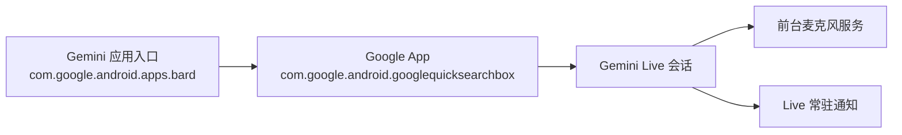

# 在国行 HyperOS 上让 Gemini Live 熄屏继续对话

散步时，我希望先打开 Gemini，进入连续语音聊天，再按下电源键熄屏，把手机放进口袋继续交谈。实际使用时，Gemini 却会在熄屏后消失或暂停。

这个问题看起来像是 HyperOS 杀后台，实际排查后发现需要同时分清三件事：**Gemini Live 与普通语音输入不是同一个模式、独立 Gemini 应用并不是 Live 的实际运行进程、锁屏对话依赖专用通知和 Gemini 锁屏开关。**

> [!success] 最终结论
> 不需要 root，也不需要修改系统分区。启动真正的 Gemini Live，并开启锁屏使用与 Live 通知后，熄屏时可以继续对话。ADB 白名单只用于防止 HyperOS 额外限制后台。

## 1. 先分清普通麦克风和 Gemini Live

Gemini 输入框右侧通常有两个相邻入口：

- **麦克风图标**：把一段语音转成单次提问；它不是持续对话服务。
- **声波形状的 Live 图标**：启动 Gemini Live，支持连续交谈、后台运行和锁屏继续。

如果点的是普通麦克风，熄屏后停止属于预期行为。正确流程是：

1. 解锁手机并打开 Gemini。
2. 点击输入框最右侧的 **Open Gemini Live** 声波图标。
3. 等 Live 界面出现并开始对话。
4. 确认通知栏出现“使用 Gemini Live”。
5. 再按一次电源键熄屏。

Google 官方说明也强调了两点：Gemini Live 不能从已锁定的屏幕直接启动，但会话开始后，只要锁屏功能与通知已开启，就可以在锁屏状态继续。[Gemini Live 官方帮助](https://support.google.com/gemini/answer/15274899?co=GENIE.Platform%3DAndroid&hl=zh-Hans)

## 2. 为什么要同时检查两个应用包

通过 ADB 查看安装包：

```bash
adb shell 'pm list packages | grep -E "com.google.android.apps.bard|googlequicksearchbox"'
```

可以看到两个相关包：

```text
com.google.android.apps.bard
com.google.android.googlequicksearchbox
```

它们的职责并不相同：



`com.google.android.apps.bard` 更像启动入口。真正承载 Gemini 界面、麦克风权限、Voice Interaction Service 和 Live 通知渠道的是 Google App：`com.google.android.googlequicksearchbox`。

因此，只给独立 Gemini 应用关闭省电限制可能不够，还必须检查 Google App。

## 3. 确认 Google 是默认数字助理

先检查当前默认助理：

```bash
adb shell settings get secure assistant
adb shell settings get secure voice_interaction_service
adb shell cmd role get-role-holders android.app.role.ASSISTANT
```

正常情况下应指向：

```text
com.google.android.googlequicksearchbox/com.google.android.voiceinteraction.GsaVoiceInteractionService
```

如果不是，可先在系统设置中打开：

```text
设置 → 应用 → 默认应用 → 数字助理应用 → Google
```

## 4. 检查麦克风、通知与后台状态

查看 Google App 的关键权限：

```bash
adb shell 'dumpsys package com.google.android.googlequicksearchbox \
  | grep -E "RECORD_AUDIO|POST_NOTIFICATIONS|FOREGROUND_SERVICE_MICROPHONE|WAKE_LOCK"'
```

至少要确认：

- `RECORD_AUDIO` 已授权；
- `POST_NOTIFICATIONS` 已授权；
- `FOREGROUND_SERVICE_MICROPHONE` 可用；
- `WAKE_LOCK` 可用。

再检查 Android AppOps：

```bash
adb shell appops get com.google.android.googlequicksearchbox RECORD_AUDIO
adb shell appops get com.google.android.googlequicksearchbox RUN_ANY_IN_BACKGROUND
adb shell appops get com.google.android.googlequicksearchbox START_FOREGROUND
```

正常结果应为 `allow`，其中麦克风可能显示为仅前台可启动，但 Gemini Live 启动后会转为前台服务。

## 5. 检查专用的 Gemini Live 通知渠道

锁屏继续对话不是只靠麦克风权限实现的。Gemini Live 会创建一个专用通知渠道：

```bash
adb shell 'dumpsys notification --noredact \
  | grep -i -B3 -A8 "Gemini Live"'
```

在本次排查中，渠道 ID 为：

```text
convmode_notification_channel_id
```

渠道名称为“使用 Gemini Live”，并且 `mImportance=4`、`mDeleted=false`，说明通知处于启用状态。

也可以直接在手机中检查：

```text
设置 → 通知与状态栏 → 应用通知 → Google → 使用 Gemini Live
```

> [!warning] 通知不是可有可无
> Google 官方明确要求开启“使用 Gemini Live”通知。关闭该渠道后，Live 无法可靠地在后台或锁屏状态继续运行。

## 6. 开启 Gemini 锁屏使用

在 Gemini 中进入：

```text
Gemini → 账号和设置 → 设置 → 在锁屏状态下使用 Gemini
```

开启：

```text
在不解锁设备的情况下使用 Gemini
```

该开关控制的是已经启动的 Live 会话能否在锁屏后继续。如果关闭它，按下电源键后 Live 会进入暂停状态。

需要注意：这个开关不会赋予 Gemini 读取所有隐私内容的权限。涉及 Gmail 等个人内容时，Gemini 仍可能要求先解锁设备。

## 7. 避免 HyperOS 杀掉后台会话

先查看应用是否已经在 Doze 白名单：

```bash
adb shell 'dumpsys deviceidle whitelist \
  | grep -E "com.google.android.apps.bard|com.google.android.googlequicksearchbox"'
```

如果没有，可以通过 ADB 添加：

```bash
adb shell dumpsys deviceidle whitelist +com.google.android.googlequicksearchbox
adb shell dumpsys deviceidle whitelist +com.google.android.apps.bard
```

然后允许 Gemini 入口在后台运行，并取消休眠状态：

```bash
adb shell cmd appops set com.google.android.apps.bard RUN_IN_BACKGROUND allow
adb shell cmd appops set com.google.android.apps.bard RUN_ANY_IN_BACKGROUND allow
adb shell am set-inactive --user 0 com.google.android.apps.bard false
```

还可以在 HyperOS 图形界面中设置：

```text
设置 → 应用 → 应用管理 → Google / Gemini → 省电策略 → 无限制
```

这一步是针对 HyperOS 激进后台管理的补充措施。真正的必要条件仍然是：进入 Live、开启 Live 通知、允许锁屏使用 Gemini。

## 8. 如何判断是否真的成功

最直观的判断不是看 Gemini 是否还在最近任务中，而是看通知和麦克风状态：

```text
启动 Live
   ↓
通知栏出现“使用 Gemini Live”
   ↓
按电源键熄屏
   ↓
耳机或手机仍能听到回答，也能继续说话打断
```

如果熄屏前没有出现“使用 Gemini Live”通知，通常意味着启动的是普通麦克风模式，而不是 Live。

可以用 ADB 辅助确认进程仍存在：

```bash
adb shell 'ps -A | grep com.google.android.googlequicksearchbox'
adb shell 'dumpsys activity services com.google.android.googlequicksearchbox \
  | grep -Ei "foreground|startForeground|convmode|live"'
```

## 9. 回滚 ADB 白名单

如果以后不希望 Google 或 Gemini 获得 Doze 豁免，可以删除白名单：

```bash
adb shell dumpsys deviceidle whitelist -com.google.android.googlequicksearchbox
adb shell dumpsys deviceidle whitelist -com.google.android.apps.bard
```

恢复 Gemini 入口的 AppOps 默认值：

```bash
adb shell cmd appops set com.google.android.apps.bard RUN_IN_BACKGROUND default
adb shell cmd appops set com.google.android.apps.bard RUN_ANY_IN_BACKGROUND default
```

这些操作不需要 root，不会清除 Gemini 数据，也不会修改系统分区。

## 10. 容易混淆的边界

### 普通“朗读回答”不会持续

文本回答中的朗读功能不等于 Gemini Live。想在散步时持续聊天，应使用 Live 模式。

### 锁屏后摄像头会关闭

Gemini Live 的语音可以继续，但如果正在分享摄像头，锁屏会自动关闭摄像头；解锁后也不会自动重新打开。这是官方设计，不是 HyperOS 故障。

### 这不等于 Hey Google 唤醒

本文解决的是“解锁并启动 Gemini Live 后，熄屏继续对话”。它不解决从完全待机状态说出“Hey Google”启动 Gemini。后者依赖系统级 Voice Match 和热词检测能力，是另一条技术链路。

## 总结

这次问题的核心并不是单一权限，而是模式和组件识别错误：

1. 必须点击声波图标进入 **Gemini Live**，而不是普通麦克风。
2. Live 的实际运行主体是 Google App，而不只是独立 Gemini 应用。
3. “使用 Gemini Live”通知渠道必须开启。
4. “在不解锁设备的情况下使用 Gemini”必须开启。
5. HyperOS 用户可额外为 Google 与 Gemini 添加后台和 Doze 白名单。

满足这些条件后，就可以先启动 Live，再熄屏放入口袋，通过手机或蓝牙耳机继续散步聊天。
