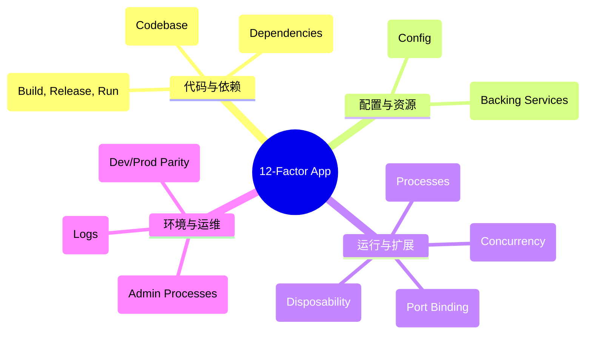
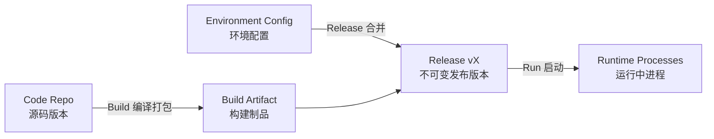
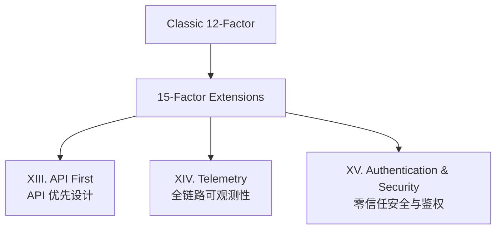

# The Twelve-Factor App（十二要素应用宣言）全译与现代解读

> **原作者**：Adam Wiggins (Heroku 联合创始人)  
> **原文地址**：[https://12factor.net/zh_cn/](https://12factor.net/zh_cn/)  
> **编译与批注**：Ryou

---

## 🎯 导读与背景

如今，软件通常会作为一种服务来交付，它们被称为网络应用程序，或软件即服务（SaaS）。**12-Factor（十二要素）** 为构建现代化 SaaS 应用提供了系统性的工程方法论：

- 使用**标准化流程**自动配置，使新加入的开发者花费最少的学习成本即可上手。
- 与底层操作系统之间**划清界限**，在不同运行环境中提供**最大的可移植性**。
- 天然适合**部署在现代云计算平台**，节省服务器与运维管理资源。
- 将开发环境与生产环境的**差异降至最低**，并通过**持续交付（CD）**实施敏捷迭代。
- 可以在工具、架构和开发流程不发生根本性变化的前提下实现**平滑横向扩展**。

这套理论由 PaaS 先驱 **Heroku** 团队在见证了数十万个应用程序的生命周期后提炼而成。无论是 Docker、Kubernetes、微服务还是 Serverless，现代云原生体系的核心设计哲学，几乎都能在 12-Factor 中找到思想源头。

---

## 📜 十二要素全译与深度解析

### I. 基准代码（Codebase）
> **一份基准代码，多份部署（One codebase tracked in revision control, many deploys）**

12-Factor 应用通常使用版本控制系统（如 Git、Mercurial 或 Subversion）进行追踪。版本库对应一份基准代码（Codebase），或简称为代码库。

- **基准代码与应用是一对一的**：
  - 如果有多份基准代码，那它们就不是一个应用，而是一个分布式系统。分布式系统中的每个组件都是一个独立的 12-Factor 应用，各自拥有独立的基准代码。
  - 多个应用绝不能共享同一份基准代码。共享代码应当解耦并重构为**依赖库**，通过依赖管理器进行引入。
- **一份基准代码，多份部署（Deploy）**：
  - 部署指应用运行的实例，例如生产环境（Production）、预发布环境（Staging/QA）、开发环境（Development）以及每位开发人员的本地开发实例。
  - 所有部署共享同一份基准代码，但不同部署可能处于不同的版本（例如生产环境运行 `v1.2`，预发运行 `v1.3-rc`，本地运行最新 `main` 分支）。

---

### II. 依赖（Dependencies）
> **显式声明并隔离依赖（Explicitly declare and isolate dependencies）**

大多数主流编程语言都提供了依赖打包系统（如 Python 的 `pip` + `requirements.txt`/`pyproject.toml`，Node.js 的 `npm` + `package.json`，Go 的 `go.mod`，Rust 的 `Cargo.toml`）。

- **显式声明依赖（Dependency Declaration）**：
  - 12-Factor 应用**绝不隐式依赖系统级的软件包**。
  - 应用程序必须通过依赖清单文件完整、显式地声明所有依赖项。
- **隔离依赖（Dependency Isolation）**：
  - 依赖隔离工具（如 Python 的 `venv`、容器技术 Docker 等）确保应用不会受到宿主机上全局安装的第三方库污染。
  - 无论在开发机器还是生产容器中，均只需一条命令（如 `bundle install` 或 `npm install`）即可精准装配所有运行依赖。

---

### III. 配置（Config）
> **在环境中存储配置（Store config in the environment）**

应用的配置指的是**可能在不同部署环境（开发、测试、生产）之间发生变化的一切信息**，包括：
- 数据库、Memcached、Redis 等后端服务的连接凭证与网络定位。
- 外部第三方服务的 API Key（如 S3、Stripe、SendGrid 等）。
- 部署特定的环境设置（如主机名、监听端口、日志级别等）。

**核心准则**：
1. **代码与配置严格分离**：任何配置都不能硬编码在源代码中。
2. **严禁将配置文件/敏感凭据提交至版本库**。
3. **使用环境变量（Environment Variables）存储配置**：
   - 环境变量在各语言和操作系统中天然平铺隔离，跨部署变更时无需修改代码或重新编译二进制文件。

---

### IV. 后端服务（Backing Services）
> **把后端服务当作附加资源（Treat backing services as attached resources）**

后端服务是指应用运行过程中通过网络调用的各种外部服务，包括：
- 数据存储（Databases，如 MySQL、PostgreSQL）。
- 消息队列（Message Queues，如 RabbitMQ、Kafka）。
- 缓存系统（Caches，如 Redis、Memcached）。
- 外部 API（如 SMTP 邮件网关、Twitter API、高德地图等）。

**设计要求**：
- 12-Factor 应用在代码层面**不区分本地服务与第三方托管服务**。
- 对于应用而言，本地自建的 MySQL 与云端托管的 Amazon RDS 都是一个**附加资源**，仅通过配置文件中的 URL / DSN 连接字符串进行定位与认证。
- 资源必须支持松耦合插拔：如果生产数据库发生硬件故障，运维人员只需调整配置 URL 指向备份库，应用无需修改任何代码或重新编译即可立即接入新资源。

---

### V. 构建，发布，运行（Build, Release, Run）
> **严格分离构建和运行（Strictly separate build and run stages）**

基准代码转化为一份运行中的部署需要经过三个互斥的阶段：

1. **构建阶段（Build Stage）**：
   - 获取指定版本的源码，下载并打包依赖项，编译二进制文件与静态资源，生成**构建包（Build Artifact）**。
2. **发布阶段（Release Stage）**：
   - 将构建包与当前部署环境的**配置（Config）**相结合，生成具备唯一发布版本号（Release ID，如 `v102` 或时间戳）的不可变发布包。
3. **运行阶段（Run Stage / Runtime）**：
   - 在执行环境中启动应用程序进程，根据发布版本运行指定服务。

> [!important] 发布不可变性
> 任何对运行中系统的改动，都必须通过新的发布（Release）来推进；严禁在运行阶段直接登录服务器修改线上代码或依赖。发布版本具备回滚能力，支持一键退回历史版本。

---

### VI. 进程（Processes）
> **以一个或多个无状态进程运行应用（Execute the app as one or more stateless processes）**

在运行环境中，应用程序由一个或多个进程承载。

- **无状态（Stateless）与无共享（Shared-Nothing）**：
  - 12-Factor 应用的进程必须保持无状态。
  - **任何需要持久化的数据都必须存入后端服务（如数据库、分布式缓存或对象存储）中**。
- **临时存储的边界**：
  - 内存区域或本地文件系统可以作为单次请求/事务内的临时缓存（如处理上传图片时写入临时临时文件）。
  - 应用绝不能假设下一次请求还会落在同一个进程或同一台机器上。
- **严禁使用 Sticky Session（粘性会话）**：
  - 用户登录态与 Session 数据应当存储在 Redis 或 Memcached 等分布式缓存中，而不是保存在单机内存里。

---

### VII. 端口绑定（Port Binding）
> **通过端口绑定提供服务（Export services via port binding）**

传统 Web 应用有时会宿主在外部服务器容器中（例如 PHP 运行在 Apache mod_php 模块内，Java Web 应用打包成 WAR 部署在 Tomcat 容器中）。

- **12-Factor 应用完全自我加载（Self-Contained）**：
  - 应用不依赖外部 Web 容器，而是将网络服务器类库作为依赖项内嵌到代码中（如 Go 内置 `net/http`、Node.js 内置 HTTP 模块、Python 的 Gunicorn/Uvicorn、Java 的 Spring Boot 内嵌 Tomcat）。
  - 应用在启动时监听由环境变量指定的端口（如 `$PORT`），通过端口绑定直接对外导出 HTTP/gRPC 网络服务。
  - 在线上环境中，外部路由网关（如 Nginx、Traefik、Kubernetes Ingress）负责将公共域名的外部流量反向代理路由至各个绑定的端口进程。

---

### VIII. 并发（Concurrency）
> **通过进程模型进行扩展（Scale out via the process model）**

在 12-Factor 架构中，**进程是一等公民（First-class citizens）**。

- **进程模型划分角色（Process Types）**：
  - 将不同职责的工作划分给不同的进程类型。例如：
    - `web` 进程：专门接收与处理外部 HTTP 请求。
    - `worker` 进程：常驻后台，消费消息队列任务。
    - `clock` / `cron` 进程：负责定时调度与批处理。
- **水平扩展（Scale Out）**：
  - 当负载增高时，不应盲目依赖单机的垂直扩容（加 CPU/内存），而是通过**增加无状态进程的实例数量**进行横向扩充。
  - 结合无共享架构，多进程可以在多台物理机/虚拟机/容器节点间任意分布调度。

---

### IX. 易处理（Disposability）
> **快速启动和优雅终止可最大化健壮性（Maximize robustness with fast startup and graceful shutdown）**

12-Factor 应用的进程是**易处理的（Disposable）**，可以随开随关：

1. **追求极短的启动时间（Fast Startup）**：
   - 进程从接收启动指令到能够开始服务请求只需数秒甚至更短。
   - 快速启动大幅提升了弹性伸缩能力，使得扩容与故障漂移（Process Migration）更敏捷。
2. **支持优雅终止（Graceful Shutdown）**：
   - 当接收到操作系统终止信号（`SIGTERM`）时：
     - **Web 进程**：停止监听新连接，等待当前正在处理中的活跃请求完成，然后干净退出。
     - **Worker 进程**：停止拉取新任务，将当前正在执行但未完成的任务放回（NACK）队列，释放分布式锁，然后退出。
3. **具备抗崩溃弹性（Crash-Only Design）**：
   - 当底层硬件突发宕机或遭遇意外杀死（`SIGKILL`）时，系统依赖队列事务与幂等设计，保证数据不会损毁。

---

### X. 开发环境与线上环境等价（Dev/Prod Parity）
> **尽可能的保持开发，预发布，线上环境相同（Keep development, staging, and production as similar as possible）**

历史项目中，开发环境与生产环境往往存在巨大鸿沟，导致“本地明明是好的，上线就崩溃”的窘境。12-Factor 提出消除三大鸿沟：

| 维度 | 传统模式 | 12-Factor 模式 | 现代工具支撑 |
| :--- | :--- | :--- | :--- |
| **时间差距** | 开发者写的代码数周/数月后才上线 | 几小时甚至几分钟内完成上线 | CI/CD 自动化流水线 |
| **人员差距** | 开发只管写代码，运维负责部署维护 | 开发深度参与部署与全生命周期 | DevOps 文化、GitOps |
| **工具差距** | 本地用 SQLite/Nginx，线上用 PostgreSQL/Cloud LB | 本地与线上使用相同的技术栈与版本 | Docker 容器化、Compose |

> [!tip] 警惕环境适配器
> 某些 ORM 框架宣称可以抽象抹平底层数据库（如本地用轻量 SQLite，线上用 PostgreSQL）。但两者的并发锁机制、SQL 方言、数据类型与性能特征差异巨大，极易在生产环境引发隐蔽 Bug。**本地应当使用与生产完全一致的依赖服务类型和版本**。

---

### XI. 日志（Logs）
> **把日志当作事件流（Treat logs as event streams）**

日志是了解应用程序运行状态的生命线。

- **不应由应用管理日志文件**：
  - 应用不应自行写入本地硬盘文件，不应负责日志切分（Log Rotate）或归档清理。
- **直接输出到标准输出（stdout / stderr）**：
  - 应用各进程只需按时间顺序将事件以单行格式打印到标准输出。
  - 在开发环境中，开发者在终端直接观测流式输出。
  - 在生产环境中，运行基础设施（如 Kubernetes 容器运行时、Fluentd、Promtail、Vector）统一截获标准输出，将其路由至中央日志系统（如 Elasticsearch/Kibana、Loki、Datadog）进行持久化检索与监控告警。

---

### XII. 管理进程（Admin Processes）
> **后台管理任务当作一次性进程运行（Run admin/management tasks as one-off processes）**

除了处理常规 Web/Worker 流量，开发者经常需要执行一次性管理维护任务，例如：
- 数据库 Schema 迁移（如 Django 的 `manage.py migrate`，Rails 的 `db:migrate`）。
- 启动 REPL 控制台（如 `python shell` 或 `rails console`）排查线上状态。
- 执行一次性数据修复或批量同步脚本。

**规范要求**：
- 管理任务必须作为**一次性进程（One-off process）**在与生产应用完全一致的环境中执行。
- 管理脚本的代码必须随主应用程序基准代码一起提交与管理，避免使用未受版本控制的临时私有脚本。
- 一次性进程使用与对应发布版本完全相同的代码和环境变量配置。

---

## 🚀 时代演进：Beyond the Twelve-Factor

十二要素宣言诞生于 2011 年。过去十多年间，容器化（Docker/OCI）、编排引擎（Kubernetes）、服务网格（Istio）与 Serverless 深刻重塑了软件工程。

在此背景下，云原生社区（如 Pivotal / Kevin Hoffman）总结出了扩展版的 **15-Factor App**，补充了现代分布式系统不可或缺的三大支柱：

1. **XIII. API First（API 优先）**：
   - 在编码实现前，先定义清晰的 API 契约（OpenAPI / Protobuf），确保跨团队协同与多端消费的解耦。
2. **XIV. Telemetry（全链路可观测性）**：
   - 不仅是基础日志，现代应用必须内置指标暴露（Metrics，如 Prometheus `/metrics`）、健康检查探针（Liveness / Readiness Probes）以及分布式链路追踪（OpenTelemetry Tracing）。
3. **XV. Authentication & Security（零信任安全）**：
   - 将安全贯穿应用全生命周期。服务间调用实施 RBAC / mTLS，敏感凭据与密钥实施动态挂载（如 HashiCorp Vault / KMS）。

---

## 💡 总结与感悟

12-Factor 的本质并不是教条式的技术条规，而是一种**面向云原生弹性和团队协作的工程思维**：

1. **解耦**：代码与配置解耦、进程与存储解耦、构建与运行解耦。
2. **无状态与不变性**：让基础设施可替代（Pets vs. Cattle），让每一次发布清晰可回溯。
3. **一致性**：通过容器化与自动化，消灭环境间的摩擦力。

掌握 12-Factor，不仅能帮助我们构建出高可用、易伸缩的云上系统，更能为日常的架构选型与工程规范提供历久弥新的指南针。
