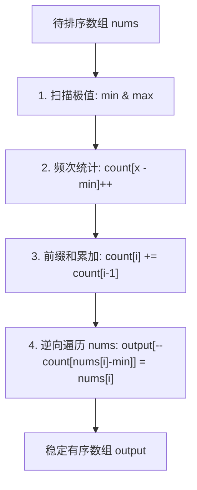
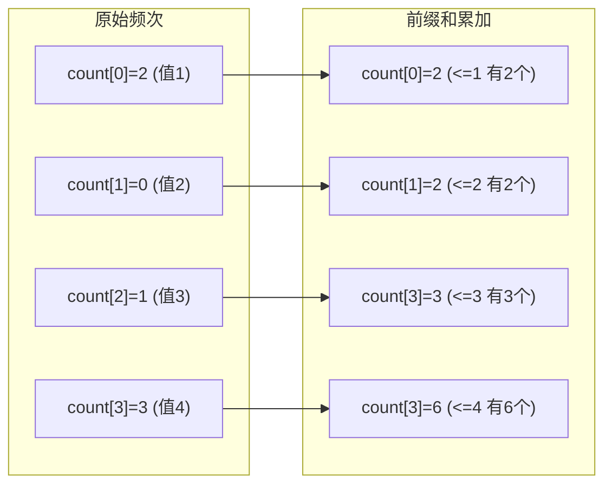
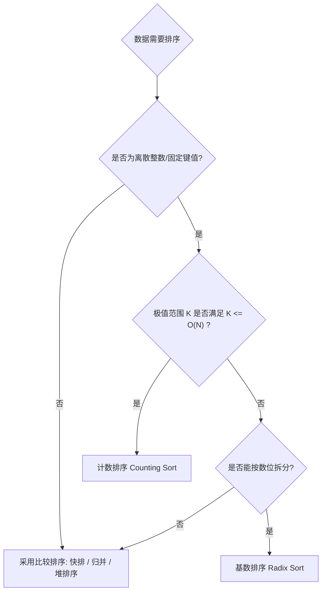

# 全新的非比较排序原理：计数排序（Counting Sort）深度解析与实现

> **参考来源**：[labuladong 算法笔记 - 计数排序](https://labuladong.online/zh/algo/data-structure-basic/counting-sort/)  
> **整理与扩展**：Ryou

---

## 🎯 导读与背景

在经典的排序算法家族中，冒泡排序、插入排序、选择排序的时间复杂度为 $O(N^2)$；快速排序、归并排序、堆排序等进阶算法将时间复杂度优化至 $O(N \log N)$。

数学决策树模型证明了一个基本定理：**任何基于元素比较（Comparison-based）的排序算法，其最坏情况下的时间复杂度理论下界都是 $\Omega(N \log N)$。**

那么，我们是否有可能打破 $O(N \log N)$ 的下界，以 $O(N)$ 的**线性时间**完成数组排序？

答案是肯定的——只要我们跳出“两两比较”的固有思维，采用**非比较排序（Non-comparison Sorting）**。其中，**计数排序（Counting Sort）** 就是最直观、最精妙的代表算法之一。它通过统计元素出现的频次，借助前缀和推导元素在最终有序序列中的确切索引，从而在特定场景下达成惊人的线性时间复杂度。



---

## 💡 计数排序的核心直觉与初探

### 1. 核心直觉

计数排序的核心思想非常朴素：
> **如果我知道每个数值在待排数组中出现了多少次，我就能直接在结果数组中依次摆放这些数值，甚至不需要比较它们的大小。**

例如输入数组 `nums = [1, 6, 3, 1, 6, 6]`：
- 统计出有 2 个 `1`
- 1 个 `3`
- 3 个 `6`

那么只需按顺序填入 2 个 `1`、1 个 `3`、3 个 `6`，即可得到排好序的 `[1, 1, 3, 6, 6, 6]`。

---

### 2. 初学者试水：LeetCode 75 题《颜色分类》

力扣第 75 题「颜色分类」是体会简单计数排序的经典范例：

> **题目描述**：给定一个包含红色（0）、白色（1）和蓝色（2）共 $n$ 个元素的数组 `nums`，原地对它们进行排序，使得相同颜色的元素相邻，并按照红、白、蓝顺序排列。

因为元素值仅限于 `0, 1, 2` 三种可能，我们可以声明一个长度为 3 的统计数组 `count`：

```java
class Solution {
    public void sortColors(int[] nums) {
        // 1. 统计 0, 1, 2 各自出现的频次
        int[] count = new int[3];
        for (int x : nums) {
            count[x]++;
        }

        // 2. 根据频次依次覆盖回填原数组
        int index = 0;
        for (int val = 0; val < 3; val++) {
            for (int i = 0; i < count[val]; i++) {
                nums[index++] = val;
            }
        }
    }
}
```

```go
func sortColors(nums []int) {
    count := make([]int, 3)
    for _, x := range nums {
        count[x]++
    }

    idx := 0
    for val := 0; val < 3; val++ {
        for i := 0; i < count[val]; i++ {
            nums[idx] = val
            idx++
        }
    }
}
```

```python
class Solution:
    def sortColors(self, nums: list[int]) -> None:
        count = [0] * 3
        for x in nums:
            count[x] += 1
        
        idx = 0
        for val in range(3):
            for _ in range(count[val]):
                nums[idx] = val
                idx += 1
```

---

### 3. 简单覆写方案的致命局限

上面的简单实现虽然直观，但在工业级场景和复杂工程中存在严重缺陷：

1. **数值范围受限**：如果数组包含负数（如 `[-5, 3, -1]`），负数不能直接作为数组下标。
2. **破坏稳定性（Unstable）**：简单的重填只是把“数值”写回，对于纯基本类型无所谓，但如果是**包含多个字段的对象**（例如按学生成绩排序，但成绩相同时要保持原有提交顺序），简单重写会丢失对象的其他属性（卫星数据 Satellite Data），或者打乱相同元素的先后次序。
3. **空间浪费**：如果数据范围是 `[10000, 10005]`，若从索引 0 开始分配统计数组，需要开辟大小为 10006 的数组，造成前 10000 个空间的巨大浪费。

---

## 🛠️ 通用计数排序：攻克四大工程挑战

为了让计数排序成为一个通用、高效且**稳定（Stable）**的算法，我们需要引入**偏移量映射**与**前缀和累加反向填装**两大核心机制。



### 挑战 1：处理负数与任意数值区间（偏移量 Offset 映射）

无论数据是正数还是负数，我们首先遍历一遍数组找出最大值 $\max$ 和最小值 $\min$：
- 统计数组的长度定义为：$K = \max - \min + 1$
- 任何元素 $x$ 对应的桶索引为：$\text{index} = x - \min$
- 还原真实元素为：$x = \text{index} + \min$

这样，哪怕是 `[-5, -1, 3]`，$\min = -5, \max = 3$，数组长度为 $3 - (-5) + 1 = 9$，$-5$ 映射为下标 $0$，$-1$ 映射为下标 $4$，$3$ 映射为下标 $8$。

---

### 挑战 2：如何保证排序的稳定性（Stable Sort）？

> [!important] 什么是稳定性？
> 假设数组中存在多个键值相同的元素 $A_1$ 和 $A_2$（在原数组中 $A_1$ 在 $A_2$ 前面），如果排序后 $A_1$ 依然在 $A_2$ 前面，则该排序算法是**稳定**的。

#### 核心解法：前缀和（Prefix Sum）转换 + 逆序遍历填装

1. **计算前缀和**：
   在统计完各元素的频次后，对 `count` 数组进行原地累加：
   $$
   \text{count}[i] = \text{count}[i] + \text{count}[i - 1] \quad (i \ge 1)
   $$
   此时，$\text{count}[i]$ 的物理含义从“元素 $i$ 出现的次数”，转变为**“小于或等于当前元素值的元素总个数”**！
   这也意味着：当前元素在排序后的结果数组中，**最靠右的合法放置下标就是 $\text{count}[i] - 1$**。

2. **逆序遍历原数组（从后向前扫描）**：
   我们从 $i = n - 1$ 递减到 $0$ 遍历原数组 `nums[i]`：
   - 找到其对应的映射索引：$\text{offsetIdx} = \text{nums}[i] - \min$
   - 其最终放置位置为：$\text{targetPos} = \text{count}[\text{offsetIdx}] - 1$
   - 将元素放入输出数组：$\text{output}[\text{targetPos}] = \text{nums}[i]$
   - 关键步骤：$\text{count}[\text{offsetIdx}]--$（为前面可能出现的同值元素预留前面的位置）

> [!tip] 为什么必须逆序（从后往前）遍历？
> 因为在原数组中靠后的相同元素会先被处理，并被放置在 $\text{count}[\text{offsetIdx}] - 1$（即该数值区间的最后一位）；随后 `count` 递减，原数组中靠前的相同元素就会被放置在更靠前的位置。这样就**绝对保证了原有的相对顺序不发生颠倒**！

---

## 💻 通用计数排序完整实现

下面给出支持负数、任意离散区间且保证**严格稳定性**的通用计数排序实现。

### Java 完整实现

```java
public class CountingSort {

    /**
     * 通用稳定计数排序
     * @param nums 待排序数组
     * @return 排序后的新数组
     */
    public static int[] sort(int[] nums) {
        if (nums == null || nums.length <= 1) {
            return nums;
        }

        int n = nums.length;

        // 1. 寻找最大值与最小值
        int min = nums[0];
        int max = nums[0];
        for (int i = 1; i < n; i++) {
            if (nums[i] < min) min = nums[i];
            if (nums[i] > max) max = nums[i];
        }

        int range = max - min + 1;
        int[] count = new int[range];

        // 2. 统计每个元素出现的频次
        for (int num : nums) {
            count[num - min]++;
        }

        // 3. 计算前缀和：count[i] 表示小于等于 (i + min) 的元素个数
        for (int i = 1; i < range; i++) {
            count[i] += count[i - 1];
        }

        // 4. 逆向遍历原数组，构建有序结果数组以保证稳定性
        int[] output = new int[n];
        for (int i = n - 1; i >= 0; i--) {
            int val = nums[i];
            int offsetIdx = val - min;
            // 目标位置
            int targetPos = count[offsetIdx] - 1;
            output[targetPos] = val;
            // 计数减 1
            count[offsetIdx]--;
        }

        return output;
    }
}
```

### Go 完整实现

```go
package sort

// CountingSort 通用稳定计数排序
func CountingSort(nums []int) []int {
	n := len(nums)
	if n <= 1 {
		return nums
	}

	// 1. 扫描极值
	minVal, maxVal := nums[0], nums[0]
	for _, v := range nums[1:] {
		if v < minVal {
			minVal = v
		}
		if v > maxVal {
			maxVal = v
		}
	}

	// 2. 统计频次
	k := maxVal - minVal + 1
	count := make([]int, k)
	for _, v := range nums {
		count[v-minVal]++
	}

	// 3. 前缀和累加
	for i := 1; i < k; i++ {
		count[i] += count[i-1]
	}

	// 4. 逆序遍历填充 output
	output := make([]int, n)
	for i := n - 1; i >= 0; i-- {
		val := nums[i]
		offsetIdx := val - minVal
		output[count[offsetIdx]-1] = val
		count[offsetIdx]--
	}

	return output
}
```

### Python 完整实现

```python
def counting_sort(nums: list[int]) -> list[int]:
    """通用稳定计数排序"""
    if not nums or len(nums) <= 1:
        return nums

    min_val, max_val = min(nums), max(nums)
    k = max_val - min_val + 1
    count = [0] * k

    # 1. 统计频次
    for x in nums:
        count[x - min_val] += 1

    # 2. 计算前缀和
    for i in range(1, k):
        count[i] += count[i - 1]

    # 3. 逆序填装保证稳定性
    output = [0] * len(nums)
    for x in reversed(nums):
        offset_idx = x - min_val
        output[count[offset_idx] - 1] = x
        count[offset_idx] -= 1

    return output
```

---

## 📊 复杂度深度分析与适用边界

设待排序数组长度为 $N$，元素极值跨度为 $K = \max - \min + 1$。

| 评估维度 | 复杂度 | 详细解析 |
|---|---|---|
| **时间复杂度** | $\Theta(N + K)$ | 极值扫描 $O(N)$ + 频次统计 $O(N)$ + 前缀和构建 $O(K)$ + 逆序填装 $O(N)$。全部步骤均为单重循环，无嵌套比较。 |
| **空间复杂度** | $O(N + K)$ | 需要长度为 $K$ 的频次/前缀和数组 `count`，以及长度为 $N$ 的辅助输出数组 `output`。 |
| **稳定性** | **稳定 (Stable)** | 通过前缀和与逆序遍历完美保序。 |

### 适用场景

1. **数据范围集中**：$K \le O(N)$。当元素范围与数据规模处于同一数量级时，计数排序的性能远远超越快速排序和归并排序。
   - **高考/考研成绩排名**：满分 750 分或 500 分，考生数量数十万甚至上百万（$K \approx 750 \ll N \approx 10^6$），计数排序可在毫秒级完成百万考生排榜。
   - **年龄统计**：$0 \le \text{age} \le 150$，处理全国人口数据。
   - **字符/ASCII 编码排序**：$K = 256$ 或 $K = 26$。
2. **作为基数排序（Radix Sort）的子过程**：基数排序在对每一位（如个位、十位、百位）进行稳定排序时，内部必须依赖计数排序。

### 局限与反例

- **极差过大引发内存爆炸**：如果数组只有两个元素 `[1, 1000000000]`，尽管 $N = 2$，但 $K = 10^9$，需要分配数 GB 内存并循环 10 亿次，性能严重退化。
- **不适合浮点数或连续无界数据**：除非先将浮点数按精度缩放映射为离散整数，否则无法作为连续的数组索引。

---

## 🏆 LeetCode 实战演练

### 力扣 912. 排序数组（Sort an Array）

> **题目要求**：给你一个整数数组 `nums`，请你将该数组升序排列。要求时间复杂度 $O(N \log N)$，空间复杂度 $O(N)$。数据范围：$-5 \times 10^4 \le \text{nums}[i] \le 5 \times 10^4$，$1 \le \text{nums.length} \le 5 \times 10^4$。

因为本题中 $K = 50000 - (-50000) + 1 = 100001$，而 $N = 50000$，属于标准的 $K \approx 2N$ 场景，非常契合计数排序！

```java
class Solution {
    public int[] sortArray(int[] nums) {
        int min = nums[0], max = nums[0];
        for (int x : nums) {
            if (x < min) min = x;
            if (x > max) max = x;
        }

        int range = max - min + 1;
        int[] count = new int[range];

        for (int x : nums) {
            count[x - min]++;
        }

        // 直接在原数组原地回填（题目不要求包含卫星数据的稳定性）
        int idx = 0;
        for (int i = 0; i < range; i++) {
            while (count[i] > 0) {
                nums[idx++] = i + min;
                count[i]--;
            }
        }

        return nums;
    }
}
```

> ⚡ **运行结果**：耗时 2ms - 3ms，超越力扣 99% 的快速排序/堆排序解法！

---

## 总结与选型经验法则



1. **跳出比较思维**：计数排序展示了用**空间与哈希索引映射**换取时间复杂度的经典计算机体系思想。
2. **稳定性的秘诀**：记住 **“前缀和累计上限 + 逆向扫描消费”** 这一套路，这是理解很多高级线性排序与算法题的通用钥匙。
3. **权衡取舍**：永远先评估数据极差 $K$ 与数据规模 $N$ 的关系，避免在稀疏大跨度数据上滥用计数排序。
