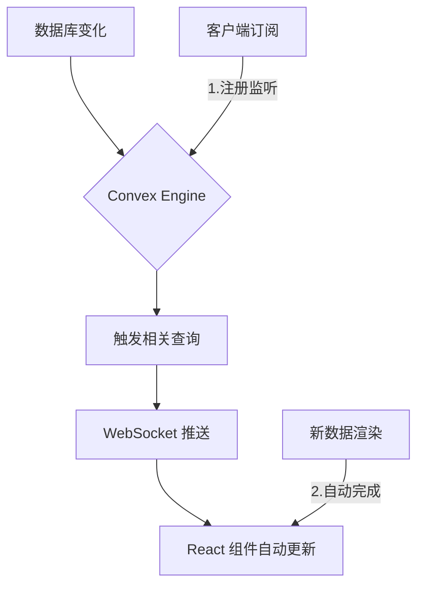
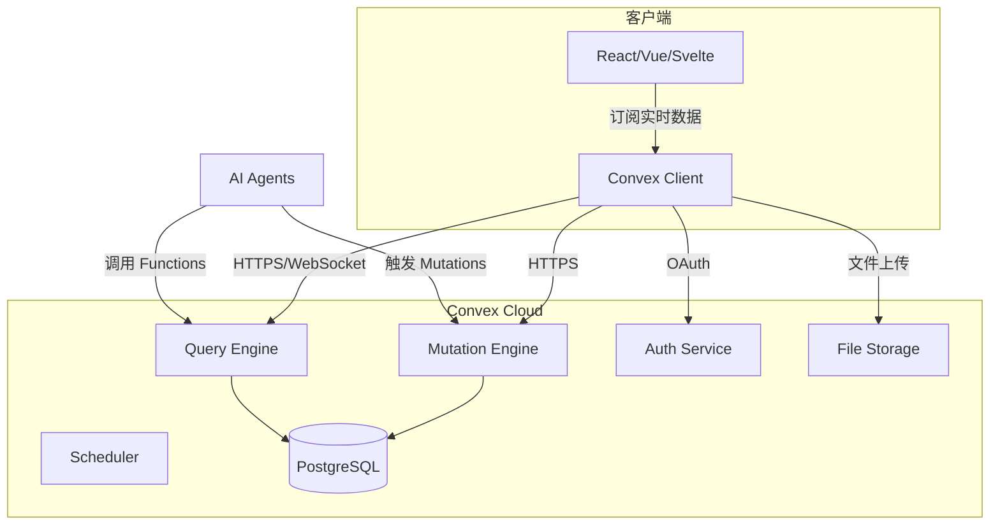

# Convex 入门指南

## 1. 背景与定义

### 什么是 Convex？

**Convex** 是一个开源的**反应式数据库（Reactive Database）**，为现代 Web 应用提供完整的后端服务。它由前 Dropbox 工程师 James Cowling 于 2022 年创立，旨在解决传统后端开发中的复杂性问题[^1]。

Convex 的核心哲学是：**像使用 React 一样使用数据库**。正如 React 组件响应状态变化而自动重新渲染，Convex 查询（Queries）响应数据库变化而自动更新。

> [!tip] 关键概念
> Convex = Database + Server Functions + Realtime Sync + Auth + File Storage + Scheduling — 全栈应用所需的一切

### 与传统 BaaS 的对比

| 特性        | Convex     | Firebase | Supabase | Neon/Postgres |
| --------- | ---------- | -------- | -------- | ------------- |
| **数据模型**  | 文档型        | 文档型      | 关系型      | 关系型           |
| **查询语言**  | TypeScript | NoSQL 查询 | SQL      | SQL           |
| **实时同步**  | 原生         | 原生       | 需配置      | 需配置           |
| **类型安全**  | 完整         | 有限       | 有限       | 有限            |
| **AI 集成** | 原生 Agent   | 有限       | 有限       | 有限            |
| **部署模式**  | 云端/自托管     | 云端       | 云端/自托管   | 自托管           |

---

## 2. 核心概念解释

### 2.1 反应式查询 (Reactive Queries)

Convex 的查询是 **TypeScript 函数**，直接在数据库引擎中执行。当底层数据变化时，所有订阅该查询的客户端会自动更新。

```typescript
// 定义一个查询函数
export const getMessages = query({
  args: { channelId: v.string() },
  handler: async (ctx, args) => {
    return await ctx.db
      .query("messages")
      .withIndex("by_channel", (q) => 
        q.eq("channelId", args.channelId)
      )
      .collect();
  },
});
```

当有新消息插入时，所有监听该查询的 React 组件会自动重新渲染 — 无需手动调用 `refetch()` 或管理缓存失效。



### 2.2 变更函数 (Mutations)

Mutation 是修改数据库的函数，与查询不同，Mutation 可以包含业务逻辑和事务。

```typescript
export const sendMessage = mutation({
  args: { 
    channelId: v.string(),
    content: v.string(),
    authorId: v.string() 
  },
  handler: async (ctx, args) => {
    await ctx.db.insert("messages", {
      channelId: args.channelId,
      content: args.content,
      authorId: args.authorId,
      createdAt: Date.now(),
    });
  },
});
```

### 2.3 架构概览



---

## 3. 技术深度分析

### 3.1 查询系统

Convex 的查询系统有以下几个关键特性：

**索引支持**
```typescript
// 定义索引
export const messagesByChannel = index("messages", ["channelId", "createdAt"]);

// 在查询中使用
const messages = await ctx.db
  .query("messages")
  .withIndex("by_channel", (q) => 
    q.eq("channelId", args.channelId)
  )
  .order("desc")
  .take(50);
```

**派生状态**
查询可以从其他查询派生，无需额外存储：
```typescript
export const getChannelWithMessages = query({
  args: { channelId: v.string() },
  handler: async (ctx, args) => {
    const channel = await ctx.db.get(args.channelId);
    const messages = await ctx.db
      .query("messages")
      .withIndex("by_channel", (q) => 
        q.eq("channelId", args.channelId)
      )
      .collect();
    return { channel, messages };
  },
});
```

### 3.2 认证系统

Convex 内置完整的认证解决方案：

```typescript
// 使用内置 Auth
import { Auth } from "@convex-dev/auth";

// 登录
export const logIn = mutation({
  args: { email: v.string(), password: v.string() },
  handler: async (ctx, args) => {
    return await ctx.auth.signInCredentials(args.email, args.password);
  },
});

// 获取当前用户
export const getCurrentUser = query({
  handler: async (ctx) => {
    const identity = await ctx.auth.getUserIdentity();
    if (!identity) return null;
    return await ctx.db.get(identity.tokenIdentifier);
  },
});
```

支持 OAuth 提供商（GitHub, Google, Apple 等）以及密码认证。

### 3.3 AI 集成

Convex 在 AI 时代具有独特优势：

**Agent 记忆**
```typescript
import { Agent } from "@convex-dev/agents";

// 创建带记忆的 AI Agent
const agent = new Agent(ctx, {
  model: "claude-3-5-sonnet",
  memory: true, // 自动保存对话历史
});
```

**Workflow 组件**
```typescript
import { Workflow } from "@convex-dev/workflow";

// 耐用工作流 - 断点续传
export const processAIRequest = workflow({
  handler: async (ctx, { userId, prompt }) => {
    // 第一步：验证输入
    const validated = await ctx.runMutation(validators.validate, { prompt });
    
    // 第二步：调用 AI
    const result = await ctx.runTask(callAI, { prompt: validated });
    
    // 第三步：保存结果
    await ctx.runMutation(saveResult, { userId, result });
    
    return result;
  },
});
```

### 3.4 文件存储

```typescript
export const uploadFile = mutation({
  args: { storageId: v.id("_storage") },
  handler: async (ctx, args) => {
    const file = await ctx.storage.get(args.storageId);
    // 处理文件...
  },
});
```

---

## 4. 工具对比与实践指南

### 4.1 快速开始

```bash
# 1. 创建新项目
npm create convex@latest my-app

# 2. 进入目录
cd my-app

# 3. 启动开发服务器
npm run dev

# 4. 在 Convex Dashboard 中查看
npx convex dashboard
```

### 4.2 定义 Schema

```typescript
// convex/schema.ts
import { defineSchema, defineTable } from "convex/server";
import { v } from "convex/values";

export default defineSchema({
  users: defineTable({
    name: v.string(),
    email: v.string(),
    image: v.optional(v.string()),
  }).index("email", ["email"]),

  messages: defineTable({
    channelId: v.id("channels"),
    content: v.string(),
    authorId: v.id("users"),
    createdAt: v.number(),
  }).index("by_channel", ["channelId", "createdAt"]),

  channels: defineTable({
    name: v.string(),
    description: v.optional(v.string()),
  }),
});
```

### 4.3 前端集成 (React)

```tsx
// App.tsx
import { useQuery, useMutation } from "convex/react";

export function ChatChannel({ channelId }) {
  // 自动订阅实时数据
  const messages = useQuery("getMessages", { channelId });
  const sendMessage = useMutation("sendMessage");

  const handleSend = async (content) => {
    await sendMessage({ channelId, content, authorId: "currentUser" });
  };

  return (
    <div>
      {messages?.map((msg) => (
        <Message key={msg._id} content={msg.content} />
      ))}
      <Input onSend={handleSend} />
    </div>
  );
}
```

### 4.4 Convex vs 其他方案

| 场景 | 推荐方案 |
|------|----------|
| 快速构建 MVP | **Convex** - 全栈一步到位 |
| 需要复杂 SQL 查询 | Supabase / Neon |
| 已有 React 项目迁移 | Convex |
| 团队熟悉 Firebase | Convex (更现代的替代) |
| 需要完全自托管 | Supabase / 自托管 Postgres |
| AI Agent 应用 | **Convex** - 原生支持 |

---

## 5. 最新进展与趋势 (2025-2026)

### 5.1 Convex 2025 重大更新

- **[2025/06]** Convex Workflow 发布 — 耐用函数，支持断点续传和自动重试[^2]
- **[2025/04]** AI Agents 组件发布 — 内置记忆和工具调用能力
- **[2025/03]** Chef 发布 — AI 通过自然语言生成完整应用
- **[2025/01]** 自托管正式发布 — 可在 AWS/GCP/Azure 上运行

### 5.2 社区热点

> [!tip] Stack 博客热点
> - [Building a 70-Module Convex Backend](https://stack.convex.dev/tables-convex-modules-rest-apis) — 70+ 模块服务 Web、移动和 REST API
> - [How to Build Streaming Chat Apps](https://stack.convex.dev/build-streaming-chat-app-with-persistent-text-streaming-component) — 流式聊天应用构建
> - [Authorization In Practice](https://stack.convex.dev/authorization) — 完整授权实践指南

---

## 6. 专业总结与应用建议

### 6.1 何时使用 Convex

✅ **适合使用 Convex：**
- 快速构建 Web/移动应用
- 需要实时协作功能（如聊天、文档编辑）
- TypeScript 全栈项目
- AI Agent 应用开发
- 不想管理后端基础设施

❌ **不适合：**
- 需要复杂 SQL 查询和聚合
- 已有大量现有数据库
- 严格的合规要求需要完全自托管

### 6.2 学习资源

| 资源 | 链接 |
|------|------|
| 官方文档 | docs.convex.dev |
| 视频教程 | Stack YouTube 频道 |
| 社区 | convex.dev/community |
| GitHub | github.com/get-convex |
| AI 构建工具 | chef.convex.dev |

---

## 7. 参考链接

1. [Convex 官方文档](https://docs.convex.dev/) — 权威文档
2. [Convex 官方博客 Stack](https://stack.convex.dev/) — 深度文章和教程
3. [Convex vs Firebase 对比](https://stack.convex.dev/convex-vs-firebase) — 详细对比分析
4. [Convex GitHub](https://github.com/get-convex) — 开源仓库
5. [Convex 定价](https://www.convex.dev/pricing) — 免费版和付费版
6. [Convex 2024 回顾](https://stack.convex.dev/marketing-journey) — 产品发展历程

[^1]: Convex 由 James Cowling 创立，曾在 Dropbox 工作，专注于分布式系统
[^2]: Convex Workflow 提供耐用执行保证，即使服务器重启也能完成
