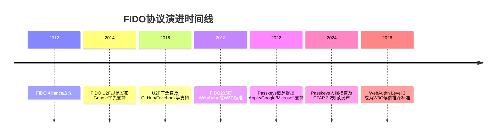
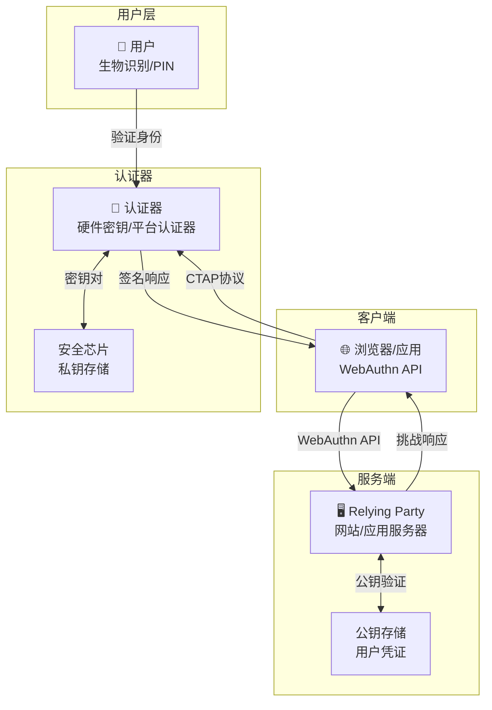
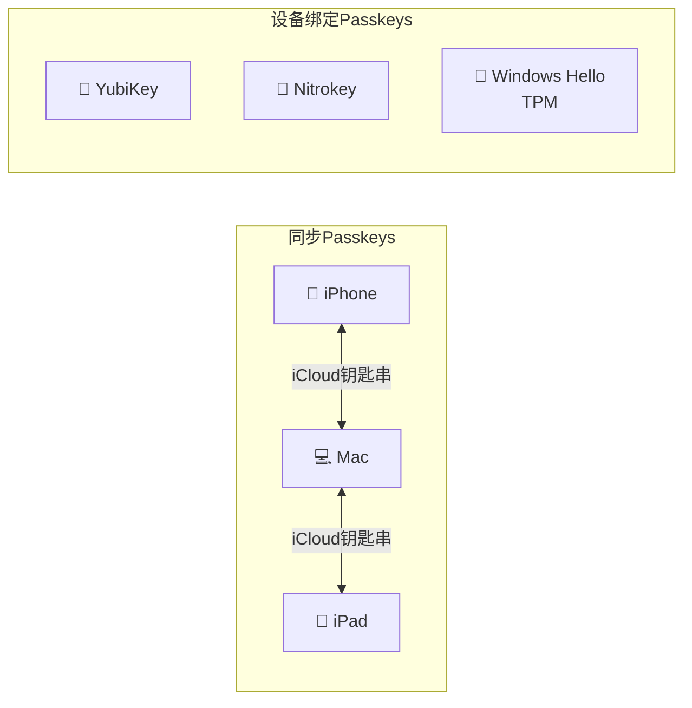
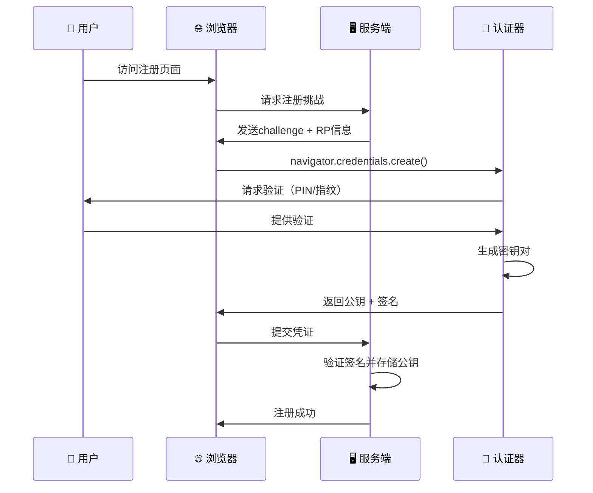
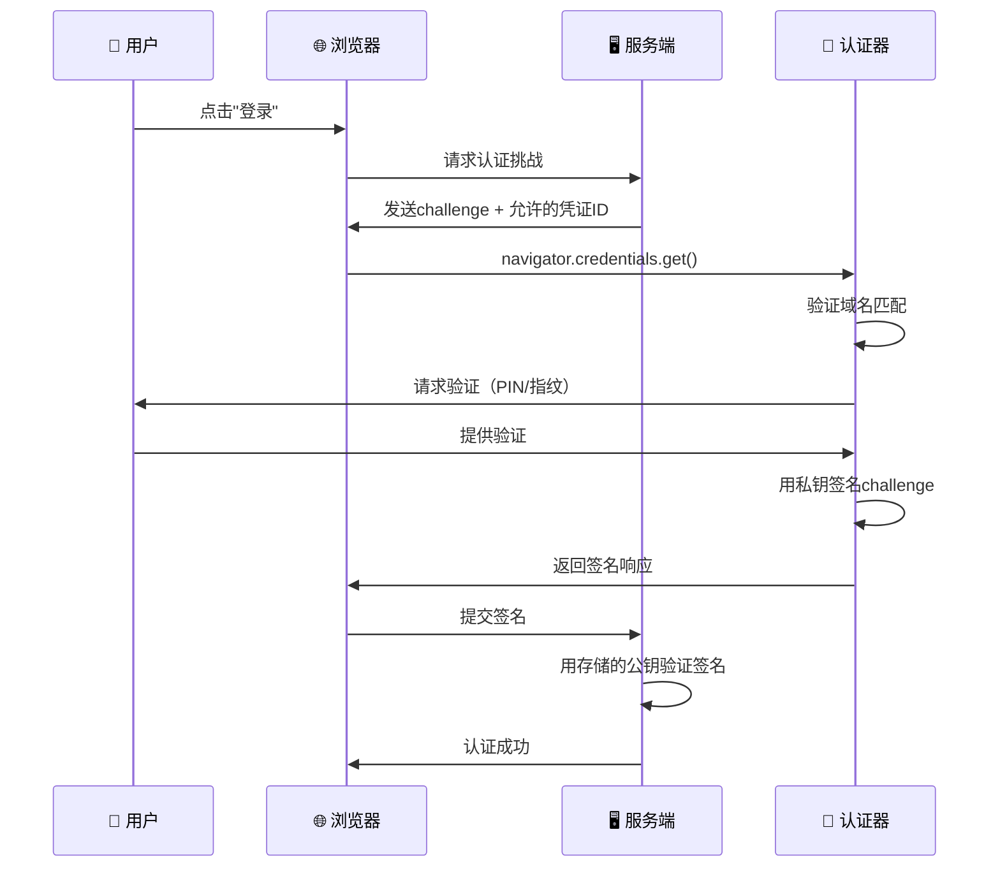
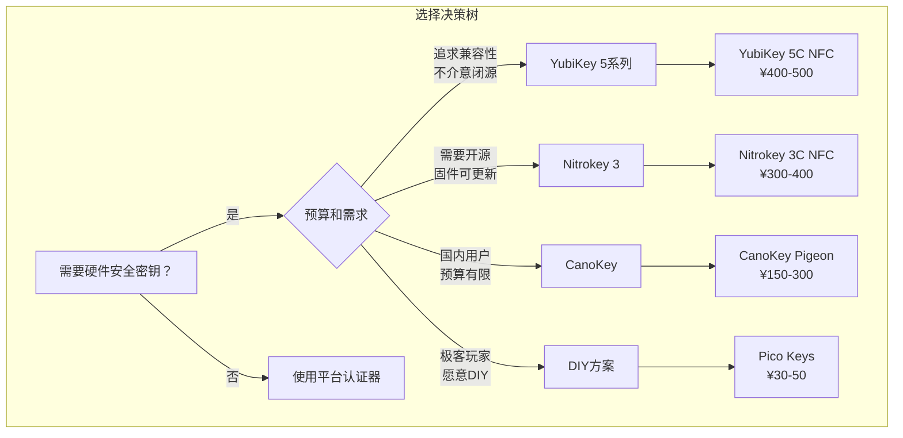
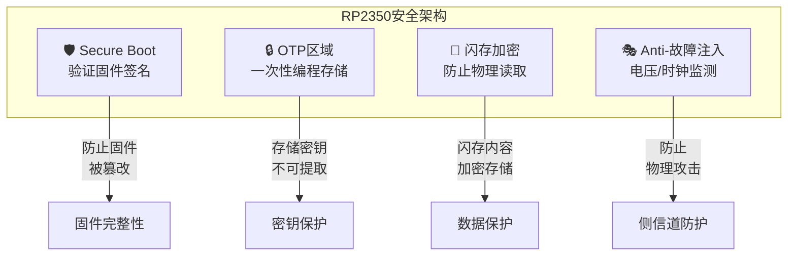

# FIDO介绍与其DIY

## 1. 背景与定义

### 什么是FIDO？

**FIDO**（Fast Identity Online，快速身份在线）是由 [FIDO Alliance](https://fidoalliance.org/) 于2012年成立的开放行业协会制定的一系列身份认证标准。其核心目标是**减少全球对密码的依赖**，提供更安全、更便捷的认证方式。

> [!info] FIDO Alliance
> FIDO Alliance由250多家全球领先企业组成，包括Google、Apple、Microsoft、Amazon、Intel、ARM等科技巨头，以及Visa、Mastercard等金融支付公司。该联盟负责制定和维护FIDO相关技术规范。

根据 [Verizon 2024数据泄露调查报告](https://www.verizon.com/business/resources/reports/dbir/)，网络钓鱼攻击的发生率逐年增长，凭证泄露仍是首要安全威胁。FIDO协议从根本上解决了这些问题。

### FIDO协议演进

FIDO Alliance发布了三代认证规范：

| 规范 | 发布时间 | 核心功能 | 当前状态 |
|------|----------|----------|----------|
| **FIDO U2F** | 2014 | 通用第二因素认证 | 已淘汰，被FIDO2替代 |
| **FIDO UAF** | 2014 | 通用认证框架（无密码） | 部分场景使用 |
| **FIDO2** | 2018 | 密码无关认证（Passkeys） | **当前标准** |



## 2. 核心概念解释

### FIDO2技术架构

FIDO2由两个核心技术组成：

1. **WebAuthn**（Web Authentication）：W3C标准的浏览器API，定义了网页应用如何与认证器交互
2. **CTAP**（Client to Authenticator Protocol）：客户端与认证器之间的通信协议



### Passkeys（通行密钥）

**Passkeys**是FIDO2的核心应用场景，它**完全替代密码**，而非作为第二因素。

> [!tip] Passkeys vs 密码
> Passkeys是**抗钓鱼**的加密凭证，使用非对称密钥对（公钥/私钥）实现认证。私钥永远不离开用户设备，即使服务器数据库泄露，攻击者也无法获取可用于登录的凭证。

#### Passkeys类型

| 类型 | 特点 | 同步方式 | 安全等级 |
|------|------|----------|----------|
| **同步Passkeys** | 在设备间自动同步 | iCloud钥匙串/Google密码管理器 | 高（依赖平台安全） |
| **设备绑定Passkeys** | 不离开单一设备 | 无同步 | 极高（硬件隔离） |



### 认证流程详解

#### 注册流程（Registration）



#### 认证流程（Authentication）



> [!warning] 抗钓鱼原理
> 认证器在注册时会记录网站域名（RP ID）。认证时，浏览器必须提供匹配的域名，否则认证器拒绝签名。这意味着即使攻击者创建了完美的钓鱼页面，由于域名不匹配，认证也会失败。

## 3. 技术深度分析

### 安全模型

FIDO的安全性基于以下核心原则：

1. **非对称加密**：每个凭证使用唯一的密钥对，私钥永不离开认证器
2. **挑战-响应机制**：每次认证使用一次性挑战值，防止重放攻击
3. **域名绑定**：凭证与特定域名关联，防止跨站攻击
4. **用户验证**：需要本地验证（PIN/生物识别）才能使用私钥

#### 安全级别对比

| 攻击方式 | 密码 | 密码+SMS OTP | 密码+TOTP | FIDO2 Passkeys |
|----------|------|--------------|-----------|----------------|
| **钓鱼攻击** | ❌ 易受攻击 | ❌ 易受攻击 | ❌ 易受攻击 | ✅ 完全免疫 |
| **重放攻击** | ❌ 易受攻击 | ⚠️ 部分保护 | ⚠️ 部分保护 | ✅ 完全免疫 |
| **数据库泄露** | ❌ 密码泄露 | ❌ 密码泄露 | ⚠️ 密钥可能泄露 | ✅ 仅公钥 |
| **中间人攻击** | ❌ 易受攻击 | ❌ 易受攻击 | ❌ 易受攻击 | ✅ 完全免疫 |
| **凭证填充** | ❌ 易受攻击 | ❌ 易受攻击 | ❌ 易受攻击 | ✅ 完全免疫 |

> [!success] 实际效果
> [Google在2018年报告](https://krebsonsecurity.com/2018/07/google-security-keys-approach-100-effectiveness-in-stopping-account-takeovers/)，部署硬件安全密钥后，内部员工账户被钓鱼攻击的成功率降至**零**。不是"显著降低"，而是零。

### CTAP 2.2新特性

2025年2月发布的 [CTAP 2.2](https://fidoalliance.org/specs/fido-v2.2-ps-20250228/fido-client-to-authenticator-protocol-v2.2-ps-20250228.html) 规范引入了重要改进：

- **企业级认证**（Enterprise Attestation）：允许企业部署的密钥提供更详细的设备信息
- **备用UI**：支持在没有显示屏的设备上配置认证器
- **最小PIN长度策略**：服务器可要求更长的PIN
- **凭证管理改进**：更好的凭证发现和管理能力

### WebAuthn Level 3

[W3C WebAuthn Level 3](https://w3.org/TR/webauthn-3)（2026年1月成为候选推荐标准）的新特性：

- **信号API**：允许网站报告被钓鱼的凭证使用
- **远程桌面支持**：改进远程环境下的认证体验
- **多设备声明**：更好地支持跨设备场景
- **第三方认证器**：改进的第三方认证器API

## 4. 主流FIDO产品对比

### 硬件安全密钥产品

| 产品 | 价格范围 | 开源 | 固件更新 | FIDO2 | NFC | TOTP | OpenPGP | 安全芯片 | 产地 |
|------|----------|------|----------|-------|-----|------|---------|----------|------|
| **YubiKey 5系列** | ¥350-600 | ❌ 闭源 | ❌ 不可更新 | ✅ | 部分 | ✅ | ✅ | ✅ | 瑞典/美国 |
| **Nitrokey 3** | ¥200-500 | ✅ 开源 | ✅ 可更新 | ✅ | 部分 | ✅ | ✅ | ✅ EAL 6+ | 德国 |
| **SoloKey** | ¥150-300 | ✅ 开源 | ✅ 可更新 | ✅ | 部分 | ❌ | ❌ | ❌ | 美国 |
| **OnlyKey** | ¥350-550 | ⚠️ 部分开源 | ✅ 可更新 | ✅ | ❌ | ✅ | ❌ | ✅ | 美国 |
| **CanoKey** | ¥100-200 | ✅ 开源 | ✅ 可更新 | ✅ | 部分 | ✅ | ✅ | 可选 | 中国（清华） |

#### YubiKey详解

[YubiKey](https://www.yubico.com/products/yubikey-5-overview/) 是市场上最知名、兼容性最广的硬件安全密钥。

**优势：**
- 最广泛的兼容性——几乎支持所有主流服务
- 多种形态（USB-A、USB-C、NFC、Lightning）
- 支持FIDO2、U2F、TOTP、HOTP、PIV、OpenPGP、YubiOTP
- 当前固件（5.7+）支持100个Passkey槽位
- FIDO Level 2认证

**劣势：**
- 闭源固件——无法审计代码
- 不支持固件更新——发现漏洞需购买新设备
- 较高价格
- 美国公司（部分地区用户可能有管辖权顾虑）

> [!warning] YubiKey安全事件
> 2024年，YubiKey 5系列被发现存在 [安全漏洞](https://www.yubico.com/support/security-advisories/ysa-2024-03/)，由于固件不可更新，受影响用户只能购买新设备。这突显了开源固件和可更新能力的重要性。

#### Nitrokey详解

[Nitrokey](https://www.nitrokey.com/) 是德国公司开发的开源硬件安全密钥，注重透明度和可审计性。

**优势：**
- 完全开源固件——可审计安全性
- 支持固件更新——漏洞可修补
- EAL 6+认证安全芯片（Nitrokey 3）
- 欧盟隐私管辖权
- 多种型号适应不同需求

**劣势：**
- 生态系统小于YubiKey
- 部分功能不如YubiKey成熟
- Passkey容量不一（35-100个）

#### CanoKey详解

[CanoKey](https://docs.canokeys.org/) 是清华大学团队开发的开源硬件安全密钥项目。

**优势：**
- 完全开源
- 价格亲民
- 支持FIDO2、TOTP、OpenPGP
- 国内团队，本地支持

**劣势：**
- 非安全芯片版本存在物理访问风险
- 安全版本（Pigeon/Canary）价格较高

### 平台认证器（无需额外硬件）

| 平台 | 技术基础 | 安全等级 | Passkey同步 |
|------|----------|----------|-------------|
| **Windows Hello** | TPM 2.0 | 高 | 通过Microsoft账户同步 |
| **macOS/iOS** | Secure Enclave | 极高 | 通过iCloud钥匙串同步 |
| **Android** | Titan M芯片/Keystore | 高 | 通过Google密码管理器同步 |
| **Chrome** | 软件实现 | 中 | 通过Google账户同步 |



## 5. DIY FIDO2安全密钥完全指南

### 为什么DIY？

| 对比维度 | 商用密钥（如YubiKey） | DIY方案（Pico Keys） |
|----------|----------------------|---------------------|
| **成本** | ¥350-600 | ¥30-50 |
| **开源** | ❌ | ✅ 完全开源 |
| **固件更新** | ❌ | ✅ 随时更新 |
| **安全芯片** | ✅ | ⚠️ 依赖芯片特性 |
| **安全性审计** | 依赖厂商 | 可自行审计 |
| **定制能力** | 无 | 完全可控 |
| **生产就绪性** | ✅ 经过认证 | ⚠️ 实验性质 |

> [!warning] DIY安全声明
> DIY方案虽然开源透明，但**缺乏FIDO Alliance认证**，固件的安全审计可能不如商用产品彻底。对于高安全要求的场景，建议使用经过认证的商用产品。

### 方案选择

目前主流的开源FIDO2 DIY方案：

| 项目 | 平台 | 成本 | 安全特性 | 活跃度 |
|------|------|------|----------|--------|
| **[Pico Keys](https://github.com/polhenarejos/pico-fido)** | RP2040/RP2350/ESP32S3 | ¥30-50 | Secure Boot | 活跃 |
| **[OpenSK](https://github.com/google/OpenSK)** | nRF52840 | ¥80-150 | 部分保护 | 维护中 |
| **[LionKey](https://github.com/pokusew/lionkey)** | STM32H533 | ¥100+ | 硬件保护 | 活跃 |
| **[Fidelio](https://github.com/danielinux/fidelio)** | Raspberry Pi Pico | ¥30 | 有限 | 停滞 |

> [!tip] 推荐：Pico Keys
> **Pico Keys**是当前最优的DIY方案：
> - 使用廉价的RP2350芯片（树莓派Pico 2同款）
> - 支持Secure Boot防止固件篡改
> - 利用OTP区域保护密钥不被提取
> - 积极维护，功能完整
> - 30元人民币即可入手

### 硬件准备

#### 推荐硬件

**核心开发板：Waveshare RP2350-One**
- 价格：约¥30（淘宝可购）
- 尺寸：类似小型U盘，非常便携
- 芯片：RP2350（支持Secure Boot）

> [!info] 其他支持的板子
> Pico Keys项目支持多种开发板，包括：
> - Raspberry Pi Pico / Pico 2
> - Waveshare RP2350-One
> - 各种ESP32S3开发板
> 
> 完整列表见 [Pico Keys支持设备](https://github.com/polhenarejos/pico-fido#supported-boards)

#### 硬件安全特性

RP2350芯片的安全特性：



> [!success] RP2350安全验证
> Raspberry Pi基金会曾举办 [RP2350 Hacking Challenge](https://www.raspberrypi.com/news/security-through-transparency-rp2350-hacking-challenge-results-are-in/)，悬赏$20,000寻找安全漏洞。最终4个成功攻击都使用了极高难度的技术——这证明了该芯片的基础安全性。

### 刷写固件

#### 步骤1：下载固件

访问 [Pico Keys固件发布页](https://github.com/polhenarejos/pico-fido/releases)，下载对应板子的`.uf2`文件。

对于Waveshare RP2350-One，下载`Raspberry Pico 2`版本的固件（完全兼容）。

#### 步骤2：进入Bootloader模式

1. 按住板子上的**BOOTSEL**按钮
2. 将USB插入电脑
3. 松开按钮
4. 电脑会识别为一个USB存储设备

#### 步骤3：刷写固件

直接将下载的`.uf2`文件拖入该USB设备即可，设备会自动重启并完成刷写。

> [!tip] 零门槛刷写
> RP2040/RP2350的刷写过程极其简单，不需要任何驱动或特殊工具，就像复制文件一样。

#### 步骤4：启用安全特性（强烈推荐）

刷写完成后，通过 [Pico Commissioner在线工具](https://www.picokeys.com/pico-commissioner/) 启用安全特性：

1. 连接设备到浏览器
2. 选择**Secure Boot**和**Secure Lock**
3. 应用配置

> [!warning] Secure Boot影响
> 启用Secure Boot后，设备只能运行官方签名的Pico Keys固件。这提高了安全性，但限制了自定义能力。如需同时兼顾DIY灵活性和安全性，可参考 [自签名指南](https://github.com/polhenarejos/pico-fido/issues/106)。

### 功能测试

#### FIDO2/Passkeys测试

1. 访问 [WebAuthn测试网站](https://webauthn.io/) 或搜索"FIDO2 Test"
2. 首次使用需设置PIN（至少4位）
3. 注册Passkey
4. 使用Passkey登录

使用`ykman`工具检查密钥状态：

```bash
# 列出设备
ykman list

# 查看FIDO信息
ykman fido info
```

输出示例：
```
YubiKey 5A (6.2.0) [OTP+FIDO+CCID] Serial: 272681xxxx
PIN:                    8 attempt(s) remaining
Minimum PIN length:     4
Enterprise Attestation: Disabled
```

#### SSH密钥测试

使用FIDO2生成SSH密钥：

```bash
# 生成普通FIDO2 SSH密钥
ssh-keygen -t ed25519-sk

# 生成驻留密钥（可在任何机器上恢复）
ssh-keygen -t ed25519-sk -O resident
```

> [!tip] SSH密钥安全性
> 使用`ssh-keygen -t ed25519-sk`生成的密钥需要**同时具备**硬件密钥和`.pub`文件才能使用——任何单一组件都不足以完成SSH访问。

#### TOTP测试

使用`ykman`管理OATH/TOTP：

```bash
# 添加TOTP账户
ykman oath accounts add "MyService"
# 输入base32编码的密钥

# 列出账户
ykman oath accounts list

# 生成验证码
ykman oath accounts code "MyService"
```

为OATH设置密码保护：

```bash
ykman oath access change
```

### 伪装YubiKey（趣味功能）

Pico Keys支持修改设备标识，可以伪装成YubiKey：

1. 使用Pico Commissioner修改Vendor为`Yubico`
2. 修改Product为`YubiKey 5`
3. 即可使用Yubico官方的`ykman`工具管理

### 故障恢复

如果需要重置设备到出厂状态，使用 [Pico Nuke固件](https://github.com/polhenarejos/pico-nuke)：

1. 下载nuke固件
2. 刷入设备
3. 设备将被完全重置

## 6. 专业总结与应用建议

### 安全实践最佳实践

1. **购买/制作至少两个密钥**：一个日常使用，一个安全备份
2. **优先保护关键账户**：邮箱 > 密码管理器 > 金融账户 > 云存储
3. **保存恢复代码**：离线安全存储，作为最后的恢复手段
4. **使用强PIN**：至少6位数字，避免简单序列
5. **启用Passkeys**：在支持的服务上使用Passkeys完全替代密码

### DIY vs 商用选择指南

| 场景 | 推荐方案 |
|------|----------|
| **企业部署/高安全要求** | 商用密钥（YubiKey/Nitrokey） |
| **技术爱好者/安全研究** | DIY方案（Pico Keys） |
| **预算有限/学习用途** | DIY方案（Pico Keys） |
| **日常个人使用** | 商用密钥或平台认证器 |
| **多密钥管理** | 商用密钥 + DIY备份 |

### 未来趋势

1. **Passkeys成为主流**：越来越多的服务支持Passkeys，密码正在被淘汰
2. **硬件密钥小型化**：安全密钥将更便携，集成到可穿戴设备
3. **跨平台同步**：Passkeys的跨设备同步将更无缝
4. **企业级特性**：更多企业级认证和管理能力

## 7. 参考链接

1. [FIDO Alliance官方](https://fidoalliance.org/) — FIDO标准和认证的权威来源
2. [WebAuthn W3C规范](https://w3.org/TR/webauthn-3) — Web认证API标准
3. [CTAP 2.2规范](https://fidoalliance.org/specs/fido-v2.2-ps-20250228/fido-client-to-authenticator-protocol-v2.2-ps-20250228.html) — 客户端到认证器协议
4. [Passkeys介绍](https://fidoalliance.org/passkeys/) — Passkeys官方介绍
5. [Pico Keys项目](https://github.com/polhenarejos/pico-fido) — 开源FIDO2 DIY方案
6. [DIY 30元FIDO2密钥](https://blog.lyc8503.net/en/post/diy-fido-key/) — lyc8503的详细DIY教程
7. [硬件安全密钥对比](https://stateofsurveillance.org/guides/advanced/hardware-security-keys-comparison/) — YubiKey vs Nitrokey vs OnlyKey
8. [RP2350安全挑战结果](https://www.raspberrypi.com/news/security-through-transparency-rp2350-hacking-challenge-results-are-in/) — 芯片安全验证
9. [Google安全密钥零钓鱼报告](https://krebsonsecurity.com/2018/07/google-security-keys-approach-100-effectiveness-in-stopping-account-takeovers/) — 硬件密钥的实际效果
10. [CanoKeys项目](https://docs.canokeys.org/) — 清华大学开源硬件密钥
