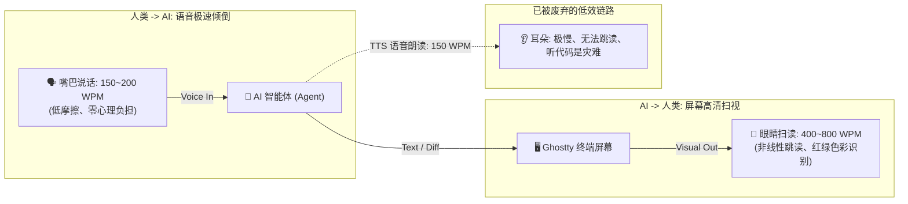
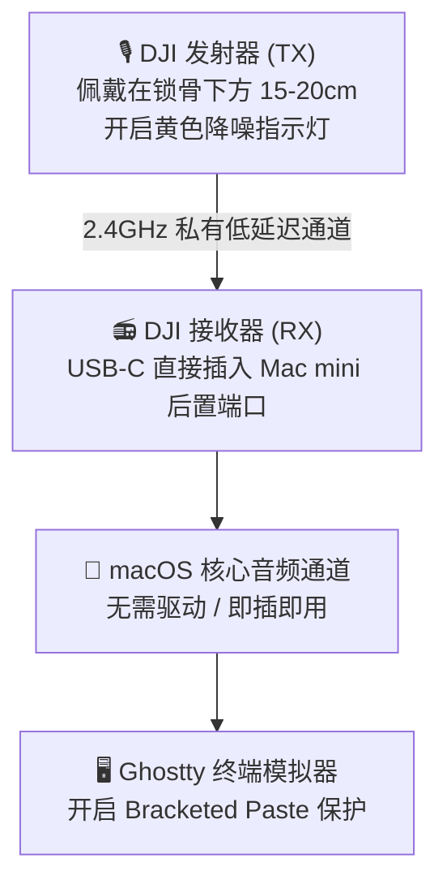
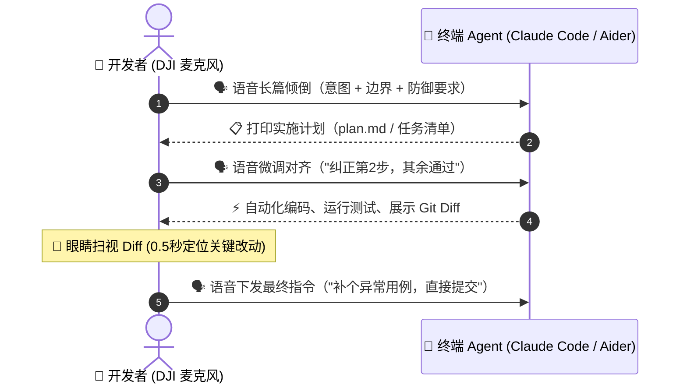

> [!important] 核心认知：非对称带宽（Asymmetric Bandwidth）
> **“嘴巴输入（Voice In）+ 眼睛看（Visual Out）”是人机结对编程（Pair Programming）的最高效形态。**
> 打字是人类思考的吞吐量瓶颈；耳朵是线性低效的接收通道。用语音以 3 倍速倾倒上下文，用眼睛以 5 倍速扫视代码 Diff，形成高频、低摩擦的**持续对齐（Continuous Steering & Alignment）**。

---

## 🎯 一、 背景：打字是人机协作的最大摩擦力

在 Andrej Karpathy 提出 **“Vibe Coding”** 的概念后，AI 辅助编程正在从传统的“手写语法”全面转向“意图传达与架构推演”。

然而，许多开发者在尝试 Vibe Coding 时往往陷入两难：
1. **短命令导致幻觉**：因为敲键盘有阻力，人类倾向于只打简短的 Prompt（如*“修复这个 Bug”*、*“写个登录接口”*），AI 缺乏上下文，生成的代码频频偏航；
2. **长输入疲惫不堪**：如果要像写 PR 描述一样敲入所有边界条件、防御性检查与架构考量，敲键盘的疲惫感迅速打断了灵感的心流。

**解决这一瓶颈的关键钥匙就是语音**。人类正常说话的语速约为 **150 ~ 200 字/分钟**，是打字速度的 3~4 倍。更关键的是，戴上领夹麦克风后，你可以靠在工学椅上、甚至站起来伸个懒腰，以**意识流（Stream of Consciousness）**的状态将脑海中的直觉、权衡与怀疑倾泻给 AI。

---

## 💡 二、 深度辩证：为什么不需要 AI 用语音回复你？

许多初尝语音交互的开发者常有一个直觉疑问：*“我说话给 AI，AI 为什么不用语音读给我听？难道我不应该戴着耳机跟它聊天吗？”*

**答案是：千万不要让 AI 语音读代码！你看屏幕绝对快得多得多。**

这是 Vibe Coding 中最核心的交互法则——**非对称带宽模型**：



### 1. 吞吐量维度的巨大鸿沟
* **听音频**：必须严格按时间线性播放，哪怕开 2 倍速也只有 ~300 WPM，中途走神一秒就失去上下文；
* **看屏幕**：人类视觉支持**非线性空间跳读**。面对 50 行的 Git Diff，你的眼睛只需 **0.5 秒** 就能定位到红色的删除行与绿色的核心逻辑改动。

### 2. 代码在听觉上的“不可理解性”
试想耳朵听这样一段代码：
> *“左括号，const response 等于 await fetch……注意在第四十二行存在未捕获的 TypeError……”*

这不仅毫无信息增益，反而是极其痛苦的认知过载。**因此，最佳实践始终是：你说你的，它打它的，你眼睛扫一眼，直接给下一轮反馈。**

---

## 🛠️ 三、 硬件基座：DJI 麦克风与 Mac mini 的免驱联动

Mac mini 作为极佳的桌面工作站，最大的短板是**没有自带阵列麦克风**（即便外接普通摄像头麦克风，也极易录入风扇噪音与机械键盘的敲击声）。

**DJI 领夹麦克风（DJI Mic / Mic 2 / Mic Mini）**是这个工作流的绝配：



* **降噪与收音**：开启发射器上的环境降噪（黄色指示灯常亮），能彻底过滤机械键盘的 Click 声，保证语音转写模型获得高信噪比的纯净人声。
* **佩戴姿势**：夹在领口或锁骨正下方，无需提高音量，轻声低语即可被清晰捕获。

---

## ⚡ 四、 终端极客选型：Ghostty 下的专属语音方案

在 Ghostty 终端模拟器中做语音交互，比在臃肿的 GUI IDE 里更加敏捷纯粹。以下是两种最推荐的落地路径：

### 方案 1：终端 CLI 原生语音模式（零额外软件）

主流的终端 Agent（如 **Claude Code** 和 **Aider**）其实都在终端里原生集成了语音输入支持！

#### 1. Claude Code 的原生 `/voice`
* **启动方式**：在 Ghostty 终端中启动 `claude`，输入 `/voice` 回车开启语音模式。
* **交互手感**：
  * **按住空格键（Hold Spacebar）**开始倾吐想法；
  * 说完后**松开空格键**，文字瞬时插入命令行提示符；
  * 回车确认提交。
* **优势**：由 Anthropic 针对编程术语深度优化，且不额外扣减会话 Token。

#### 2. Aider 的原生 `/voice`
* **环境准备**：`brew install portaudio`
* **交互方式**：在 Aider 对话中输入 `/voice`，按 Enter 开始录音，录完按 Enter 停止并提交，自动生成规范的 Git Commit。

### 方案 2：全局 Superwhisper 注入流（Karpathy 标配）

如果你希望跨终端、文档与浏览器统一使用语音：
* **核心配置**：
  * 引擎选本地 `whisper.cpp`（完全在 Apple Silicon M 系列芯片上本地推理，隐私且零延迟）；
  * **至关重要的设置**：**关闭 `Auto-submit / Press Enter`**，只允许它向 Ghostty 粘贴文本，严禁自动触发回车；
  * **快捷键绑定**：设为 `Right Option` 或 `双击 Left Cmd`，避免与终端本身的常用键位冲突。

---

## 🔄 五、 Karpathy 式“持续对齐”实操四步法

进入实际编码任务时，请遵循以下四步闭环：



### 1. 意图倾倒（Stream of Consciousness）
不要惜字如金。按住麦克风，一口气说 30~50 秒：
> *“我们要给当前服务加一个内存缓存层。千万不要引入外部 Redis，直接用内置的 lru-cache。先不要动手改业务逻辑，先看一眼 `services/user.ts`，把需要加缓存的方法和失效策略列成清单给我。”*

### 2. 计划锁死（Plan Freeze）
Agent 打印出步骤清单后，**只要有 10% 偏离你的本意，坚决不让它改代码**：
> *“第 2 步不对，不要在 Controller 里做缓存，统一收口在 Repository 层；其他步骤符合预期，放手执行。”*

### 3. 静默执行与视觉速读（Visual Skim）
Agent 开始修改代码并跑测试：
* 终端发出任务完成提示音；
* 你的眼睛迅速扫过 Ghostty 终端里的高亮 Diff——重点关注**红色删除了什么重要逻辑**，以及**绿色新增的函数签名是否规范**。

### 4. 口述微操与原子提交（Micro-Steering）
发现瑕疵，不要伸手去敲键盘修改：
> *“看一眼刚才改的单测，少覆盖了空字符串的情况。补上测试用例，全部跑通后直接 git commit。”*

---

## 🌐 六、 Reddit 社区硬核实践与防踩坑指南

在 Reddit 的 r/ClaudeAI 和 r/commandline 社区中，全球极客们沉淀了宝贵的实操细节：

### 1. 消除 Whisper 的“静默幻觉”
* **痛点**：思考中途停顿 2 秒，语音模型经常脑补出 *“Thank you for watching”* 等 YouTube 视频高频字幕。
* **解法**：在 Superwhisper 或 Whisper 的 Prompt 参数中注入防御提示词：
  ```text
  Context: Strict technical programming dictation. Do not hallucinate filler phrases or subtitles.
  ```

### 2. 注入编程技术词典（Custom Vocabulary）
为防止将 `camelCase` 听成 `camel case`，把 `TypeScript` 听成 `text script`，务必在词典里配置常用术语：
`TypeScript, Ghostty, refactor, Git, PR, Docker, SQLite, AST, Zod, API, endpoint, boolean`

### 3. 高阶硬件：蓝牙指点笔与脚踏板（Foot Pedal）
Reddit 开发者普遍反感“0.8 秒触发延迟带来的心流打断”：
* 不少人配备了十几美元的**无线指尖翻页器**或 **USB 踏板**；
* 领口夹着 DJI 麦克风，手里拿着翻页笔，按住即可在任何姿势下说话，彻底解放双手与脊柱。

---

## 📺 七、 精选视频教程与检索路径

想要观摩动态操作节奏，可以在 YouTube 搜索以下精确标题：

| 视频标题 | 核心学习点 |
| :--- | :--- |
| **`Claude Code Voice Mode Tutorial & Workflow`** | 学习终端原生 `/voice` 的按键手感与上下文对齐实操。 |
| **`Be a 10x Vibe Coder (Claude Code + MCP)`** | 学习如何通过分步计划（Plan Mode）在终端高效调度多 Agent。 |
| **`VIBE CODING 3 min demo | Cursor + o3-mini + SuperWhisper`** | 体验 Karpathy 式“不碰键盘、高频口述纠偏”的极速节奏。 |

---

## 📝 总结与行动清单

如果你今天就想把这套工作流跑通，只需完成以下三步：
1. **硬件就绪**：将 DJI 麦克风接收器插上 Mac mini，发射器夹在领口并开启降噪模式；
2. **终端调优**：打开 Ghostty，启动 `claude` 并输入 `/voice`，或者打开 `Superwhisper` 并关闭自动回车；
3. **心态切换**：告别逐行敲命令的旧习惯，像给资深搭档布置任务一样，一口气把“为什么要做、有什么限制、先给什么方案”聊出来。

**把键盘留给微调，把思考交给声音，把验证交给眼睛。**
