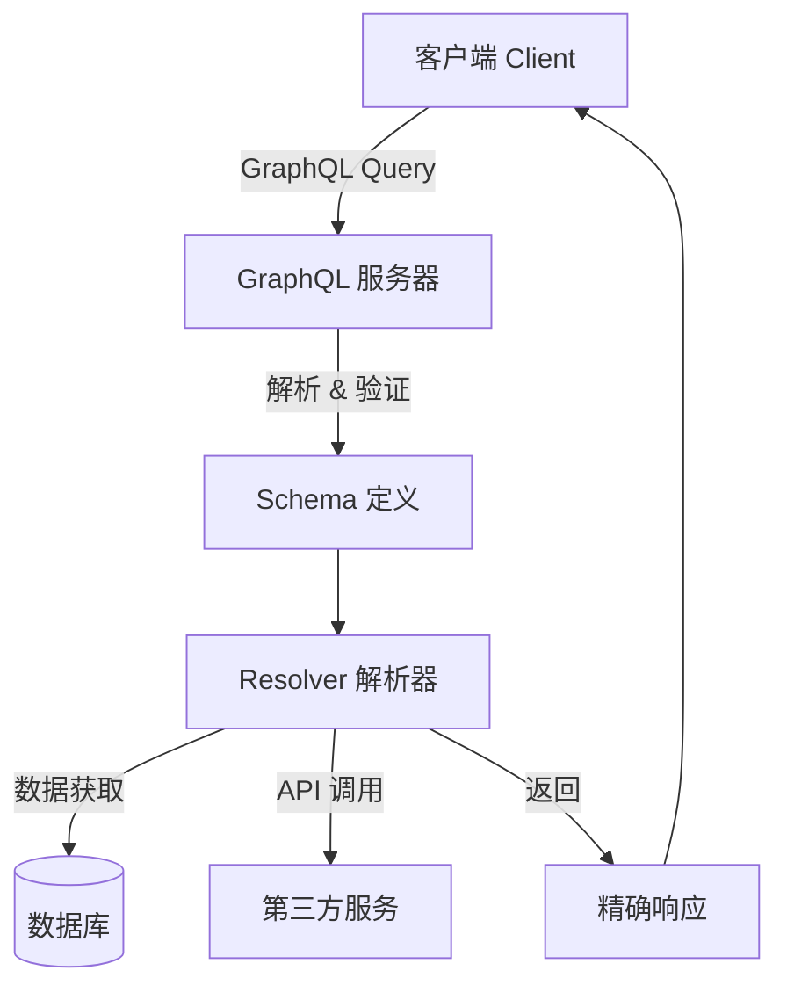
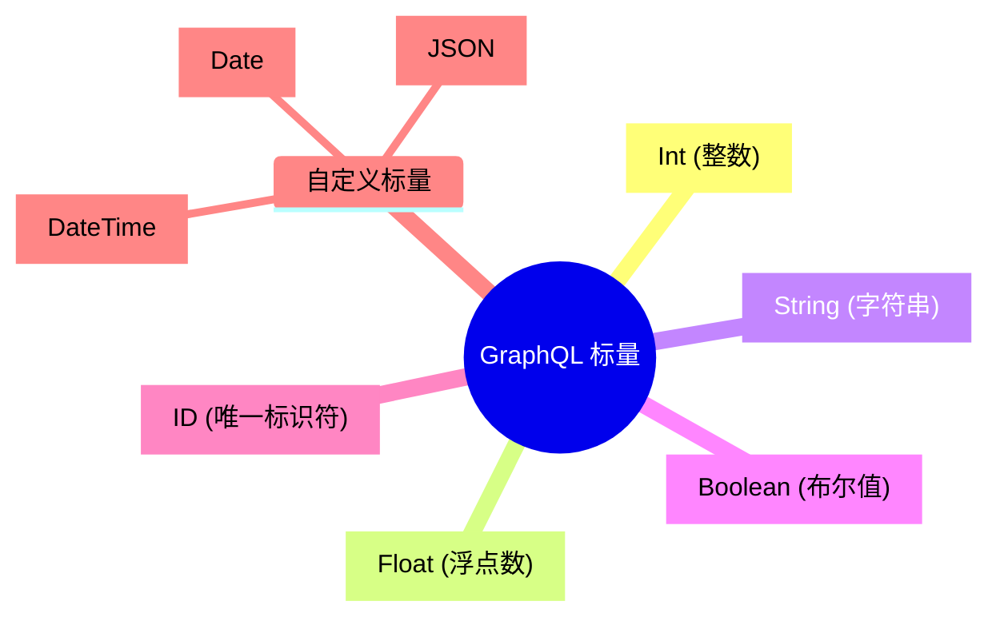
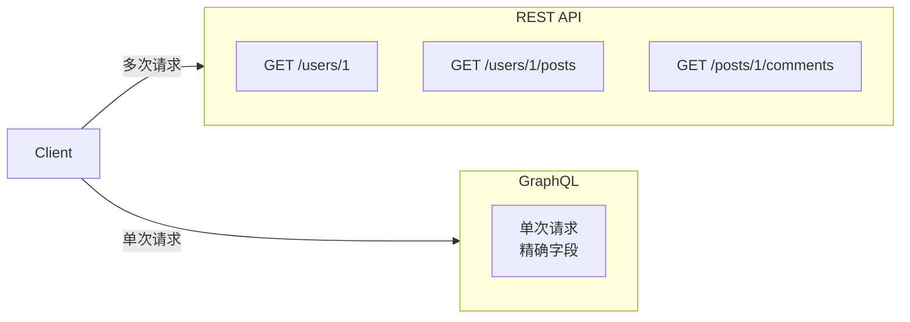
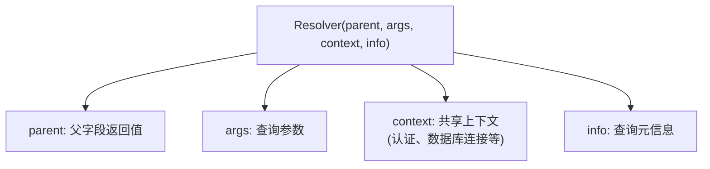
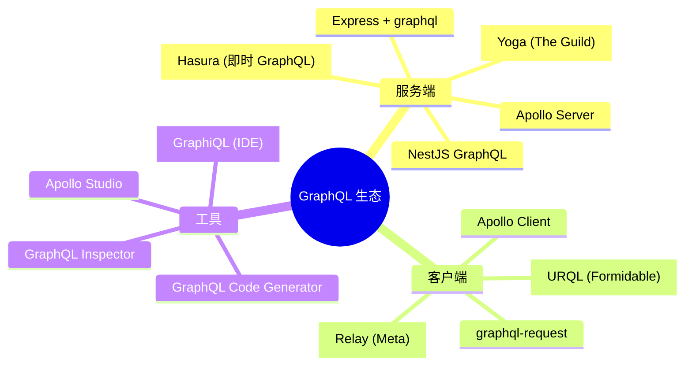
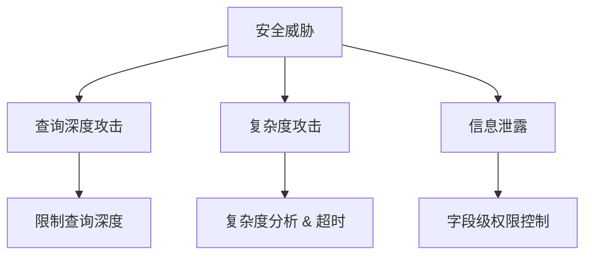

# GraphQL 详解

## 1. 背景与定义

**GraphQL** 是一种用于 API 的查询语言和运行时环境，由 **Facebook (现 Meta)** 于 2012 年内部开发，并于 2015 年开源。它提供了一种更高效、强大且灵活的替代 REST API 的方案。

- 核心理念：**"Ask for what you need, get exactly that"**（你需要什么，就获取什么）
- 官方网站：[GraphQL 官网](https://graphql.org/)
- GitHub 仓库：[graphql/graphql-js](https://github.com/graphql/graphql-js)

---

## 2. 核心概念

### 2.1 整体架构



### 2.2 三大核心支柱

| 支柱 | 说明 |
|------|------|
| **Schema** | 类型系统，定义 API 的能力和数据结构 |
| **Query** | 查询语言，客户端声明式获取数据 |
| **Resolver** | 解析器，连接 Schema 与实际数据源的桥梁 |

---

## 3. Schema 定义语言

Schema 是 GraphQL 的核心，使用 **SDL (Schema Definition Language)** 定义：

```graphql
# 定义类型
type User {
  id: ID!
  name: String!
  email: String!
  posts: [Post!]!
}

type Post {
  id: ID!
  title: String!
  content: String!
  author: User!
}

# 查询入口
type Query {
  user(id: ID!): User
  users: [User!]!
  posts: [Post!]!
}

# 变更操作
type Mutation {
  createUser(name: String!, email: String!): User!
  createPost(title: String!, content: String!, authorId: ID!): Post!
}

# 订阅
type Subscription {
  onPostCreated: Post!
}
```

### 3.1 基本标量类型



---

## 4. 操作类型

### 4.1 Query（查询）

用于**读取数据**，类比 REST 的 `GET`：

```graphql
query GetUserWithPosts {
  user(id: "123") {
    name
    email
    posts {
      title
      content
    }
  }
}
```

**响应示例：**
```json
{
  "data": {
    "user": {
      "name": "Ryou",
      "email": "ryou@example.com",
      "posts": [
        { "title": "GraphQL 入门", "content": "..." }
      ]
    }
  }
}
```

### 4.2 Mutation（变更）

用于**修改数据**，类比 REST 的 `POST/PUT/DELETE`：

```graphql
mutation CreateNewUser {
  createUser(name: "Alice", email: "alice@example.com") {
    id
    name
    email
  }
}
```

### 4.3 Subscription（订阅）

用于**实时数据推送**，基于 WebSocket：

```graphql
subscription OnPostCreated {
  onPostCreated {
    title
    author {
      name
    }
  }
}
```

---

## 5. GraphQL vs REST 对比



| 特性 | REST | GraphQL |
|------|------|---------|
| **端点** | 多个 URL | 单一端点 `/graphql` |
| **数据获取** | 固定响应结构 | 客户端指定字段 |
| **Over-fetching** | 常见问题 | 完全避免 |
| **Under-fetching** | 需要 N+1 请求 | 单次请求解决 |
| **版本管理** | `/v1`, `/v2` | 无需版本，Schema 演进 |
| **类型系统** | 需额外工具 | 内置强类型 |
| **文档** | 需手动维护 | 自动生成 |

---

## 6. Resolver 解析器

Resolver 是获取数据的函数，每个字段都可以有对应的 Resolver：

```javascript
const resolvers = {
  Query: {
    user: (parent, args, context, info) => {
      return context.db.users.find(u => u.id === args.id);
    },
    users: (parent, args, context) => {
      return context.db.users;
    }
  },
  User: {
    posts: (parent, args, context) => {
      return context.db.posts.filter(p => p.authorId === parent.id);
    }
  },
  Mutation: {
    createUser: (parent, { name, email }, context) => {
      const newUser = { id: uuid(), name, email };
      context.db.users.push(newUser);
      return newUser;
    }
  }
};
```

### 6.1 Resolver 参数



---

## 7. 优势与挑战

### 7.1 优势

- **精确获取**：避免 Over-fetching 和 Under-fetching
- **强类型系统**：Schema 即文档，自动校验
- **单一端点**：简化网络层
- **实时能力**：Subscription 支持实时更新
- **聚合能力**：一次请求聚合多个数据源
- **工具生态**：GraphiQL、Apollo Studio 等强大工具

### 7.2 挑战与解决方案

| 挑战 | 解决方案 |
|------|----------|
| **N+1 查询问题** | DataLoader 批量加载 |
| **缓存复杂** | 使用 Apollo Client / Relay 缓存机制 |
| **学习曲线** | Schema-first 设计，逐步迁移 |
| **文件上传** | graphql-upload 或 multipart 请求 |
| **安全性** | 查询深度限制、复杂度分析 |

---

## 8. 主流实现框架



### 8.1 服务端示例

```javascript
import { ApolloServer } from '@apollo/server';
import { startStandaloneServer } from '@apollo/server/standalone';

const typeDefs = `#graphql
  type Book {
    title: String
    author: String
  }

  type Query {
    books: [Book]
  }
`;

const books = [
  { title: 'The Awakening', author: 'Kate Chopin' },
  { title: 'City of Glass', author: 'Paul Auster' },
];

const resolvers = {
  Query: {
    books: () => books,
  },
};

const server = new ApolloServer({
  typeDefs,
  resolvers,
});

const { url } = await startStandaloneServer(server, {
  listen: { port: 4000 },
});

console.log(`🚀 Server ready at: ${url}`);
```

---

## 9. 最佳实践

### 9.1 Schema 设计原则

- **业务领域驱动**：Schema 应反映业务模型
- **命名规范**：使用 `camelCase` 字段，`PascalCase` 类型
- **非空断言**：谨慎使用 `!`，明确可选与必选
- **分页设计**：使用 Relay Cursor Connections 规范

```graphql
type PageInfo {
  hasNextPage: Boolean!
  hasPreviousPage: Boolean!
  startCursor: String
  endCursor: String
}

type UserConnection {
  edges: [UserEdge!]!
  pageInfo: PageInfo!
  totalCount: Int!
}

type UserEdge {
  node: User!
  cursor: String!
}
```

### 9.2 安全性考虑



---

## 10. 最新趋势与生态

### 10.1 2024-2025 发展趋势

1. **GraphQL Federation 2.x**：微服务架构下的统一网关
2. **GraphQL over HTTP/2 & HTTP/3**：性能优化
3. **与 tRPC / TypeScript 深度集成**：端到端类型安全
4. **AI + GraphQL**：自动生成 Schema、智能查询优化
5. **边缘计算支持**：Cloudflare Workers、Vercel Edge Functions

### 10.2 相关资源

- [GraphQL 官方文档](https://graphql.org/learn/)
- [Apollo GraphQL](https://www.apollographql.com/)
- [The Guild](https://the-guild.dev/) — GraphQL 工具集
- [GraphQL Foundation](https://foundation.graphql.org/)
- [Hasura](https://hasura.io/) — 即时 GraphQL 引擎

---

## 11. 总结

GraphQL 是一种**革命性的 API 技术**，通过强类型 Schema、声明式查询和灵活的解析器机制，解决了传统 REST API 的诸多痛点。它特别适合：

- **复杂数据需求**的前端应用
- **多端适配**（Web、Mobile、IoT）
- **微服务聚合**场景
- **需要实时更新**的应用

然而，GraphQL 也带来了新的复杂性，需要团队在**学习成本、缓存策略、安全防护**等方面做好充分准备。
