>[!summary] 前情提要
>- 无处不在的 HOOK 技术 有点头痛。
我来为您详细梳理不同领域的 HOOK 技术。首先进行联网检索获取最新权威信息。

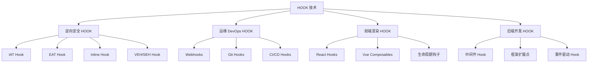

---

### 1. 核心概念：什么是 HOOK？

**HOOK（钩子）** 是一种**扩展点机制**，允许在特定事件发生或特定条件满足时，插入自定义逻辑。

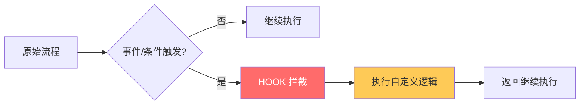

**核心思想**：**劫持** → **干预** → **放行/替代**

---

### 2. 逆向安全领域的 HOOK 技术

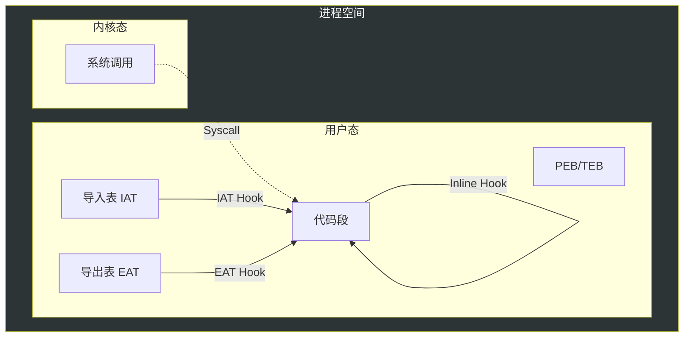

#### 2.1 IAT Hook（导入地址表钩子）

**原理**：修改 PE 文件的导入地址表（IAT），替换函数指针。

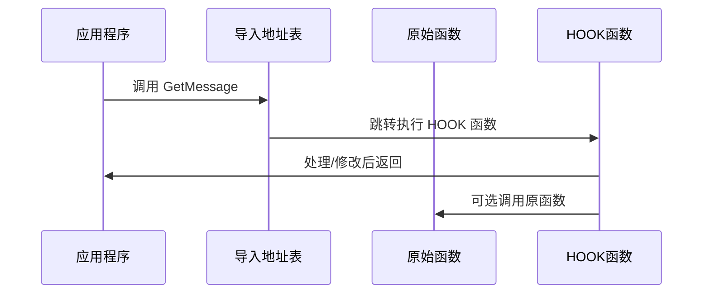

**代码示例（伪代码）**：
```c
// 保存原始函数指针
OrigGetMessage = (GetMessage_t)GetProcAddress(hUser32, "GetMessageW");

// 替换为 HOOK 函数
*pGetMessageW = (FARPROC)MyGetMessageW;
```

**特点**：
- ✅ 易于实现
- ✅ 稳定可靠
- ❌ 只能 Hook 导入表中的函数

---

#### 2.2 EAT Hook（导出地址表钩子）

**原理**：修改 DLL 的导出地址表，改变函数入口。

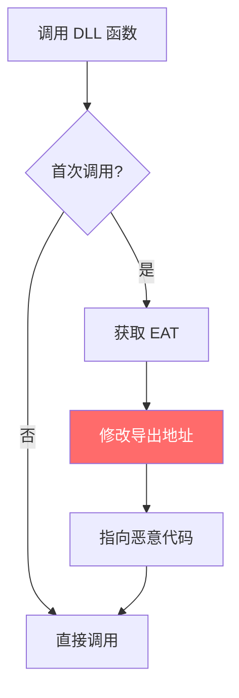

**应用场景**：
- 恶意软件替换系统 DLL 导出函数
- 软件破解/补丁

---

#### 2.3 Inline Hook（内联钩子）

**原理**：直接修改目标函数的机器码，跳转到自定义函数。

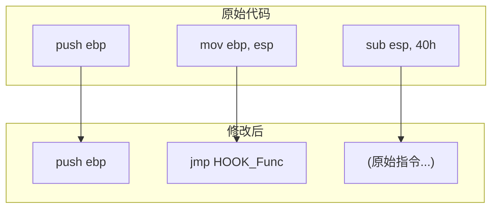

**实现步骤**：
1. 保存原始指令（前 5-7 字节）
2. 写入跳转指令（JMP XXXXXXXX）
3. 执行自定义逻辑
4. 可选：恢复原始指令并调用原函数

**特点**：
- ✅ 可 Hook 任意函数（包括内部函数）
- ✅ 灵活性最高
- ❌ 实现复杂，需要处理指令长度
- ❌ 可能被检测

---

#### 2.4 VEH/SEH Hook（异常处理钩子）

**原理**：利用 Vectored Exception Handler / Structured Exception Handler 拦截异常。

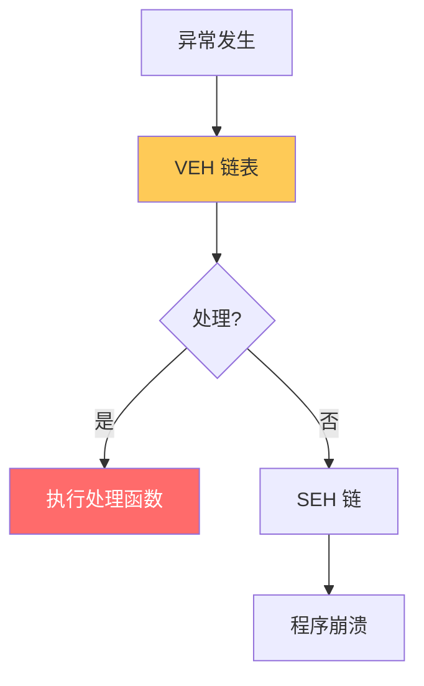

---

#### 2.5 应用场景

| 场景 | 说明 |
|------|------|
| 🛡️ **安全软件** | 杀毒软件 HOOK 系统调用进行监控 |
| 🎮 **游戏辅助** | 读取/修改游戏内存 |
| 🔧 **调试工具** | 函数拦截用于调试 |
| 🔒 **软件保护** | 检测调试器/修改器 |

* 参考来源：[Understanding Hooking Techniques - Mandiant](https://www.mandiant.com/resources/blog)

---

### 3. 运维 DevOps 领域的 HOOK

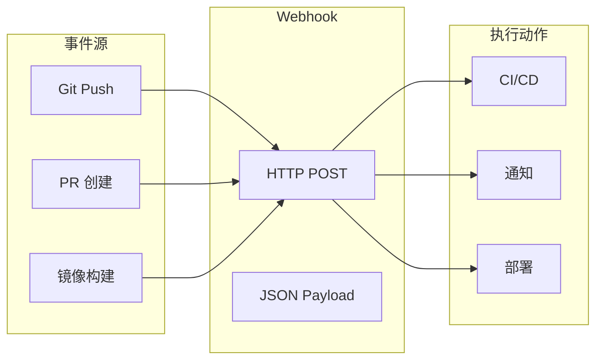

#### 3.1 Webhooks（Web 钩子）

**定义**：通过 HTTP 回调实现的自动化消息推送机制。

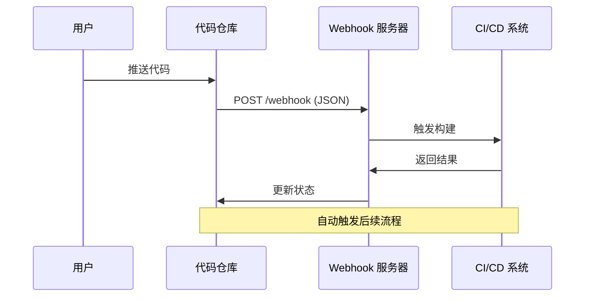

**常见应用**：
- GitHub/GitLab Webhooks → 触发 CI/CD
- 支付回调（支付宝/微信）
- 自动化测试触发

**配置示例**（GitHub）：
```yaml
# .github/workflows/example.yml
on:
  push:
    branches: [main]
  pull_request:
    branches: [main]
```

* 参考来源：[About Webhooks - GitHub Docs](https://docs.github.com/en/webhooks)

---

#### 3.2 Git Hooks

**定义**：Git 在执行特定操作时执行的脚本。

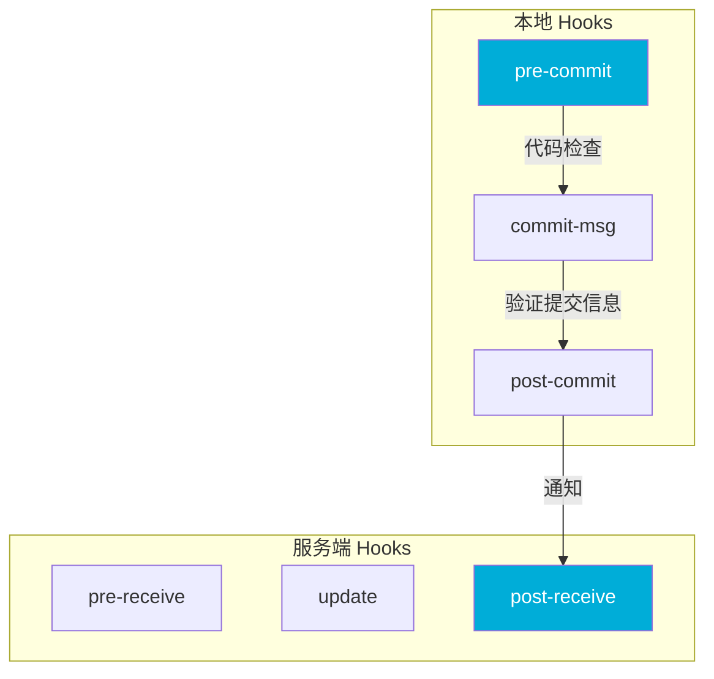

**常用 Git Hooks**：

| Hook | 阶段 | 用途 |
|------|------|------|
| `pre-commit` | 提交前 | 代码格式检查、单元测试 |
| `commit-msg` | 提交信息 | 规范提交信息格式 |
| `pre-push` | 推送前 | 运行完整测试 |
| `post-receive` | 接收后 | 自动部署 |

**使用示例**：
```bash
# .git/hooks/pre-commit
#!/bin/sh
npm run lint
npm test
```

* 参考来源：[Git Hooks - Pro Git Book](https://git-scm.com/book/en/v2/Customizing-Git-Git-Hooks)

---

#### 3.3 CI/CD Pipeline Hooks

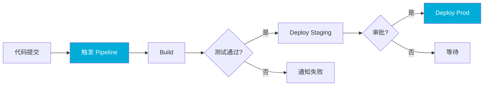

---

### 4. 前端渲染中的 HOOK

#### 4.1 React Hooks（React 核心机制）

**定义**：Hook 是让你在函数组件中"钩入"状态和副作用的函数。

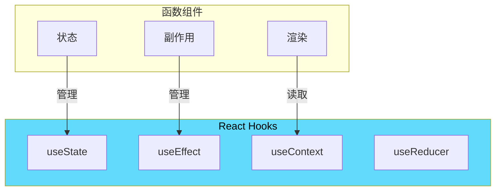

**核心 Hooks**：

```jsx
import { useState, useEffect, useContext } from 'react';

function Counter() {
    // 状态 Hook
    const [count, setCount] = useState(0);
    
    // 副作用 Hook
    useEffect(() => {
        document.title = `点击 ${count} 次`;
        // 清理函数
        return () => {
            console.log('清理副作用');
        };
    }, [count]);  // 依赖数组
    
    return <button onClick={() => setCount(count + 1)}>{count}</button>;
}
```

**Hook 规则**：
1. ⚠️ **只在顶层调用** - 不能在循环/条件中调用
2. ⚠️ **只在 React 函数中调用** - 函数组件或自定义 Hook

* 参考来源：[React Hooks Official Docs](https://react.dev/reference/react)

---

#### 4.2 Vue Composition API（Vue 3）

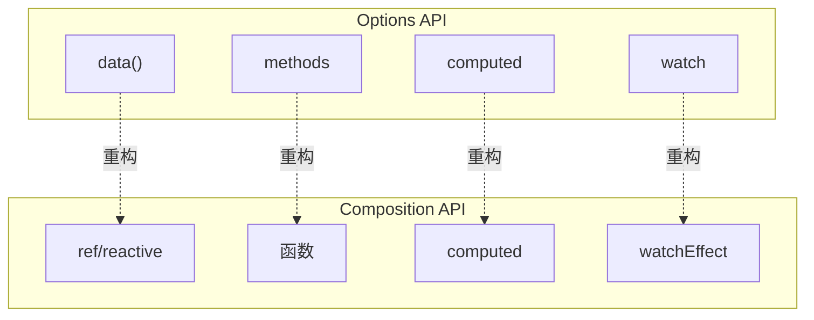

**Vue Hook 形式**：
```javascript
import { ref, onMounted, onUnmounted } from 'vue';

export function useMouse() {
    const x = ref(0);
    const y = ref(0);
    
    function update(event) {
        x.value = event.pageX;
        y.value = event.pageY;
    }
    
    onMounted(() => window.addEventListener('mousemove', update));
    onUnmounted(() => window.removeEventListener('mousemove', update));
    
    return { x, y };
}
```

---

#### 4.3 前端生命周期钩子

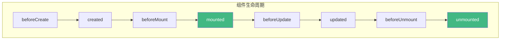

---

### 5. 后端开发中的 HOOK

#### 5.1 中间件模式（Middleware Hook）

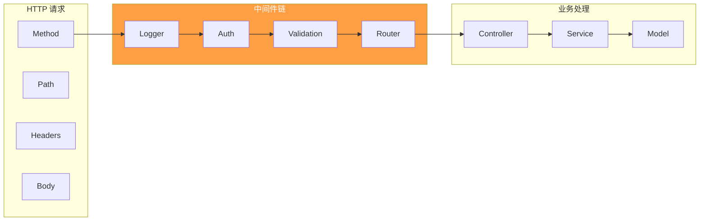

**Go Gin 框架示例**：
```go
func main() {
    r := gin.Default()
    
    // 全局中间件
    r.Use(Logger())
    r.Use(Recovery())
    
    // 路由组中间件
    api := r.Group("/api")
    api.Use(AuthRequired()) {
        api.GET("/users", getUsers)
    }
    
    r.Run(":8080")
}

// 自定义中间件
func Logger() gin.HandlerFunc {
    return func(c *gin.Context) {
        start := time.Now()
        path := c.Request.URL.Path
        
        c.Next()  // 处理请求
        
        latency := time.Since(start)
        status := c.Writer.Status()
        fmt.Printf("%s %s %d %v\n", c.Request.Method, path, status, latency)
    }
}
```

---

#### 5.2 框架扩展点 HOOK

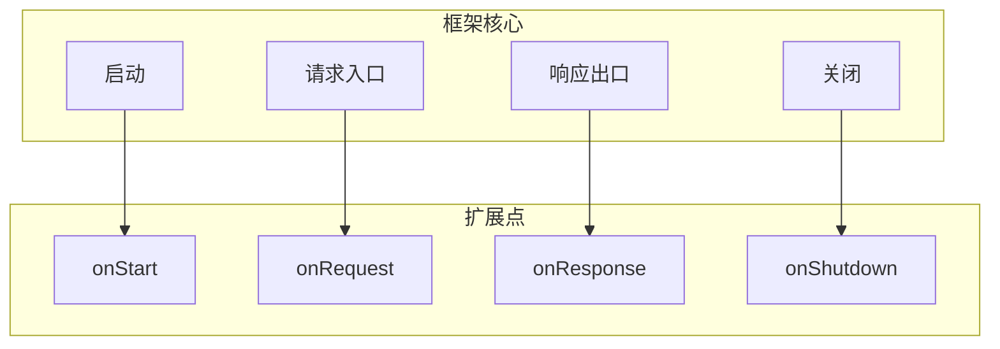

**Node.js Express 示例**：
```javascript
const express = require('express');
const app = express();

// 请求开始时执行
app.use((req, res, next) => {
    console.log('请求开始:', req.method, req.url);
    next();
});

// 路由处理器
app.get('/api', (req, res) => {
    res.json({ message: 'Hello' });
});

// 响应结束时的 Hook
app.use((req, res, next) => {
    res.on('finish', () => {
        console.log('响应完成:', res.statusCode);
    });
    next();
});
```

---

#### 5.3 事件驱动 HOOK

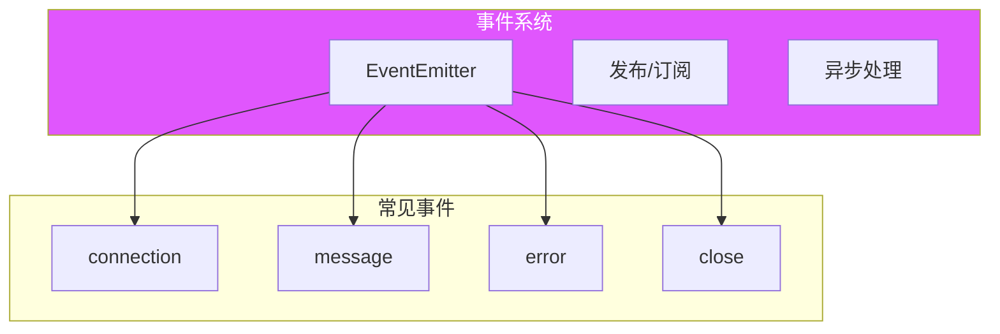

**Node.js 事件驱动示例**：
```javascript
const EventEmitter = require('events');
const emitter = new EventEmitter();

// 注册 HOOK（监听器）
emitter.on('user:login', (user) => {
    console.log('用户登录:', user.name);
    // 发送欢迎邮件
    sendWelcomeEmail(user.email);
});

emitter.on('user:login', (user) => {
    console.log('记录登录日志');
    // 写入日志
    logger.info(`User ${user.id} logged in`);
});

// 触发事件
emitter.emit('user:login', { id: 1, name: 'Alice', email: 'alice@example.com' });
```

---

### 6. 总结：HOOK 的统一本质

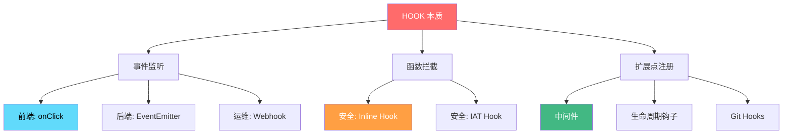

| 领域 | HOOK 形式 | 作用 |
|------|-----------|------|
| 🔒 **安全/逆向** | 代码注入、函数劫持 | 监控、修改行为 |
| 🛠️ **运维/DevOps** | Webhook、Git Hook | 自动化触发 |
| 🎨 **前端** | React Hooks、生命周期 | 状态/副作用管理 |
| ⚙️ **后端** | 中间件、事件钩子 | 请求预处理/扩展 |

---

### 参考链接

1. [Understanding Hooking Techniques - Mandiant](https://www.mandiant.com/resources/blog) — 安全逆向技术
2. [React Hooks Documentation](https://react.dev/reference/react) — React 官方文档
3. [Git Hooks - Pro Git Book](https://git-scm.com/book/en/v2/Customizing-Git-Git-Hooks) — Git 官方文档
4. [Webhooks - GitHub Docs](https://docs.github.com/en/webhooks) — Webhook 配置
5. [Inline Hooking - OpenSecurityTraining](https://opensecuritytraining.info/) — 内联Hook技术
6. [Go Gin Middleware](https://gin-gonic.com/docs/examples/using-middleware/) — Go 中间件示例

---

> 💡 **一句话总结**：HOOK 就是**"在特定时机插入自定义逻辑的机制"**，不同领域的叫法不同，但本质相通。

