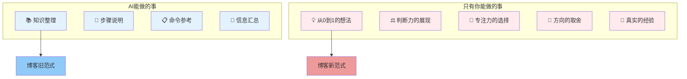
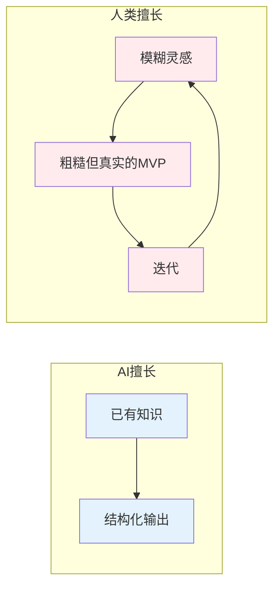
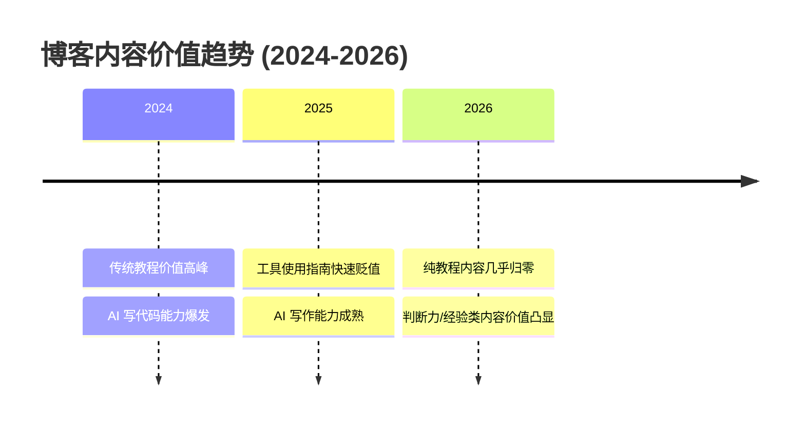

> [!summary] 核心论点
> LLM Agent 时代，博客的价值不再在于记录"如何做"，而在于展现"为什么做"和"做了什么判断"。**判断力就是新的稀缺**。

## 一、一次大清理

今天我做了一件事：删掉了博客 `post/` 目录下 63 篇博文，只保留了 9 篇。

被删掉的有：

- `git命令.md` — Git 命令参考
- `tmux 使用教程.md` — Tmux 教程
- `chmod 文件权限.md` — 权限命令指南
- `golang中grpc常见的protoc命令行.md` — 命令速查
- 等等，一共 63 篇

留着的有：

- `三资三化--人的私有化.md` — 关于个人资本化的理论框架
- `工作的复利问题.md` — 对 VibeCoding 和媒介批判的深度分析
- `笨蛋的思考.md` — 哲学随笔
- `FIDO介绍与其DIY.md` — 从无密码认证的愿景到 30 元 DIY 实现

看出区别了吗？

**前者是"怎么做"的记录，后者是"为什么"的探索。**

这不仅是内容分类的区别，更是在 LLM Agent 时代，人类创作者需要面对的根本性选择。

---

## 二、LLM Agent 改变了什么

2026 年的今天，任何一个 LLM Agent 都可以：

- 在 30 秒内写出一篇完整的 Git 教程
- 用你从未见过的视角解释 gRPC 的工作原理
- 生成一份带交互式图表的 Redis 深度指南

**它唯一不能做的是：替你做出判断。**



这并不是说 AI 写的教程没有价值——恰好相反，AI 教程的价值太高了，高到**不值得人类去重复**。

如果你的博客内容是 AI 30 秒就能生成的东西，那你的读者为什么要来看？答案很残酷：**他们不会来**。

---

## 三、新的创作哲学：三问筛选法

经过这次清理，我建立了一套博客创作的筛选标准。发表前，问自己三个问题：

### 第一问：这篇文章是否体现了我的判断力？

判断力是 LLM Agent 时代最稀缺的能力。

- 你选择研究什么、忽略什么？
- 你在两个方案之间如何取舍？
- 你从某个经历中学到了什么只有你能学到的东西？

如果文章可以被一个 prompt 复现，那它不值得发表。

### 第二问：这篇文章是否有"从 0 到 1"的成分？

AI 擅长"从 1 到 100"——把已有知识结构化、完善化、可视化。

人类擅长"从 0 到 1"——从模糊的想法出发，构建一个不完美但真实的 MVP。



**"不完美但原创"远比"完美但重复"有价值。**

### 第三问：这篇文章是否诚实地记录了我的生活或思考？

日常生活记录、人生经验总结——这些是 AI 无法伪造的东西。

- 你看了一部 1930 年的电影，有什么感受？
- 你经历了一次职业选择，背后是什么思考？
- 你观察到某个社会现象，你的立场是什么？

AI 可以生成"西线无战事影评"，但无法生成**你坐在电影院里、在 2026 年、作为你这个人——的真实感受**。

---

## 四、内容分类框架

基于这个哲学，我把博客内容分为三类：

| 类型 | 定义 | 例子 | 价值来源 |
|------|------|------|----------|
| **思路 → MVP** | 从一个伟大的想法出发，完成最小可行验证 | FIDO DIY、Git Worktree 方案 | 判断力和执行力 |
| **日常生活** | 真实的经历和观察 | 观影感受、旅行见闻 | 不可复制的体验 |
| **人生经验** | 长期积累的思考总结 | 工作方法论、认知框架 | 时间和实践沉淀 |

这三类的共同特征是：**都要求创作者的在场**。没有你的判断、你的经历、你的思考，这些内容就不存在。

---

## 五、关于"干货"的重新定义

传统博客圈喜欢说"干货"——即实用、可操作的内容。

但在 LLM Agent 时代，"干货"的定义需要更新：

- **旧干货**：操作步骤、命令参数、配置方法
- **新干货**：思考框架、决策依据、经验教训

为什么？**因为旧干货正在急剧贬值，新干货正在持续升值。**



这是否意味着不要写技术内容？不。

这意味着技术内容的写法需要改变：

```
❌ 旧写法：列出所有 git 命令
✅ 新写法：为什么选择这个方案、踩了什么坑、实际效果如何

❌ 旧写法：翻译协议规范
✅ 新写法：密码认证的根本问题是什么、DIY 方案的取舍、对安全的理解
```

**同样的主题，不同的切入角度，产生完全不同价值的内容。**

---

## 六、创作即判断

回到最初的问题：在 LLM Agent 时代，博客应该创造什么？

我的答案是：**创造判断。**

每一篇博客文章，都应该是一次判断力的公开展示。

- 你判断什么值得关注
- 你判断什么值得放弃
- 你判断什么方法有效
- 你判断什么方向正确

AI 可以做很多事情，但它不能替你判断——**因为你才是那个要为判断结果负责的人**。

这就是 LLM Agent 时代，博客创作的意义。

---

## 待办：建立博客创作的 Git 标注系统

参考 Simon Willison 的做法，用 Git 来追踪和管理博客内容：

> Simon Willison 是 Python 生态知名开发者、Datasette 作者。他建立了一套"将 Git 作为 LLM 创作行为审计层"的方法论：
>
> - 每篇 AI 辅助创作的内容，commit message 中附上完整对话记录的链接
> - 通过脚本从 git history 自动提取 prompt 来源、生成 colophon 页面
> - AI 生成的文档嵌入源文件的 commit hash，确保版本对应
>
> 来源：[Adding AI-generated descriptions to my tools collection](https://simonwillison.net/2025/Mar/13/tools-colophon/) · [Here's how I use LLMs to help me write code](https://simonwillison.net/2025/Mar/11/using-llms-for-code/) · [The Perfect Commit](https://simonwillison.net/2022/Oct/29/the-perfect-commit/)

- [ ] 为每篇博客的 commit 标注 AI 参与程度（全文 AI / AI 辅助 / 纯人工）
- [ ] 在 commit message 中附上 prompt 或对话记录链接
- [ ] 建立 colophon 页面，自动从 git history 提取每篇博客的创作方式
- [ ] 用 `git log` 追踪博客内容的版本演变——每次修改都记录"改了判断"而不是"改了措辞"