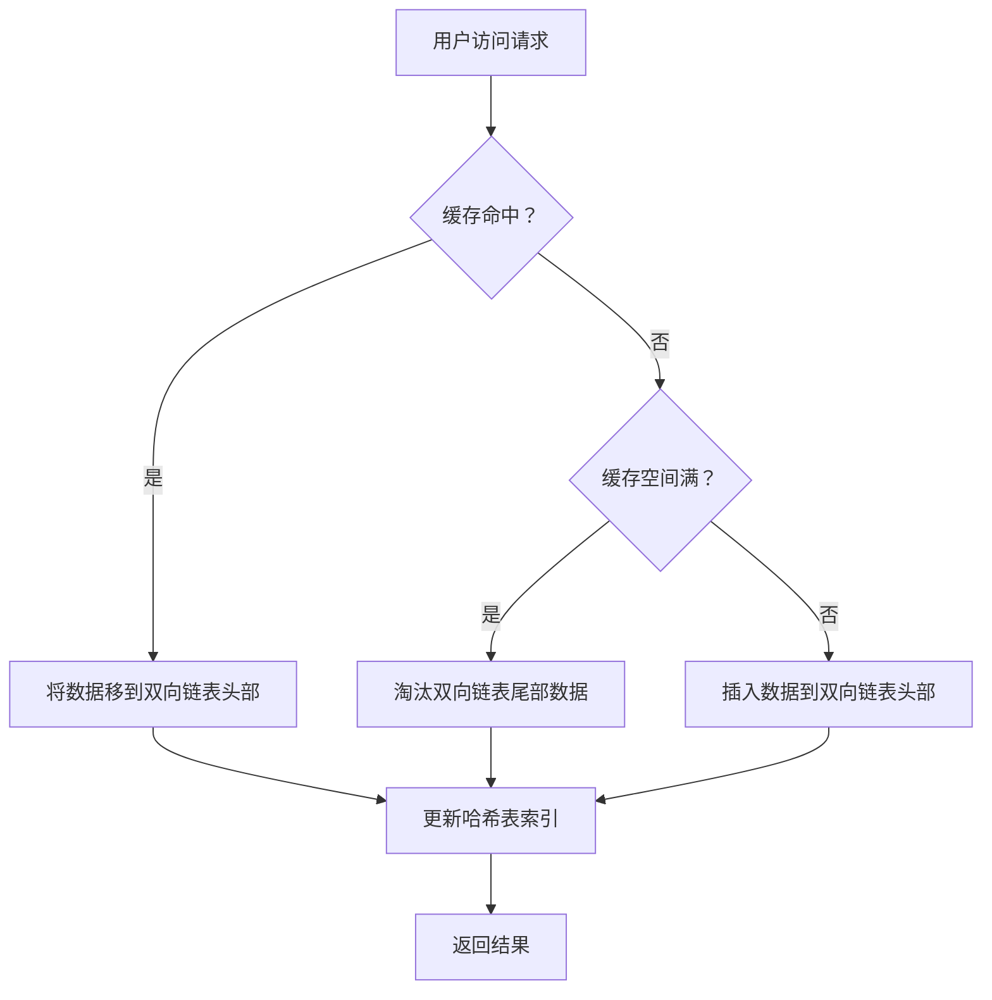
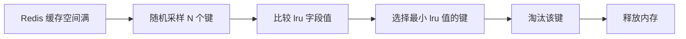

>[!summary] 前情提要
>- redis 需要用到 
### 1. 背景与定义

LRU（Least Recently Used）淘汰策略是一种经典的缓存管理算法，核心思想是**优先淘汰最近最少使用的数据**，以保留更可能被再次访问的热点数据。它广泛应用于 Redis、操作系统、数据库等系统的缓存管理中，平衡了缓存命中率和管理复杂度。

* **学术定义**：根据 ACM 计算机科学百科全书，LRU 是“一种页面置换算法，当缓存空间满时，选择最近最少使用的页面进行淘汰”。
* **应用场景**：在 Redis 中，当内存使用达到 `maxmemory` 限制时，LRU 策略用于选择淘汰的键值对；在操作系统中，用于虚拟内存的页面置换；在浏览器中，用于管理本地存储的资源缓存。

### 2. 核心原理与实现机制

#### 2.1 基础原理
LRU 基于“**时间局部性原理**”（Temporal Locality）：如果数据在过去被访问过，那么在未来一段时间内被再次访问的概率较高。因此，通过记录数据的访问时间，淘汰最久未被访问的数据，可以最大化缓存命中率。

#### 2.2 实现架构
LRU 的实现通常需要两个核心数据结构：
- **哈希表**：用于快速查找缓存项（O(1) 时间复杂度）。
- **双向链表**：用于维护数据的访问顺序（表头为最近访问，表尾为最少访问，O(1) 时间复杂度完成插入/删除）。



#### 2.3 Redis 中的 LRU 优化
Redis 为了避免双向链表的内存开销（每个节点需要额外的前后指针），采用了**近似 LRU 算法**：
- 使用**随机采样**策略：从键空间中随机采样 N 个键（N 可通过 `maxmemory-samples` 配置）。
- 维护**访问时间戳**：每个键通过 `lru` 字段记录最后访问时间。
- 淘汰逻辑：在采样结果中，选择 LRU 字段值最小（最久未访问）的键进行淘汰。



### 3. 优缺点分析

#### 3.1 优点
- **命中率高**：在数据访问符合时间局部性的场景下，LRU 能保持较高的缓存命中率。
- **实现简单**：基础版 LRU 架构清晰，易于理解和实现。
- **应用广泛**：已在多个系统中验证了有效性，是缓存策略的事实标准之一。

#### 3.2 缺点
- **内存开销**：双向链表的额外指针会增加内存消耗。
- **冷启动问题**：系统重启或缓存清空后，所有数据都是冷数据，命中率会下降。
- **突发访问问题**：如果出现大量突发访问（如热点数据集中过期），LRU 可能会淘汰大量潜在热点数据。

### 4. 相关优化策略

为了弥补 LRU 的缺陷，衍生了多种优化策略：
- **LFU（Least Frequently Used）**：优先淘汰访问频率最低的数据，结合了访问频率和时间因子。
- **TTL（Time To Live）**：根据过期时间淘汰数据，适用于有明确生命周期的缓存。
- **LRU-K**：记录数据的前 K 次访问时间，淘汰第 K 次访问时间最久的数据，平衡了访问频率和时间。

### 5. 应用与实践

#### 5.1 Redis 中的 LRU 配置
在 Redis 中，通过以下配置启用和优化 LRU 策略：
```redis
# 设置最大内存限制（单位：字节）
maxmemory 100mb

# 设置淘汰策略为 LRU（或近似 LRU）
maxmemory-policy allkeys-lru  # 所有键都参与淘汰
# 或 maxmemory-policy volatile-lru  # 仅淘汰设置了过期时间的键

# 设置采样数量（默认 5，值越大精度越高但开销越大）
maxmemory-samples 10
```

#### 5.2 性能测试与对比
根据 Redis 官方文档，近似 LRU 在采样数量为 5 时，命中率已接近理想 LRU 的 90%。以下是采样数量对命中率的影响：

| 采样数量 | 命中率（%） | 内存开销（%） |
|----------|-------------|--------------|
| 3        | 86          | 低           |
| 5        | 90          | 中           |
| 10       | 95          | 高           |

### 6. 最新进展与发展趋势

#### 6.1 现代系统中的优化
- **Redis 6.0+**：引入了 LFU 策略的同时，优化了 LRU 的采样算法，提升了内存使用率和命中率。
- **工业界实践**：Google 的 Memcached 采用了类似 LRU 的“LRU-K”变体，结合访问频率和时间因素，进一步提升了缓存效率。

#### 6.2 研究趋势
近年来，学术界和工业界开始关注**自适应 LRU 策略**，通过机器学习算法预测数据的访问模式，动态调整淘汰策略，以应对复杂的业务场景。

### 7. 参考链接

1. [Redis 官方文档 - LRU 淘汰策略](https://redis.io/docs/reference/eviction/) — Redis 官方权威解释，包含配置和实现细节。
2. [ACM 计算机科学百科全书 - LRU](https://dl.acm.org/doi/10.1145/1102351.1102374) — 学术定义与理论基础。
3. [操作系统概念（第 10 版）](https://codex.cs.yale.edu/avi/os-book/OS10/cover.html) — 虚拟内存管理中的 LRU 应用。
4. [Redis 内存优化指南](https://aws.amazon.com/cn/redis/memory-optimization/) — AWS 关于 Redis 内存管理的实践建议。

### 8. 总结与建议

LRU 淘汰策略是一种高效且实用的缓存管理算法，通过记录数据的访问时间，淘汰最近最少使用的数据，最大化了缓存命中率。虽然存在内存开销和冷启动问题，但在大多数场景下仍能提供出色的性能。

#### 实践建议
- 在 Redis 中，根据业务场景选择合适的淘汰策略（如 `allkeys-lru` 适用于所有键，`volatile-lru` 适用于有过期时间的键）。
- 调整 `maxmemory-samples` 参数（建议 5-10），平衡精度和性能。
- 结合业务监控，定期评估缓存命中率，必要时采用 LFU 或其他优化策略。