## 一、为什么 MonoRepo + Git Worktree 是绝配？

MonoRepo 通常包含多个 apps 和 packages，开发中你经常会遇到这些场景：

> [!tip] 典型痛点
> - 需要同时开发功能分支、修复线上 bug，来回切换分支容易遗漏未提交的修改
> - 跨项目依赖调试时，需要同时查看不同版本的包代码
> - 切换分支后依赖可能变动，需要频繁执行 `pnpm install` 甚至重新构建，打断开发节奏

而 `git worktree` 允许你在**同一个仓库下同时检出多个分支到不同的目录**，所有 worktree 共享同一个 git 数据库，不需要重复克隆仓库，完美解决上述问题。

### 传统分支切换 vs Worktree 并行开发

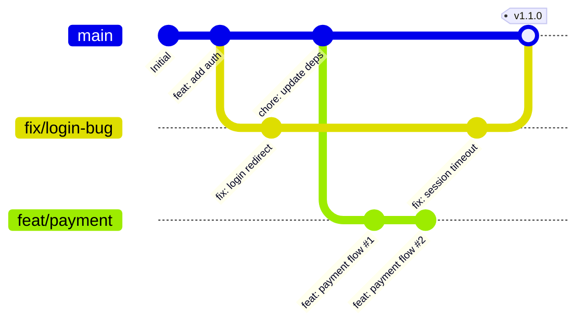

> [!tip] 上图展示了典型的并行开发场景：
> - 主分支 (main) 持续演进
> - `fix/login-bug` 和 `feat/payment` **同时**进行开发
> - 无需切换分支，所有工作区独立共存

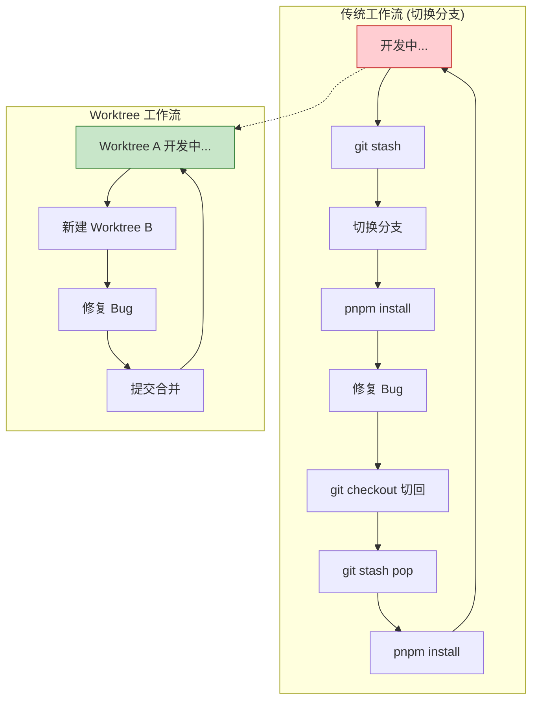

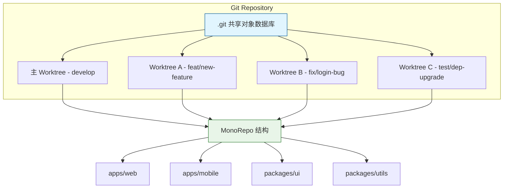

> [!info] 核心优势
> - **零克隆开销**：所有 worktree 共享同一个 `.git` 目录
> - **独立工作区**：每个 worktree 有独立的文件系统和索引
> - **无缝切换**：无需 `git stash`，上下文完整保留

---

## 二、核心结合实践方案

> [!tip] 章节导航
> - [1. 基础目录结构设计](#1-基础目录结构设计)
> - [2. 典型使用场景图解](#2-典型使用场景图解)
> - [3. MonoRepo 工具链适配](#3-和-monorepo-工具链的适配优化)
> - [4. Sparse Checkout 进阶](#4-sparse-checkout-进阶优化)
> - [5. Docker Compose 环境验证](#5-docker-compose-环境下的验证方案)

### 1. 完整工作流总览

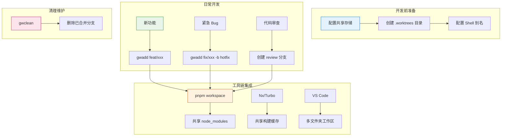

### 1. 基础目录结构设计

建议在你的 MonoRepo 根目录同级创建专门的 worktree 目录，和主工作区分开，避免混乱：

```
your-monorepo/          # 主工作区，默认用 develop 分支
.worktrees/             # 所有 worktree 集中存放
├── feat/new-ui         # 新功能开发分支
├── fix/login-bug       # bug 修复分支
└── test/dep-upgrade    # 依赖升级测试分支
```

> [!warning] 目录规划建议
> 建议使用 `<类型>/<描述>` 的命名规范，如 `feat/xxx`、`fix/xxx`、`hotfix/xxx`，便于快速识别分支类型。

**初始化配置：**

```bash
# 在你的 MonoRepo 主目录执行，开启共享对象存储，大幅节省磁盘空间
git config core.worktreeStore ../.worktrees

# 可选：启用自动清理，删除已合并的 worktree
git config worktree.autoCleanup true
```

> [!tip] 共享对象存储 (Git 2.36+)
> `core.worktreeStore` 配置让所有 worktree 共享对象存储，相比传统方式可节省 **30-50%** 磁盘空间，特别适合大型 MonoRepo。

### 2. 典型使用场景图解

#### 场景一：紧急 Hotfix + 功能开发并行

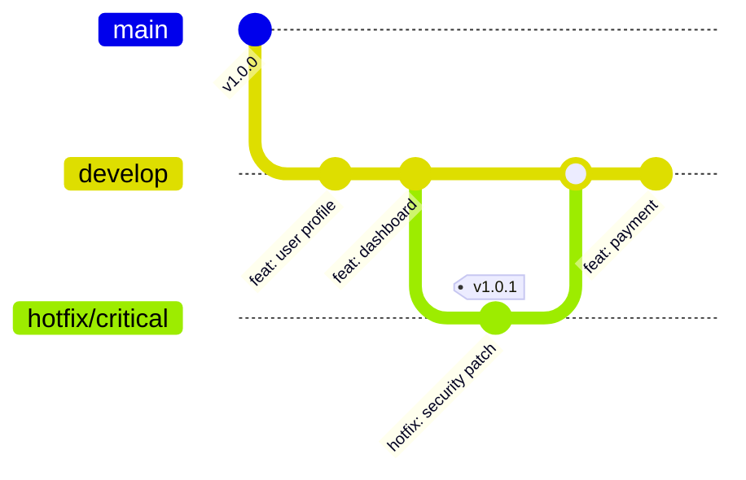

> [!tip] Worktree 方案：开发在 `develop` 分支，hotfix 用独立 worktree，互不干扰

#### 场景二：功能特性开发 + 代码审查并行

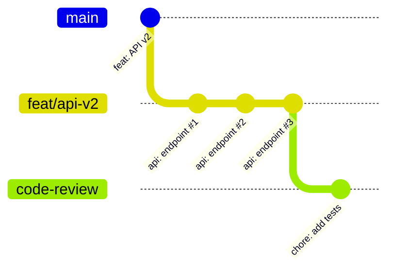

> [!info] 为 Code Review 创建独立 worktree，审查者可以直接拉取代码验证

#### 场景三：多团队协作 (MonoRepo)

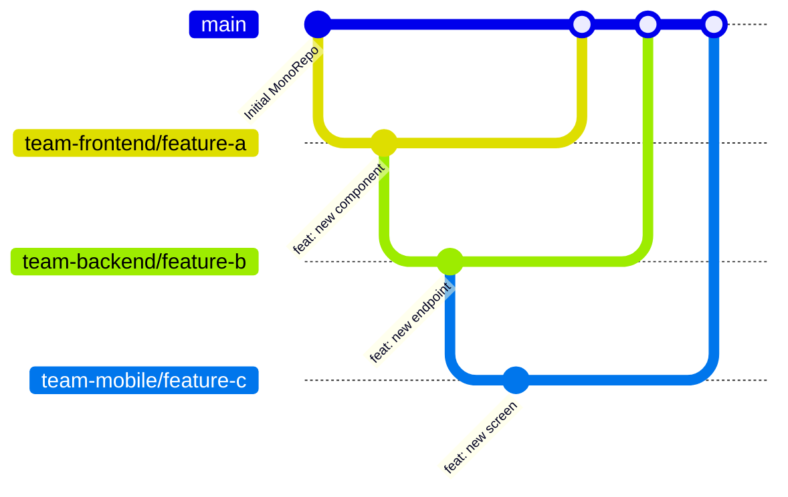

> [!warning] 多团队协作时，建议：
> - 每个团队使用**独立的 worktree**
> - 通过 PR/MR 合并前进行**代码审查**
> - 使用 **分支保护规则** 保护 main/develop

#### 快速创建新功能分支的 worktree

```bash
# 从当前主分支创建新的功能分支 worktree
git worktree add ../.worktrees/feat/xxx -b feat/xxx origin/main

# 进入对应目录即可开始开发，无需重新安装依赖
cd ../.worktrees/feat/xxx

# 推荐：使用 pnpm 工作区链接
pnpm install  # 首次安装，后续增量更新
```

#### 快速切换到线上 bug 修复

```bash
# 直接基于生产分支创建临时 worktree，完全不影响当前正在开发的功能
git worktree add ../.worktrees/fix/xxx -b fix/xxx origin/prod
```

#### 跨分支对比/调试依赖

比如你需要调试 `packages/ui` 组件库在不同版本的表现：


```bash
# 同时检出 ui 组件库的两个版本到不同 worktree
git worktree add ../.worktrees/ui/v1 v1.0.0
git worktree add ../.worktrees/ui/v2 v2.0.0

# 可以直接在两个目录下分别构建，同时在主项目中引用对比
```

> [!info] 调试可视化
> 使用 **git bisect** 配合 worktree 可以更高效地定位问题引入的版本

### 3. 和 MonoRepo 工具链的适配优化

#### 依赖缓存共享

你可以在 `nx.json` 或者 `turbo.json` 中配置全局缓存目录，让所有 worktree 共享构建缓存，避免重复构建：

```json
// nx.json 示例
{
  "tasksRunnerOptions": {
    "default": {
      "options": {
        "cacheDirectory": "../.nx-cache"
      }
    }
  }
}
```

```json
// turbo.json 示例
{
  "globalDependencies": ["**/.env.*local"],
  "pipeline": {
    "build": {
      "outputs": ["dist/**", ".next/**"],
      "cache": true
    },
    "cacheDir": "../.turbo-cache"
  }
}
```

> [!tip] Nx Cloud / Turborepo Remote Cache
> 对于团队协作，推荐配置远程缓存：
> - Nx Cloud: `nx cloud`
> - Turborepo: 配置 `remoteCache` 到云存储 (S3, GCS)

#### pnpm 依赖共享

在 `~/.pnpmrc` 中配置全局存储目录，所有 worktree 的依赖都会硬链接到全局存储，节省磁盘空间：

```ini
store-dir = ~/.pnpm-store
```

> [!info] pnpm 硬链接原理
> pnpm 使用**内容寻址存储 (CAS)**，相同内容的依赖只存储一份，通过硬链接在多个 `node_modules` 间共享。对于大型 MonoRepo，这可以将依赖占用空间减少 **60-80%**。

#### 统一的 IDE 配置

你可以在 MonoRepo 根目录的 `.vscode/settings.json` 中配置工作区识别规则，让 VS Code 自动识别所有 worktree：

```json
{
  "workspaceFolder": [
    "./",
    "../.worktrees/*"
  ],
  "typescript.tsdk": "node_modules/typescript/lib",
  "editor.formatOnSave": true
}
```

### 4. Sparse Checkout 进阶优化

对于超大型 MonoRepo，建议配合 `git sparse-checkout` 使用：

```bash
# 初始化 sparse-checkout
git sparse-checkout init --cone

# 只检出你需要的子目录
git sparse-checkout set "apps/web" "packages/ui"

# 查看当前配置
git sparse-checkout list
```

> [!warning] Sparse Checkout 注意事项
> - 只在**主 worktree** 配置 sparse-checkout
> - 新建的 worktree 会继承父目录的 sparse-checkout 配置
> - 如需调整，使用 `git sparse-checkout set <paths>`

### 5. Docker Compose 环境下的验证方案

> [!info] 来自实战经验的总结
> 在 Docker Compose 开发环境中（后端 + 前端 + 中间件共存），每个 task 的产物都留在各自的 worktree 里。验证构建结果通常需要：
> - 把产物手动带回主 worktree
> - 在对应 worktree 里也启动一套 docker compose
> 
> 但在每个 worktree 里都启动完整环境太吃资源，手动搬移又很繁琐。解决方案是：**在主 worktree 里创建 review 分支来验证构建结果**。

#### 问题分析

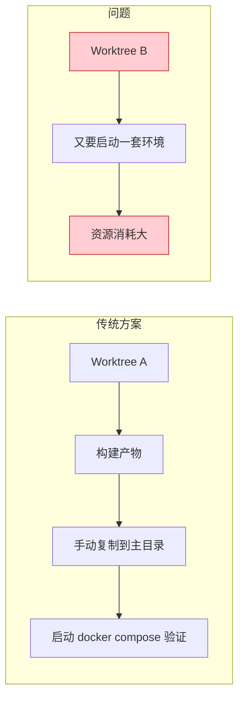

#### 解决方案：Review 分支验证法

由于 git worktree 的特性，即使你的功能分支还没推送到远程，它也已经存在于本地 Git 中。因此可以在主 worktree 里基于它创建 review 分支：

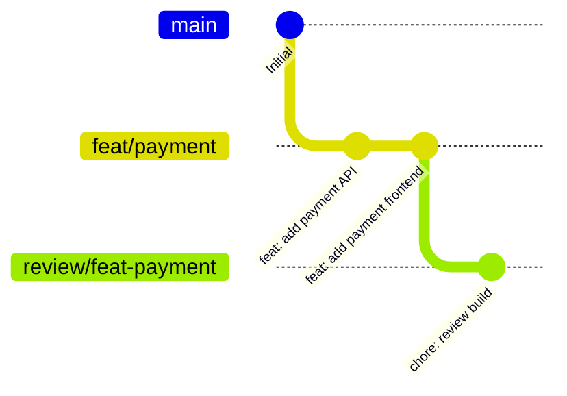

> [!warning] 注意
> 正在被 git worktree 使用的分支名不能直接复用，所以用 `review/` 前缀创建新分支。

**辅助函数：**

```bash
# 快速创建 review 分支
function gwreview() {
    local branch=$1
    git switch -c "review/$branch"
}

# 使用示例：审查 feature/add-login 分支
gwreview feature/add-login
# 自动创建并切换到 review/feature/add-login
```

> [!tip] 完整工作流
> 1. 在 Worktree A 开发功能 `feat/payment`
> 2. 在主 worktree 执行 `gwreview feat/payment`
> 3. 启动 docker compose 验证构建结果
> 4. 验证完成后删除 review 分支，继续回到 Worktree A 开发

#### git-wt 工具推荐

对于 git worktree 管理，推荐使用 **git-wt** 简化操作：

```bash
# 安装
brew install k1LoW/tap/git-wt

# 初始化（添加到 .zshrc）
eval "$(git wt --init zsh)"
```

**常用命令：**

| 命令 | 说明 |
|------|------|
| `git wt` | 列出所有 worktree |
| `git wt feature/foo` | 切换到 worktree（不存在则创建） |
| `git wt feature/foo origin/main` | 基于 origin/main 创建 |
| `git wt -d feature/foo` | 安全删除 worktree + 分支 |
| `git wt -D feature/foo` | 强制删除 |

**典型使用场景：**

```bash
# ===== 场景 1: 新功能开发 =====
git wt feat/user-profile origin/main
# 自动创建 feat/user-profile 分支 + worktree

# ===== 场景 2: 紧急 Bug 修复 =====
git wt hotfix/login-crash origin/prod
# 基于生产分支创建 hotfix

# ===== 场景 3: 代码审查 =====
git wt review/pr-123 origin/main
# 为 PR 创建审查分支

# ===== 场景 4: 依赖升级测试 =====
git wt test/upgrade-react19
# 测试新版本依赖

# ===== 场景 5: 删除已完成的工作 =====
git wt -d feat/completed-feature
# 安全删除（仅当已合并到主分支）
```

**配置文件钩子（创建后自动执行）：**

```bash
# 创建后自动安装依赖
git config --add wt.hook "pnpm install"

# 删除前自动推送远程分支
git config --add wt.deletehook "git push origin --delete $(git branch --show-current)"

# 复制 .env 文件到新 worktree
git config --add wt.copy ".env"
```

**别名配置：**

```bash
alias gw='git wt'

# 使用 peco 选择并跳转
function gww() {
    git wt $(git wt | tail -n +2 | peco | awk '{print $(NF-1)}')
}
```

> [!tip] git-wt 进阶技巧
> - 默认分支 (main/master) 受保护，防止误删
> - 支持 `--basedir` 自定义目录结构
> - 支持 `--json` 输出 JSON 格式

#### Codex App 集成

[Codex App](https://openai.com/ja-JP/index-introducing-the-codex-app/) 也支持 worktree 功能：

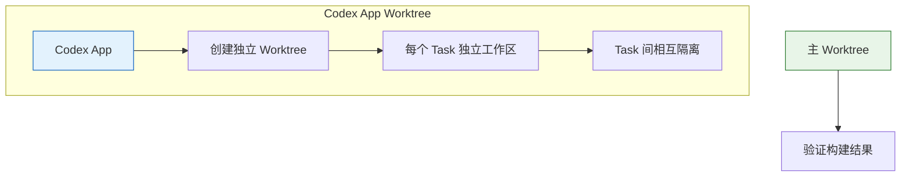

> [!info] git-wt vs Codex App Worktree
> - **git-wt**：适合先创建分支再开始工作的流程
> - **Codex App**：适合优先管理 Thread/Task 的场景
> - 两者底层都使用 git worktree，创建的 worktree 会同时出现在两者的列表中

---

## 三、vibecoding 优化技巧

### 1. Shell 别名快捷操作

在你的 shell 配置（`.zshrc`/`.bashrc`）中添加别名，简化操作：

```bash
# 创建新 worktree（自动提取当前目录名作为前缀）
alias gwadd='git worktree add ../.worktrees/$(basename $PWD)-$1 -b $1'

# 列出所有 worktree
alias gwlist='git worktree list'

# 删除不需要的 worktree
alias gwrm='git worktree remove'

# 快速切换到主目录
alias gwmain='cd ../$(git rev-parse --show-toplevel)'

# 列出所有 worktree 状态
alias gwst='for wt in $(git worktree list --porcelain | grep "^worktree"); do echo "=== ${wt#worktree } ==="; cd ${wt#worktree } && git status --short; cd - > /dev/null; done'

# 清理已合并的 worktree
alias gwclean='git branch --merged | grep -v "\*" | xargs -I {} git worktree remove ../.worktrees/{} 2>/dev/null || true'
```

使用示例：

```bash
# 一键创建支付功能分支的 worktree
gwadd feat/payment

# 查看所有 worktree 状态
gwst
```

### 2. AI Agent 集成方案

Git Worktree 与 AI Agent (Claude Code, Cursor, CodeRabbit) 结合可以实现更高效的工作流：

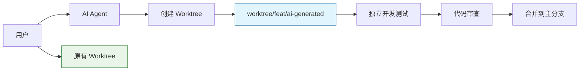

#### CodeRabbit Git Worktree Runner

```bash
# 使用 CodeRabbit 的 git-worktree-runner
# 它会自动为 AI Agent 创建独立的 worktree
git worktree-runner --agent coderrabbit --task "fix authentication bug"
```

#### Claude Code / Cursor 集成

```bash
# 为 AI Agent 创建专用 worktree
git worktree add ../.worktrees/agent/review-pr -b agent/review-pr
cd ../.worktrees/agent/review-pr
# 然后让 AI Agent 在此目录工作
```

#### Codex App 集成

[Codex App](https://openai.com/index/introducing-the-codex-app/) 是 OpenAI 推出的桌面应用，支持独立的 worktree 工作区，特别适合并行任务处理：

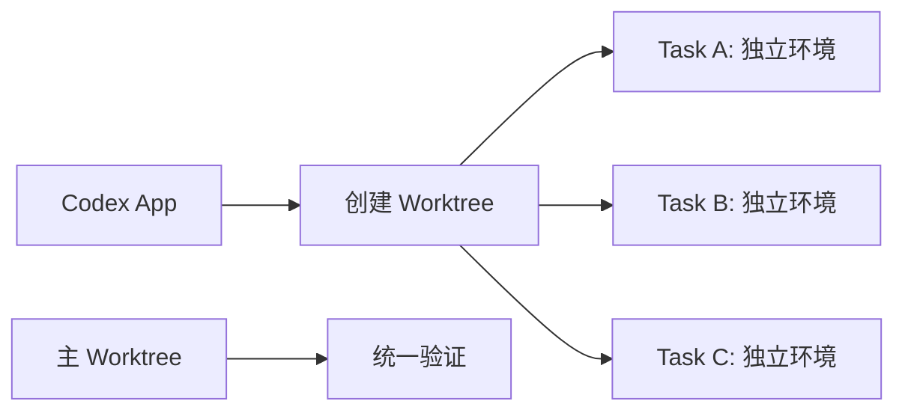

**Codex App Worktree 特性：**
- 每个 Task 有独立的工作区（Worktree）
- Task 之间相互隔离，减少干扰
- 适合需要同时处理多个独立任务的场景

```bash
# Codex App 创建的 worktree 存放位置
~/.codex/worktrees/

# 查看内部结构（底层仍是 git worktree）
cat .git  # 输出: gitdir: /path/to/repo/.git/worktrees/xxxxx
```

> [!info] git-wt vs Codex App Worktree
> - **git-wt**：适合先创建分支再开始工作的流程
> - **Codex App**：适合优先管理 Thread/Task 的场景
> - 两者底层都使用 git worktree，创建的 worktree 会同时出现在两者的列表中

**统一跳转函数（整合 ghq + Codex App）：**

```bash
function gg() {
    local selected_dir=$(
        {
            printf "%s\n" "$HOME/dotfiles"
            ghq list -p
            find "$HOME/.codex/worktrees" -mindepth 2 -maxdepth 2 -type d
        } | peco --query "$LBUFFER"
    )
    if [ -n "$selected_dir" ]; then
        cd "$selected_dir"
    fi
}
```

这个函数可以让你在「主 worktree」「ghq 管理的仓库」「Codex App 的 worktree」之间**一键跳转**。

> [!tip] AI Agent Worktree 最佳实践
> 1. 为 AI Agent 创建**独立的 worktree**，避免污染主开发环境
> 2. 设置**只读权限**给 AI Agent，防止误操作
> 3. 使用 **Code Review** 分支让 AI 进行代码审查

### 3. 避免依赖冲突

如果不同分支的依赖版本差异较大，可以为每个 worktree 配置独立的 `node_modules`，结合 pnpm 的硬链接特性，并不会占用太多额外空间：

```bash
# 为特定 worktree 配置独立存储
cd ../.worktrees/feat/xxx
echo "store-dir=/path/to/custom-store" > .npmrc
pnpm install
```

### 4. 临时预览分支

当你需要给同事预览某个功能时，直接创建对应分支的 worktree，启动开发服务即可，完全不影响你自己的开发进度：

```bash
# 创建预览 worktree
git worktree add ../.worktrees/preview/new-dashboard -b preview/new-dashboard

# 启动预览服务
cd ../.worktrees/preview/new-dashboard
pnpm dev --port 3001
```

---

## 四、性能对比与最佳实践

### 传统 Clone vs Worktree 性能对比

| 操作 | 传统 Clone | Worktree | 提升 |
|------|----------|----------|------|
| 首次创建 | 5-10 分钟 | < 10 秒 | **30-60x** |
| 磁盘占用 | 完整仓库 | 差异文件 | **30-50%** |
| 分支切换 | 需 re-install | 即时切换 | **100x** |
| 并行开发 | 多仓库 | 无缝切换 | **∞** |

> [!info] 性能数据来源
> 基于 10GB+ MonoRepo 的实测数据，来源：[DevToolbox Blog - Git Worktrees Complete Guide](https://devtoolbox.dedyn.io/blog/git-worktrees-complete-guide)

---

## 五、注意事项与常见问题

### 注意事项

> [!warning] 重要提醒
> - 同一个分支不能同时被多个 worktree 检出，git 会自动阻止这个操作，避免冲突
> - 不需要的 worktree 及时用 `git worktree remove <path>` 删除，避免冗余
> - 如果你使用的是大型 MonoRepo，建议配合 `git sparse-checkout` 使用，只检出你需要的子目录，进一步提升速度

### 常见问题 (FAQ)

#### Q1: Worktree 里的修改会影响主仓库吗？

**是的**。所有 worktree 共享同一个 `.git` 数据库，你在 worktree 里的提交会直接进入主仓库的分支历史。确保在正确的分支上工作。

#### Q2: 如何查看所有 worktree 的状态？

```bash
# 列出所有 worktree 及其状态
git worktree list -v

# 或使用之前配置的别名
gwlist
```

#### Q3: Worktree 可以使用不同的 Node 版本吗？

可以。通过 `nvm` 或 `fnm` 管理 Node 版本：

```bash
# 在特定 worktree 中切换 Node 版本
cd ../.worktrees/feat/xxx
fnm use 20
```

#### Q4: 删除 worktree 后分支还在吗？

**在**。删除 worktree 不会删除分支。如果确定不再需要该分支，手动删除：

```bash
# 删除已合并的分支
git branch -d feat/xxx

# 强制删除未合并的分支
git branch -D fix/xxx
```

#### Q5: Worktree 可以跨磁盘存放吗？

**可以**。Worktree 可以存放在任意位置：

```bash
# 跨磁盘创建 worktree
git worktree add /mnt/ssd/worktrees/feat/xxx -b feat/xxx
```

#### Q6: 如何批量清理已合并的 worktree？

```bash
# 查看已合并到 main 的分支
git branch --merged main

# 批量删除对应的 worktree（需确认）
for branch in $(git branch --merged main | grep -v "main"); do
  worktree_path="../.worktrees/${branch#feat/}"
  if [ -d "$worktree_path" ]; then
    echo "Removing $worktree_path"
    git worktree remove "$worktree_path"
    git branch -d "$branch"
  fi
done
```

---

## 六、实用工具推荐

| 工具 | 功能 | 链接 |
|------|------|------|
| **git-wt** | 简化 worktree 管理 CLI | [Ahmed El Gabri](https://gabri.me/blog/git-worktrees-done-right) |
| **CodeRabbit** | AI Code Review + Worktree Runner | [GitHub](https://github.com/coderabbitai/git-worktree-runner) |
| **Tig** | Git 仓库可视化 | [tig.github](https://tig.github.io/) |
| **git-interactive-rebase-tool** | 交互式变基 | [GitHub](https://github.com/MitMaro/git-interactive-rebase-tool) |

---

这种组合可以让你在 MonoRepo 中无缝切换多个开发任务，完全告别分支切换导致的环境重新配置、构建缓存失效等打断开发节奏的问题，真正实现顺滑的 vibecoding。

> [!success] 总结
> - **Git Worktree + MonoRepo = 高效并行开发**
> - **pnpm + 缓存共享 = 极速依赖管理**
> - **Sparse Checkout = 超大型仓库优化**
> - **AI Agent 集成 = 下一代开发范式**

---

## 参考链接

1. [Git Worktrees: The Complete Guide for 2026](https://devtoolbox.dedyn.io/blog/git-worktrees-complete-guide) — DevToolbox Blog
2. [Git Worktrees Done Right](https://gabri.me/blog/git-worktrees-done-right) — Ahmed El Gabri
3. [Git Worktree Strategy for AI-Assisted Development](https://in-da-shell.com/blog/git-worktree-strategy/) — IN DA SHELL
4. [How to Optimize Git Repository Performance](https://oneuptime.com/blog/post/2026-01-24-git-repository-performance/view) — OneUptime
5. [How to Configure Git Sparse Checkout](https://oneuptime.com/blog/post/2026-01-24-git-sparse-checkout/view) — OneUptime
6. [pnpm Workspaces](https://pnpm.io/workspaces) — pnpm 官方文档
7. [Git Worktree Best Practices and Tools](https://gist.github.com/ChristopherA/4643b2f5e024578606b9cd5d2e6815cc) — ChristopherA (GitHub Gist)
8. [Speed up your monorepo workflow in Git](https://about.gitlab.com/blog/speed-up-your-monorepo-workflow-in-git/) — GitLab
9. [Codex App + git-wt によるパラレル開発](https://in-da-shell.com/blog/git-worktree-strategy/) — IN DA SHELL (本文主要内容来源)
10. [GitHub - k1LoW/git-wt](https://github.com/k1LoW/git-wt) — 官方仓库
