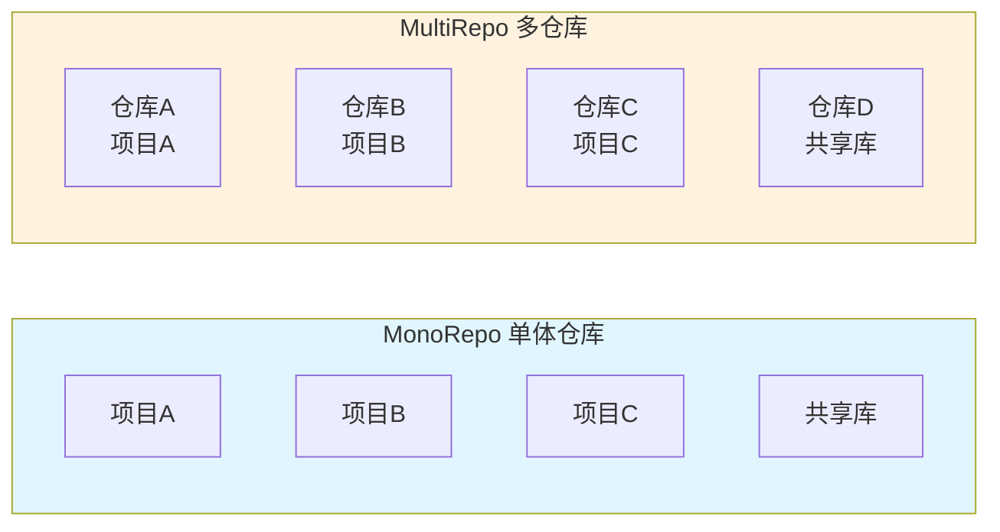
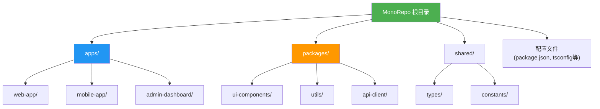
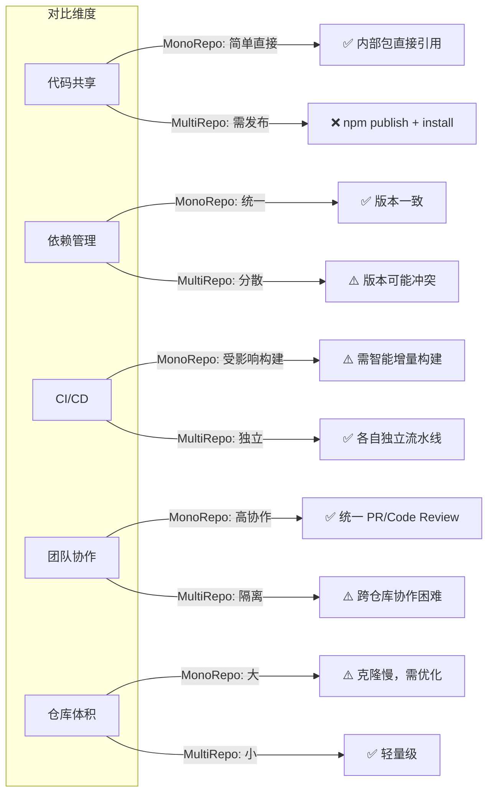
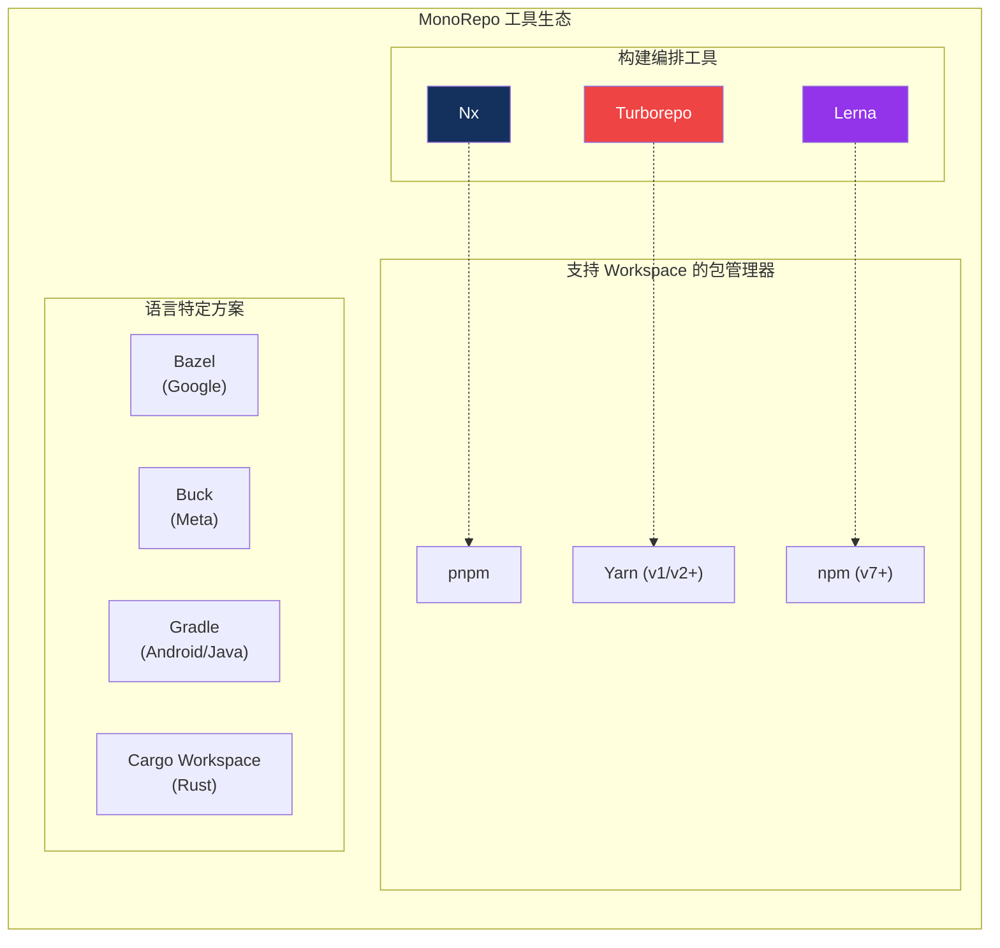
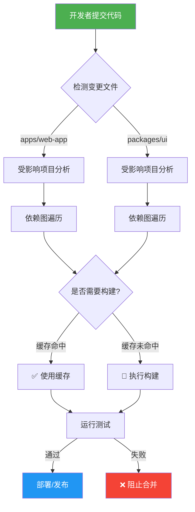
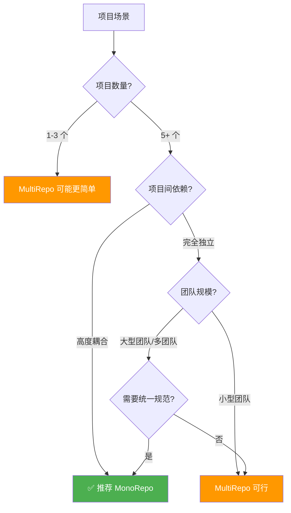

# MonoRepo 详解

## 1. 背景与定义

**MonoRepo**（Monolithic Repository，单体仓库）是一种软件开发策略，指将多个相关或不相关的项目代码存储在**同一个版本控制仓库**中。

与之相对的是 **MultiRepo**（PolyRepo），即每个项目都有独立的仓库。



### 典型案例

许多知名公司采用 MonoRepo 策略：

- **Google**：全球最大的 MonoRepo 实践者，数十亿行代码在单一仓库中
- **Meta (Facebook)**：使用自定义的 Mercurial 扩展管理大规模仓库
- **Microsoft**：Windows 系统代码、.NET 等采用 MonoRepo
- **Twitter**、**Uber** 等科技公司

---

## 2. 核心概念与架构

### 2.1 MonoRepo 的典型结构



### 2.2 关键特性

| 特性 | 说明 |
|---|---|
| **统一依赖管理** | 所有项目共享依赖版本，避免版本冲突 |
| **原子提交** | 一次提交可跨多个项目/包进行修改 |
| **代码共享** | 内部包可直接引用，无需发布到 npm |
| **统一工具链** | ESLint、TypeScript、测试框架等配置统一 |
| **可见性** | 所有代码对团队成员透明可见 |

---

## 3. MonoRepo vs MultiRepo 对比



### 详细对比表

| 维度 | MonoRepo | MultiRepo |
|---|---|---|
| **代码复用** | ✅ 极其方便，直接引用 | ❌ 需发布包或使用 git submodule |
| **依赖一致性** | ✅ 统一管理，版本一致 | ⚠️ 各项目独立，可能版本冲突 |
| **重构成本** | ✅ 一次重构全局生效 | ❌ 需逐个仓库修改 |
| **CI/CD 复杂度** | ⚠️ 需智能增量构建 | ✅ 简单独立 |
| **权限控制** | ⚠️ 粒度较粗 | ✅ 可精确到仓库级别 |
| **克隆速度** | ❌ 可能很慢 | ✅ 快速轻量 |
| **独立发布** | ⚠️ 需工具支持 | ✅ 天然独立 |
| **跨项目修改** | ✅ 原子提交 | ❌ 多 PR 多仓库 |

---

## 4. 主流 MonoRepo 工具



### 4.1 Nx

由 **Nrwl** 公司开发，是目前最流行的 MonoRepo 工具之一。

**特点：**
- 强大的**依赖图分析**，智能增量构建
- 内置**代码生成器**（schematics）
- 丰富的插件生态（React、Vue、Node、Nest 等）
- 可视化依赖图：`nx graph`

**官方文档：** [Nx Documentation](https://nx.dev/)

### 4.2 Turborepo

由 **Vercel** 收购的高性能构建系统，专注于**任务编排和缓存**。

**特点：**
- **远程缓存**，团队共享构建产物
- 极简配置，开箱即用
- 与 Vercel 深度集成
- 支持并行执行和智能调度

**官方文档：** [Turborepo](https://turbo.build/repo)

### 4.3 Lerna

最早的 JavaScript MonoRepo 工具之一，专注于**包版本管理和发布**。

**特点：**
- 版本管理：独立版本或统一版本
- 自动化 npm 发布流程
- 变更日志生成
- 现已与 Nx 集成，推荐配合使用

**官方文档：** [Lerna](https://lerna.js.org/)

### 4.4 pnpm Workspaces

pnpm 原生支持的 MonoRepo 方案，以**磁盘空间效率**著称。

**特点：**
- 硬链接存储，节省磁盘空间
- 严格的依赖解析，避免幽灵依赖
- 原生 workspace 协议支持

**官方文档：** [pnpm Workspaces](https://pnpm.io/workspaces)

---

## 5. 工作流程示意



---

## 6. 优缺点总结

### ✅ 优点

1. **代码共享便捷**：内部包无需发布即可使用
2. **原子提交**：跨项目重构一次完成
3. **统一工具链**：ESLint、Prettier、TypeScript 配置一致
4. **依赖版本统一**：避免"依赖地狱"
5. **团队协作高效**：统一的 PR、Code Review 流程
6. **代码可见性高**：便于代码复用和知识共享

### ❌ 缺点

1. **仓库体积大**：克隆和拉取可能缓慢
2. **CI/CD 复杂**：需要智能增量构建系统
3. **权限控制粗**：难以限制特定目录的访问
4. **工具学习成本**：需要掌握 Nx/Turborepo 等工具
5. **构建性能挑战**：大型仓库需要精细的缓存策略

---

## 7. 适用场景建议



### 推荐使用 MonoRepo 的场景

- **微前端架构**：多个前端应用共享组件库
- **全栈项目**：前端、后端、移动端共享类型定义
- **组件库开发**：多个包需要协同开发和版本管理
- **大型团队**：需要统一的代码规范和工具链
- **频繁跨项目重构**：需要原子提交能力

---

## 8. 快速上手示例

### 使用 Nx 创建 MonoRepo

```bash
# 创建新的 MonoRepo
npx create-nx-workspace@latest my-org --preset=apps

# 目录结构
my-org/
├── apps/
│   ├── web-app/
│   └── admin-app/
├── libs/
│   ├── ui/
│   └── utils/
├── nx.json
├── package.json
└── tsconfig.base.json
```

### 使用 Turborepo 创建 MonoRepo

```bash
# 创建新的 Turborepo 项目
npx create-turbo@latest my-turborepo

# 目录结构
my-turborepo/
├── apps/
│   ├── web/
│   └── docs/
├── packages/
│   ├── ui/
│   ├── tsconfig/
│   └── eslint-config/
├── turbo.json
└── package.json
```

---

## 9. 参考链接

1. [Nx Official Documentation](https://nx.dev/) — Nx 官方文档，最全面的 MonoRepo 指南
2. [Turborepo Documentation](https://turbo.build/repo) — Vercel 出品的高性能构建系统
3. [Lerna Documentation](https://lerna.js.org/) — JavaScript 包版本管理工具
4. [pnpm Workspaces](https://pnpm.io/workspaces) — pnpm 官方 Workspace 文档
5. [Google's MonoRepo Practices](https://research.google/pubs/pub45424/) — Google 关于大规模 MonoRepo 的学术论文
6. [Why MonoRepo - Atlassian](https://www.atlassian.com/git/tutorials/monorepos) — Atlassian 对 MonoRepo 的介绍

---

> [!tip] 总结
> MonoRepo 是一种将多个项目放在同一仓库的管理策略，适合**高度耦合、需要频繁协作**的项目。选择 MonoRepo 还是 MultiRepo 应根据**团队规模、项目复杂度、协作需求**综合考量。现代工具如 **Nx** 和 **Turborepo** 已大幅降低了 MonoRepo 的维护成本。