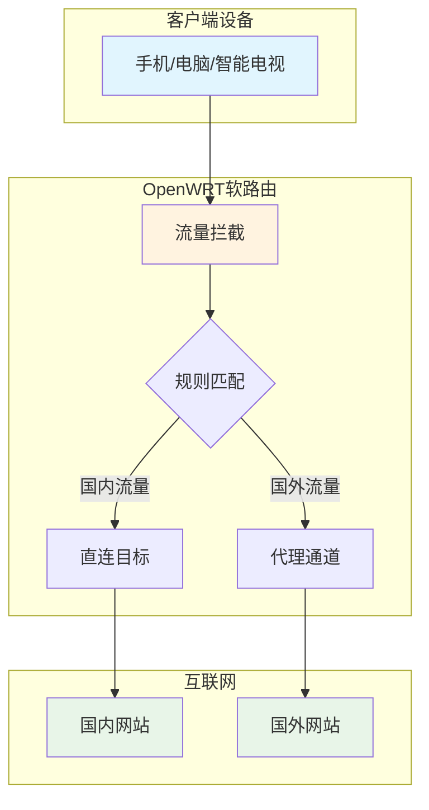
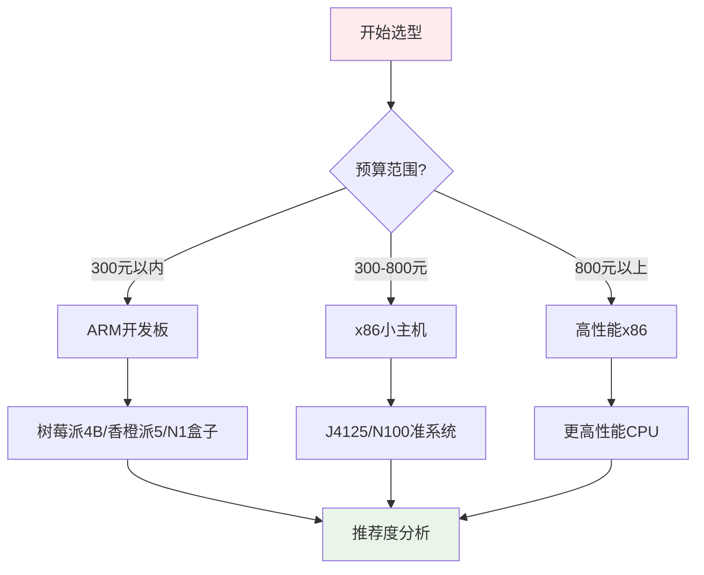
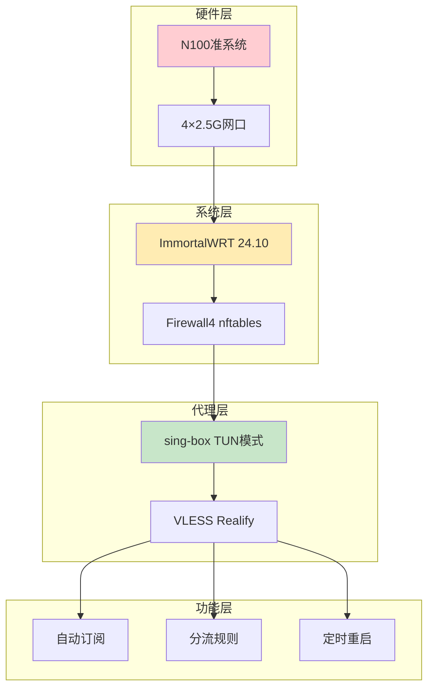

# OPENWRT实现真正透明代理

> [!tip] 核心价值
> 透明代理的核心价值在于：局域网内所有设备无需配置客户端软件即可科学上网，路由器层面自动完成流量分流与代理转发。

## 1. 透明代理原理与核心概念

### 1.1 什么是透明代理？

透明代理（Transparent Proxy）是一种网络代理技术，它能够在用户无感知的情况下拦截并转发网络流量。与传统需要客户端配置的代理不同，透明代理工作在网络层，自动将需要代理的流量重定向到代理服务器，用户端的设备无需任何设置。



### 1.2 透明代理的三种实现模式

| 模式 | 技术原理 | TCP支持 | UDP支持 | 资源消耗 | 复杂度 |
|------|----------|--------|--------|---------|--------|
| **Redirect** | NAT重定向 | ✅ | ❌ | 低 | 简单 |
| **TPROXY** | 透明代理模块 | ✅ | ✅ | 中 | 中等 |
| **TUN** | 虚拟网卡 | ✅ | ✅ | 高 | 复杂 |

> [!tip] 模式选择建议
> - 普通用户：TCP用Redirect模式，UDP用TPROXY模式（平衡方案）
> - 游戏玩家：TUN模式获得最大灵活性，但资源消耗最大

### 1.3 核心组件依赖

透明代理需要以下内核模块支持：

- `kmod-nft-tproxy` — TPROXY模式核心（必选）
- `kmod-tun` — TUN模式必备
- `kmod-nft-socket` — 增强Socket处理
- `ip-full` — 完整路由策略管理
- `ca-certificates` — TLS安全校验

## 2. 硬件推荐方案

### 2.1 选购决策流程



### 2.2 硬件方案对比

#### 入门级方案（300元以内）

| 设备 | CPU | 内存 | 网口 | 特点 | 适用场景 |
|------|-----|------|------|------|----------|
| **N1盒子** | S905X (4核1.5GHz) | 2GB | 千兆×1 | 性价比之王，需刷机等 | 旁路由 |
| **玩客云** | S805 (4核1.5GHz) | 1GB | 千兆×1 | 矿渣价格低 | 入门体验 |
| **R2S** | RK3328 (4核1.2GHz) | 1GB | 千兆×2 | 梅林/OP官方支持 | 简单上网加速 |

#### 主流级方案（300-800元）

| 设��� | CPU | 内存 | 网口 | 特点 | 适用场景 |
|------|-----|------|------|------|----------|
| **J4125** | 赛扬4核 | 支持DDR4 | 2.5G×4 | x86性能均衡 | 主力软路由 |
| **N100准系统** | 英特尔N100 | DDR4/DDR5 | 2.5G×2-4 | 性能接近桌面级 | 高端玩家 |
| **J5105** | 赛扬5核 | DDR4 | 2.5G×4 | 比J4125略强 | 中重度使用 |

#### 推荐方案（2025-2026年）

> [!tip] 重点推荐
> **N100准系统**是目前性价比最高的选择，性能比J4125提升约100%，支持AES指令集科学上网无压力，价格约550元

> [!warning] ARM设备注意事项
> - OpenWRT官方对ARM支持有限，部分插件可能无法使用
> - 性能较弱，不适合大带宽+多设备场景
> - 如果需要稳定科学上网，强烈建议x86方案

### 2.3 推荐固件选择

| 固件项目 | 更新频率 | 插件生态 | 适合人群 | 官方推荐 |
|----------|----------|---------|----------|----------|
| **ImmortalWRT** | 高 | 丰富 | 中高级用户 | ⭐⭐⭐⭐⭐ |
| **Lean固件** | 高 | 极丰富 | 进阶用户 | ⭐⭐⭐⭐ |
| **iStoreOS** | 中 | 完整 | 新手用户 | ⭐⭐⭐⭐ |
| **KWRT** | 不定期 | 在线编译 | 定制需求 | ⭐⭐⭐ |

> [!tip] 固件选择建议
> - 新手用户：iStoreOS（稳定性好，界面友好）
> - 中级用户：ImmortalWRT（纯净稳定）
> - 进阶用户：Lean/QWRT+（插件最全）

## 3. 软件方案对比与选择

### 3.1 代理内核对比

| 内核 | 协议支持 | 更新状态 | 性能 | 配置文件难度 | 推荐度 |
|------|----------|----------|------|--------------|----------|
| **sing-box** | 最全面 | 活跃 | 高 | 中等 | ⭐⭐⭐⭐⭐ |
| **Xray** | VLESS/VMess/Trojan | 活跃 | 高 | 简单 | ⭐⭐⭐⭐ |
| **v2ray-core** | 经典 | 维护中 | 中 | 简单 | ⭐⭐⭐ |
| **mihomo** | Clash兼容 | 活跃 | 高 | 简单 | ⭐⭐⭐⭐ |

### 3.2 代理协议支持矩阵

| 协议 | sing-box | Xray | v2ray | 备注 |
|------|---------|------|-------|------|
| VLESS | ✅ | ✅ | ✅ | 主流协议 |
| VMess | ✅ | ✅ | ✅ | 经典协议 |
| Trojan | ✅ | ✅ | ✅ | 高性能 |
| Shadowsocks | ✅ | ✅ | ✅ |  |
| Hysteria2 | ✅ | ❌ | ❌ |  |
| TUIC | ✅ | ❌ | ❌ |  |
| WireGuard | ✅ | ✅ | ✅ |  |
| REALITY | ✅ | ✅ | ❌ | 最强协议 |

> [!tip] 协议选择建议
> - VLESS + Realify是2025-2026年最强组合，兼顾安全与性能
> - Hysteria2/TUIC适合高宽带低延迟场景

### 3.3 管理界面方案

| 方案 | 内核 | 界面 | 学习成本 | 功能丰富度 |
|------|------|------|----------|-------------|
| **v2rayA** | v2ray/Xray | Web UI | 低 | ⭐⭐⭐⭐ |
| ** Nikki** | Mihomo | LuCI | 中 | ⭐⭐⭐⭐⭐ |
| **Momo** | sing-box | LuCI | 中 | ⭐⭐⭐⭐⭐ |
| **PassWall2** | 多内核 | LuCI | 低 | ⭐⭐⭐⭐ |
| **OpenClash** | Clash | LuCI | 低 | ⭐⭐⭐⭐ |

## 4. 最佳实践方案

### 4.1 方案一：新手上路（iStoreOS + v2rayA）


**配置要点：**
- 安装依赖：`kmod-nft-tproxy`, `kmod-tun`
- 开启透明代理：v2rayA管理页面 → 透明代理 → 启用
- DNS设置：LAN口DNS指向 `127.2.0.17`

**适合画像：**
- ✅ 预算有限（300元以内）
- ✅ 仅需简单科学上网
- ✅ 设备数量＜10台

### 4.2 方案二：主流玩家（ImmortalWRT + Nikki/Momo）

**配置要点：**
- 通过Firmware Selector定制固件，集成必要组件
- 选择代理模式：TCP→Redirect, UDP→TUN
- 配置分流规则：国内直连，国际代理
- 开启DNS防污���

**硬件推荐：**
- J4125四网口（约450元）
- N100准系统（约550元）

**适合画像：**
- ✅ 预算300-800元
- ✅ 追求稳定性和可维护性
- ✅ 设备数量多(10-30台)
- ✅ 有一定技术基础

### 4.3 方案三：高端玩家（N100 + sing-box）



**配置要点：**
- 通过OpenWRT官方Firmware Selector定制固件
- 必要组件：`sing-box`, `luci-app-momo`, `kmod-nft-tproxy`, `mihomo`
- 开启TPROXY模式支持IPv6
- 配置connmark做策略路由

**适合画像：**
- ✅ 预算充足（800元以上）
- ✅ 大带宽（千兆+）
- ✅ 多设备+重度使用
- ✅ 技术能力强，追求定制化

## 5. 常见问题排查

### 5.1 无法科学上网

**排查步骤：**
```bash
# 1. 检查内核是否运行
ps | grep -E 'sing-box|mihomo|v2ray'

# 2. 检查防火墙规则
iptables -t nat -L -n | grep -E 'REDIRECT|TPROXY'

# 3. 检查代理服务日志
logread | grep -E 'sing-box|mihomo|v2ray' | tail -20

# 4. 测试直连
curl -x socks5://127.0.0.1:1080 https://www.google.com
```

### 5.2 DNS污染问题

> [!tip] 解决方案
> 在代理软件中开启"接管系统DNS"选项，让代理软件监听53端口处理DNS查询

### 5.3 NAT端口转发失效（sing-box TUN模式）

**问题原因：** sing-box的`auto_route`会创建独立路由表，可能与OpenWRT原生规则冲突

**解决方案：**
```bash
# 创建nft规则文件持久化
cat > /etc/nftables.d/sing-box-dnat-fix.nft << 'EOF'
chain mangle_prerouting {
    type filter hook prerouting priority mangle; policy accept;
    ct status dnat meta mark set 0xff
}
EOF

# 添加ip rule持久化
vim /etc/rc.local
# 添加：ip rule add priority 8998 fwmark 0xff lookup main

# 使配置生效
fw4 restart
```

## 6. 方案选择决策表

| 你的情况 | 推荐方案 | 预算 | 难度 |
|---------|----------|------|------|
| 纯新手，仅体验科学上网 | N1+iStoreOS+v2rayA | 300元 | ⭐ |
| 普通家庭上网加速 | J4125+ImmortalWRT+ Nikki | 500元 | ⭐⭐ |
| 大带宽+稳定需求 | N100+ImmortalWRT+ Momo | 800元 | ⭐⭐⭐ |
| 高端玩家/极客 | N100+自定义+Momo | 1000元+ | ⭐⭐⭐⭐ |

## 7. 参考链接

1. [OpenWRT官方固件选择器](https://firmware-selector.openwrt.com) — 自定义固件编译
2. [ImmortalWRT项目](https://github.com/immortalwrt/immortalwrt) — 稳定第三方固件
3. [Nikki项目](https://github.com/nikkinikki-org/OpenWrt-nikki) — Mihomo管理UI
4. [Momo项目](https://github.com/nikkinikki-org/OpenWrt-momo) — sing-box管理UI
5. [v2rayA官方文档](https://v2rayA.github.io) — v2rayA使用指南
6. [sing-box官方仓库](https://github.com/SagerNet/sing-box) — sing-box核心

---

> [!note] 更新说明
> - 2026-04-18：初版创建
> - 涵盖2025-2026年最新方案