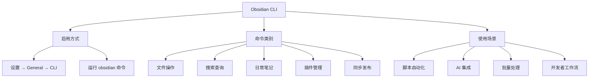
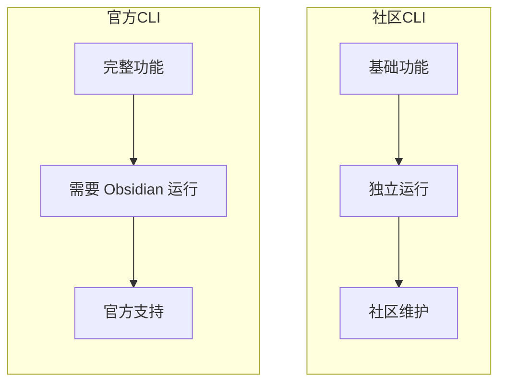

> [!summary] 前情提要
> 2026年2月，Obsidian 正式发布了官方命令行界面 (CLI)，这是自 Obsidian 1.12 版本以来的重大更新。官方 CLI 提供了超过 100 个命令，可以从终端控制 Obsidian 的几乎所有功能。

# ObsidianCLI 入门指南

## 1. 背景与定义

Obsidian CLI 是 Obsidian 官方推出的命令行工具，于 **2026年2月10日** 随着 Obsidian 1.12 桌面版预览发布。它允许用户通过终端程序、脚本或外部工具来控制 Obsidian 金库，实现笔记的读取、创建、搜索、管理等操作。

> [!tip] 官方宣布
> "Anything you can do in Obsidian, you can do from the command line."
> — Obsidian Official (@obsdmd) February 11, 2026

### 与社区 CLI 的区别

| 特性 | 官方 Obsidian CLI | 社区 CLI (如 NotesMD) |
|------|-------------------|----------------------|
| 运行环境 | 需要 Obsidian 运行 | 可独立运行 |
| 功能范围 | 完整 Obsidian 功能 | 基础文件操作 |
| 发布来源 | Obsidian 官方 | GitHub 社区 |
| 版本 | v1.12+ | v0.3.x |

## 2. 核心概念解释



## 3. 技术深度分析

### 3.1 安装与配置

#### 第一步：更新到 Obsidian 1.12+

从 [Obsidian 官网](https://obsidian.md/download) 下载并安装最新版本。

#### 第二步：启用 CLI

1. 打开 Obsidian 设置
2. 导航到 **General → Command Line Interface**
3. 启用 CLI 功能

```bash
# 验证安装
obsidian --version

# 查看帮助
obsidian --help
```

#### 第三步：基本命令结构

```bash
obsidian <command> [subcommand] [options] [arguments]
```

### 3.2 核心命令一览

#### 文件操作

| 命令 | 说明 |
|------|------|
| `obsidian files list` | 列出所有文件 |
| `obsidian file read <path>` | 读取文件内容 |
| `obsidian files write <path>` | 写入文件 |
| `obsidian file create <path>` | 创建新文件 |
| `obsidian file move <src> <dest>` | 移动文件 |
| `obsidian file delete <path>` | 删除文件 |

#### 日常笔记

| 命令 | 说明 |
|------|------|
| `obsidian daily` | 打开今日笔记 |
| `obsidian daily:path` | 获取今日笔记路径 |
| `obsidian daily:read` | 读取今日笔记内容 |
| `obsidian daily:append <text>` | 追加内容到今日笔记 |
| `obsidian daily:prepend <text>` | 前置内容到今日笔记 |

#### 搜索功能

| 命令 | 说明 |
|------|------|
| `obsidian search <query>` | 搜索笔记 |
| `obsidian search:context <query>` | 带上下文的搜索 |
| `obsidian search:open <query>` | 在 Obsidian 中打开搜索结果 |

#### 属性管理

| 命令 | 说明 |
|------|------|
| `obsidian properties` | 列出所有属性 |
| `obsidian property:set <file> <key> <value>` | 设置属性 |
| `obsidian property:read <file>` | 读取文件属性 |

#### 标签操作

| 命令 | 说明 |
|------|------|
| `obsidian tags` | 列出所有标签 |
| `obsidian tag <name>` | 查看特定标签的笔记 |

#### 模板功能

| 命令 | 说明 |
|------|------|
| `obsidian templates` | 列出所有模板 |
| `obsidian template:read <name>` | 读取模板内容 |
| `obsidian template:insert <name> [path]` | 插入模板到指定位置 |

#### 插件管理

| 命令 | 说明 |
|------|------|
| `obsidian plugins` | 列出所有插件 |
| `obsidian plugins:enabled` | 列出已启用插件 |
| `obsidian plugin:enable <id>` | 启用插件 |
| `obsidian plugin:disable <id>` | 禁用插件 |
| `obsidian plugin:reload` | 重新加载插件 |

#### 同步与发布

| 命令 | 说明 |
|------|------|
| `obsidian sync:status` | 查看同步状态 |
| `obsidian sync:history` | 查看同步历史 |
| `obsidian publish:site` | 查看发布站点 |
| `obsidian publish:list` | 列出已发布文件 |

#### 链接查询

| 命令 | 说明 |
|------|------|
| `obsidian backlinks <file>` | 查看文件的后向链接 |
| `obsidian links <file>` | 查看文件的前向链接 |
| `obsidian unresolved` | 列出未解析的链接 |
| `obsidian orphans` | 列出孤立文件 |

#### 文件历史

| 命令 | 说明 |
|------|------|
| `obsidian diff <file>` | 查看文件差异 |
| `obsidian history <file>` | 查看文件历史 |
| `obsidian history:list <file>` | 列出历史版本 |
| `obsidian history:restore <file> <version>` | 恢复历史版本 |

### 3.3 高级用法

#### Vault 目标指定

```bash
# 指定 vault
obsidian --vault "My Vault" files list

# 指定 vault 路径
obsidian --vault-path /path/to/vault files list
```

#### 文件目标指定

```bash
# 指定文件
obsidian file read --file "path/to/note.md"
```

#### 输出选项

```bash
# JSON 格式输出
obsidian files list --json

# 纯文本输出
obsidian files list --plain
```

#### 管道与脚本结合

```bash
# 读取今日笔记并提取待办
obsidian daily:read | grep -A 5 "## Tasks"

# 创建新笔记并写入内容
echo "# New Note" | obsidian files write "Notes/new.md"
```

## 4. 工具对比与实践指南

### 4.1 官方 CLI vs 社区 CLI




### 4.2 常见社区 CLI 工具

| 工具                                                            | 语言         | Stars | 特点            |
| ------------------------------------------------------------- | ---------- | ----- | ------------- |
| [NotesMD CLI](https://github.com/Yakitrak/obsidian-cli)       | Go         | 1119  | 社区最流行，可独立运行   |
| [Bip901/obsidian-cli](https://github.com/Bip901/obsidian-cli) | Python     | 20    | Vault 管理、模板创建 |
| [Petra](https://github.com/H4ZM47/petra-obsidian-cli)         | TypeScript | 0     | CLI + MCP 插件  |

### 4.3 实践示例

#### 日常自动化

```bash
#!/bin/bash
# 每日晨间自动化脚本

# 1. 打开今日笔记
obsidian daily

# 2. 追加昨日回顾
yesterday=$(date -d "yesterday" +%Y-%m-%d)
echo "## Yesterday" >> $(obsidian daily:path --plain)

# 3. 搜索未完成的任务
obsidian search "todo"
```

#### AI 集成

结合 Claude Code 等 AI 工具使用时，需要注意 CLI 的一些静默失败问题：

> [!warning] 已知问题
> Obsidian CLI 1.12 存在约 13 种静默失败场景，命令返回空数据但退出码为 0。使用 AI 集成时建议添加额外的验证逻辑。

## 5. 最新进展与趋势

### 2026年2月重大更新

- **2026.02.27** - Obsidian 1.12 桌面版正式发布，CLI 功能转为公开
- **2026.02.10** - Obsidian 1.12.0 预览版发布，CLI 首次亮相

### 相关工具生态

1. **Obsidian CLI REST** - 将 CLI 命令转换为 HTTP API 和 MCP 服务器
   - GitHub: [dsebastien/obsidian-cli-rest](https://github.com/dsebastien/obsidian-cli-rest)
   - 支持 AI 助手通过 REST API 控制 Obsidian

2. **OpenClaw 集成** - AI Agent 自动化工作流
   - 支持语音笔记、结构化查询、版本历史

3. **LobeHub Skills** - AI Agent 的 Obsidian CLI 技能集

## 6. 专业总结与应用建议

### 核心要点

1. **官方 CLI 优势**
   - 功能完整，覆盖 Obsidian 几乎所有操作
   - 官方支持，持续更新
   - 与 Obsidian 深度集成

2. **适用场景**
   - 终端爱好者日常工作流
   - 脚本自动化（备份、批量处理）
   - AI Agent 集成
   - 开发者工作流

3. **注意事项**
   - 需要 Obsidian 桌面应用运行
   - 首次使用需在设置中启用
   - Windows 用户可能需要额外配置

### 实际应用建议

- **入门**: 先启用 CLI，尝试 `obsidian daily` 和 `obsidian search` 命令
- **进阶**: 结合脚本实现自动化工作流
- **深入**: 探索与 AI Agent 的集成可能

## 7. 参考链接

1. [Obsidian CLI 官方帮助](https://help.obsidian.md/cli) — 官方文档
2. [Obsidian 1.12 更新日志](https://obsidian.md/changelog/2026-02-27-desktop-v1.12.4/) — 版本更新说明
3. [The Complete Obsidian CLI Setup Guide](https://zenn.dev/sora_biz/articles/obsidian-cli-setup-guide) — Windows 安装指南
4. [Obsidian's desktop apps now include a command line interface](https://www.howtogeek.com/obsidian-desktop-apps-now-include-a-command-line-interface/) — HowToGeek 介绍
5. [NotesMD CLI](https://github.com/Yakitrak/obsidian-cli) — 社区流行 CLI 工具
6. [Obsidian CLI REST](https://github.com/dsebastien/obsidian-cli-rest) — MCP 服务器

---

*本文最后更新于 2026年3月*
