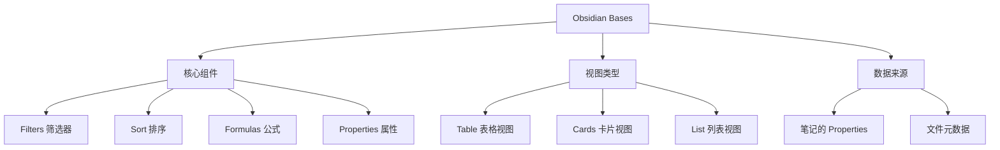

> [!summary] 前情提要
> Obsidian Bases 是自 1.9 版本引入的核心插件，让笔记可以像数据库一样被整理、筛选和可视化。本文将通过具体案例，带你掌握这一强大功能。

# Obsidian Bases 数据库使用指南

## 1. 背景与定义

### 什么是 Obsidian Bases？

Obsidian Bases 是 Obsidian 官方推出的原生数据库功能，于 **2025年5月** 随着 Obsidian 1.9 版本正式发布。它能够将你的笔记转换为强大的数据库视图，支持表格、卡片等多种展示形式。

> [!tip] 官方定位
> Bases 可以将笔记整理成数据清单，可用于项目管理、阅读清单、旅行计划，甚至做自己的收藏系统。
> — Obsidian 官方

### Bases vs Dataview

| 特性 | Bases (官方) | Dataview (社区插件) |
|------|-------------|-------------------|
| 平台支持 | 全平台 (手机/平板/电脑) | 手机端支持有限 |
| 安装方式 | 核心插件，开箱即用 | 需额外安装 |
| 学习门槛 | 图形界面，点点按钮 | 需要学习 SQL 语法 |
| 稳定性 |新有保障 | 依赖插件作者 官方维护，更更新 |

> [!info] 版本要求
> Obsidian 版本需要 **1.9.10** 或更高才能使用 Bases 功能。

## 2. 核心概念解释



## 3. 技术深度分析

### 3.1 启用 Bases

1. 打开 **设置 → 核心插件**
2. 找到 **Bases** 并启用
3. 同时建议启用 **Properties** 插件

### 3.2 创建第一个 Base

**方法一：命令面板**
- 按下 `Ctrl + P` (Windows/Linux) 或 `Cmd + P` (macOS)
- 搜索 "Create new base"
- 命名并创建 `.base` 文件

**方法二：右键菜单**
- 在文件资源管理器中右键
- 选择 "新建 Base"

### 3.3 Base 文件结构

每个 `.base` 文件包含四大区域：

```yaml
# 🔍 全局筛选器 - 应用于所有视图
filters:
  and:
    - file.hasTag("project")

# 🧮 自定义公式
formulas:
  完成度: "(current / total * 100).toFixed(1) + '%'"
  
# 🏷️ 属性显示设置
properties:
  status:
    displayName: "项目状态"

# 📊 视图配置
views:
  - name: "我的视图"
    type: "table"
```

## 4. 具体案例

### 案例一：任务待办管理系统 (Todo)

这是最受欢迎的 Bases 用例之一。

#### 步骤 1：创建任务笔记模板

```yaml
---
title: 
date: 2026-03-01
tags:
  - task
status: todo     # 选项: todo, in-progress, done
priority: high   # 选项: low, medium, high
due: 
project: 
---

## 任务内容

## 备注
```

#### 步骤 2：创建 Base 视图

创建 `任务管理.base` 文件：

```yaml
---
views:
  - name: "所有任务"
    type: "table"
    columns:
      - property: "title"
      - property: "status"
      - property: "priority"
      - property: "due"
      - property: "project"
    filters:
      and:
        - file.hasTag("task")
    sorts:
      - property: "due"
        direction: "asc"
        
  - name: "今日待办"
    type: "table"
    filters:
      and:
        - file.hasTag("task")
        - status = "todo"
        
  - name: "卡片视图"
    type: "cards"
    filters:
      and:
        - file.hasTag("task")
        - status != "done"
```

#### 效果展示

```
| 任务名称 | 状态 | 优先级 | 截止日期 | 项目 |
|---------|------|--------|---------|------|
| 完成调研报告 | todo | high | 2026-03-05 | 项目A |
| 代码审查 | in-progress | medium | 2026-03-03 | 项目B |
```

### 案例二：阅读清单管理

#### 笔记属性设置

```yaml
---
title: 
date: 2026-03-01
tags:
  - book
type: book       # book, article, blog
status: reading  # to-read, reading, completed
rating: 
genre: 
author: 
startDate: 
endDate: 
notes: 
---

## 读后感

```

#### Base 配置

```yaml
---
views:
  - name: "阅读进度"
    type: "table"
    filters:
      and:
        - file.hasTag("book")
        - status != "completed"
    columns:
      - property: "title"
      - property: "author"
      - property: "status"
      - property: "rating"
      
  - name: "已完成"
    type: "cards"
    filters:
      and:
        - file.hasTag("book")
        - status = "completed"
    sorts:
      - property: "rating"
        direction: "desc"
```

### 案例三：项目进度追踪

```yaml
---
title: 
date: 2026-03-01
tags:
  - project
project: 
status: active   # planning, active, on-hold, completed
progress: 0      # 0-100
startDate: 
endDate: 
owner: 
budget: 
---

## 项目目标

## 里程碑

## 风险
```

```yaml
# 项目管理.base
views:
  - name: "仪表盘"
    type: "table"
    formulas:
      总进度: "avg(progress)"
      进行中: 'length(filter(status, s => s = "active"))'
    columns:
      - property: "project"
      - property: "status"
      - formula: "progress"
      - property: "endDate"
      - property: "owner"
      
  - name: "风险预警"
    type: "cards"
    filters:
      and:
        - status = "active"
        - progress < 30
```

### 案例四：图片画廊

利用 Bases 快速创建图片收藏展示：

```yaml
---
views:
  - name: "截图画廊"
    type: "cards"
    filters:
      and:
        - file.extension = "png"
        - file.createdDate > date("2026-01-01")
    columns:
      - property: "file.name"
      - property: "file.createdDate"
      - property: "file.size"
```

### 案例五：最近笔记动态

```yaml
---
views:
  - name: "最近笔记"
    type: "table"
    filters:
      and:
        - file.mtime > date("now() - 7d")
    sorts:
      - property: "file.mtime"
        direction: "desc"
    columns:
      - property: "file.name"
      - property: "file.mtime"
      - property: "file.folder"
```

## 5. 高级功能

### 5.1 公式系统

Bases 支持强大的公式计算：

```yaml
formulas:
  # 计算年龄
  年龄: "year(today()) - year(birthDate)"
  
  # 任务状态颜色
  状态标签: 'if(status = "done", "✅", if(status = "todo", "📋", "🔄"))'
  
  # 进度百分比
  完成率: "(current / total * 100).toFixed(0) + "%""
  
  # 日期差
  剩余天数: "dayDiff(deadline, today())"
```

### 5.2 筛选逻辑

**AND 逻辑 (全部满足)**:
```yaml
filters:
  and:
    - status = "active"
    - priority = "high"
```

**OR 逻辑 (满足其一)**:
```yaml
filters:
  or:
    - status = "urgent"
    - priority = "high"
```

**嵌套逻辑**:
```yaml
filters:
  and:
    - status = "active"
    - or:
        - priority = "high"
        - due < date("now() + 3d")
```

### 5.3 嵌入 Base 到笔记

```markdown
## 我的任务

![[任务管理.base#所有任务]]

## 今日待办

![[任务管理.base#今日待办]]
```

## 6. 实践技巧

### 视图引用

在笔记中引用特定视图：
```
![[任务管理.base#今日待办]]
```

### 动态链接

结合 Templater 插件创建新笔记时自动填充属性：

```javascript
<%* 
const project = tp.file.title;
const date = tp.date.now("YYYY-MM-DD");
-%>
---
project: <% project %>
date: <% date %>
status: todo
---
```

### 性能优化

> [!warning] 注意事项
> - Base 默认展示全库数据，记得添加筛选条件
> - 大量笔记时避免使用过于复杂的公式
> - 定期清理无用属性，保持数据结构清晰

## 7. 专业总结与应用建议

### 适用场景

| 场景 | 推荐视图 | 说明 |
|------|---------|------|
| 任务管理 | 表格 + 卡片 | 状态、优先级一目了然 |
| 阅读清单 | 卡片 | 封面展示更直观 |
| 项目追踪 | 表格 | 进度、日期清晰 |
| 素材收藏 | 画廊 | 图片预览体验好 |

### 核心要点

1. **先规划属性**: 明确需要跟踪哪些信息
2. **合理使用筛选**: 避免全库扫描导致卡顿
3. **视图分工明确**: 不同视图服务不同目的
4. **公式简化**: 复杂计算放在数据来源笔记中

### 迁移建议

从 Dataview 迁移到 Bases：
- 将 Dataview 查询转换为 Base 筛选条件
- 用视图替代不同的查询需求
- 利用图形界面替代代码查询

## 8. 参考链接

1. [Obsidian Bases 官方文档](https://help.obsidian.md/bases) — 官方帮助文档
2. [Obsidian 数据库入门教程](https://sspai.com/post/104365) — 少数派 Todo 系统教程
3. [Bases 基础入门完整教學](https://alfredo-know.com/obsidian-bases-entry-guide/) — 繁体中文指南
4. [Bases 高级语法与智能应用](https://alfredo-know.com/obsidian-bases-advanced-guide/) — 进阶技巧
5. [Bases 用例：项目状态追踪](https://forum-zh.obsidian.md/t/topic/53092) — 社区案例
6. [从 Dataview 迁移到 Bases](https://practicalpkm.com/moving-to-obsidian-bases-from-dataview/) — 迁移指南

---

*本文最后更新于 2026年3月*
