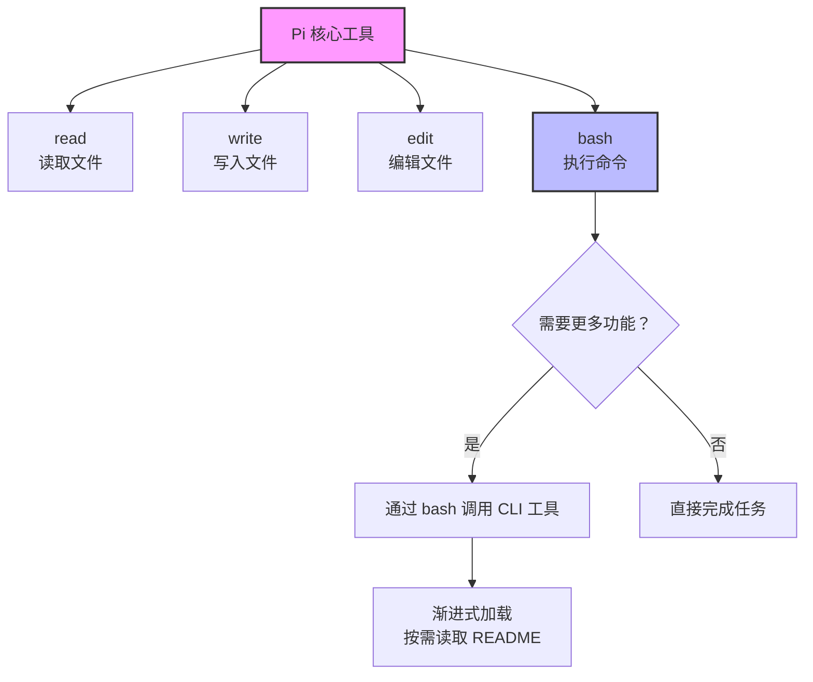
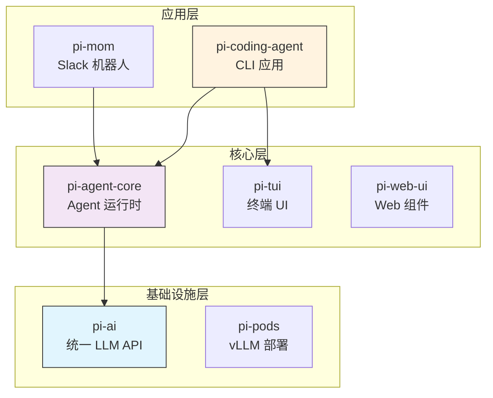
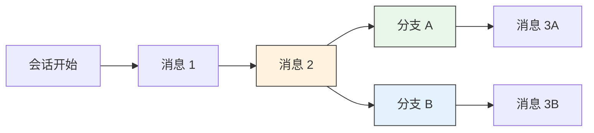
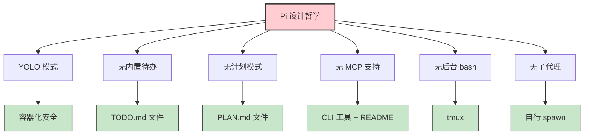

# Pi Code 入门：极简主义编程助手的设计哲学与实践

## 1. 背景与定义

在 2025 年，AI 编程助手领域经历了从自动补全到自主代理（Agent）的范式转变。[Claude Code](https://claude.ai/code)、[OpenAI Codex](https://github.com/openai/codex)、[Cursor](https://cursor.com) 等工具迅速占领市场，但它们的复杂性也在不断增加——动辄数十个工具、上万 token 的系统提示、以及难以理解的内部机制。

正是在这种背景下，[Mario Zechner](https://mariozechner.at/)（著名跨平台游戏框架 [libGDX](https://libgdx.com/) 的创始人，GitHub 2.3 万星）因对 Claude Code 日益膨胀的功能感到沮丧，决定构建一个截然不同的工具：[**Pi**](https://github.com/badlogic/pi-mono)。

> [!info] Pi 是什么？
> Pi 是一个极简终端编程助手（Coding Agent Harness），仅提供 4 个核心工具（read、write、edit、bash），系统提示不到 1000 个 token。它采用了"如果你不需要它，就不构建它"的设计哲学，通过 TypeScript 扩展系统实现高度可定制化。Pi 也是 [OpenClaw](https://github.com/openclaw/openclaw)（14.5 万+ GitHub 星星）的核心引擎。

* 项目官网：[pi.dev](https://pi.dev)
* GitHub 仓库：[badlogic/pi-mono](https://github.com/badlogic/pi-mono)（2.6 万星）
* 创建者博客：[What I learned building an opinionated and minimal coding agent](https://mariozechner.at/posts/2025-11-30-pi-coding-agent/)

## 2. 核心概念解释

### 2.1 "四工具哲学"

Pi 的核心理念可以用一句话概括：**"Bash is all you need"**。



Mario 的论点是：所有前沿模型都经过了大量的 RL 训练，因此它们**天生理解什么是编程助手**。模型知道 `bash` 是什么，知道文件系统如何工作。添加专门的工具（如"搜索文件"工具）只会浪费宝贵的上下文窗口空间。

### 2.2 与其他 Agent 的对比

| 特性 | Pi | Claude Code | Cursor |
|------|------|-------------|--------|
| **工具数量** | 4 个 | 20+ 个 | 集成式 |
| **系统提示大小** | <1000 tokens | ~10000 tokens | 不透明 |
| **开源** | ✅ MIT | ❌ | ❌ |
| **多模型支持** | 15+ 提供商 | 仅 Anthropic | 多模型 |
| **可扩展性** | TypeScript 扩展 | 有限 | 插件系统 |
| **背景进程** | tmux | 内置 | 内置 |
| **子代理** | 自行构建 | 内置 | 内置 |

> [!tip] 关键洞察
> Pi 的设计哲学不是"功能不好"，而是**"没有可观测性的功能是技术债务"**。每个隐藏的状态都会增加信任成本。

## 3. 技术深度分析

### 3.1 Monorepo 架构

Pi 采用 TypeScript monorepo 结构，包含 8 个包，分为三个层次：



#### 包功能说明

| 包名 | 功能 | 关键特性 |
|------|------|----------|
| `@mariozechner/pi-ai` | 统一多提供商 LLM API | 支持 OpenAI、Anthropic、Google 等 |
| `@mariozechner/pi-agent-core` | Agent 运行时 | 工具调用、状态管理、事件流 |
| `@mariozechner/pi-coding-agent` | 交互式编码 Agent CLI | 会话管理、扩展系统、主题 |
| `@mariozechner/pi-mom` | Slack 机器人 | 委托消息给 Pi |
| `@mariozechner/pi-tui` | 终端 UI 库 | 差异渲染、无闪烁更新 |
| `@mariozechner/pi-web-ui` | Web 组件 | AI 聊天界面 |
| `@mariozechner/pi-pods` | GPU Pod 管理 CLI | vLLM 部署 |

### 3.2 统一 LLM API（pi-ai）

pi-ai 的核心创新在于统一了 4 种主要的 LLM API 协议：

1. **OpenAI Completions API** — 被绝大多数提供商使用
2. **OpenAI Responses API** — OpenAI 新版 API
3. **Anthropic Messages API** — Claude 系列
4. **Google Generative AI API** — Gemini 系列

> [!warning] 提供商兼容性挑战
> 不同提供商对"相同"API 的实现差异巨大：
> - Cerebras、xAI、Mistral 不支持 `store` 字段
> - Mistral 使用 `max_tokens` 而非 `max_completion_tokens`
> - Grok 模型不支持 `reasoning_effort`
> - 推理内容返回在不同字段（`reasoning_content` vs `reasoning`）

#### 上下文跨提供商传递

```typescript
import { getModel, complete, Context } from '@mariozechner/pi-ai';

// 从 Claude 开始
const claude = getModel('anthropic', 'claude-sonnet-4-5');
const context: Context = { messages: [] };

context.messages.push({ role: 'user', content: '25 * 18 等于多少？' });
const claudeResponse = await complete(claude, context, {
  thinkingEnabled: true
});
context.messages.push(claudeResponse);

// 切换到 GPT - 它会看到 Claude 的思考过程作为 <thinking> 标签
const gpt = getModel('openai', 'gpt-5.1-codex');
context.messages.push({ role: 'user', content: '这个答案对吗？' });
const gptResponse = await complete(gpt, context);
```

### 3.3 工具输出的双重结构

Pi 的工具系统创新性地将输出分为两部分：给 LLM 的文本和给 UI 的结构化数据。

```typescript
import { Type, AgentTool } from '@mariozechner/pi-ai';

const weatherTool: AgentTool = {
  name: 'get_weather',
  description: '获取城市天气',
  parameters: Type.Object({
    city: Type.String({ minLength: 1 }),
  }),
  execute: async (toolCallId, args) => {
    const temp = Math.round(Math.random() * 30);
    return {
      // 给 LLM 的文本
      output: `${args.city} 温度: ${temp}°C`,
      // 给 UI 的结构化数据
      details: { temp, city: args.city }
    };
  }
};
```

### 3.4 会话管理与分支

Pi 的会话采用树状结构存储为 JSONL 文件，支持原地分支而无需创建新文件。



- **`/tree`** — 导航会话树，从任意历史点继续
- **`/fork`** — 创建新会话文件
- **`/compact`** — 手动压缩上下文

## 4. 工具对比/实践指南

### 4.1 快速开始

```bash
# 安装
npm install -g @mariozechner/pi-coding-agent

# 配置 API Key
export ANTHROPIC_API_KEY=sk-ant-...

# 启动
pi

# 或使用 OAuth 登录
pi
/login
```

### 4.2 四种运行模式

| 模式 | 命令 | 用途 |
|------|------|------|
| **交互式** | `pi` | 完整 TUI 体验 |
| **打印/JSON** | `pi -p "查询"` | 脚本集成 |
| **RPC** | `pi --mode rpc` | 进程集成（JSONL 协议） |
| **SDK** | 代码嵌入 | 自定义应用 |

### 4.3 扩展系统示例

Pi 的扩展系统允许你构建任何功能：

```typescript
export default function(pi: ExtensionAPI) {
  // 注册自定义工具
  pi.registerTool({
    name: "deploy",
    description: "部署应用到生产环境",
    execute: async (args) => {
      // 部署逻辑
      return { output: "部署成功" };
    }
  });

  // 注册命令
  pi.registerCommand("stats", {
    description: "显示代码统计",
    execute: async () => {
      // 统计逻辑
    }
  });

  // 事件监听
  pi.on("tool_call", async (event, ctx) => {
    console.log(`工具调用: ${event.name}`);
  });
}
```

### 4.4 可能的扩展

- 子代理系统（通过 tmux 或自定义实现）
- 计划模式（写入文件或扩展实现）
- 权限门控（自定义确认流程）
- SSH 和沙箱执行
- MCP 服务器集成
- 游戏等待界面（是的，[Doom 可以运行](https://github.com/badlogic/pi-mono/tree/main/packages/coding-agent/examples/extensions/doom-overlay/)）

> [!example] 实际案例
> [OpenClaw](https://github.com/openclaw/openclaw) 使用 Pi 作为核心引擎，添加了浏览器控制（Chrome DevTools Protocol）、语音（ElevenLabs）、多平台消息路由等能力。

## 5. 最新进展/趋势

### 5.1 社区反响

Pi 在开发者社区获得了广泛关注：

* **GitHub Stars**：2.6 万+（截至 2026 年 3 月）
* **OpenClaw 采用**：14.5 万+ 星星的项目选择 Pi 作为核心引擎
* **社区扩展**：50+ 示例扩展，活跃的 Discord 社区

### 5.2 用户评价

> "通过使用 Pi，我比使用任何其他工具都更了解上下文管理、系统提示和 LLM 的极限。" —— [Daniel Koller](https://www.danielkoller.me/en/blog/why-pi-is-my-new-coding-agent-of-choice)

> "Pi 教会了我适当的上下文管理是多么关键。" —— [Ry Walker Research](https://rywalker.com/research/pi)

### 5.3 基准测试

根据 [Mario 的博客文章](https://mariozechner.at/posts/2025-11-30-pi-coding-agent/)，尽管系统提示和工具集极小，Pi 在基准测试中与重量级工具持平甚至更优。核心论点不是"功能不好"，而是**"没有可观测性的功能是债务"**。

### 5.4 设计哲学的深层思考



每项"不做什么"都有明确的替代方案：
- **安全** → 在容器中运行，而非虚假的安全护栏
- **任务追踪** → 使用外部文件，而非隐藏状态
- **扩展性** → 通过 bash 调用 CLI 工具，而非消耗 token 的 MCP

## 6. 专业总结与应用建议

### 6.1 结论要点

1. **极简核心**：4 个工具 + 不到 1000 token 的系统提示，证明了"少即是多"的 Agent 设计理念
2. **可观测性优先**：每个操作都透明可见，没有黑盒子
3. **渐进式披露**：按需加载文档，而非一次性注入所有工具描述
4. **会话可移植性**：支持跨提供商切换模型，会话可序列化和分支
5. **扩展而非内置**：提供原语而非功能，让用户构建自己的工作流

### 6.2 实际应用建议

| 使用场景 | 推荐理由 |
|----------|----------|
| **Agent 开发学习** | 代码库清晰，架构简单，是学习 Agent 内部机制的理想选择 |
| **多模型工作流** | 15+ 提供商支持，可随时切换模型获取不同视角 |
| **自定义工作流** | TypeScript 扩展系统允许深度定制 |
| **终端重度用户** | 原生 tmux 集成，完整的终端可观测性 |
| **OpenClaw 生态** | 作为 OpenClaw 的核心引擎，可构建个人 AI 助手 |

> [!tip] 入门建议
> 如果你习惯 Claude Code 的"开箱即用"体验，Pi 可能需要一些配置。但如果你想要理解 Agent 的工作原理、掌控你的工作流细节，并愿意动手调整，Pi 是目前市场上最令人兴奋的选择。

### 6.3 适用人群

- ✅ 正在构建 Agent 的开发者
- ✅ 终端工具重度用户
- ✅ 需要多模型灵活性的团队
- ✅ 希望深入理解 LLM Agent 工作原理的人

- ❌ 追求开箱即用、不愿配置的用户
- ❌ 需要图形界面的用户
- ❌ 对终端操作不熟悉的初学者

## 7. 参考链接

1. [Pi GitHub 仓库](https://github.com/badlogic/pi-mono) — 官方代码库，MIT 许可
2. [pi.dev 官网](https://pi.dev) — 项目主页与快速开始
3. [What I learned building an opinionated and minimal coding agent](https://mariozechner.at/posts/2025-11-30-pi-coding-agent/) — Mario Zechner 的设计哲学深度解析
4. [OpenClaw](https://github.com/openclaw/openclaw) — 使用 Pi 作为核心引擎的个人 AI 助手
5. [Goodbye Claude Code. Why pi Is My New Coding Agent Pick](https://www.danielkoller.me/en/blog/why-pi-is-my-new-coding-agent-of-choice) — 用户体验分享
6. [Pi — Anatomy of a minimal coding agent powering OpenClaw](https://shivamagarwal7.medium.com/agentic-ai-pi-anatomy-of-a-minimal-coding-agent-powering-openclaw-5ecd4dd6b440) — 架构深度分析
7. [Pi Coding Agent: The Architecture of Agent-Based Minimalism](https://www.innobu.com/en/articles/pi-coding-agent-minimalism) — 技术分析
8. [Mario Zechner 的博客](https://mariozechner.at/) — 创建者的个人博客
9. [shittycodingagent.ai](https://shittycodingagent.ai) — 是的，这是 Pi 的官方域名（真的）

---

> [!note] 编者注
> Pi 代表了 AI Agent 领域的一种重要趋势：从"功能堆砌"转向"原语构建"。它的成功证明了，在 LLM 能力不断增强的今天，Agent 框架的核心价值不在于预设多少功能，而在于提供多大的可组合性和可观测性。对于想要深入理解 AI 编程助手工作原理的开发者来说，Pi 是一个绝佳的学习对象。
