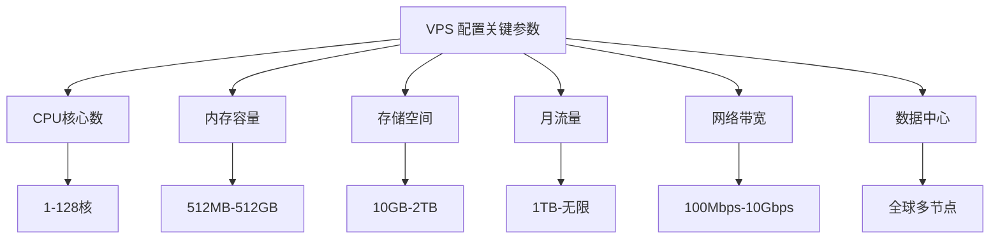
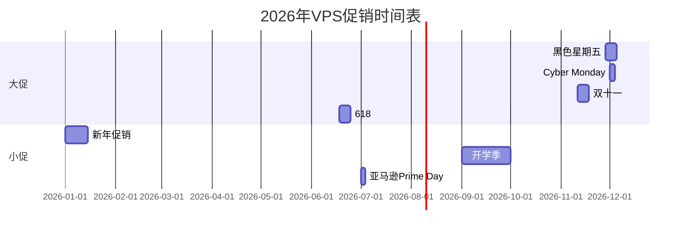
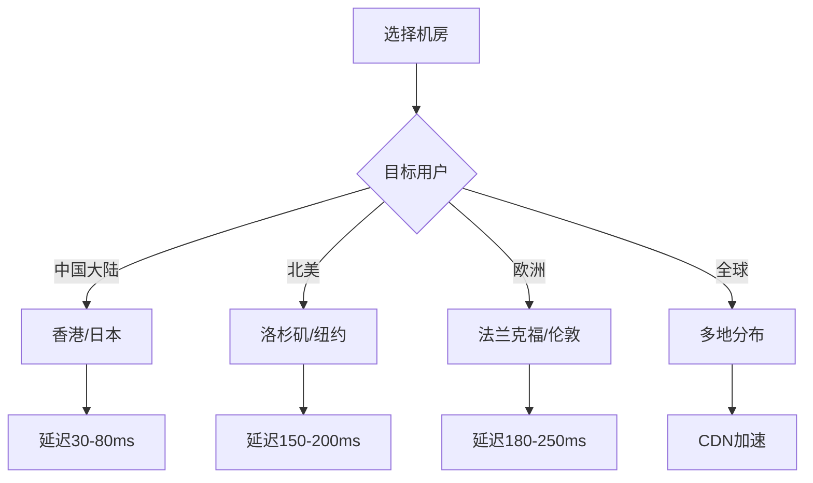

# 国际 VPS 供应商推荐与最佳购买时机指南

> [!tip] 文章概要
> 本文全面介绍主流国际 VPS 供应商，从入门级到企业级全覆盖，并详细分析全年最佳购买时机，帮助你以最优价格入手满意的 VPS。

## 1. 背景与定义

### 1.1 什么是 VPS？

虚拟专用服务器（Virtual Private Server，VPS）是将一台物理服务器通过虚拟化技术分割成多个独立虚拟服务器的解决方案。每个 VPS 拥有独立的操作系统、资源（CPU、内存、磁盘）和网络配置，用户可自由安装软件、配置环境，获得接近独立服务器的体验，但价格仅为传统独立服务器的几分之一。

* 参考来源：[全球热门VPS服务商综合排名 - 主机侦探](https://www.zhujizhentan.com/a/579)

### 1.2 为什么选择国际 VPS？

| 优势 | 说明 |
|------|------|
| **免备案** | 无需繁琐的ICP/EDI备案流程 |
| **网络自由** | 可访问国际互联网资源 |
| **价格透明** | 按量计费，无隐藏费用 |
| **全球节点** | 覆盖北美、欧洲、亚洲数据中心 |
| **支付便利** | 支持PayPal、信用卡付款 |

* 参考来源：[国内外服务器VPS选哪个好 - 简米科技](https://idctop.com/article/34966.html)

## 2. 核心概念解释

### 2.1 VPS 关键参数

### 2.2 线路类型解析

| 线路类型 | 特点 | 适用场景 |
|----------|------|----------|
| **CN2 GIA** | 中国大陆优化线路，三网直连 | 国内访问为主 |
| **CN2 GT** | 中国电信优化，非全程直连 | 性价比选择 |
| **BGP** | 多线路自动选择最优 | 全球化业务 |
| **常规线路** | 国际带宽，价格最低 | 纯国际业务 |

* 参考来源：[2026年VPS主机服务商推荐 - 窗前月下](https://sites.google.com/view/chuanqianyuexia/)

## 3. VPS 供应商深度对比

### 3.1 入门级 VPS（$5/月以内）

| 供应商 | 起步价 | CPU | 内存 | 存储 | 流量 | 特点 |
|--------|--------|-----|------|------|------|------|
| **Hetzner** | €4.15/月 | 1核 | 4GB | 20GB NVMe | 20TB | 欧洲首选，性价比之王 |
| **Linode** | $5/月 | 1核 | 1GB | 25GB SSD | 1TB | 老牌稳定，Akamai收购 |
| **Vultr** | $6/月 | 1核 | 1GB | 25GB SSD | 1TB | 全球25+节点 |
| **DigitalOcean** | $6/月 | 1核 | 1GB | 25GB SSD | 1TB | 开发者友好，生态完善 |

> [!tip] 推荐选择
> - **欧洲用户**：首选 Hetzner，价格最低，性能稳定
> - **亚洲用户**：Vultr 日本/新加坡节点延迟低
> - **开发者**：DigitalOcean 生态最完善，教程丰富

* 参考来源：[Best VPS Providers 2025 - VPS Commander](https://vps-commander.com/blog/best-vps-providers-2025/)

### 3.2 性价比 VPS（$5-20/月）

| 供应商 | 起步价 | 特色 | 推荐场景 |
|--------|--------|------|----------|
| **Hostinger** | $4.99/月 | AI助手，NVMe存储 | 个人博客、小站 |
| **RackNerd** | $10.60/年 | 低价多机房 | 预算敏感用户 |
| **BandwagonHost** | $19.99/年 | CN2 GIA线路 | 国内访问优化 |
| **CloudCone** | $3.99/月 | 随时可取消 | 按需使用 |

* 参考来源：[2026 国外便宜 VPS 推荐 - VPSDeck](https://vpsdeck.com/cheap-cost-effective-vps/)

### 3.3 高性能 VPS（$20+/月）

| 供应商 | 起步价 | 特色 | 适用场景 |
|--------|--------|------|----------|
| **AWS EC2** | $3.50/月 | 企业级弹性 | 生产环境 |
| **Google Cloud** | $4.28/月 | 全球网络 | 大规模部署 |
| **ScalaHosting** | $29.95/月 | SPanel面板 | 托管服务 |
| **InMotion Hosting** | $4.99/月 | NVMe+安全 | 业务站点 |

* 参考来源：[2026年最佳VPS主机提供商 - HostScore](https://hostscore.net/zh-CN/choose/best-vps-hosting/)

### 3.4 中国用户专属推荐

| 供应商 | 线路 | 起步价 | 特点 |
|--------|------|--------|------|
| **搬瓦工** | CN2 GIA | $49.99/年 | 最稳定，限量供应 |
| **DMIT** | CN2 GIA | $89/年 | 大带宽，新生代 |
| **HostDare** | CN2 | $9.1/年 | 低价优化线路 |
| **GigsGigsCloud** | CN2 GIA | $15/月 | 多种优化方案 |

* 参考来源：[9家海外最适合建站VPS推荐 - VPS之家](https://vpszhijia.com/%E5%BB%BA%E7%AB%99vps%E6%8E%A8%E8%8D%90)

## 4. 全年最佳购买时机

### 4.1 促销时间节点一览

### 4.2 黑色星期五（Black Friday）

**时间**：每年 11 月最后一个周五（2026年为11月27日）

这是全年 VPS 促销力度最大的时期，优惠幅度通常在 **30%-70%**：

| 商家 | 典型优惠 | 力度 |
|------|----------|------|
| **RackNerd** | $10.60/年 1GB VPS | 新低 |
| **Hostinger** | 最高87%折扣 | ★★★★★ |
| **HostDare** | CN2 VPS $9.1/年 | ★★★★★ |
| **JustHost** | 多种方案5折起 | ★★★★☆ |

* 参考来源：[2025年黑色星期五VPS优惠整理 - VPS GO](https://www.vpsgo.com/vps-black-friday.html)

> [!tip] 购买建议
> - 提前注册账户，准备好支付方式
> - 关注商家促销电报群获取第一手信息
> - 年付方案通常折扣最大

### 4.3 双十一 vs 618

| 促销节点 | 时间 | 参与商家 | 特点 |
|----------|------|----------|------|
| **双十一** | 11月11日 | 国内厂商+部分海外 | 阿里云、腾讯云为主 |
| **618** | 6月18日 | 国内厂商 | 年中最大促 |

**国内厂商优惠示例**：
- 阿里云：限时秒杀、满减券
- 腾讯云：秒杀专场、续费同价

* 参考来源：[黑五期间买服务器哪里划算 - 便宜云服务器](https://www.xymww.com/hei-wu-qi-jian-mai-fu-wu-qi-na-li-hua-suan/)

### 4.4 其他促销时机

| 时间 | 商家 | 优惠类型 |
|------|------|----------|
| **1-2月** | 恒创科技等 | 新年首促 |
| **4月** | 各大厂商 | 春季促销 |
| **7月** | Amazon Prime Day | AWS优惠 |
| **9月** | Hostinger等 | 开学季促销 |

* 参考来源：[2025年各大外贸主机VPS服务器黑五大促汇总 - 外贸建站博客](https://www.huluboke.com/4238.html)

## 5. 配置选择指南

### 5.1 按用途选择配置

| 用途 | CPU | 内存 | 存储 | 月流量 | 预估价格 |
|------|-----|------|------|--------|----------|
| **个人博客** | 1核 | 1GB | 20GB | 1TB | $5/月 |
| **WordPress** | 2核 | 2GB | 40GB | 2TB | $10/月 |
| **小型电商** | 2核 | 4GB | 60GB | 3TB | $20/月 |
| **API服务** | 2核 | 4GB | 30GB | 5TB | $15/月 |
| **科学上网** | 1核 | 512MB | 10GB | 500GB | $3/月 |

### 5.2 机房选择建议

### 5.3 线路选择决策

> [!tip] 快速选择
> - **国内访问为主** → CN2 GIA（贵但快）
> - **中美业务** → BGP优化线路
> - **纯国际业务** → 常规国际带宽（最便宜）

## 6. 购买流程与注意事项

### 6.1 标准购买流程

### 6.2 支付方式对比

| 方式 | 优点 | 缺点 |
|------|------|------|
| **PayPal** | 安全，支持争议 | 需要验证 |
| **信用卡** | 通用 | 有拒付风险 |
| **支付宝** | 中文友好 | 仅部分商家 |
| **加密货币** | 匿名 | 波动大 |

### 6.3 注意事项

> [!warning] 重要提醒
> - 仔细阅读服务条款，特别是退款政策
> - 了解机房所在地区法规要求
> - 保留好购买凭证和发票
    - 续费价格通常高于首购，需提前规划

## 7. 专业总结

### 7.1 推荐方案汇总

| 用户类型 | 推荐商家 | 核心优势 |
|----------|----------|----------|
| **预算优先** | RackNerd、Hetzner | 价格最低 |
| **国内访问** | 搬瓦工、DMIT | CN2 GIA优化 |
| **开发测试** | DigitalOcean、Vultr | 生态完善 |
| **生产环境** | AWS、Google Cloud | 企业级可靠性 |
| **建站入门** | Hostinger、CloudCone | 易用性高 |

### 7.2 购买策略建议

1. **刚需用户**：遇到合适促销就入手，不用刻意等待
2. **价格敏感**：重点关注黑五、双十一，提前做好功课
3. **长期使用**：年付通常比月付划算 20-40%
4. **新用户首购**：大部分商家对新用户最优惠

### 7.3 2026 年 VPS 市场趋势

- 价格竞争加剧，性价比持续提升
- NVMe SSD 成为标配
- 更多商家支持中文客服
- 中国优化线路产品增多

## 8. 参考链接

1. [全球热门VPS服务商综合排名](https://www.zhujizhentan.com/a/579) — 主机侦探
2. [2026年VPS主机服务商推荐：46家全面对比测评](https://sites.google.com/view/chuanqianyuexia/) — 窗前月下
3. [2026年最佳VPS主机提供商](https://hostscore.net/zh-CN/choose/best-vps-hosting/) — HostScore
4. [Best VPS Providers 2025](https://vps-commander.com/blog/best-vps-providers-2025/) — VPS Commander
5. [2025年黑色星期五VPS优惠整理](https://www.vpsgo.com/vps-black-friday.html) — VPS GO
6. [9家海外最适合建站VPS推荐](https://vpszhijia.com/%E5%BB%BA%E7%AB%99vps%E6%8E%A8%E8%8D%90) — VPS之家
7. [2026 国外便宜 VPS 推荐](https://vpsdeck.com/cheap-cost-effective-vps/) — VPSDeck

---

*本文基于 2026 年 3 月最新信息编写，促销信息请以各商家官网为准。*

