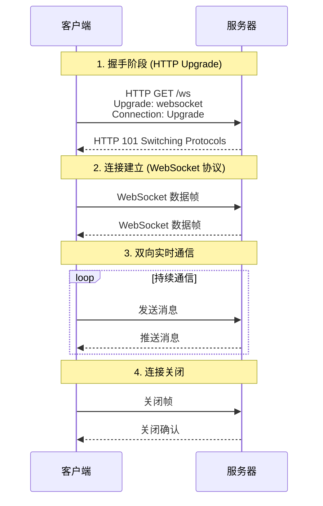
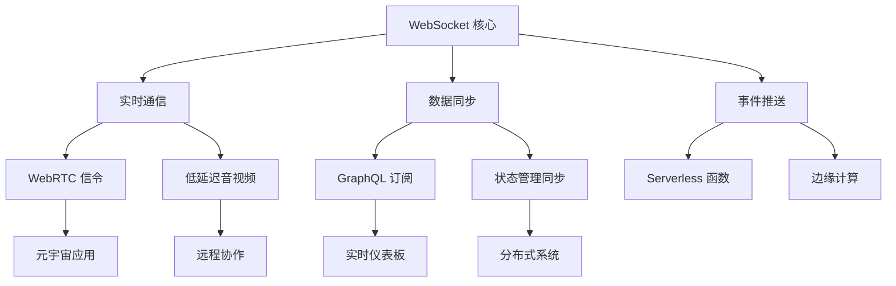

>[!summary] 前情提要
>
## WebSocket 技术详解

### 1. 什么是 WebSocket？

WebSocket 是一种在单个 TCP 连接上进行全双工通信的协议，由 HTML5 规范引入。它使得客户端和服务器之间可以建立持久连接，实现双向实时数据交换。

**核心特点：**
- **全双工通信**：客户端和服务器可以同时发送和接收数据
- **低延迟**：相比 HTTP 轮询，延迟显著降低
- **持久连接**：连接建立后保持打开状态
- **轻量级协议**：头部开销小，数据传输效率高

### 2. WebSocket 协议工作原理



### 3. 技术架构与实现

#### 3.1 协议栈对比

| 协议类型 | 通信模式 | 延迟 | 资源消耗 | 适用场景 |
|---------|---------|------|----------|----------|
| HTTP 轮询 | 半双工 | 高 | 高 | 简单数据获取 |
| HTTP 长轮询 | 半双工 | 中 | 中 | 实时性要求不高 |
| Server-Sent Events | 单向 | 低 | 低 | 服务器推送 |
| **WebSocket** | **全双工** | **极低** | **低** | **实时交互应用** |

#### 3.2 帧结构
WebSocket 数据帧包含：
- FIN 位：标识是否为消息的最后一帧
- Opcode：操作码（文本、二进制、关闭等）
- Mask：掩码（客户端到服务器需要）
- Payload length：数据长度
- Payload data：实际数据

### 4. 现代应用场景

#### 4.1 实时通信应用
- **即时通讯**：微信、Slack、Discord 等
- **在线协作**：Google Docs、Figma 等
- **游戏**：多人在线游戏实时同步

#### 4.2 金融科技
- **股票交易**：实时行情推送 [纳斯达克实时数据](https://www.nasdaq.com/market-activity/quotes)
- **加密货币**：交易所实时价格更新
- **支付系统**：实时交易状态通知

#### 4.3 IoT 物联网
- **智能家居**：设备状态实时同步
- **工业监控**：传感器数据实时传输
- **车联网**：车辆状态实时上报

#### 4.4 新兴技术整合



### 5. 最佳实践

#### 5.1 连接管理
```javascript
// 重连机制示例
class WebSocketManager {
  constructor(url) {
    this.url = url;
    this.reconnectAttempts = 0;
    this.maxReconnectAttempts = 5;
    this.reconnectDelay = 1000;
  }
  
  connect() {
    this.ws = new WebSocket(this.url);
    
    this.ws.onopen = () => {
      console.log('WebSocket 连接成功');
      this.reconnectAttempts = 0;
    };
    
    this.ws.onclose = () => {
      if (this.reconnectAttempts < this.maxReconnectAttempts) {
        setTimeout(() => {
          this.reconnectAttempts++;
          this.connect();
        }, this.reconnectDelay * Math.pow(2, this.reconnectAttempts));
      }
    };
  }
}
```

#### 5.2 错误处理与监控
- **连接状态监控**
- **消息重试机制**
- **性能指标收集**
- **异常报警系统**
### 学习资源推荐

1. **官方文档**
   - [MDN WebSocket API](https://developer.mozilla.org/zh-CN/docs/Web/API/WebSocket)
   - [RFC 6455 规范](https://tools.ietf.org/html/rfc6455)

2. **实践教程**
   - [WebSocket 实战指南](https://websocket.org/)
   - [实时应用开发最佳实践](https://ably.com/blog)

3. **性能优化**
   - [WebSocket 性能调优](https://www.cloudflare.com/learning/performance/websocket-performance/)
   - [大规模连接管理](https://engineering.fb.com/2023/05/15/production-engineering/websocket-scalability/)

### 总结

WebSocket 作为现代 Web 实时通信的核心技术，在数字化转型和实时交互需求日益增长的今天，其重要性不断提升。随着新协议扩展、性能优化和安全增强，WebSocket 将继续在实时通信领域发挥关键作用。

