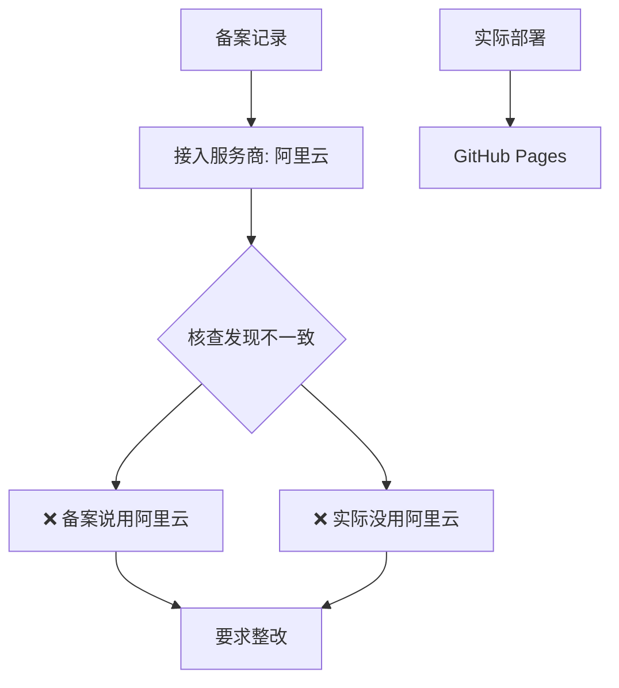
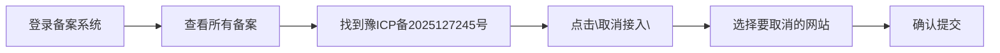
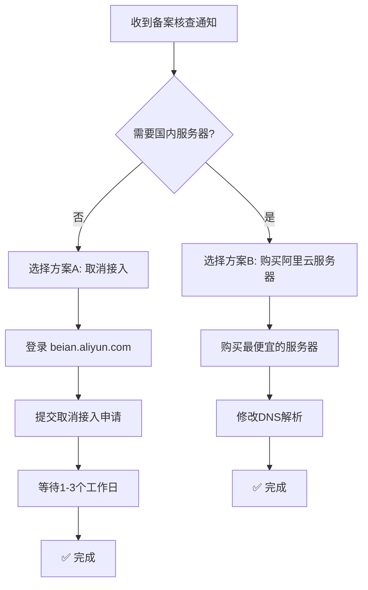

# 阿里云备案核查处理指南

## 1. 问题诊断

根据你提供的信息，问题的核心是：

简单说：**你的备案信息显示网站托管在阿里云，但实际上你用的是 GitHub Pages**。阿里云核查发现这个不一致，要求你处理。

---

## 2. 你的两个选择

| 方案 | 操作 | 适用场景 | 成本 |
|------|------|----------|------|
| **方案A** | 取消阿里云接入 | 个人博客、无需国内加速 | 免费 |
| **方案B** | 购买阿里云服务器 | 需要国内访问速度 | 约 100-300元/年 |

### 推荐方案A：取消阿里云接入

对于你的情况（个人博客 + GitHub Pages），**取消接入是最简单的方案**，原因：

1. GitHub Pages 本身不需要 ICP 备案（服务器在海外）
2. 取消后网站**不会受影响**，可以正常访问
3. 备案主体（豫ICP备2025127245号）**不会被注销**，只是取消阿里云这个"接入"记录

---

## 3. 方案A：取消接入操作步骤

### 步骤1：登录阿里云 ICP 备案系统

访问：[阿里云 ICP 备案管理系统](https://beian.aliyun.com/)

### 步骤2：找到取消接入入口

具体路径：
1. 进入 **ICP 备案** → **我的备案**
2. 找到备案号 **豫ICP备2025127245号**
3. 点击操作栏的 **更多** → **取消接入**
4. 选择网站 **jeffkafka.top**
5. 填写取消原因（可填"网站已迁移至其他平台"）
6. 提交申请

### 步骤3：等待审核

- 审核时间：通常 **1-3 个工作日**
- 审核通过后，阿里云会注销该网站的接入记录
- 你的网站**不受任何影响**（GitHub Pages 正常运行）

---

## 4. 方案B：购买阿里云服务器（备选）

如果你希望保留阿里云接入（比如未来可能需要国内服务器），可以：

### 步骤1：购买最便宜的 ECS 或虚拟主机

- 推荐产品：[阿里云轻量应用服务器](https://www.aliyun.com/product/swas)
- 最低配置约 **60-100元/年**

### 步骤2：将域名解析指向阿里云服务器

在阿里云 DNS 控制台修改 A 记录，指向你购买的服务器 IP。

### 步骤3：在服务器上部署网站

可以做一个简单的反向代理，将请求转发到 GitHub Pages，或者直接在阿里云部署静态网站。

---

## 5. 常见问题解答

### Q1: 取消接入后，备案号会失效吗？

**不会**。取消接入只是取消"阿里云作为服务商"的记录，主体备案号（豫ICP备2025127245号）仍然有效。如果将来你要用国内服务器，可以重新做接入。

### Q2: 取消接入后网站能正常访问吗？

**可以**。你的网站托管在 GitHub Pages（海外服务器），不需要 ICP 备案也能正常访问。唯一影响是国内访问速度可能较慢。

### Q3: 不处理会怎样？

根据阿里云通知：
- **2026年02月25日**前未处理
- 网站可能被**限制访问**
- 或被**强制取消接入**

---

## 6. 总结建议

**我的建议**：对于个人博客，直接选择 **方案A（取消接入）**，操作简单、免费、不影响网站运行。

---

## 7. 参考链接

1. [阿里云 ICP 备案管理系统](https://beian.aliyun.com/) — 官方备案管理入口
2. [阿里云备案 - 取消接入操作指南](https://help.aliyun.com/document_detail/36926.html) — 官方帮助文档
3. [接入准确性核查说明](https://help.aliyun.com/document_detail/202775.html) — 阿里云官方说明

---

如果你在操作过程中遇到任何问题，可以告诉我具体卡在哪一步，我会进一步帮你解答。