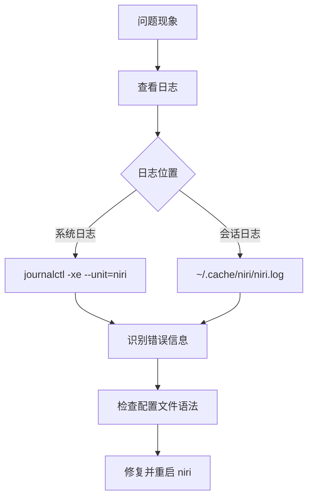

>[!summary] 前情提要### 1. 背景与定义

niri 是一款基于 **Wayland 协议**的现代窗口管理器，以其简洁的设计、高效的多任务处理能力和原生支持 Wayland 的特性而受到 Linux 桌面用户的欢迎。作为 Arch Linux 生态系统的一部分，niri 提供了高度可定制的工作流，适合追求轻量化与生产力的用户。

* **核心特性**：采用图层管理（Layered Layout）、原生支持触摸手势、内置窗口动画、支持多显示器、配置基于 TOML 文件。
* **与 X11 窗口管理器的区别**：niri 完全基于 Wayland 协议开发，无需 X11 兼容性层（XWayland 可选），提供更优的渲染性能和安全性。

---

### 2. 安装与依赖准备

#### 2.1 系统要求
- **Arch Linux 或 Arch 系发行版**：确保系统已更新到最新状态（`pacman -Syu`）。
- **Wayland 会话支持**：需要安装 Wayland 相关依赖（如 `wayland`、`wayland-protocols`）。
- **显示服务器**：建议使用 `wlroots` 作为后端（niri 基于 wlroots 开发）。

#### 2.2 安装步骤
1. **启用 Arch User Repository (AUR)**：
   - 使用 `yay`、`paru` 或 `trizen` 等 AUR 助手。
   - 安装 `niri` 包：`yay -S niri` 或 `paru -S niri`。
2. **验证安装**：安装完成后，运行 `niri --version` 检查版本信息。

#### 2.3 依赖清单
| 依赖名称 | 功能说明 |
|---------|----------|
| [wlroots](https://github.com/swaywm/wlroots) | Wayland 合成器基础库 |
| [wayland](https://wayland.freedesktop.org/) | Wayland 显示服务器协议 |
| [wayland-protocols](https://gitlab.freedesktop.org/wayland/wayland-protocols) | Wayland 协议扩展 |
| [xwayland](https://xorg.freedesktop.org/wiki/Projects/Xwayland/) | X11 应用程序兼容性层（可选） |

---

### 3. 基本配置流程

#### 3.1 初始化配置文件
- niri 的配置文件位于 `~/.config/niri/config.toml`（首次运行时自动生成）。
- 配置文件结构采用 TOML 格式，包含**全局设置**、**键盘绑定**、**工作区配置**和**窗口规则**等部分。

#### 3.2 核心配置项
```toml
# 全局设置
[global]
# 是否启用触摸手势
enable_touch_gestures = true
# 是否显示状态栏
show_top_bar = true
# 背景图像路径
wallpaper = "/path/to/your/wallpaper.jpg"

# 工作区配置
[workspaces]
# 定义 10 个工作区
count = 10
# 工作区名称
names = ["1: Code", "2: Browser", "3: Terminal", "4: Design", "5: Music"]

# 键盘绑定
[keybindings]
# 启动终端：Super+Enter
"Super+Enter" = "spawn alacritty"
# 打开应用启动器：Super+D
"Super+D" = "spawn wofi --show drun"
# 移动窗口到工作区：Super+Shift+数字
"Super+Shift+1" = "move_workspace 1"
```

---

### 4. 启动与会话管理

#### 4.1 创建 Wayland 会话入口
1. 在 `/usr/share/wayland-sessions/` 目录下创建 `niri.desktop` 文件：
   ```ini
   [Desktop Entry]
   Name=niri
   Comment=A modern Wayland compositor
   Exec=niri
   Type=Application
   Keywords=wayland;compositor;
   ```
2. 确保文件权限正确：`chmod +x /usr/share/wayland-sessions/niri.desktop`。

#### 4.2 启动方式
- **图形登录管理器**：在 GDM、SDDM 或 LightDM 中选择 "niri" 会话。
- **命令行启动**：在 TTY 中运行 `niri` 直接进入会话。

---

### 5. 核心功能配置与调优

#### 5.1 窗口与布局管理
```toml
# 窗口规则示例：指定应用程序的默认工作区
[window_rules]
# VS Code 始终打开在工作区 1
[[window_rules.rule]]
app_id = "code-oss"
workspace = 1
# 浏览器窗口最大化显示
[[window_rules.rule]]
app_id = "firefox"
initial_state = "maximized"

# 图层布局配置
[layered_layout]
# 主窗口占比（默认 60%）
main_ratio = 0.6
# 次要窗口占比（默认 40%）
secondary_ratio = 0.4
# 是否启用窗口快照预览
enable_snapshots = true
```

#### 5.2 键盘与触摸手势
```toml
# 触摸手势配置
[gestures]
# 三指上滑：显示工作区概览
three_finger_swipe_up = "toggle_overview"
# 四指上滑：切换全屏
four_finger_swipe_up = "toggle_fullscreen"

# 自定义键盘绑定
[keybindings]
# 移动窗口到上/下/左/右：Super+Shift+方向键
"Super+Shift+Up" = "move_window up"
"Super+Shift+Down" = "move_window down"
"Super+Shift+Left" = "move_window left"
"Super+Shift+Right" = "move_window right"
# 调整窗口大小：Super+Ctrl+方向键
"Super+Ctrl+Up" = "resize_window up"
```

---

### 6. 集成与高级用法

#### 6.1 状态栏与通知
- **推荐状态栏**：使用 `waybar` 或 `ags`（Aylur's Widgets）作为 niri 的状态栏。
  - 配置方式：在 `~/.config/waybar/config` 中添加 niri 支持的模块。
- **通知系统**：使用 `mako` 或 `dunst`（需要 XWayland 支持）。

#### 6.2 主题与外观
- **GTK 主题**：使用 `gsettings` 或 `nwg-look` 配置 GTK 应用程序的主题。
- **光标主题**：通过 `XcursorTheme` 环境变量指定（如 `export XcursorTheme=Bibata-Modern-Ice`）。

#### 6.3 多显示器配置
```toml
[monitors]
# 主显示器：DP-1
[[monitors.monitor]]
name = "DP-1"
primary = true
scale = 1.0
# 副显示器：HDMI-A-1（右侧）
[[monitors.monitor]]
name = "HDMI-A-1"
position = "right_of DP-1"
scale = 1.5
```

---

### 7. 常见问题与调试

#### 7.1 问题排查流程


#### 7.2 典型问题与解决方案
- **无法启动**：检查 `/usr/share/wayland-sessions/niri.desktop` 文件是否正确。
- **窗口闪烁**：调整显卡驱动配置（如 NVIDIA 驱动需要启用 DRM 内核模式设置）。
- **触摸手势失效**：检查 `libinput` 驱动是否正常加载。

---

### 8. 总结与资源

#### 8.1 配置流程总结
1. 安装 niri 及其依赖。
2. 创建 Wayland 会话入口。
3. 配置 `config.toml` 以满足个人需求。
4. 启动 niri 并验证功能。
5. 逐步调优布局、键盘绑定和主题。

#### 8.2 学习资源
- **官方文档**：[niri 文档](https://github.com/YaLTeR/niri/wiki)。
- **社区支持**：[Reddit 论坛](https://www.reddit.com/r/wayland/)、[Arch Linux 论坛](https://bbs.archlinux.org/)。
- **配置示例**：[GitHub 仓库](https://github.com/YaLTeR/niri) 提供的默认配置和社区贡献的配置。

---

通过以上步骤，您可以在 Arch Linux 中成功配置并使用 niri 作为默认窗口管理器，享受到 Wayland 带来的现代化桌面体验。