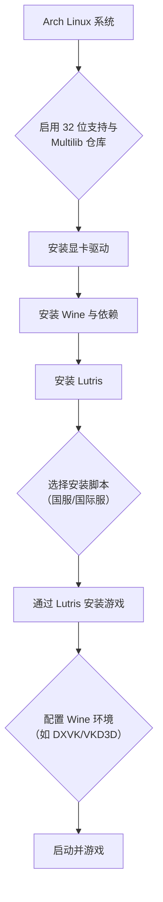

### 1. 背景与定义

在 Arch Linux 上运行《英雄联盟》（League of Legends）是一个经典的 Linux 游戏兼容性挑战。由于《英雄联盟》是一款仅支持 Windows 的在线游戏，并且采用了反作弊系统（如 Vanguard，在国服为腾讯的 TP 反作弊系统），在 Linux 上运行它需要借助兼容层。目前，最主流和成功的方法是使用 **Wine** 配合 **Lutris** 游戏启动器。

* 例：[WineHQ – Wine](https://www.winehq.org/) - 一个在 Linux 和 macOS 上运行 Windows 应用程序的兼容层。
* 例：[Lutris](https://lutris.net/) - 一个开源游戏平台，用于在 Linux 上安装和管理游戏，它自动化了 Wine 和各类运行库的配置。

### 2. 核心概念与准备工作

在开始前，你需要了解几个关键组件及其关系：



**核心准备工作：**
1.  **系统更新**：确保系统为最新：`sudo pacman -Syu`
2.  **启用 Multilib 仓库**：编辑 `/etc/pacman.conf`，取消 `[multilib]` 部分的注释，然后再次执行 `sudo pacman -Syu`。这对于运行 32 位 Windows 程序至关重要。
3.  **安装显卡驱动**：
    - **NVIDIA**：`sudo pacman -S nvidia nvidia-utils lib32-nvidia-utils`
    - **AMD**：`sudo pacman -S mesa lib32-mesa vulkan-radeon lib32-vulkan-radeon`
    - **Intel**：`sudo pacman -S mesa lib32-mesa vulkan-intel lib32-vulkan-intel`
4.  **安装 Wine 和依赖**：`sudo pacman -S wine wine-mono wine-gecko winetricks`

### 3. 详细安装步骤（以 Lutris 为例）

这是目前最推荐、最自动化的方法。

#### 步骤一：安装 Lutris
```bash
sudo pacman -S lutris
```

#### 步骤二：通过 Lutris 安装《英雄联盟》
Lutris 社区提供了安装脚本，可以自动处理复杂的配置。

1.  打开 Lutris。
2.  点击左上角的 **“+”** 按钮，选择 **“从 Lutris 网站搜索安装游戏”**。
3.  在搜索框中输入 **“League of Legends”**。
4.  你会看到多个脚本，**请根据你的服务器选择**：
    - **国际服（Riot Client）**：通常选择由 “GloriousEggroll” 等维护的脚本。
    - **国服（腾讯 WeGame/客户端）**：搜索 “League of Legends China” 或 “英雄联盟 国服”。一个常用的脚本是 “[League of Legends (China)](https://lutris.net/games/league-of-legends-china/)”。
5.  点击你选择的脚本，然后点击 **“安装”**。Lutris 会自动下载所需的 Wine 版本（如 `wine-lol`、`wine-ge-lol`）、配置 DXVK（将 DirectX 转换为 Vulkan 的层）并创建 Wine 前缀。
6.  安装程序会引导你下载官方游戏安装器或客户端。**请务必从英雄联盟官网下载最新的客户端安装程序**，然后在 Lutris 的安装向导中指定该安装程序的位置。
7.  跟随安装向导完成游戏客户端的安装。

*最新进展与脚本来源*：Lutris 网站上的脚本由社区维护，更新频繁以应对游戏和反作弊的更改。例如，国服脚本会针对腾讯 TP 反作弊进行特殊配置。
* 核心脚本页面：[Lutris - League of Legends (China)](https://lutris.net/games/league-of-legends-china/)

#### 步骤三：安装后的重要配置
- **Runner 选项**：在 Lutris 的游戏配置中，确保 “Runner” 选项卡下的 “Wine version” 是脚本推荐的版本（如 `wine-ge-lol-8-x86_64`）。
- **DXVK/VKD3D**：在 “Runner options” 中，通常需要启用 **DXVK** 和 **VKD3D** 以提升图形性能与兼容性。
- **游戏设置**：首次启动游戏后，在游戏的视频设置中，建议：
    - 将图形 API 设置为 **DirectX 11**（如果可选）。
    - 启用 “全屏窗口化” 或 “无边框” 模式，以减少切换桌面时的问题。
    - 关闭阴影等高级特效以进一步提升帧数。

### 4. 可能遇到的问题与解决方案

1.  **反作弊问题（TP/Vanguard）**：
    - 这是最大的障碍。社区脚本通常会应用特定的补丁或使用特制的 Wine 版本（如 `wine-lol`）来绕过或兼容反作弊。
    - **务必使用 Lutris 脚本安装**，手动配置极其困难。
    - 如果游戏启动失败或提示反作弊错误，请查看 Lutris 日志，并到脚本页面查看其他用户的评论和解决方案。

2.  **性能低于 Windows**：
    - 这是正常现象。通过使用 DXVK 并保持驱动更新，性能损失可以控制在可接受范围内（通常为 10%-20%）。
    - 确保在 Lutris 的游戏配置中启用了 **Esync** 或 **Fsync**（Wine 性能特性）。

3.  **中文输入法问题**：
    - 在 Wine 环境中输入中文可能需要额外配置。可以尝试安装 `fcitx5` 或 `ibus` 输入法框架，并在 Wine 前缀中设置正确的环境变量。

### 5. 专业总结与应用建议

*   **结论要点**：在 Arch Linux 上玩《英雄联盟》是可行的，但并非官方支持。成功的关键在于使用 **Lutris** 及其社区维护的安装脚本，它们自动化了 Wine 版本、DXVK 和反作弊兼容性等最复杂的部分。
*   **实际应用建议**：
    1.  **优先选择 Lutris 方案**，避免手动配置 Wine。
    2.  **仔细选择对应服务器的脚本**（国服/国际服），并关注脚本页面的更新和评论。
    3.  保持你的 **Arch 系统、显卡驱动和 Lutris** 处于最新状态。
    4.  管理好预期，**性能可能略低于 Windows**，且每次游戏大更新后都可能需要等待脚本或 Wine 版本更新。
    5.  遇到问题时，**Arch Wiki** 和 **Lutris 社区** 是首要的求助资源。

### 6. 参考链接（附说明）

1.  [Lutris - League of Legends (China) 安装页面](https://lutris.net/games/league-of-legends-china/) — 国服英雄联盟的一键安装脚本页面，包含安装指导和社区讨论。
2.  [Arch Wiki: Wine](https://wiki.archlinux.org/title/Wine) — Arch Linux 官方 Wiki 关于 Wine 的详尽配置指南，是解决深层次问题的重要参考。
3.  [Arch Wiki: Lutris](https://wiki.archlinux.org/title/Lutris) — 在 Arch 上安装和配置 Lutris 的官方指南。
4.  [WineHQ AppDB: League of Legends](https://appdb.winehq.org/objectManager.php?sClass=application&iId=10108) — Wine 官方应用程序数据库中对《英雄联盟》的兼容性评级和用户报告，可了解最新兼容状态。
5.  [GloriousEggroll's Wine Builds](https://github.com/GloriousEggroll/wine-ge-custom) — 一个性能优化且包含游戏补丁的 Wine 版本，常被 Lutris 脚本使用。