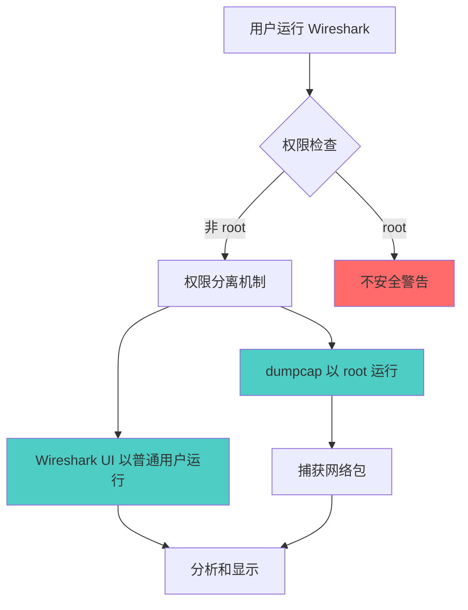

> [!summary] 前情提要
> 本文将详细介绍在 Arch Linux 系统上安装和配置 Wireshark 网络抓包工具的完整流程，包括权限配置、GUI 和 CLI 版本选择，以及常见问题的解决方案。

# Arch Linux 配置 Wireshark 完整指南

Wireshark 是世界上最强大的网络协议分析器之一，能够让你在微观级别洞察网络流量。本文将详细介绍在 Arch Linux 上的配置方法。

## 1. 背景与定义

Wireshark 是一个免费开源的包分析器，广泛用于网络故障排查、分析、软件和通信协议开发以及教育领域。

> [!tip] 官方定义
> Wireshark 是全球领先的网络协议分析工具，支持捕获和分析网络流量。

* 来源：[Wireshark 官方网站](https://www.wireshark.org/)

### Arch Linux 包选择

在 Arch Linux 上，Wireshark 提供两个主要包：

| 包名 | 描述 | 适用场景 |
|------|------|----------|
| `wireshark-qt` | Qt GUI 图形界面 | 需要图形界面分析 |
| `wireshark-cli` | 命令行工具 (tshark) | 服务器/无 GUI 环境 |

## 2. 核心概念解释



### 权限分离机制

Wireshark 实现了权限分离机制：
- **dumpcap**: 以 root 权限运行，负责实际捕获网络包
- **Wireshark UI/tshark**: 以普通用户运行，负责分析和显示

> [!warning] 安全警告
> **永远不要以 root 用户运行 Wireshark**！这会带来严重的安全风险。

## 3. Arch Linux 安装步骤

### 3.1 安装 Wireshark

```bash
# 安装 Qt GUI 版本（推荐桌面用户）
sudo pacman -S wireshark-qt

# 或安装 CLI 版本（服务器/无 GUI 环境）
sudo pacman -S wireshark-cli
```

> [!info] 包信息
> - `wireshark-cli`: 4.6.2-2 版本，大小 19.4 MB
> - `wireshark-qt`: 4.6.2-2 版本，大小 4.5 MB
>
> 来源：[Arch Linux 官方包](https://archlinux.org/packages/extra/x86_64/wireshark-qt/)

### 3.2 配置捕获权限

安装后，`wireshark-cli` 会自动设置 `/usr/bin/dumpcap` 的权限：

```bash
# 将当前用户添加到 wireshark 组
sudo usermod -aG wireshark $USER

# 或使用 gpasswd
sudo gpasswd -a $USER wireshark

# 重新登录后生效
newgrp wireshark
```

### 3.3 验证安装

```bash
# 检查 wireshark 组权限
groups | grep wireshark

# 测试 tshark CLI
tshark --version

# 测试 Wireshark GUI
wireshark
```

## 4. 常见问题与解决方案

### 4.1 权限问题

如果普通用户无法捕获网络包：

```bash
# 检查 dumpcap 权限
ls -l /usr/bin/dumpcap

# 手动设置权限（如果需要）
sudo setcap cap_net_raw,cap_net_admin+eip /usr/bin/dumpcap
```

### 4.2 运行崩溃问题

> [!warning] 已知问题
> 有用户报告在某些 Arch Linux 系统上运行 tshark 时出现 `IOT instruction (core dumped)` 错误。
>
> 来源：[Arch Linux 论坛](https://bbs.archlinux.org/viewtopic.php?id=305878)

可能的解决方案：
- 确保系统完全更新：`sudo pacman -Syu`
- 检查是否是 AUR 版本的问题，尝试官方源版本
- 查看 coredump：`coredumpctl debug`

## 5. 进阶配置

### 5.1 捕获过滤器语法

Wireshark 使用 BPF (Berkeley Packet Filter) 语法：

```bash
# 只捕获 HTTP 流量
tcp port 80 or tcp port 443

# 排除特定 IP
not host 192.168.1.1

# 只捕获特定协议
udp or tcp
```

### 5.2 常用 tshark 命令

```bash
# 实时捕获并显示
tshark -i eth0

# 捕获指定数量包后退出
tshark -i eth0 -c 100

# 保存到文件
tshark -i eth0 -w capture.pcap

# 只显示特定协议
tshark -i eth0 -Y "http"
```

## 6. 总结与建议

### 核心要点

1. **选择合适的包**：桌面用户用 `wireshark-qt`，服务器用 `wireshark-cli`
2. **权限配置**：将用户加入 `wireshark` 组，不要以 root 运行
3. **安全意识**：捕获网络流量涉及隐私法律问题，确保合规使用

### 实际应用建议

- 学习 BPF 过滤器语法以提高效率
- 熟悉常见协议（TCP/IP, HTTP, DNS）的数据包结构
- 使用 `termshark` 作为终端 UI 替代方案

> [!tip] 推荐资源
> 官方文档 [Wireshark User's Guide](https://www.wireshark.org/docs/) 是学习的最佳起点。

## 7. 参考链接

1. [Wireshark 官方网站](https://www.wireshark.org/) — 官方首页
2. [Wireshark - ArchWiki](https://wiki.archlinux.org/title/Wireshark) — Arch Linux 官方 Wiki
3. [wireshark-qt 包详情](https://archlinux.org/packages/extra/x86_64/wireshark-qt/) — Arch 官方仓库
4. [wireshark-cli 包详情](https://archlinux.org/packages/extra/x86_64/wireshark-cli/) — Arch 官方仓库
5. [Wireshark 权限配置文档](https://gitlab.com/wireshark/wireshark/-/wikis/CaptureSetup/CapturePrivileges) — 官方权限设置指南
6. [Arch Linux 论坛 - Wireshark 问题讨论](https://bbs.archlinux.org/viewtopic.php?id=305878) — 社区问题解决方案
