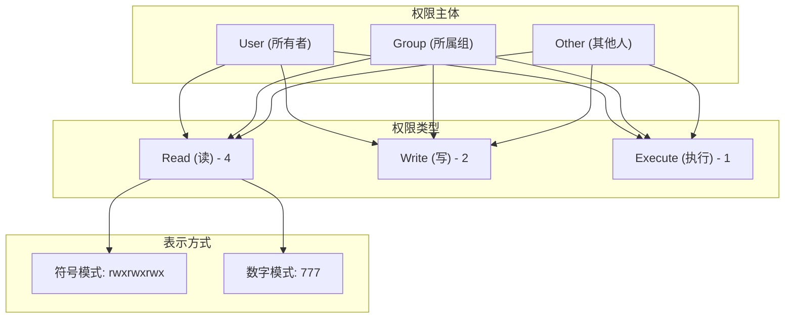
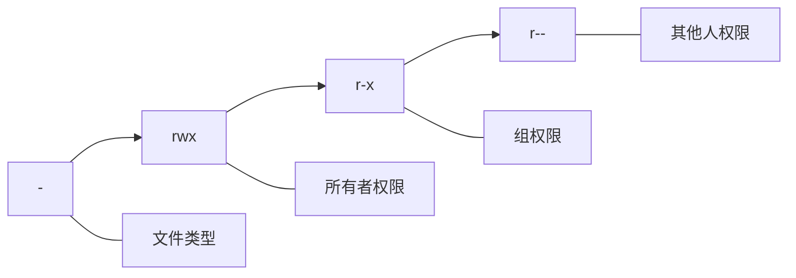
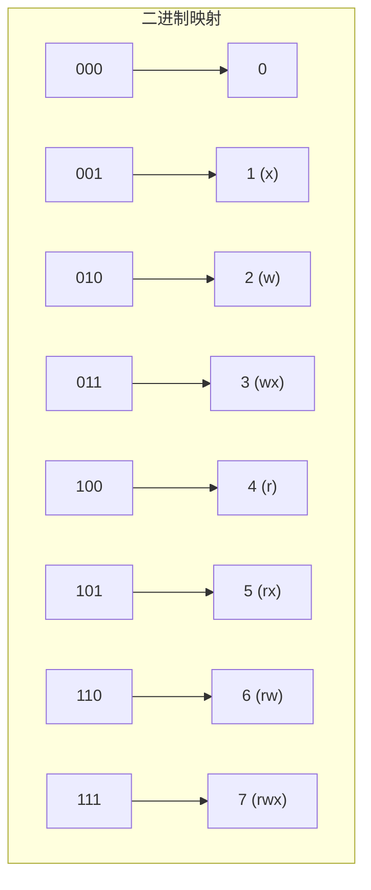
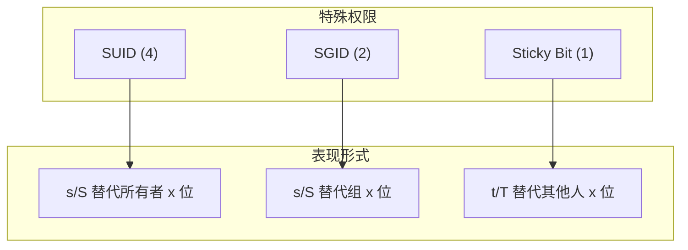
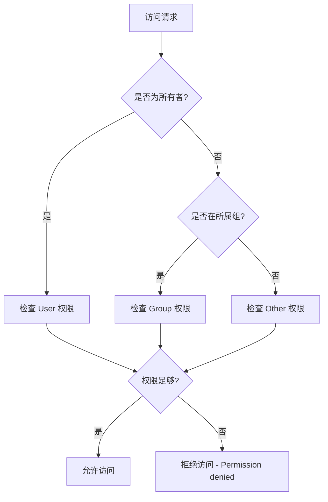

# Linux 文件权限编码详解

## 1. 背景与定义

Linux 文件权限是 Unix/Linux 系统安全模型的核心组成部分，用于控制用户对文件和目录的访问能力。每个文件和目录都有一组权限标志，决定了**谁可以读取、写入或执行**该文件。

Linux 权限系统基于 **POSIX 标准**，采用**多用户、多任务**设计理念，确保系统资源的隔离与安全。

> 参考：[Linux Manual Page - chmod](https://man7.org/linux/man-pages/man1/chmod.1.html)

---

## 2. 权限模型架构

Linux 权限采用 **UGO 模型**（User-Group-Other），将访问者分为三类：



### 2.1 三类用户身份

| 身份 | 符号 | 说明 |
|------|------|------|
| User (所有者) | `u` | 文件的创建者或拥有者 |
| Group (所属组) | `g` | 文件所属的用户组 |
| Other (其他人) | `o` | 既不是所有者也不在所属组的用户 |
| All (所有人) | `a` | 等同于 `ugo` |

### 2.2 三种基本权限

| 权限 | 符号 | 数值 | 对文件的作用 | 对目录的作用 |
|------|------|------|-------------|-------------|
| Read (读) | `r` | 4 | 查看文件内容 | 列出目录内容 (`ls`) |
| Write (写) | `w` | 2 | 修改文件内容 | 创建/删除/重命名目录内的文件 |
| Execute (执行) | `x` | 1 | 作为程序执行 | 进入目录 (`cd`) |

---

## 3. 权限编码详解

### 3.1 符号表示法

使用 `ls -l` 命令查看文件权限时，会看到类似 `-rwxr-xr--` 的输出：



**文件类型标识（首位字符）：**

| 字符 | 类型 |
|------|------|
| `-` | 普通文件 |
| `d` | 目录 |
| `l` | 符号链接 |
| `b` | 块设备文件 |
| `c` | 字符设备文件 |
| `s` | 套接字文件 |
| `p` | 命名管道 (FIFO) |

### 3.2 数字表示法（八进制编码）

每种权限对应一个**二进制位**，三个权限组合成一个 **0-7 的八进制数**：



**常用权限组合示例：**

| 数字 | 符号 | 含义 | 典型用途 |
|------|------|------|----------|
| `755` | `rwxr-xr-x` | 所有者全权限，其他人可读可执行 | 可执行程序、目录 |
| `644` | `rw-r--r--` | 所有者可读写，其他人只读 | 普通文件、配置文件 |
| `600` | `rw-------` | 仅所有者可读写 | 私钥文件、敏感配置 |
| `777` | `rwxrwxrwx` | 所有人全权限 | 临时目录（不推荐） |
| `700` | `rwx------` | 仅所有者全权限 | 私有目录 |
| `775` | `rwxrwxr-x` | 组内可写，其他人只读 | 共享项目目录 |

---

## 4. 特殊权限（SUID、SGID、Sticky Bit）

除了基本权限，Linux 还支持三种**特殊权限**，它们占用额外的权限位：



### 4.1 SUID (Set User ID) - 数值 4

- **作用**：执行文件时，进程以**文件所有者**的身份运行
- **显示**：所有者执行位显示为 `s`（有 x）或 `S`（无 x）
- **典型示例**：`/usr/bin/passwd`

```bash
ls -l /usr/bin/passwd
# -rwsr-xr-x 1 root root ... /usr/bin/passwd
```

### 4.2 SGID (Set Group ID) - 数值 2

- **对文件**：执行时以**文件所属组**身份运行
- **对目录**：在该目录下创建的文件**自动继承目录的组**
- **显示**：组执行位显示为 `s` 或 `S`

### 4.3 Sticky Bit - 数值 1

- **作用**：目录中的文件**仅所有者可删除**
- **显示**：其他人执行位显示为 `t`（有 x）或 `T`（无 x）
- **典型示例**：`/tmp` 目录

```bash
ls -ld /tmp
# drwxrwxrwt 8 root root ... /tmp
```

### 4.4 特殊权限数值计算

完整权限为 **4 位八进制数**：`[特殊权限][User][Group][Other]`

| 完整数值 | 含义 |
|----------|------|
| `4755` | SUID + 755 |
| `2755` | SGID + 755 |
| `1755` | Sticky Bit + 755 |
| `6755` | SUID + SGID + 755 |

---

## 5. chmod 命令使用

### 5.1 符号模式语法

```bash
chmod [ugoa][+-=][rwxst] 文件
```

| 操作符 | 含义 |
|--------|------|
| `+` | 添加权限 |
| `-` | 移除权限 |
| `=` | 精确设置权限 |

**示例：**

```bash
# 给所有者添加执行权限
chmod u+x script.sh

# 移除组和其他人的写权限
chmod go-w file.txt

# 精确设置权限
chmod u=rwx,g=rx,o=r file.txt

# 给所有人添加读权限
chmod a+r file.txt
```

### 5.2 数字模式语法

```bash
chmod NNN 文件
```

**示例：**

```bash
# 设置 755 权限
chmod 755 script.sh

# 设置 644 权限
chmod 644 config.txt

# 设置 SUID
chmod 4755 /usr/local/bin/myapp
```

### 5.3 递归修改

```bash
# 递归修改目录及其内容
chmod -R 755 /var/www/html
```

---

## 6. 权限判断流程



---

## 7. 实际应用建议

### 7.1 安全最佳实践

- **最小权限原则**：只授予必要的权限
- **避免 777**：不要对任何文件或目录设置 `777`
- **保护敏感文件**：私钥文件应设为 `600` 或 `400`
- **Web 目录**：通常设为 `755`（目录）和 `644`（文件）

### 7.2 常用权限配置

| 场景 | 目录权限 | 文件权限 |
|------|----------|----------|
| Web 服务器 | `755` | `644` |
| 用户主目录 | `700` | `600` |
| 共享项目 | `775` | `664` |
| SSH 密钥 | - | `600` |
| 临时目录 | `1777` | - |

---

## 8. 相关命令

| 命令 | 作用 |
|------|------|
| `chown` | 修改文件所有者 |
| `chgrp` | 修改文件所属组 |
| `umask` | 设置默认权限掩码 |
| `stat` | 查看文件详细属性 |
| `getfacl` | 查看访问控制列表 |
| `setfacl` | 设置访问控制列表 |

---

## 9. 参考链接

1. [GNU Coreutils - chmod](https://www.gnu.org/software/coreutils/manual/html_node/chmod-invocation.html) — GNU 官方文档
2. [Linux man page - chmod(1)](https://man7.org/linux/man-pages/man1/chmod.1.html) — 权威手册页
3. [Linux man page - chmod(2)](https://man7.org/linux/man-pages/man2/chmod.2.html) — 系统调用文档
4. [Wikipedia - File system permissions](https://en.wikipedia.org/wiki/File_system_permissions) — 维基百科详细解释
5. [Red Hat Documentation](https://access.redhat.com/documentation/en-us/red_hat_enterprise_linux/9/html/configuring_basic_system_settings/managing-permissions_configuring-basic-system-settings) — Red Hat 官方文档