---

### 1. Git 核心原理深度解析

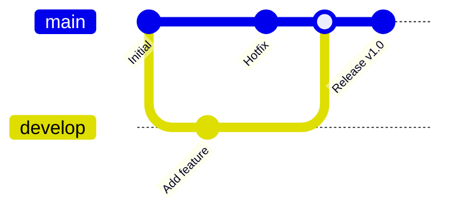

---

### 2. 详细使用场景与 GitGraph

#### 场景 1：完整功能开发流程

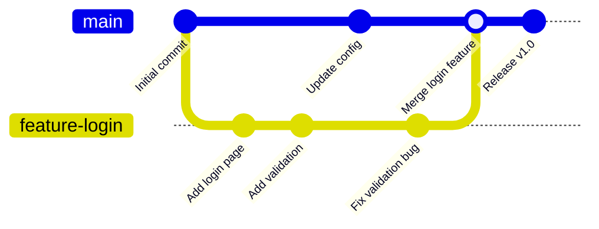

**详细命令流程**：

```bash
# 1. 确保主分支最新
git checkout main
git pull origin main

# 2. 创建功能分支
git checkout -b feature-login

# 3. 开发过程中的提交
git add login.go
git commit -m "feat: 添加登录页面"

git add validation.go
git commit -m "feat: 添加表单验证"

# 4. 定期同步主分支更新
git fetch origin
git merge origin/main

# 5. 开发完成后，合并到主分支
git checkout main
git merge feature-login

# 6. 推送并清理分支
git push origin main
git branch -d feature-login
```

---

#### 场景 2：Bug 修复流程（Hotfix）

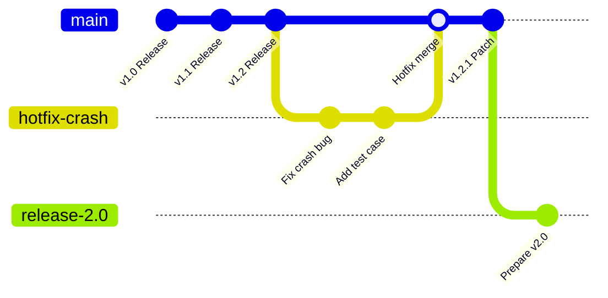

**Hotfix 场景详解**：

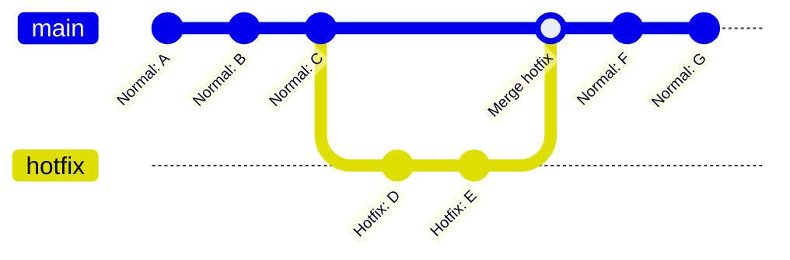

```bash
# 发现线上 Bug，立即修复
git checkout main
git pull
git checkout -b hotfix-crash-bug

# 修复 Bug
git add fix.go
git commit -m "fix: 修复登录崩溃问题"

# 立即合并到主分支
git checkout main
git merge hotfix-crash-bug

# 推送并打标签
git push origin main
git tag -a v1.2.1 -m "紧急修复"

# 同时合并回开发分支（如果需要）
git checkout develop
git merge hotfix-crash-bug

# 清理
git branch -d hotfix-crash-bug
```

---

#### 场景 3：多人协作开发

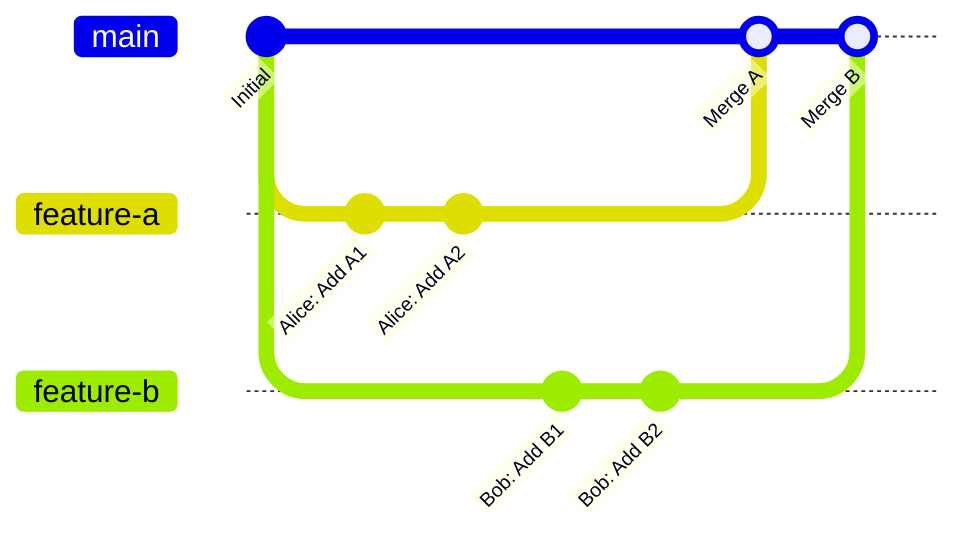

**协作冲突处理**：

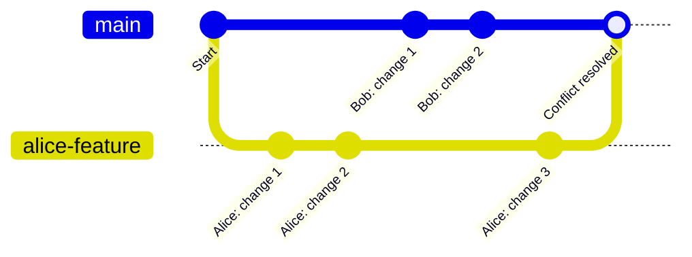

```bash
# Alice 的操作
git checkout -b alice-feature
git add file.txt
git commit -m "Alice: 添加功能A"

# Bob 同时在 main 上开发
git checkout main
git add file.txt
git commit -m "Bob: 添加功能B"

# Alice 准备合并前，先同步 Bob 的更改
git fetch origin
git merge origin/main
# 如果有冲突，解决后
git add file.txt
git commit -m "解决合并冲突"

# 合并 Alice 的功能
git merge alice-feature
```

---

#### 场景 4：代码回滚场景

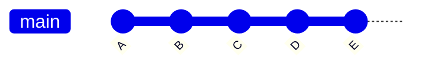

**场景 4.1：本地未推送，想撤销**


```bash
# 撤销最后一次提交（本地）
git reset --hard HEAD~1
git reset --hard abc123  # 回退到指定提交
```

**场景 4.2：已推送，想撤销（保留历史）**


```bash
# 撤销已推送的提交（创建新提交来撤销）
git revert HEAD
git revert abc123

# 推送到远程
git push origin main
```

**场景 4.3：撤销指定文件**


```bash
# 恢复单个文件到某个版本
git checkout abc123 -- filename.txt
git checkout HEAD~2 -- filename.txt
```

---

#### 场景 5：Git Flow 工作流

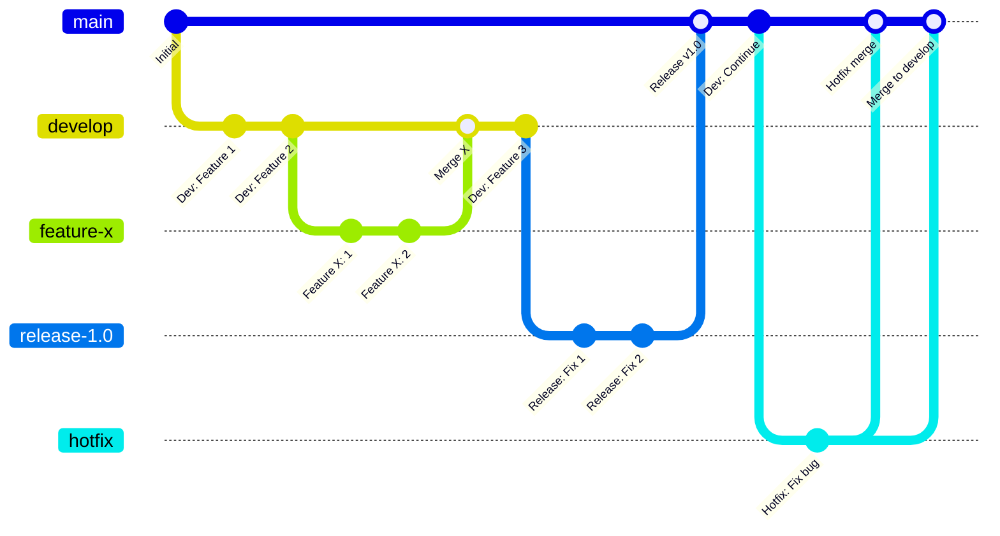

**Git Flow 详细命令**：

```bash
# 1. 初始化 Git Flow
git flow init

# 2. 开始新功能
git flow feature start login
# 开发...
git flow feature finish login

# 3. 准备发布
git flow release start v1.0.0
# 最后的修复...
git flow release finish v1.0.0

# 4. 紧急修复
git flow hotfix start bugfix
# 修复...
git flow hotfix finish bugfix
```

**手动实现 Git Flow**：

```bash
# Main 分支 - 生产代码
# Develop 分支 - 开发代码

# 创建开发分支
git checkout -b develop main

# 功能开发
git checkout -b feature-new develop
# 开发完成
git checkout develop
git merge --no-ff feature-new
git branch -d feature-new

# 发布准备
git checkout -b release-1.0 develop
# 修复版本号等
git checkout main
git merge --no-ff release-1.0
git tag -a v1.0.0 -m "Release v1.0"
git checkout develop
git merge --no-ff release-1.0
git branch -d release-1.0

# Hotfix
git checkout -b hotfix-1.0.1 main
# 修复后
git checkout main
git merge --no-ff hotfix-1.0.1
git tag -a v1.0.1 -m "Hotfix v1.0.1"
git checkout develop
git merge --no-ff hotfix-1.0.1
git branch -d hotfix-1.0.1
```

---

#### 场景 6：多仓库 Fork 协作

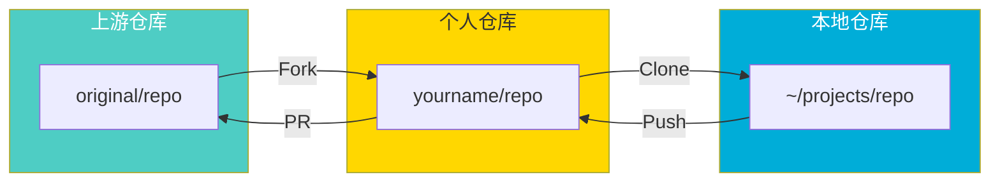

```bash
# 1. Fork 后克隆到本地
git clone git@github.com:yourname/repo.git
cd repo

# 2. 添加上游仓库
git remote add upstream git@github.com:original/repo.git

# 3. 同步上游代码
git fetch upstream
git checkout main
git merge upstream/main
git push origin main

# 4. 开发新功能
git checkout -b feature-new
# 开发并提交
git push origin feature-new

# 5. 在 GitHub 创建 Pull Request 到上游仓库

# 6. 上游更新后，同步到个人仓库
git fetch upstream
git checkout main
git merge upstream/main
git push origin main

# 7. 更新功能分支
git checkout feature-new
git merge main
```

---

#### 场景 7：交互式变基（Rebase）


```bash
# 变基前
# A --- B --- C --- D (feature)
#          \
#           E --- F (main)

# 切换到功能分支
git checkout feature

# 变基到 main
git rebase main

# 变基后
# A --- B --- E --- F (main)
#                \
#                 C' --- D' (feature)

# 推送到远程（需要强制推送）
git push --force-with-lease

# 在 main 上合并（可以快进合并）
git checkout main
git merge feature
```

**交互式变基**：

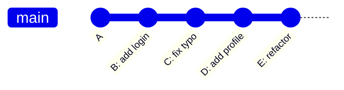

```bash
# 合并最后 4 个提交，修改提交信息
git rebase -i HEAD~4

# 交互式界面示例：
# pick B add login
# reword C fix typo      # 修改提交信息
# squash D add profile   # 合并到上一个提交
# drop E refactor        # 删除这个提交
```

---

#### 场景 8：Git Cherry-Pick

```mermaid
gitGraph
   commit id: "A"
   commit id: "B"
   commit id: "C"
   commit id: "D"
   commit id: "E"
   cherry-pick id: "Pick C"
   commit id: "F"
```

```bash
# Cherry-pick 单个提交
git cherry-pick abc123

# Cherry-pick 多个提交
git cherry-pick abc123 def456

# Cherry-pick 范围
git cherry-pick abc123..def456  # 不包含 abc123
git cherry-pick abc123^..def456 # 包含 abc123

# Cherry-pick 但不提交（用于解决冲突）
git cherry-pick -n abc123
```

---

### 3. 高级使用技巧

#### 3.1 工作区清洁

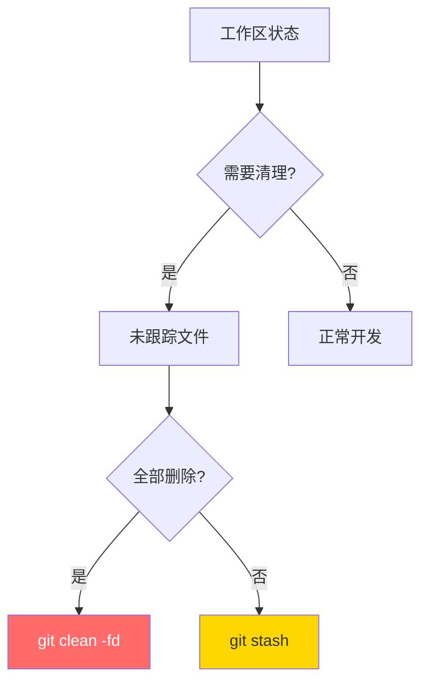

```bash
# 查看将被清理的文件（预览）
git clean -n

# 删除未跟踪文件
git clean -f        # 文件
git clean -fd       # 文件和目录
git clean -fdx      # 包括 .gitignore 中的文件

# 同时清理未跟踪和已暂存
git reset --hard
git clean -fd
```

#### 3.2 Submodule 子模块

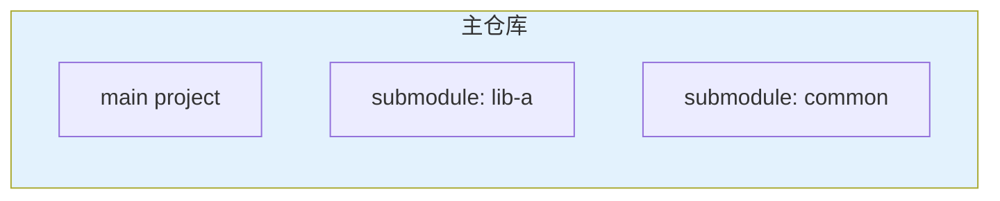

```bash
# 添加子模块
git submodule add https://github.com/user/repo.git libs/repo

# 克隆包含子模块的仓库
git clone --recurse-submodules main-repo.git

# 或者分步
git clone main-repo.git
git submodule init
git submodule update

# 更新子模块
cd libs/repo
git pull origin main
cd ../..
git add libs/repo
git commit -m "更新子模块"
```

#### 3.3 Git Bisect（二分查找 Bug）

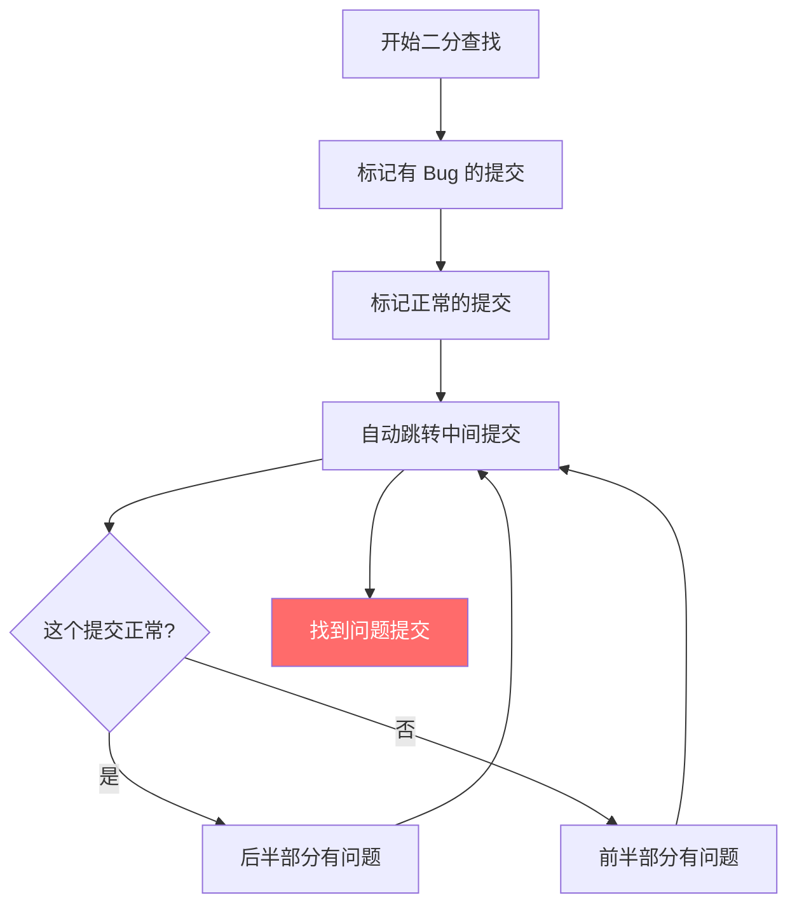

```bash
# 开始二分查找
git bisect start

# 标记当前版本有 Bug
git bisect bad

# 标记正常的版本
git bisect good v1.0.0

# Git 自动 checkout 中间版本
# 测试后标记
git bisect good  # 或 git bisect bad

# 重复直到找到
# Git 会输出问题提交

# 结束查找
git bisect reset
```

---

### 4. 常见问题解决方案

| 问题 | 解决方案 | 命令 |
|------|----------|------|
| 误删文件恢复 | reflog | `git reflog` → `git checkout HEAD@{x} -- file` |
| 合并冲突放弃 | abort | `git merge --abort` |
| 提交信息写错 | amend | `git commit --amend -m "新信息"` |
| 忘记加文件 | amend | `git add forgotten.txt` → `git commit --amend` |
| 误删分支恢复 | reflog | `git checkout -b branch-name HEAD@{x}` |
| 查看某行代码历史 | blame | `git blame filename.txt` |
| 大文件传错 | filter-branch | `git filter-branch --tree-filter 'rm file' HEAD` |

---

### 5. 最佳实践总结

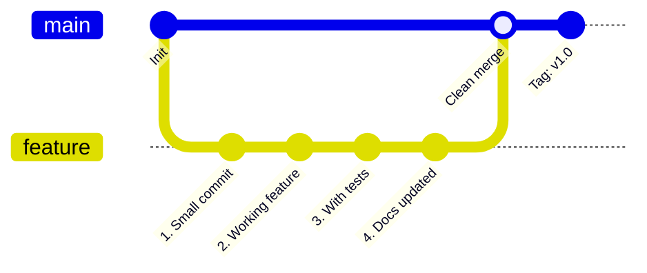

#### 提交信息规范（Conventional Commits）

```
<type>(<scope>): <subject>

feat: 添加用户登录功能
fix: 修复登录崩溃问题
docs: 更新 API 文档
style: 格式化代码
refactor: 重构登录模块
test: 添加登录测试
chore: 更新依赖
```

---

### 6. 参考链接

1. [Git Official Website](https://git-scm.com/) — 官方网站
2. [Pro Git Book](https://git-scm.com/book/en/v2) — 权威教程
3. [Oh Shit, Git!?!](https://ohshitgit.com/) — 常见问题解决
4. [GitHub Flow](https://docs.github.com/en/get-started/using-github/github-flow) — GitHub 工作流
5. [Git Flow](https://nvie.com/posts/a-successful-git-branching-model/) — 分支模型
6. [Conventional Commits](https://www.conventionalcommits.org/) — 提交规范

---

> 💡 **一句话总结**：Git 的核心是 **分支管理** + **提交历史**，掌握 `merge`、`rebase`、`cherry-pick` 等技巧，才能游刃有余地应对各种开发场景。

希望这篇带有 GitGraph 可视化的文章对您有所帮助！🎉