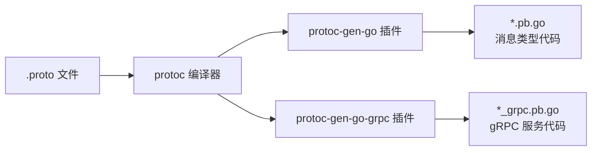
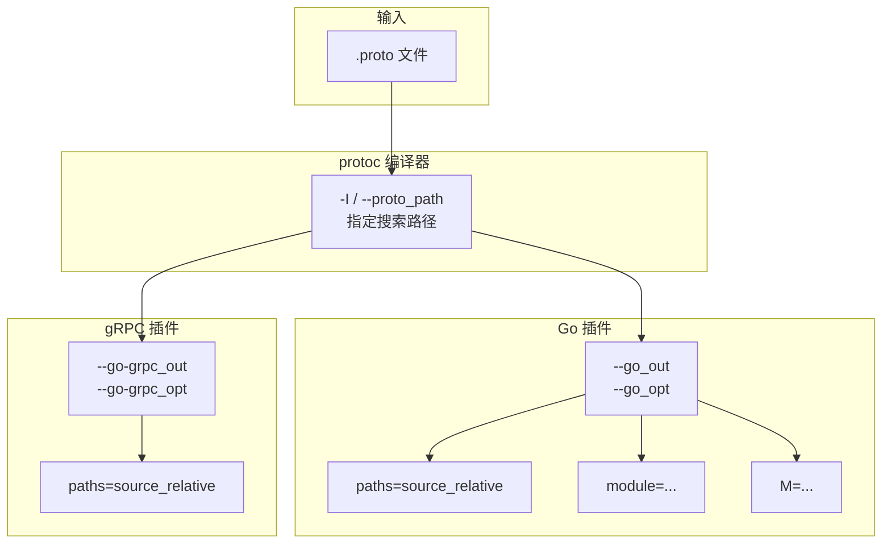

# gRPC 中常见的 protoc 命令行参数详解

## 1. 背景与概述

`protoc` 是 Protocol Buffers 的编译器，用于将 `.proto` 文件编译生成各种语言的代码。在 Go 语言中使用 gRPC 时，需要配合 `protoc-gen-go` 和 `protoc-gen-go-grpc` 插件来生成代码。

- 官方文档：[Protocol Buffers - Google Developers](https://protobuf.dev/)
- gRPC Go 快速开始：[gRPC Quick Start - Go](https://grpc.io/docs/languages/go/quickstart/)

---

## 2. protoc 命令基本结构



**基本命令格式：**

```bash
protoc [OPTIONS] FILE.proto
```

---

## 3. 核心参数详解

### 3.1 输入输出相关参数

| 参数 | 说明 |
|------|------|
| `--proto_path=PATH` / `-I PATH` | 指定 `.proto` 文件的搜索路径（可多次指定） |
| `--go_out=PATH` | Go 消息类型代码的输出目录 |
| `--go-grpc_out=PATH` | gRPC 服务端/客户端代码的输出目录 |
| `--descriptor_set_out=FILE` | 输出 `FileDescriptorSet` 到指定文件 |
| `-h` / `--help` | 显示帮助信息 |

### 3.2 Go 插件专用参数

通过 `--go_opt` 和 `--go-grpc_opt` 传递：

| 参数 | 说明 |
|------|------|
| `paths=source_relative` | 输出文件路径相对于 `.proto` 源文件（而非 go_package） |
| `module=example.com/module` | 指定模块前缀，输出路径会去掉此前缀 |
| `M=foo.proto=example.com/bar` | 覆盖特定 `.proto` 文件的 Go 包路径映射 |

### 3.3 descriptor 相关参数

| 参数 | 说明 |
|------|------|
| `--include_imports` | 在 descriptor set 中包含所有导入的文件 |
| `--include_source_info` | 包含源代码位置信息（用于调试、文档生成等） |

---

## 4. 常用命令示例

### 4.1 最简命令（单文件）

```bash
protoc --go_out=. --go-grpc_out=. hello.proto
```

### 4.2 指定搜索路径与输出目录

```bash
protoc \
  -I=./proto \
  --go_out=./output \
  --go-grpc_out=./output \
  ./proto/hello.proto
```

### 4.3 使用 `paths=source_relative`

```bash
protoc \
  --go_out=. --go_opt=paths=source_relative \
  --go-grpc_out=. --go-grpc_opt=paths=source_relative \
  hello.proto
```

> 这样生成的 `hello.pb.go` 会直接在当前目录，而不是按 `go_package` 路径创建子目录。

### 4.4 批量编译（使用 find）

```bash
find ./proto -name "*.proto" | xargs protoc \
  -I=./proto \
  --go_out=./output --go_opt=paths=source_relative \
  --go-grpc_out=./output --go-grpc_opt=paths=source_relative
```

### 4.5 生成 FileDescriptorSet（用于反射、网关等）

```bash
protoc \
  -I=./proto \
  --include_imports \
  --include_source_info \
  --descriptor_set_out=./output/hello.pb \
  ./proto/hello.proto
```

---

## 5. 参数传递流程图



---

## 6. .proto 文件中的关键声明

在 `.proto` 文件中，以下声明会影响生成代码的包路径：

```protobuf
syntax = "proto3";

package myservice;                    // 逻辑包名
option go_package = "example.com/myservice";  // Go 包导入路径
```

- `go_package` 决定了生成代码的 Go import 路径
- 若未设置 `paths=source_relative`，输出目录会按 `go_package` 创建

---

## 7. 常见问题与解决方案

| 问题 | 原因 | 解决方案 |
|------|------|----------|
| `protoc-gen-go: program not found` | 未安装插件 | `go install google.golang.org/protobuf/cmd/protoc-gen-go@latest` |
| `protoc-gen-go-grpc: program not found` | 未安装 gRPC 插件 | `go install google.golang.org/grpc/cmd/protoc-gen-go-grpc@latest` |
| 输出目录层级混乱 | `go_package` 与 `--go_out` 配合不当 | 使用 `paths=source_relative` 或调整 `go_package` |
| import 路径错误 | 多 proto 文件包映射问题 | 使用 `M` 参数显式指定映射 |

---

## 8. 完整 Makefile 示例

```makefile
.PHONY: proto

PROTO_DIR := ./proto
OUTPUT_DIR := ./internal/pb

proto:
	protoc \
		-I=$(PROTO_DIR) \
		--go_out=$(OUTPUT_DIR) --go_opt=paths=source_relative \
		--go-grpc_out=$(OUTPUT_DIR) --go-grpc_opt=paths=source_relative \
		$(PROTO_DIR)/**/*.proto
```

---

## 9. 参考链接

1. [Protocol Buffers 官方文档](https://protobuf.dev/) — Google 官方 Protobuf 文档
2. [gRPC Go Quick Start](https://grpc.io/docs/languages/go/quickstart/) — gRPC 官方 Go 快速入门
3. [protoc-gen-go GitHub](https://github.com/protocolbuffers/protobuf-go) — Go Protobuf 运行时与编译器插件
4. [protoc-gen-go-grpc GitHub](https://github.com/grpc/grpc-go) — gRPC Go 官方仓库
5. [Buf CLI](https://buf.build/) — 现代化的 Protobuf 工具链（可作为 protoc 替代方案）

---

> [!tip] 提示
> 如果你使用较新版本的 `protoc-gen-go`（v1.20+），建议配合 `google.golang.org/grpc/cmd/protoc-gen-go-grpc` 使用，旧版 `github.com/golang/protobuf` 已不再维护。