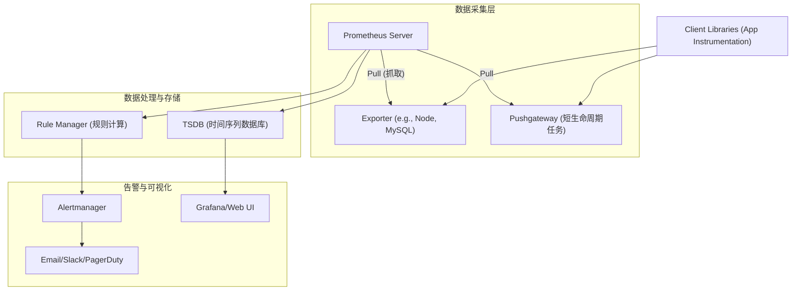

# Prometheus 详解：云原生时代的监控利器

Prometheus 是一个开源的系统监控和告警工具包，最初由 SoundCloud 构建。自 2016 年加入云原生计算基金会（CNCF）以来，它已成为继 Kubernetes 之后第二个毕业的项目，是云原生监控领域的事实标准。

---

### 1. 背景与定义

Prometheus 是一个多维数据模型，通过指标名称和键值对（Labels）来标识时间序列数据。它不依赖分布式存储，单节点即可具有自主性，并通过 HTTP 上的“拉取”模型进行时间序列收集。

- **核心定义**：开源监控和告警工具包。
- **所属组织**：CNCF (云原生计算基金会)。
- **主要特点**：多维数据模型、PromQL 查询语言、独立部署、不依赖分布式存储。

> 来源：[Prometheus 官方文档](https://prometheus.io/docs/introduction/overview/)

---

### 2. 核心架构与工作原理

Prometheus 的架构设计非常清晰，主要包含 Prometheus Server、Exporter、Pushgateway、Alertmanager 和 Web UI 等组件。

#### 架构图解



#### 关键组件说明

| 组件 | 功能描述 |
| :--- | :--- |
| **Prometheus Server** | 核心服务，负责抓取、存储和查询数据。 |
| **Exporters** | 专门用于将现有服务或系统的指标暴露给 Prometheus 的工具（如 `node_exporter`）。 |
| **Pushgateway** | 用于接收短生命周期作业推送的指标，随后由 Prometheus 拉取。 |
| **Alertmanager** | 处理来自 Prometheus 的告警，进行去重、分组和路由发送。 |
| **Client Libraries** | 嵌入应用程序代码中，用于生成指标（如 Go client）。 |

---

### 3. 数据模型与指标类型

Prometheus 存储的是**时间序列数据**（Time Series），由指标名称和一组键值对唯一标识。

#### 指标类型

Prometheus 客户端库主要支持四种指标类型：

1.  **Counter (计数器)**：只增不减的累积值，用于记录请求总数、错误数等。
2.  **Gauge (仪表盘)**：可增可减的瞬时值，用于记录温度、内存使用量等。
3.  **Histogram (直方图)**：对观测值进行采样并统计分布（如请求延迟）。
4.  **Summary (摘要)**：类似 Histogram，但在客户端计算分位数。

#### PromQL 示例

- **查询 HTTP 请求速率 (QPS)**：
  ```promql
  rate(http_requests_total[5m])
  ```
- **按状态码分组**：
  ```promql
  sum by (status) (http_requests_total)
  ```

---

### 4. 最新进展与趋势

根据 2023-2024 年的更新，Prometheus 正在向更好的可扩展性、OTLP 支持和 Agent 模式发展。

1.  **原生 Histograms (Native Histograms)**：
    在 v2.40+ 版本中引入，这是一种新的数据类型，比传统 Histogram 更高效，能大幅降低基数问题带来的存储压力。
    - 参考：[Native Histograms in Prometheus](https://www.robustperception.io/native-histograms-in-prometheus)

2.  **Agent Mode (Agent 模式)**：
    Prometheus Agent 专为“仅抓取和远程写入”设计，不存储本地数据，适合边缘端或大规模分布式采集场景。
    - 参考：[Prometheus Agent Mode](https://prometheus.io/docs/concepts/query_api/)

3.  **OpenTelemetry (OTel) 集成**：
    Prometheus 正在积极支持 OTLP (OpenTelemetry Protocol) 格式的数据接收，打通了与 OpenTelemetry 的生态壁垒。
    - 参考：[OTLP in Prometheus](https://prometheus.io/docs/guides/opentelemetry/)

---

### 5. 在 Go 语言中的使用建议

鉴于你的笔记标题是“go中使用prometheus”，这里简要介绍如何在 Go 项目中集成。

#### 步骤流程


#### 核心代码片段

```go
package main

import (
    "net/http"
    "github.com/prometheus/client_golang/prometheus"
    "github.com/prometheus/client_golang/prometheus/promhttp"
)

var (
    // 定义一个 Counter 指标
    opsProcessed = prometheus.NewCounter(prometheus.CounterOpts{
        Name: "myapp_processed_ops_total",
        Help: "The total number of processed events",
    })
)

func init() {
    // 注册指标
    prometheus.MustRegister(opsProcessed)
}

func main() {
    http.Handle("/metrics", promhttp.Handler())
    http.ListenAndServe(":2112", nil)
}
```

> **最佳实践**：
> - 避免使用高基数标签（如 User ID、Email），这会导致数据库爆炸。
> - 使用 `Histogram` 而非 `Summary` 以便在服务端聚合。

---

### 6. 总结与应用建议

Prometheus 凭借其强大的多维数据模型和 PromQL，成为了微服务和容器监控的首选。

- **适用场景**：Kubernetes 集群监控、微服务性能监控、网络设备监控。
- **局限性**：不适合做精细的日志分析（Logs）或链路追踪，通常需要配合 Loki 和 Tempo 使用。
- **存储建议**：长期存储建议对接 Thanos 或 VictoriaMetrics。

---

### 7. 参考链接

1. [Prometheus 官方文档](https://prometheus.io/docs/introduction/overview/) — 权威的配置与概念说明
2. [Prometheus GitHub 仓库](https://github.com/prometheus/prometheus) — 源码与 Release Notes
3. [client_golang GitHub](https://github.com/prometheus/client_golang) — Go 语言客户端库
4. [Awesome Prometheus Alerts](https://samber.github.io/awesome-prometheus-alerts/) — 常用告警规则集合