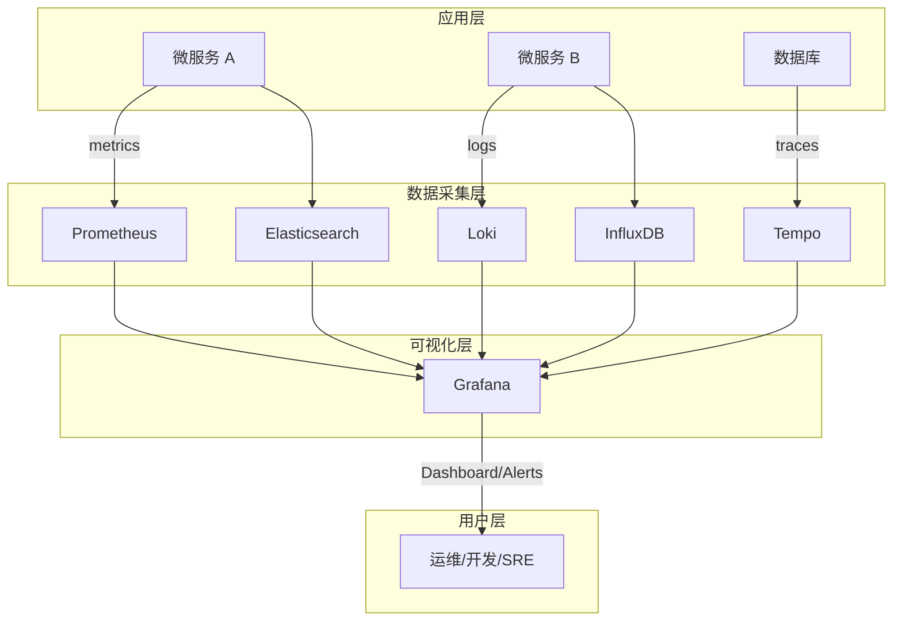
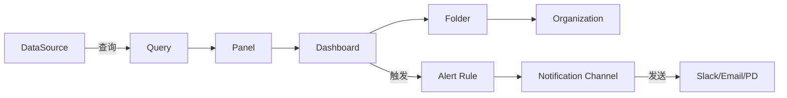
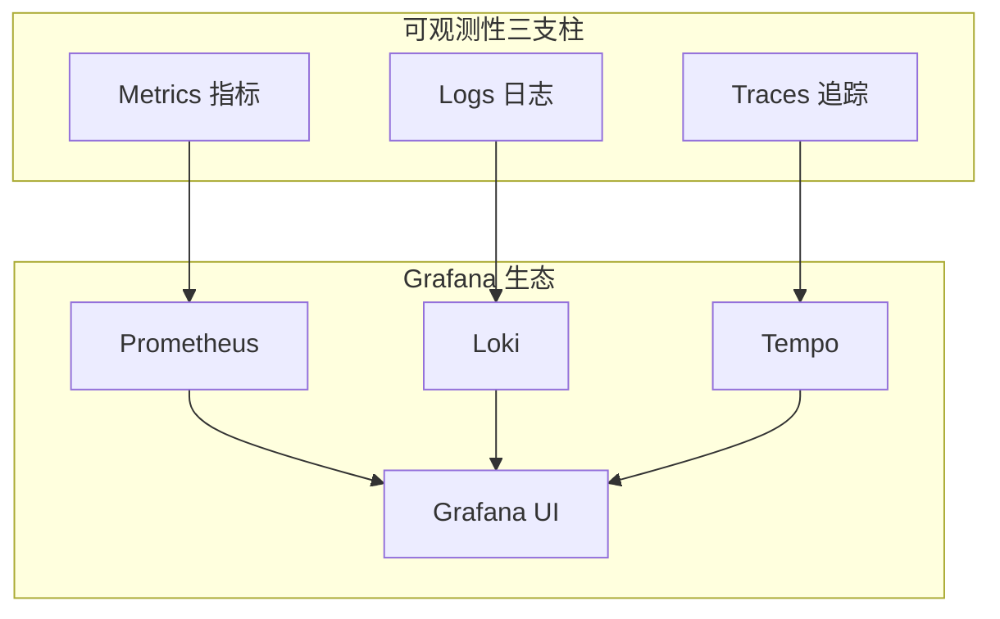
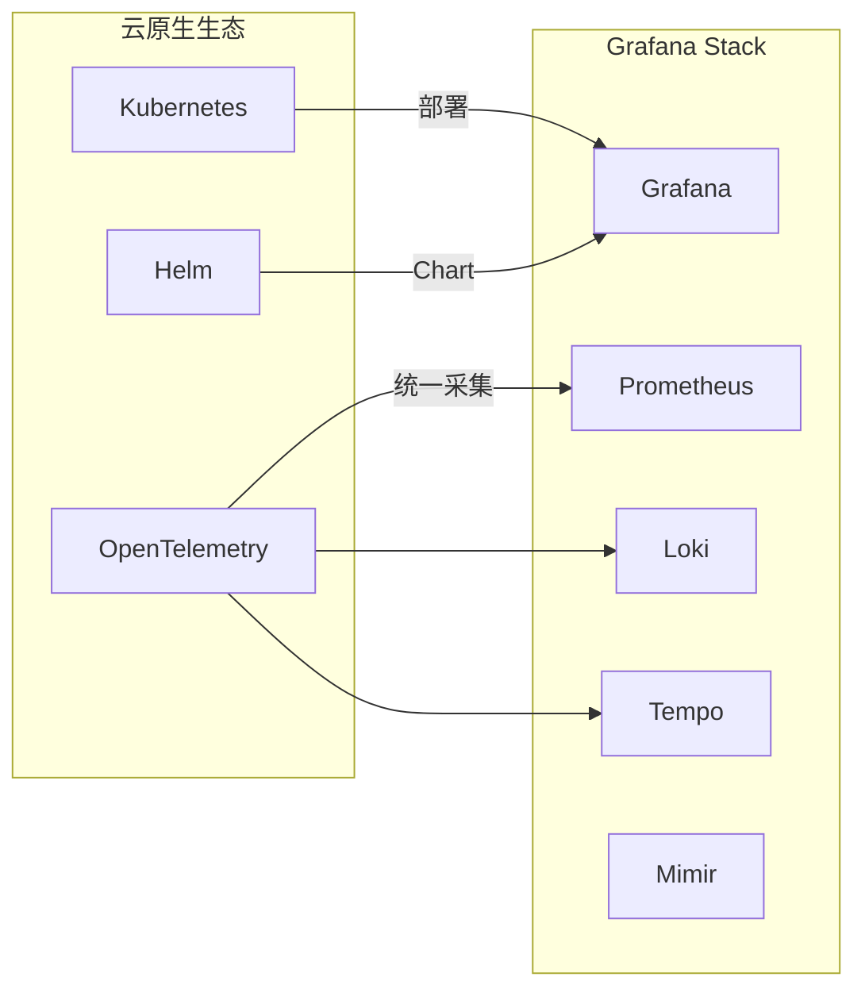

## 1. 背景与定义

**Grafana** 是一个开源的数据可视化和监控平台，由 Grafana Labs 开发维护。它能够将来自多种数据源的指标数据转化为直观的图表、仪表盘和告警，广泛应用于 DevOps、可观测性领域。

- 官方定义：Grafana 是"open source analytics & interactive visualization"（开源分析与交互式可视化）工具
- 首次发布：2014 年
- 核心价值：统一多数据源、实时监控、告警管理

> 参考：[Grafana Official Documentation](https://grafana.com/docs/grafana/latest/introduction/)（Grafana Labs，持续更新）

---

## 2. Grafana 在软件架构中的位置

Grafana 位于**可观测性技术栈的展示层**，是整个监控体系面向用户的"最后一公里"。

### 2.1 技术栈定位

| 层级 | 组件示例 | Grafana 的角色 |
| --- | --- | --- |
| 数据源 | Prometheus, Loki, Tempo, InfluxDB, MySQL, CloudWatch | **消费者**：查询并聚合数据 |
| 可视化层 | Grafana, Kibana, Datadog | **核心**：渲染图表、仪表盘 |
| 告警层 | Alertmanager, PagerDuty | **集成者**：内置告警规则与通知 |
| 用户层 | 运维、开发、业务人员 | **入口**：统一查询界面 |

---

## 3. 核心概念与功能

### 3.1 核心实体关系

### 3.2 关键组件说明

- **DataSource（数据源）**：Grafana 支持的存储后端，如 Prometheus、Loki、Elasticsearch、PostgreSQL 等
- **Dashboard（仪表盘）**：由多个 Panel 组成的可视化页面
- **Panel（面板）**：单个图表/指标展示单元
- **Alert Rule（告警规则）**：基于查询条件的阈值告警
- **Notification Channel（通知渠道）**：告警发送目标（Slack、Email、PagerDuty、Webhook 等）

---

## 4. Grafana 在现代可观测性中的三大支柱

| 支柱 | 数据源 | 典型用途 |
| --- | --- |
| Metrics | Prometheus, InfluxDB, Graphite | CPU/内存使用率、请求 QPS、延迟分布 |
| Logs | Loki, Elasticsearch | 错误日志、审计日志、调试信息 |
| Traces | Tempo, Jaeger, Zipkin | 分布式调用链、服务依赖分析 |

> 参考：[Grafana - What is Observability](https://grafana.com/blog/2022/10/11/what-is-observability-meaning-and-definition/)（Grafana Blog，2022）

---

## 5. 最新进展与趋势（2024-2025）

### 5.1 Grafana 11+ 重大更新

- **Grafana 11（2024）**：引入新的 Scene library，支持动态仪表盘构建
- **Grafana 12（2025）**：增强 AI/ML 异常检测集成、改进 Alerting 体验
- **Grafana Cloud**：SaaS 版本持续扩展，支持更广泛的托管数据源

> 参考：[Grafana 11 Release Notes](https://grafana.com/docs/grafana/latest/release-notes/)（Grafana Labs，2024）

### 5.2 生态整合趋势

- **OpenTelemetry 集成**：Grafana 生态全面支持 OTLP 协议
- **Kubernetes 原生**：通过 Helm Chart、Operator 简化部署
- **Grafana Mimir**：开源高性能 Prometheus 长期存储后端

> 参考：[Grafana Mimir Documentation](https://grafana.com/docs/mimir/latest/)（Grafana Labs）

---

## 6. 专业总结与应用建议

### 6.1 总结要点

1. **定位**：Grafana 是可观测性技术栈的**可视化与告警中心**，不产生数据，而是聚合展示
2. **核心价值**：统一多数据源、降低工具碎片化、提供一致的用户体验
3. **生态地位**：与 Prometheus、Loki、Tempo 组成"PLG Stack"，是云原生监控的事实标准

### 6.2 实际应用建议

| 场景 | 推荐配置 |
| --- | --- |
| 小型团队 | Grafana + Prometheus（单机部署） |
| 中型团队 | Grafana + Prometheus + Loki（日志聚合） |
| 大型企业 | Grafana Cloud 或 PLG Stack + Tempo（全链路追踪） |
| Kubernetes 环境 | 使用 Helm Chart 或 Grafana Operator 部署 |

---

## 7. 参考链接

1. [Grafana Official Documentation](https://grafana.com/docs/grafana/latest/introduction/) — 官方文档入口
2. [Grafana - What is Observability](https://grafana.com/blog/2022/10/11/what-is-observability-meaning-and-definition/) — 可观测性概念解释
3. [Grafana 11 Release Notes](https://grafana.com/docs/grafana/latest/release-notes/) — 版本更新说明
4. [Grafana Mimir Documentation](https://grafana.com/docs/mimir/latest/) — Mimir 存储后端文档
5. [Grafana Labs GitHub](https://github.com/grafana/grafana) — 开源代码仓库

---

如果你需要，我可以进一步帮你补充：
- Grafana 与 Kibana 的对比
- 如何在你的项目中快速搭建 PLG Stack
- 具体的 Dashboard 配置示例