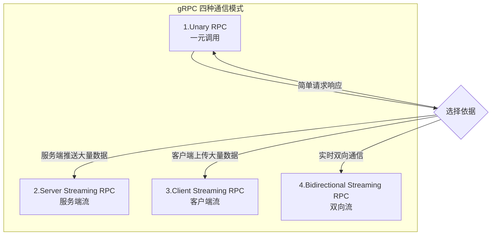
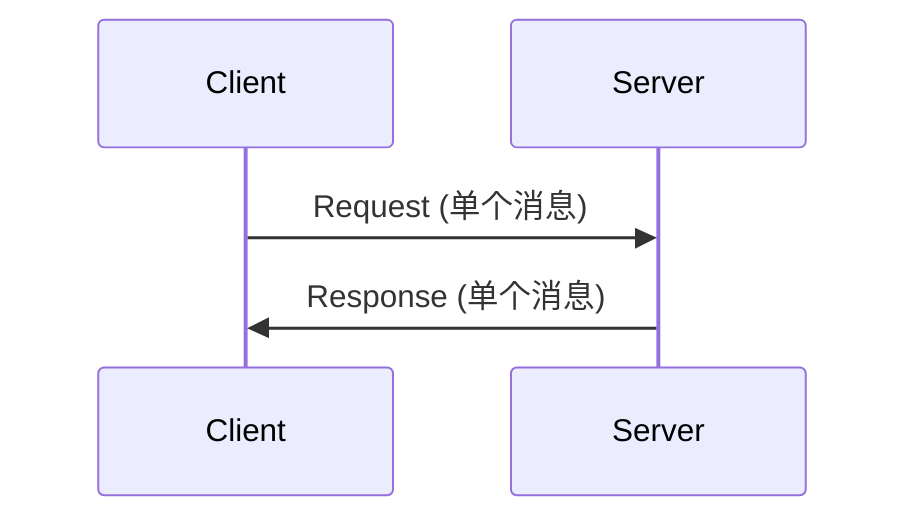
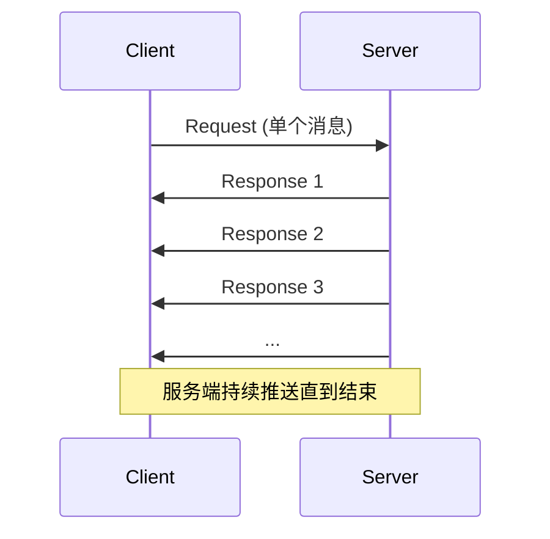
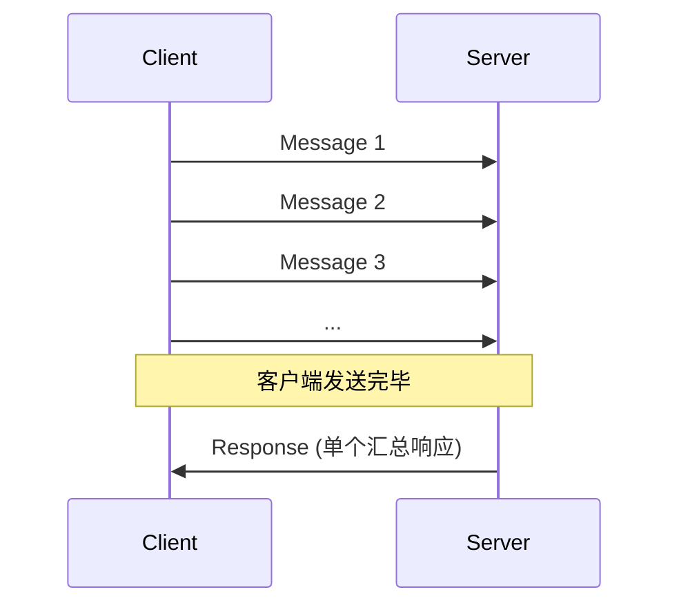
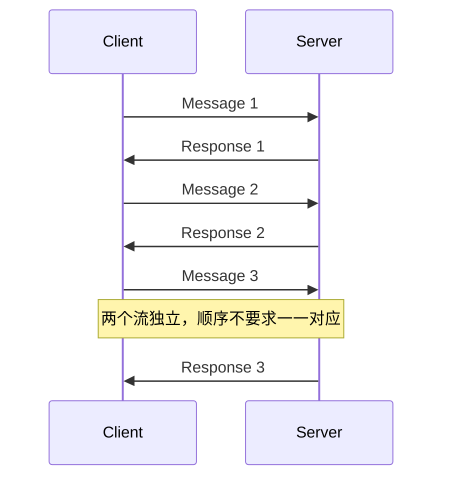
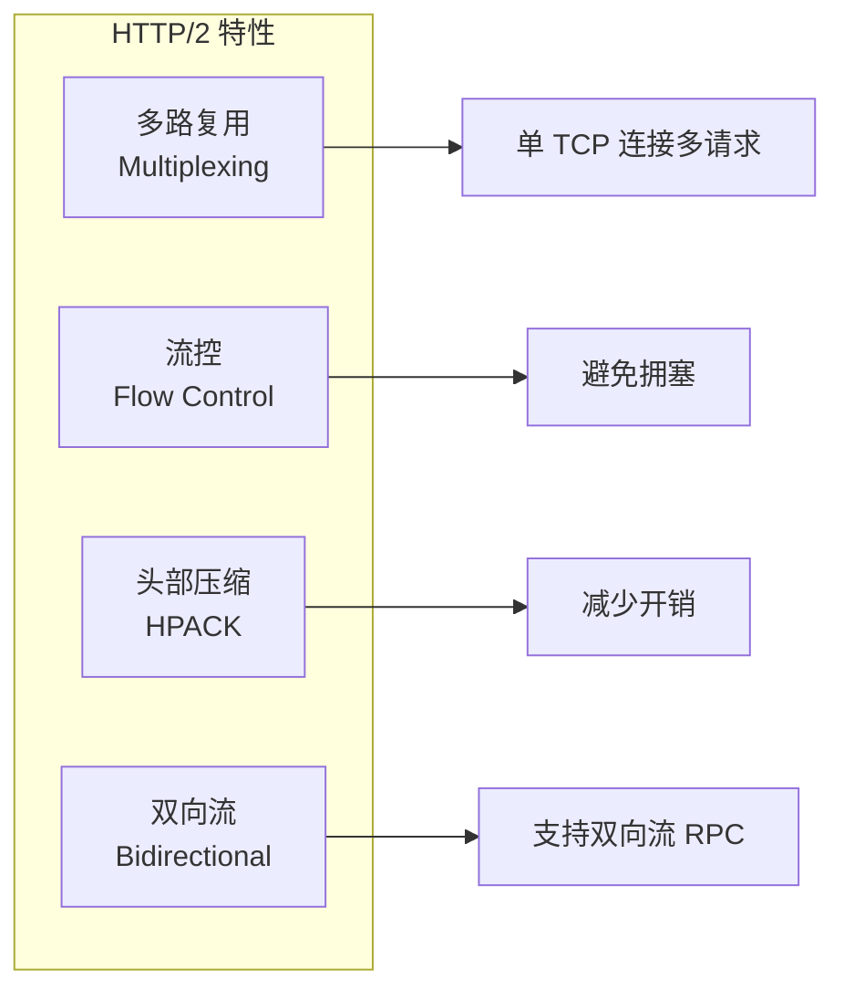

# gRPC 四种 Stream 传输方式详解

## 1. 背景与定义

gRPC 是 Google 开源的高性能 RPC 框架，基于 **HTTP/2** 协议和 **Protocol Buffers** 序列化。其核心优势之一就是支持四种不同的通信模式，满足各种业务场景需求。

> **HTTP/2 的多路复用和流控机制是 gRPC Stream 的底层支撑。**

- 参考定义：[gRPC 官方文档 – Concepts](https://grpc.io/docs/what-is-grpc/core-concepts/)

---

## 2. 四种传输模式概览



---

## 3. 详细解析

### 3.1 Unary RPC（一元调用）

**定义**：最传统的模式，客户端发送**一个请求**，服务端返回**一个响应**。



**特点**：
- 类似传统 HTTP REST API
- 同步阻塞或异步调用
- 最简单、最常用

**Proto 定义示例**：
```protobuf
rpc GetUser(GetUserRequest) returns (UserResponse);
```

**适用场景**：
- 简单的 CRUD 操作
- 请求数据量小、响应快速的场景

---

### 3.2 Server Streaming RPC（服务端流式 RPC）

**定义**：客户端发送**一个请求**，服务端返回**一个消息流**（多个响应）。



**特点**：
- 服务端可以分批发送大量数据
- 客户端按顺序读取流
- 利用 HTTP/2 流控避免拥塞

**Proto 定义示例**：
```protobuf
rpc ListFeatures(Rectangle) returns (stream Feature);
```

**适用场景**：
- 大数据集分批返回（如日志查询、历史记录）
- 服务端实时推送（如股票行情、通知推送）
- 文件下载

**代码示例**：
```go
// Server
func (s *server) ListFeatures(req *pb.Rectangle, stream pb.RouteGuide_ListFeaturesServer) error {
    for _, feature := range features {
        if inRange(feature.Location, req) {
            stream.Send(feature) // 逐个发送
        }
    }
    return nil
}

// Client
stream, _ := client.ListFeatures(ctx, rect)
for {
    feature, err := stream.Recv()
    if err == io.EOF {
        break // 流结束
    }
    // 处理 feature
}
```

---

### 3.3 Client Streaming RPC（客户端流式 RPC）

**定义**：客户端发送**一个消息流**，服务端返回**一个响应**。



**特点**：
- 客户端可以分批上传数据
- 服务端在收到所有数据后处理并返回结果
- 适合大数据上传场景

**Proto 定义示例**：
```protobuf
rpc RecordRoute(stream Point) returns (RouteSummary);
```

**适用场景**：
- 文件上传
- 批量数据提交
- 聚合计算（如上传多个数据点，返回统计结果）

**代码示例**：
```go
// Client
stream, _ := client.RecordRoute(ctx)
for _, point := range points {
    stream.Send(point) // 逐个发送
}
summary, _ := stream.CloseAndRecv() // 关闭流并接收响应

// Server
func (s *server) RecordRoute(stream pb.RouteGuide_RecordRouteServer) error {
    var pointCount int32
    for {
        point, err := stream.Recv()
        if err == io.EOF {
            return stream.SendAndClose(&pb.RouteSummary{PointCount: pointCount})
        }
        pointCount++
    }
}
```

---

### 3.4 Bidirectional Streaming RPC（双向流式 RPC）

**定义**：客户端和服务端**同时**发送消息流，两个流独立运行。



**特点**：
- 全双工通信
- 两个流相互独立，可以交错发送
- 最灵活但也最复杂

**Proto 定义示例**：
```protobuf
rpc RouteChat(stream RouteNote) returns (stream RouteNote);
```

**适用场景**：
- 实时聊天应用
- 多人游戏同步
- 实时协作编辑
- IoT 设备双向通信

**代码示例**：
```go
// Client
stream, _ := client.RouteChat(ctx)
waitc := make(chan struct{})

// 接收协程
go func() {
    for {
        note, err := stream.Recv()
        if err == io.EOF {
            close(waitc)
            return
        }
        // 处理收到的消息
    }
}()

// 发送
for _, note := range notes {
    stream.Send(note)
}
stream.CloseSend()
<-waitc
```

---

## 4. 四种模式对比

| 特性 | Unary | Server Streaming | Client Streaming | Bidirectional Streaming |
|------|-------|------------------|------------------|-------------------------|
| 请求数量 | 1 | 1 | N (流) | N (流) |
| 响应数量 | 1 | N (流) | 1 | N (流) |
| 通信方向 | 单向 | 单向 → | 单向 ← | 双向 ↔ |
| 复杂度 | 低 | 中 | 中 | 高 |
| 典型场景 | CRUD | 推送/下载 | 上传/聚合 | 实时通信 |

---

## 5. 底层原理：HTTP/2 Stream

gRPC 的流式传输依赖 HTTP/2 的特性：



每个 gRPC Stream 对应一个 HTTP/2 Stream，通过 **Stream ID** 标识，可以在同一 TCP 连接上并行传输。

---

## 6. 最佳实践与注意事项

1. **流控管理**：注意 HTTP/2 默认流控窗口，大数据传输时可能需要调整
2. **错误处理**：流式调用需要正确处理 `io.EOF` 和其他错误
3. **超时设置**：长时间运行的流需要合理设置 Deadline
4. **资源释放**：确保流正确关闭，避免资源泄漏
5. **顺序保证**：单个流内消息顺序保证，但多个流之间无序

---

## 7. 参考链接

1. [gRPC 官方文档 – Core Concepts](https://grpc.io/docs/what-is-grpc/core-concepts/) — gRPC 官方核心概念说明
2. [gRPC 官方 – Streaming Best Practices](https://grpc.io/docs/guides/performance/) — 性能与最佳实践指南
3. [Protocol Buffers 官方文档](https://protobuf.dev/programming-guides/) — Proto3 语法参考
4. [HTTP/2 RFC 7540](https://datatracker.ietf.org/doc/html/rfc7540) — HTTP/2 协议规范
5. [gRPC GitHub 仓库](https://github.com/grpc/grpc) — 源码与示例