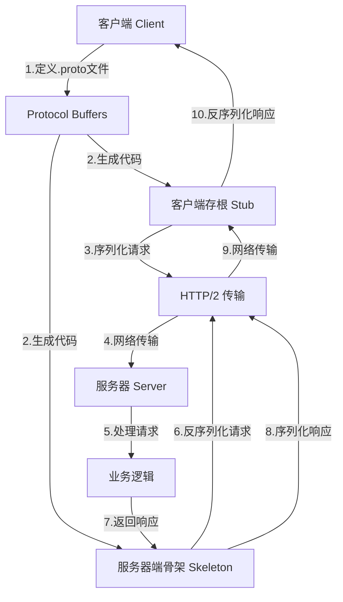
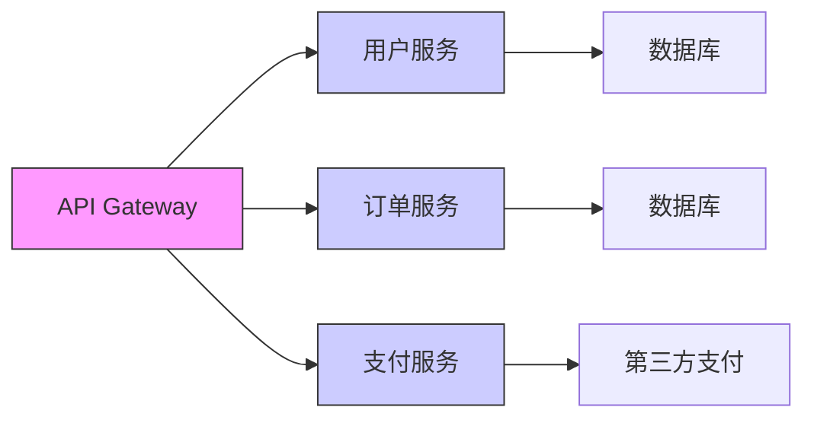

>[!summary] 前情提要


我来为您详细介绍计算机科学中的 gRPC。

## 什么是 gRPC？

gRPC（gRPC Remote Procedure Calls）是一个高性能、开源的远程过程调用（RPC）框架，最初由 Google 开发。它基于 HTTP/2 协议，使用 Protocol Buffers（protobuf）作为接口定义语言（IDL）和消息序列化格式。

## 核心特性

### 1. **基于 HTTP/2**
- 多路复用：单个连接上同时处理多个请求
- 头部压缩：减少网络开销
- 双向流：支持客户端和服务器之间的双向数据流
- 服务器推送：服务器可以主动向客户端推送数据

### 2. **Protocol Buffers**
- 高效的数据序列化格式
- 跨语言支持
- 自动生成客户端和服务端代码
- 向后兼容的版本控制

### 3. **多语言支持**
gRPC 支持多种编程语言，包括：
- C++, C#, Java, Python, Go, Ruby, Node.js, PHP, Dart, Swift 等

## gRPC 架构



## gRPC 通信模式

### 1. **一元 RPC（Unary RPC）**
最简单的请求-响应模式：
```protobuf
rpc SayHello(HelloRequest) returns (HelloResponse);
```

### 2. **服务器流式 RPC（Server Streaming RPC）**
客户端发送一个请求，服务器返回一个流：
```protobuf
rpc LotsOfReplies(HelloRequest) returns (stream HelloResponse);
```

### 3. **客户端流式 RPC（Client Streaming RPC）**
客户端发送一个流，服务器返回一个响应：
```protobuf
rpc LotsOfGreetings(stream HelloRequest) returns (HelloResponse);
```

### 4. **双向流式 RPC（Bidirectional Streaming RPC）**
双方都发送一个流：
```protobuf
rpc BidiHello(stream HelloRequest) returns (stream HelloResponse);
```

## Protocol Buffers 示例

```protobuf
syntax = "proto3";

package example;

// 服务定义
service Greeter {
  rpc SayHello (HelloRequest) returns (HelloResponse);
  rpc StreamMessages (stream Message) returns (stream Message);
}

// 消息定义
message HelloRequest {
  string name = 1;
  int32 age = 2;
}

message HelloResponse {
  string greeting = 1;
  int64 timestamp = 2;
}

message Message {
  string content = 1;
  string sender = 2;
}
```

## 性能优势

| 特性 | gRPC | REST/JSON | 优势 |
|------|------|-----------|------|
| 序列化格式 | Protocol Buffers | JSON | 更小、更快 |
| 传输协议 | HTTP/2 | HTTP/1.1 | 多路复用、头部压缩 |
| 连接管理 | 长连接 | 短连接 | 减少握手开销 |
| 流式支持 | 原生支持 | 有限支持 | 实时数据传输 |

## 实际应用场景

### 1. **微服务通信**


### 2. **移动应用后端**
- 低延迟通信
- 减少数据流量
- 更好的电池寿命

### 3. **物联网（IoT）**
- 高效的设备通信
- 实时数据流
- 低带宽消耗

### 4. **云原生应用**
- Kubernetes 服务间通信
- Service Mesh（如 Istio）
- 云函数间调用

## 安装和配置

### 基本安装步骤：
1. **安装 Protocol Buffers 编译器**
   ```bash
   # Ubuntu/Debian
   sudo apt-get install protobuf-compiler
   
   # macOS
   brew install protobuf
   ```

2. **安装 gRPC 工具**
   ```bash
   # Python
   pip install grpcio grpcio-tools
   
   # Go
   go get google.golang.org/grpc
   ```

3. **生成代码**
   ```bash
   # Python
   python -m grpc_tools.protoc -I. --python_out=. --grpc_python_out=. your_service.proto
   
   # Go
   protoc --go_out=. --go-grpc_out=. your_service.proto
   ```

## 最佳实践

### 1. **错误处理**
```protobuf
message Error {
  int32 code = 1;
  string message = 2;
  google.protobuf.Any details = 3;
}
```

### 2. **超时设置**
```python
# Python 示例
with grpc.insecure_channel('localhost:50051') as channel:
    stub = helloworld_pb2_grpc.GreeterStub(channel)
    response = stub.SayHello(
        helloworld_pb2.HelloRequest(name='you'),
        timeout=10  # 10秒超时
    )
```

### 3. **拦截器（Interceptors）**
- 认证和授权
- 日志记录
- 监控和指标收集
- 重试机制

### 4. **负载均衡**
- 客户端负载均衡
- 服务发现集成
- 健康检查

## 生态系统和工具

### 1. **gRPC Gateway**
- 将 gRPC 服务暴露为 RESTful API
- 自动生成 Swagger/OpenAPI 文档

### 2. **gRPC-Web**
- 在浏览器中使用 gRPC
- 通过代理支持 HTTP/1.1

### 3. **监控和追踪**
- OpenTelemetry 集成
- Prometheus 指标
- Jaeger 分布式追踪

## 最新发展（2024年）

根据最新信息，gRPC 在以下方面有重要更新：

1. **gRPC 1.60+ 版本**：
   - 改进的负载均衡算法
   - 更好的 HTTP/3 支持
   - 增强的安全特性

2. **性能优化**：
   - 零拷贝序列化
   - 改进的连接池管理
   - 更高效的内存使用

3. **云原生集成**：
   - 更好的 Kubernetes 支持
   - Service Mesh 深度集成
   - 云函数优化

## 学习资源

1. **官方文档**：[gRPC 官方文档](https://grpc.io/docs/)
2. **GitHub 仓库**：[grpc/grpc](https://github.com/grpc/grpc)
3. **教程和示例**：[gRPC 示例代码](https://github.com/grpc/grpc/tree/master/examples)
4. **Protocol Buffers 指南**：[Protocol Buffers 文档](https://developers.google.com/protocol-buffers)

## 总结

gRPC 作为现代分布式系统的通信框架，提供了：
- **高性能**：基于 HTTP/2 和 Protocol Buffers
- **跨语言**：支持多种编程语言
- **类型安全**：通过 .proto 文件定义接口
- **流式支持**：四种通信模式满足不同需求
- **生态系统完善**：丰富的工具和库支持

