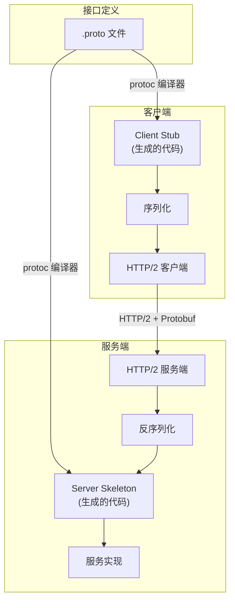
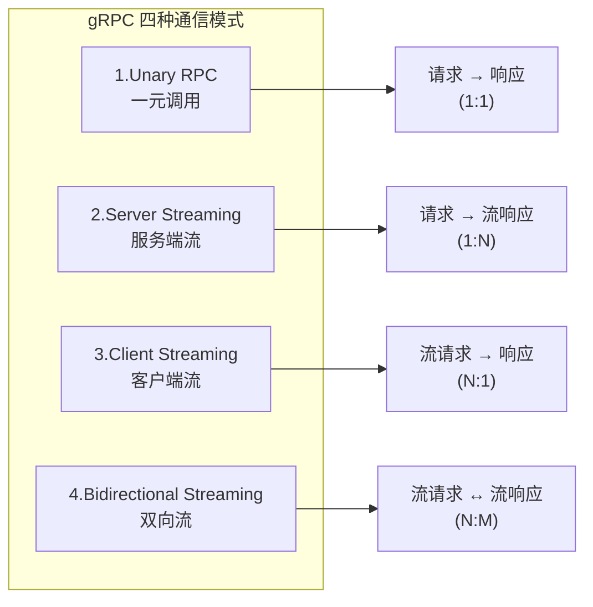
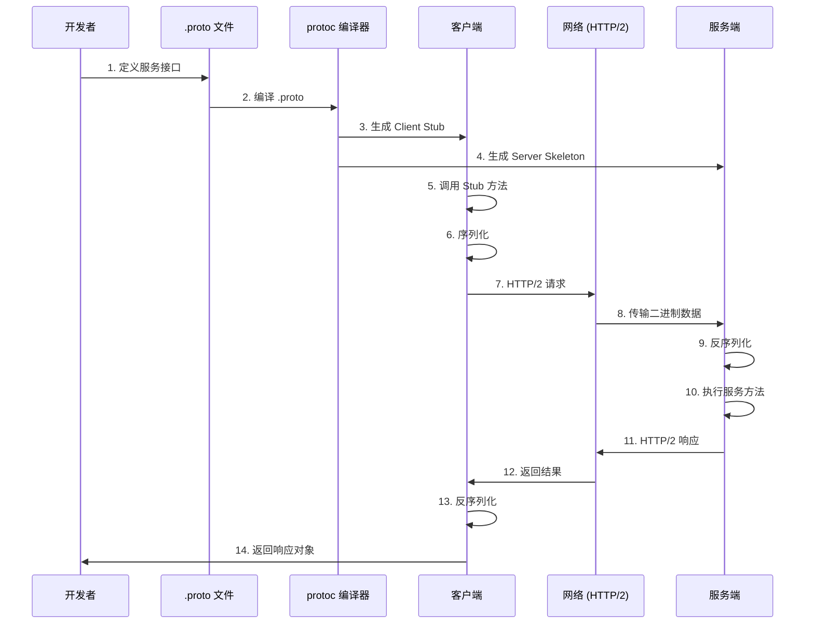
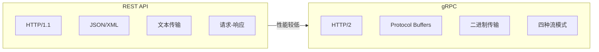
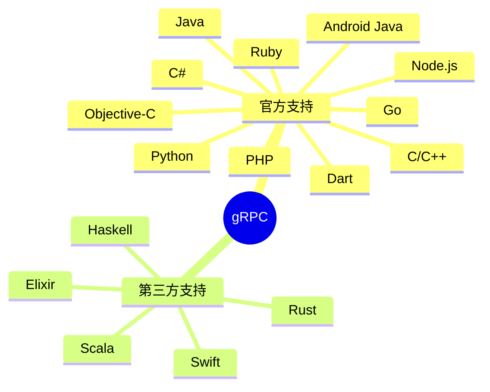
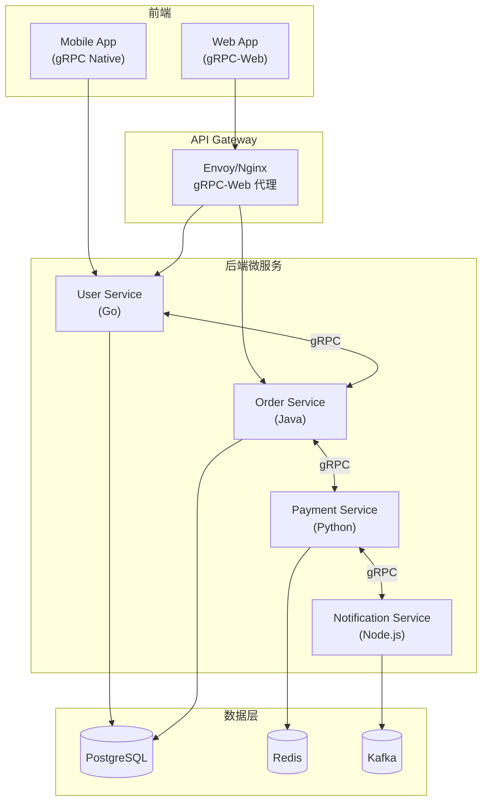
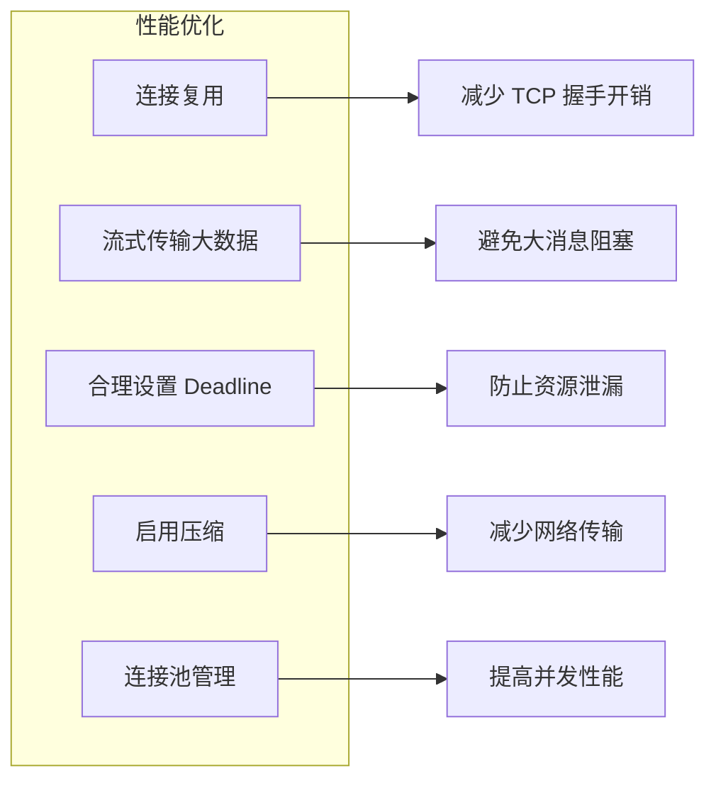

# gRPC 详解

## 1. 背景与定义

**gRPC** (gRPC Remote Procedure Calls) 是 Google 于 2015 年开源的高性能、通用的 **RPC (远程过程调用)** 框架。它基于 **HTTP/2** 协议传输，使用 **Protocol Buffers** 作为接口定义语言 (IDL) 和序列化格式。

> 官方定义：gRPC 是一个高性能、开源和通用的 RPC 框架，面向移动和 HTTP/2 设计。

- 官方网站：[gRPC - A high performance, open source universal RPC framework](https://grpc.io/)
- GitHub 仓库：[grpc/grpc](https://github.com/grpc/grpc)

---

## 2. 核心概念与架构

### 2.1 核心组件



### 2.2 关键技术栈

| 组件 | 说明 |
|------|------|
| **HTTP/2** | 二进制分帧、多路复用、头部压缩、服务端推送 |
| **Protocol Buffers** | 高效的二进制序列化格式，比 JSON 更小更快 |
| **gRPC Stub** | 由 protoc 生成的客户端/服务端代码 |
| **Channel** | 到 gRPC 服务端的连接抽象 |
| **Call** | 单次 RPC 调用的抽象 |

---

## 3. 四种通信模式

gRPC 支持四种通信模式，充分利用 HTTP/2 的双向流能力：



### 3.1 模式详解

```protobuf
// 1. Unary RPC - 传统请求响应
rpc GetUser(GetUserRequest) returns (User);

// 2. Server Streaming - 服务端流式响应
rpc ListUsers(ListUsersRequest) returns (stream User);

// 3. Client Streaming - 客户端流式请求
rpc UploadFile(stream FileChunk) returns (UploadResponse);

// 4. Bidirectional Streaming - 双向流
rpc Chat(stream Message) returns (stream Message);
```

---

## 4. 工作流程



---

## 5. Protocol Buffers 示例

### 5.1 定义 Proto 文件

```protobuf
// user.proto
syntax = "proto3";

package user;

option go_package = "./pb";

// 服务定义
service UserService {
  // Unary RPC
  rpc GetUser(GetUserRequest) returns (User);
  
  // Server Streaming
  rpc ListUsers(ListUsersRequest) returns (stream User);
  
  // Client Streaming
  rpc CreateUsers(stream CreateUserRequest) returns (CreateUsersResponse);
  
  // Bidirectional Streaming
  rpc Chat(stream ChatMessage) returns (stream ChatMessage);
}

// 消息定义
message User {
  int32 id = 1;
  string name = 2;
  string email = 3;
  repeated string roles = 4;
}

message GetUserRequest {
  int32 id = 1;
}

message ListUsersRequest {
  int32 page = 1;
  int32 page_size = 2;
}

message CreateUserRequest {
  string name = 1;
  string email = 2;
}

message CreateUsersResponse {
  repeated int32 ids = 1;
  int32 total = 2;
}

message ChatMessage {
  int32 user_id = 1;
  string content = 2;
  int64 timestamp = 3;
}
```

### 5.2 生成代码

```bash
# Go 语言
protoc --go_out=. --go-grpc_out=. user.proto

# Java
protoc --java_out=. --grpc-java_out=. user.proto

# Python
python -m grpc_tools.protoc -I. --python_out=. --grpc_python_out=. user.proto
```

---

## 6. gRPC vs REST 对比



| 特性 | gRPC | REST |
|------|------|------|
| **协议** | HTTP/2 | HTTP/1.1 |
| **数据格式** | Protocol Buffers (二进制) | JSON/XML (文本) |
| **性能** | 高 (二进制 + 头部压缩) | 较低 |
| **流式传输** | ✅ 支持 4 种模式 | ❌ 仅请求-响应 |
| **代码生成** | ✅ 自动生成强类型 Stub | ❌ 需手动或第三方工具 |
| **浏览器支持** | ❌ 需要 gRPC-Web 代理 | ✅ 原生支持 |
| **调试难度** | 较高 (二进制不可读) | 低 (文本可读) |
| **学习曲线** | 较陡 | 平缓 |

---

## 7. 多语言支持

gRPC 官方支持多种编程语言：



---

## 8. 实际应用场景

### 8.1 适用场景

- **微服务架构**：服务间高性能通信
- **实时通信**：聊天应用、实时数据推送
- **物联网**：低带宽、高效率的数据传输
- **移动应用**：减少网络流量和延迟
- **大数据传输**：流式上传/下载

### 8.2 架构示例



---

## 9. 优缺点总结

### 9.1 优点

- ✅ **高性能**：二进制序列化 + HTTP/2 多路复用
- ✅ **强类型**：通过 .proto 自动生成代码，减少运行时错误
- ✅ **双向流**：支持实时通信场景
- ✅ **多语言**：官方支持 10+ 种语言
- ✅ **内置功能**：超时、取消、元数据、认证、负载均衡

### 9.2 缺点

- ❌ **浏览器支持有限**：需要 gRPC-Web 代理
- ❌ **调试困难**：二进制格式不可直接阅读
- ❌ **学习曲线**：需要学习 Protocol Buffers 和 gRPC 概念
- ❌ **工具链依赖**：需要 protoc 编译器和各语言插件

---

## 10. 最佳实践

### 10.1 错误处理

gRPC 定义了标准错误码：

| 错误码 | 说明 |
|--------|------|
| `OK` | 成功 |
| `CANCELLED` | 操作被取消 |
| `UNKNOWN` | 未知错误 |
| `INVALID_ARGUMENT` | 无效参数 |
| `DEADLINE_EXCEEDED` | 超时 |
| `NOT_FOUND` | 资源不存在 |
| `ALREADY_EXISTS` | 资源已存在 |
| `PERMISSION_DENIED` | 权限不足 |
| `UNAUTHENTICATED` | 未认证 |
| `RESOURCE_EXHAUSTED` | 资源耗尽 |
| `UNAVAILABLE` | 服务不可用 |

### 10.2 性能优化建议



---

## 11. 参考链接

1. [gRPC 官方文档](https://grpc.io/docs/) — 官方完整文档
2. [Protocol Buffers 官方文档](https://protobuf.dev/) — Google Protocol Buffers
3. [gRPC GitHub 仓库](https://github.com/grpc/grpc) — 源码和 Issue 追踪
4. [gRPC-Web](https://github.com/grpc/grpc-web) — 浏览器端 gRPC 支持
5. [HTTP/2 RFC 7540](https://datatracker.ietf.org/doc/html/rfc7540) — HTTP/2 协议规范
6. [gRPC 性能基准测试](https://grpc.io/docs/guides/benchmarking/) — 官方性能测试指南

---

> [!tip] 小结
> gRPC 是现代微服务架构中服务间通信的优选方案，特别适合对性能和效率有高要求的场景。如果你的系统需要跨语言、高性能、实时通信，gRPC 是值得考虑的选择。
>[!summary] 前情提要
>


