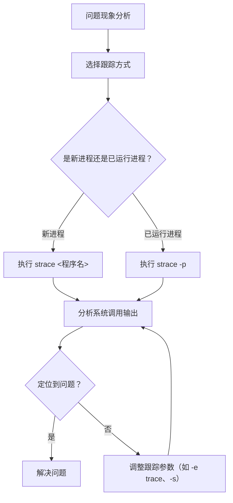

### 1. strace 概述与核心原理

strace 是 Linux 系统下的一款强大的系统调用跟踪工具，通过拦截并记录进程与内核之间的系统调用（syscall）和信号传递，帮助开发者定位程序运行时的问题，如性能瓶颈、资源泄漏、权限错误等。

#### 工作原理
strace 基于 `ptrace` 系统调用实现跟踪。当被调试进程执行系统调用时，内核会暂停进程并通知 strace，strace 记录系统调用的参数、返回值和耗时后，再让进程继续执行。

#### 核心功能
- 跟踪进程的系统调用详情
- 统计系统调用的执行时间和频率
- 过滤指定类型的系统调用
- 输出系统调用的参数值（如文件路径、网络地址等）
- 支持附加到已运行的进程或跟踪新启动的进程

* 参考来源：[Linux Manual Page - strace](https://man7.org/linux/man-pages/man1/strace.1.html)

---

### 2. 常用命令与参数解析

#### 基本使用场景
```bash
# 跟踪新启动的进程（示例：执行 ls 并跟踪）
strace ls

# 跟踪已运行的进程（需先获取进程 PID，示例：PID=1234）
strace -p 1234

# 将跟踪结果保存到文件（指定输出文件）
strace -o output.txt ls

# 跟踪特定系统调用（示例：只跟踪 open 和 read）
strace -e trace=open,read ls
```

#### 核心参数详解

| 参数         | 功能说明                                                                 |
|--------------|--------------------------------------------------------------------------|
| -p <PID>     | 附加到指定 PID 的进程进行跟踪                                           |
| -o <文件>    | 将输出写入指定文件而不是标准输出                                         |
| -e trace=<系统调用列表> | 过滤输出，仅显示指定系统调用（可使用 all 显示所有，或使用文件操作、网络操作等类别） |
| -c           | 统计系统调用的执行次数、耗时、错误率等信息                               |
| -s <字符数>  | 指定系统调用参数的显示长度（默认显示32字节，超长会截断）                 |
| -f           | 跟踪子进程（当进程执行 fork/vfork/exec 时）                               |

---

### 3. strace 输出结果解析

strace 输出格式通常为：
```
系统调用名称(参数1, 参数2, ...) = 返回值 <耗时>
```

#### 示例输出分析
```
execve("/bin/ls", ["ls"], 0x7ffd7d055dc8 /* 54 vars */) = 0 <0.000345>
brk(NULL)                               = 0x562a7c330000 <0.000007>
access("/etc/ld.so.preload", R_OK)      = -1 ENOENT (No such file or directory) <0.000010>
openat(AT_FDCWD, "/etc/ld.so.cache", O_RDONLY|O_CLOEXEC) = 3 <0.000008>
```

#### 关键字段说明
- **系统调用名**：如 `execve`（程序加载）、`brk`（内存分配）、`openat`（文件打开）
- **参数**：系统调用的输入值（如文件路径、权限、内存地址等）
- **返回值**：系统调用执行后的结果（正数表示成功，-1 表示失败）
- **错误信息**：返回值为 -1 时显示的具体错误码（如 ENOENT 表示文件不存在）
- **执行时间**：`<>` 中的数值，表示系统调用的耗时（单位：秒）

---

### 4. 实际调试场景与案例

#### 场景1：定位程序启动失败的原因
**问题现象**：执行程序 `./myapp` 后立即退出，无任何提示。
**调试步骤**：
```bash
strace ./myapp
```
**输出分析**：
```
execve("./myapp", ["./myapp"], 0x7ffd7d055dc8 /* 54 vars */) = 0
openat(AT_FDCWD, "/lib/x86_64-linux-gnu/libmysqlclient.so.21", O_RDONLY|O_CLOEXEC) = -1 ENOENT (No such file or directory)
write(2, "./myapp: error while loading sh"..., 40) = 40
exit_group(127)                         = ?
+++ exited with 127 +++
```
**结论**：程序依赖的 `libmysqlclient.so.21` 库未找到，需安装对应的 MySQL 客户端库。

#### 场景2：分析进程长时间挂起的原因
**问题现象**：进程 PID=5678 一直处于 D 状态（不可中断睡眠）。
**调试步骤**：
```bash
strace -p 5678
```
**输出分析**：
```
read(3, 0x557f3c4e84d0, 4096)           = ? ERESTARTSYS (To be restarted if SA_RESTART is set)
```
**结论**：进程正在等待文件描述符 3（可能是网络或磁盘）上的数据，需进一步检查该文件描述符关联的资源是否正常。

---

### 5. strace 与其他调试工具的对比

| 工具         | 定位场景                     | 优点                                  | 缺点                                  |
|--------------|------------------------------|---------------------------------------|---------------------------------------|
| strace       | 系统调用级别的问题定位       | 无需修改代码，使用简单，信息丰富       | 性能开销较大，不适合高并发场景         |
| ltrace       | 库函数调用级别的问题定位     | 支持跟踪动态库调用，可与 strace 配合使用 | 对系统底层资源访问追踪能力弱           |
| gdb          | 源代码级别的调试             | 支持断点、单步执行、变量查看           | 需要调试符号信息，性能开销巨大         |
| perf         | 性能分析与热点定位           | 对程序影响小，支持多维度性能分析       | 输出信息复杂，需要专业分析经验         |

---

### 6. 使用 strace 时的注意事项与优化建议

#### 性能影响
- strace 会导致被调试进程的性能下降（通常在 2-10 倍之间），生产环境使用时需谨慎
- 使用 `-c` 参数统计系统调用时，性能影响相对较小

#### 输出优化
- 使用 `-e trace` 参数只跟踪与问题相关的系统调用，避免输出大量无关信息
- 使用 `-o` 参数将输出保存到文件，方便后续分析
- 使用 `grep` 等工具对输出进行过滤和检索

#### 权限问题
- 普通用户只能跟踪属于自己的进程，跟踪其他用户进程需要 root 权限
- 生产环境中使用 root 权限运行 strace 需注意安全风险

---

### 7. strace 调试流程总结



---

### 8. 补充知识：strace 的扩展与替代工具

#### strace 的扩展工具
- **strace-graph**：将系统调用调用关系可视化为图形，更直观地展示程序的执行流程
- **strace.py**：提供 Python 接口，方便对 strace 输出进行定制化分析

#### 替代工具
- **sysdig**：系统级监控和调试工具，提供更强大的过滤和分析功能，性能优于 strace
- **bpftrace**：基于 eBPF 技术的高性能跟踪工具，支持自定义内核探针，可实现更精细的跟踪

---

### 9. 总结

strace 作为 Linux 系统下的经典调试工具，通过跟踪系统调用来揭示程序与内核的交互细节，是定位运行时问题的得力助手。其使用简单、信息丰富的特点使其在开发和运维领域广泛应用。但在高并发场景下，需注意其性能影响，可考虑使用 sysdig 或 bpftrace 等替代工具。

通过合理运用 strace 的参数和分析方法，开发者可以快速定位程序的启动失败、资源泄漏、权限错误等问题，提高调试效率。