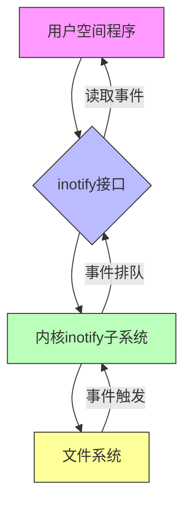
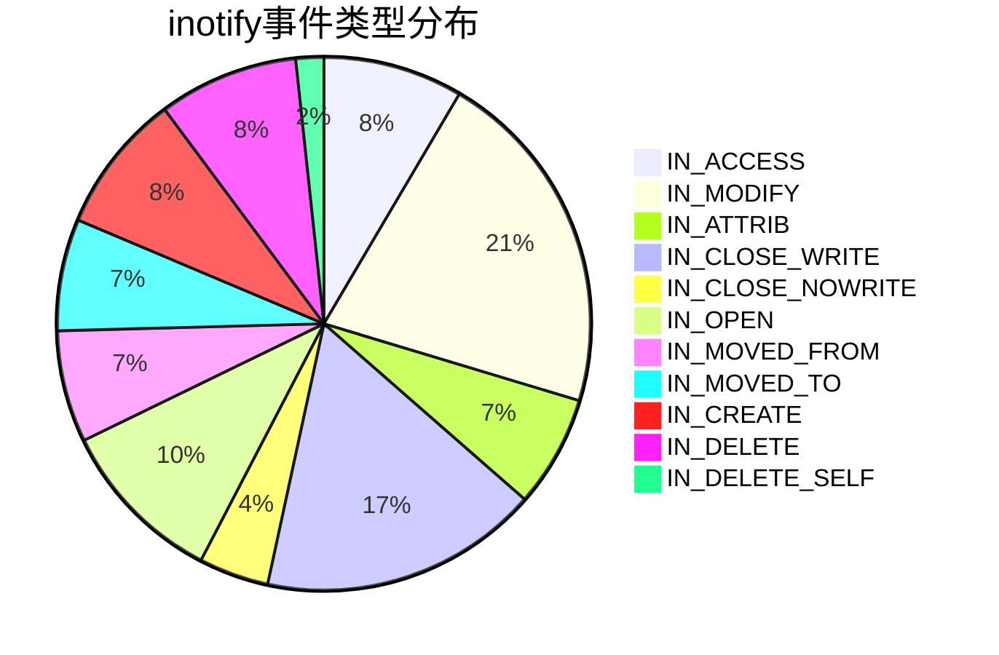
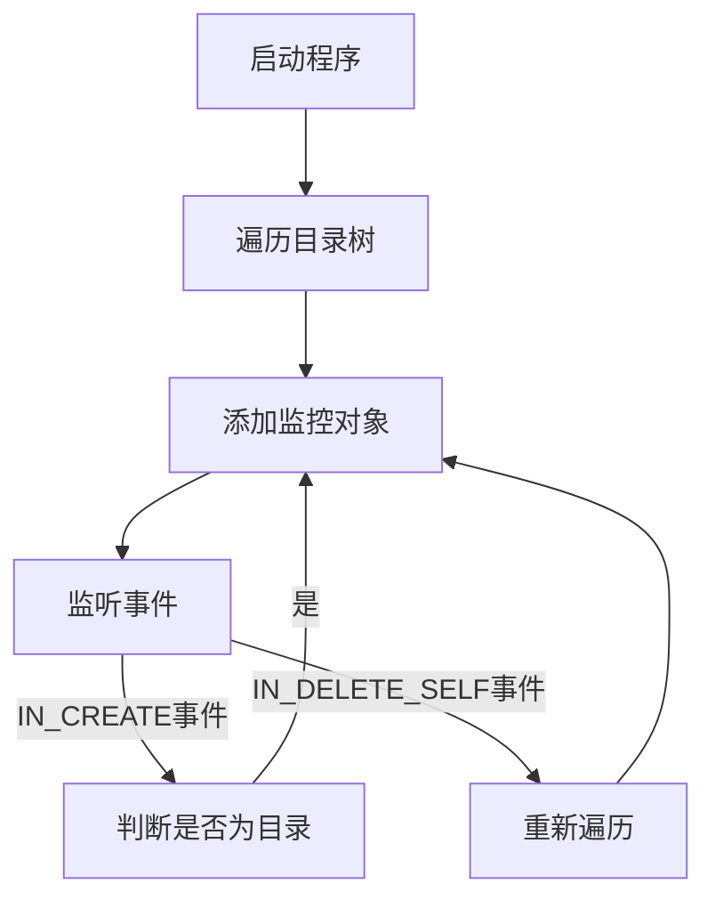

>[!summary] 前情提要
>- `bun run dev`  futex 死锁

### 1. 背景与定义

inotify是Linux内核提供的一种**高效的文件系统监控机制**，用于替代传统的dnotify系统调用。它允许用户空间程序实时监控文件系统事件，如文件创建、修改、删除等，具有轻量级、低开销和高可靠性的特点。

* 来源：[Linux内核文档–inotify](https://www.kernel.org/doc/html/latest/filesystems/inotify.html)
* 核心特性：
  - 实时事件通知
  - 支持递归目录监控
  - 可配置监控事件类型
  - 高效的用户空间接口
  - 低系统资源消耗

### 2. inotify系统架构



### 3. 核心概念与API

#### 3.1 核心结构体

inotify主要使用三个关键结构：

* **`inotify_init()`/`inotify_init1()`**：创建inotify实例，返回文件描述符
* **`inotify_add_watch()`**：添加监控对象（文件/目录）
* **`inotify_rm_watch()`**：移除监控对象
* **`read()`**：从inotify实例读取事件

#### 3.2 事件类型

inotify支持以下主要事件类型：



* **详细事件说明**：
  - `IN_ACCESS`：文件被访问
  - `IN_MODIFY`：文件内容被修改
  - `IN_ATTRIB`：文件属性被修改（如权限、时间戳）
  - `IN_CLOSE_WRITE`：可写文件被关闭
  - `IN_CLOSE_NOWRITE`：不可写文件被关闭
  - `IN_OPEN`：文件被打开
  - `IN_MOVED_FROM`：文件被移走（从监控目录）
  - `IN_MOVED_TO`：文件被移来（到监控目录）
  - `IN_CREATE`：文件/目录被创建
  - `IN_DELETE`：文件/目录被删除
  - `IN_DELETE_SELF`：监控对象本身被删除

### 4. 配置与限制

#### 4.1 系统限制参数

inotify的性能和行为受以下系统参数影响（位于`/proc/sys/fs/inotify/`目录下）：

| 参数名称 | 描述 | 默认值 | 调整方法 |
|---------|------|--------|----------|
| max_user_instances | 每个用户的最大inotify实例数 | 128 | echo 256 > /proc/sys/fs/inotify/max_user_instances |
| max_user_watches | 每个用户的最大监控对象数 | 8192 | echo 1048576 > /proc/sys/fs/inotify/max_user_watches |
| max_queued_events | 每个实例的最大事件队列长度 | 16384 | echo 32768 > /proc/sys/fs/inotify/max_queued_events |

* 来源：[Linux man page–inotify(7)](https://man7.org/linux/man-pages/man7/inotify.7.html)

#### 4.2 持久化配置

要持久化修改inotify参数，可以编辑`/etc/sysctl.conf`文件：

```bash
# 增加inotify监控对象上限
fs.inotify.max_user_watches = 1048576
# 增加事件队列长度
fs.inotify.max_queued_events = 32768
# 增加实例数
fs.inotify.max_user_instances = 256
```

然后执行`sysctl -p`生效。

### 5. 使用示例

以下是一个简单的C语言示例，演示如何使用inotify监控目录：

```c
#include <stdio.h>
#include <stdlib.h>
#include <string.h>
#include <sys/inotify.h>
#include <unistd.h>

#define BUF_LEN (1024 * (sizeof(struct inotify_event) + 16))

int main(int argc, char *argv[]) {
    int fd, wd;
    char buf[BUF_LEN];
    int length, i = 0;

    // 创建inotify实例
    fd = inotify_init();
    if (fd < 0) {
        perror("inotify_init");
        return EXIT_FAILURE;
    }

    // 添加监控对象（这里监控当前目录）
    wd = inotify_add_watch(fd, ".", IN_CREATE | IN_DELETE);
    if (wd < 0) {
        perror("inotify_add_watch");
        return EXIT_FAILURE;
    }

    printf("Monitoring directory \".\" for changes...\n");

    // 循环读取事件
    while (1) {
        length = read(fd, buf, BUF_LEN);
        if (length < 0) {
            perror("read");
            return EXIT_FAILURE;
        }

        // 解析事件
        while (i < length) {
            struct inotify_event *event = (struct inotify_event *) &buf[i];
            if (event->len) {
                if (event->mask & IN_CREATE) {
                    printf("File \"%s\" created\n", event->name);
                } else if (event->mask & IN_DELETE) {
                    printf("File \"%s\" deleted\n", event->name);
                }
            }
            i += sizeof(struct inotify_event) + event->len;
        }
        i = 0;
    }

    // 清理资源
    inotify_rm_watch(fd, wd);
    close(fd);

    return EXIT_SUCCESS;
}
```

编译并运行：

```bash
gcc -o inotify_example inotify_example.c
./inotify_example
```

在另一个终端中创建或删除文件，观察输出。

### 6. 高级应用场景

#### 6.1 递归监控目录



#### 6.2 性能优化策略

* **减少监控对象**：只监控需要的文件/目录
* **合理设置队列大小**：根据事件频率调整`max_queued_events`
* **使用非阻塞I/O**：避免read()阻塞
* **事件合并**：对于频繁触发的事件（如IN_MODIFY），可以合并处理

### 7. 工具与库

#### 7.1 命令行工具

* **`inotifywait`**：inotify-tools包提供的命令行工具
  - 安装：`sudo apt-get install inotify-tools` (Debian/Ubuntu)
  - 使用示例：`inotifywait -m /path/to/directory`

* **`inotifywatch`**：统计文件系统事件

#### 7.2 高级库

* **Pyinotify**：Python绑定库
  - 项目地址：[Pyinotify GitHub](https://github.com/seb-m/pyinotify)
  - 示例代码：
    ```python
    import pyinotify

    class EventHandler(pyinotify.ProcessEvent):
        def process_IN_CREATE(self, event):
            print(f"File created: {event.pathname}")

        def process_IN_DELETE(self, event):
            print(f"File deleted: {event.pathname}")

    wm = pyinotify.WatchManager()
    mask = pyinotify.IN_CREATE | pyinotify.IN_DELETE
    handler = EventHandler()
    notifier = pyinotify.Notifier(wm, handler)
    wdd = wm.add_watch('/path/to/directory', mask, rec=True)
    notifier.loop()
    ```

### 8. 常见问题与解决方案

#### 8.1 事件丢失

**原因**：事件队列满或处理不及时

**解决方案**：
- 增加`max_queued_events`参数
- 优化事件处理逻辑
- 确保read()调用及时

#### 8.2 性能问题

**原因**：监控对象过多或事件频率过高

**解决方案**：
- 减少监控范围
- 调整监控事件类型
- 使用异步I/O处理事件

### 9. 参考链接

1. [Linux内核文档–inotify](https://www.kernel.org/doc/html/latest/filesystems/inotify.html) — Linux内核官方文档
2. [Linux man page–inotify(7)](https://man7.org/linux/man-pages/man7/inotify.7.html) — 系统调用手册
3. [inotify-tools官方网站](https://github.com/inotify-tools/inotify-tools) — 命令行工具项目地址
4. [Pyinotify官方网站](https://github.com/seb-m/pyinotify) — Python绑定库
5. [Linux文件系统监控技术对比](https://www.ibm.com/developerworks/linux/library/l-inotify/index.html) — IBM DeveloperWorks文章

### 10. 总结

inotify是Linux系统中强大的文件系统监控机制，提供了高效、实时的事件通知功能。通过合理配置和使用，可以满足各种监控需求，从简单的文件变化检测到复杂的系统监控应用。

在使用inotify时，需要注意系统限制和性能优化，以确保应用程序的稳定性和可靠性。同时，通过工具和库的支持，可以大大简化开发过程，快速实现监控功能。