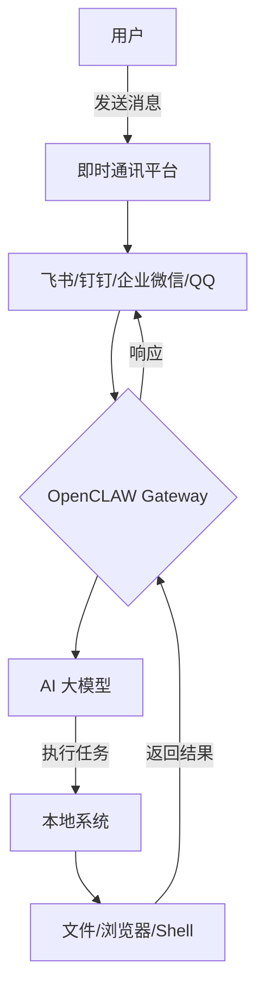
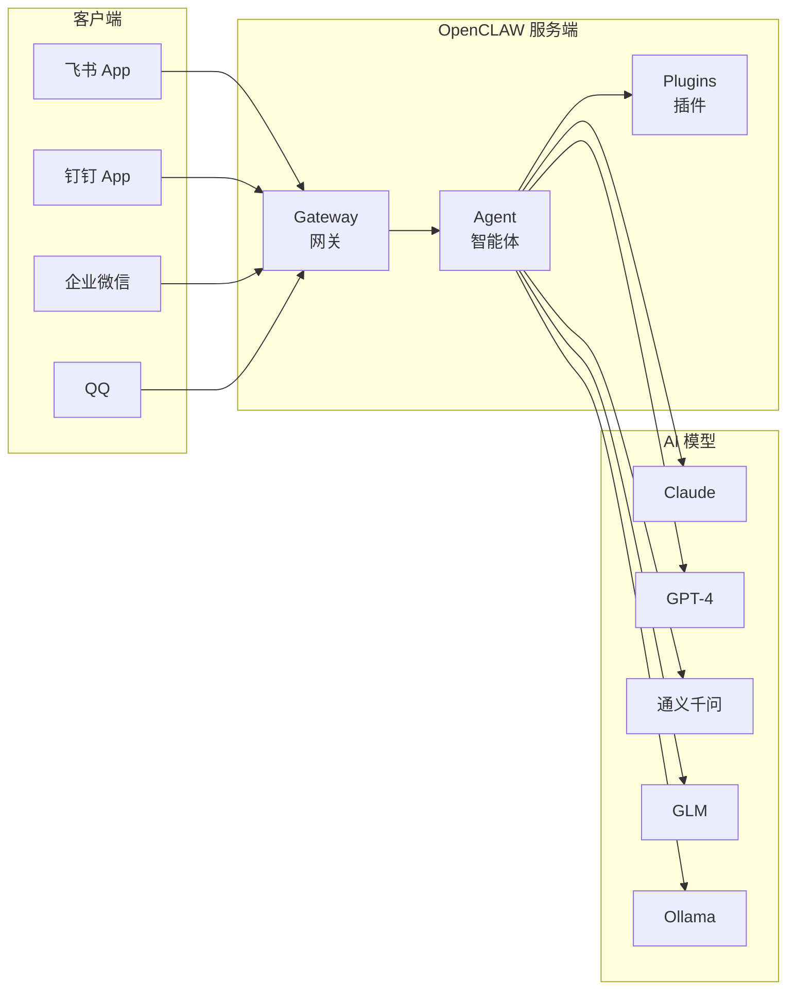
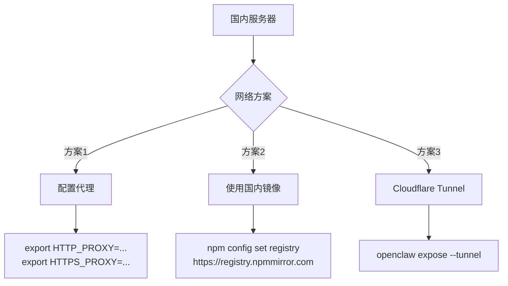
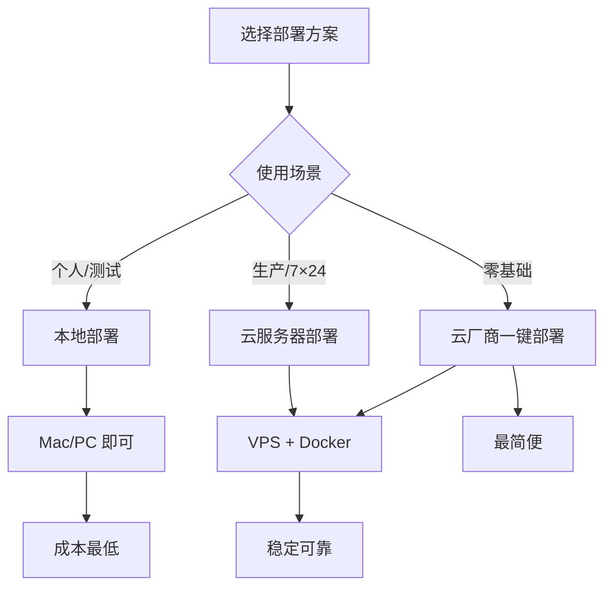

# OpenCLAW 国内配置指南：Linux 部署与社交媒体接入实战

> [!tip] 文章概要
> 本文详细介绍如何在 Linux 服务器上部署 OpenCLAW，并接入国内主流社交媒体平台（飞书、钉钉、企业微信、QQ），打造 7×24 小时在线的 AI 助手。

## 1. 背景与定义

### 1.1 什么是 OpenCLAW？

OpenCLAW（原名 Clawdbot，后更名为 Moltbot）是 2026 年开源社区最火爆的 AI Agent 项目之一，由奥地利开发者 PSPDFKit 创始人 Peter Steinberger 主导开发。截至 2026 年 2 月，GitHub 星标数已突破 18.6 万，成为全球开源领域增速最快的项目之一。

* 参考来源：[OpenCLAW 官方文档](https://docs.openclaw.ai/install)
* 参考来源：[从零开始玩转 OpenCLAW 中文教程](https://github.com/xianyu110/awesome-openclaw-tutorial)

与传统对话式 AI 工具不同，OpenCLAW 的核心定位是**本地运行、可自托管的 AI 执行引擎**，主打"从给建议到做事情"的能力跃迁。



### 1.2 核心特性

| 特性 | 说明 |
|------|------|
| **本地部署** | 数据完全自主可控，100% 数据主权 |
| **多平台支持** | 飞书、钉钉、企业微信、QQ、WhatsApp、Telegram 等 10+ 渠道 |
| **浏览器控制** | 可浏览网页、填写表单、提取数据 |
| **系统访问** | 读写文件、执行 Shell 命令、运行脚本 |
| **持久化记忆** | 记住偏好和上下文，成为专属 AI |
| **插件扩展** | 支持社区技能插件，可自行编写 |

* 参考来源：[OpenCLAW 最新保姆级飞书对接指南 - 博客园](https://www.cnblogs.com/catchadmin/p/19592309)

## 2. 核心概念解释

### 2.1 架构组件



### 2.2 关键术语

| 术语 | 说明 |
|------|------|
| **Gateway** | OpenCLAW 网关，负责接收和转发消息 |
| **Agent** | AI 智能体核心，负责任务规划和执行 |
| **Channel** | 通讯渠道（飞书、钉钉等） |
| **Plugin** | 功能插件，扩展 OpenCLAW 能力 |
| **SOUL.md** | Agent 核心配置文件 |
| **AGENTS.md** | Agent 技能和行为定义 |

## 3. 技术深度分析

### 3.1 Linux 服务器环境要求

| 项目 | 最低要求 | 推荐配置 |
|------|----------|----------|
| 操作系统 | Ubuntu 22.04+ / Debian 12+ / CentOS Stream 9+ | Ubuntu 24.04 LTS |
| CPU | 1 核 | 2 核+ |
| 内存 | 2GB | 4GB+ |
| 磁盘 | 20GB | 40GB+ |
| Node.js | ≥ 22.x | 22.x LTS |
| 网络 | 可访问 GitHub/npm | 需配置代理（国内服务器） |

* 参考来源：[OpenCLAW Linux 安装教程 2026 - VPN07](https://vpn07.com/cn/blog/2026-openclaw-linux-ubuntu-debian-centos-fuwuqi-sanxitong-bushu.html)

### 3.2 国内服务器特殊考虑

由于国内服务器访问 GitHub 和 npm 有网络限制，需要额外配置：



> [!warning] 网络注意事项
> - 如果服务器无法直接访问 GitHub，需要配置代理或使用国内镜像源
> - 阿里云、腾讯云等国内厂商可能需要配置代理才能正常安装

## 4. 工具对比与实践指南

### 4.1 Linux 安装全流程

#### 步骤 1：系统更新与基础工具

```bash
# Ubuntu/Debian
sudo apt update && sudo apt upgrade -y
sudo apt install -y curl wget git build-essential

# CentOS
sudo dnf update -y
sudo dnf install -y curl wget git gcc-c++ make
```

#### 步骤 2：安装 Node.js 22

```bash
# 方法一：使用 nvm（推荐）
curl -o- https://raw.githubusercontent.com/nvm-sh/nvm/v0.40.4/install.sh | bash
source ~/.bashrc
nvm install 22
nvm use 22

# 方法二：直接安装
curl -fsSL https://deb.nodesource.com/setup_22.x | sudo -E bash -
sudo apt-get install -y nodejs
```

#### 步骤 3：安装 OpenCLAW

```bash
# 官方一键安装
curl -fsSL https://openclaw.ai/install.sh | bash

# 或使用 npm 全局安装
npm install -g openclaw@latest
```

* 参考来源：[OpenCLAW 官方安装文档](https://docs.openclaw.ai/install)

#### 步骤 4：启动并配置守护进程

```bash
# 安装后台服务
openclaw onboard --install-daemon

# 启动网关
openclaw gateway start

# 查看状态
openclaw gateway status
```

### 4.2 国内社交媒体接入对比

| 平台 | 接入难度 | 社区支持 | 功能完整性 | 推荐指数 |
|------|----------|----------|------------|----------|
| **飞书** | ⭐⭐ | ⭐⭐⭐⭐⭐ | ⭐⭐⭐⭐⭐ | ⭐⭐⭐⭐⭐ |
| **钉钉** | ⭐⭐⭐ | ⭐⭐⭐ | ⭐⭐⭐⭐ | ⭐⭐⭐⭐ |
| **企业微信** | ⭐⭐⭐ | ⭐⭐⭐ | ⭐⭐⭐ | ⭐⭐⭐ |
| **QQ** | ⭐⭐⭐⭐ | ⭐⭐ | ⭐⭐⭐ | ⭐⭐⭐ |

> [!tip] 推荐选择
> 国内用户推荐首选**飞书**，原因：现代化界面、开发友好、功能丰富、社区教程最多。

### 4.3 飞书接入完整配置

#### 4.3.1 飞书开放平台创建应用

1. 访问 [飞书开放平台](https://open.feishu.cn/)
2. 创建企业自建应用 → 填写应用名称和描述
3. 获取 **App ID** 和 **App Secret**

#### 4.3.2 配置应用权限

需要开通以下关键权限：

```
- contact:contact.base:readonly（通讯录读取）
- im:message:send_as_bot（发送消息）
- im:message:receive（接收消息）
- im:chat:create（创建群聊）
- im:chat:member.add（添加群成员）
```

* 参考来源：[OpenCLAW 飞书插件配置教程 - 胡萝虎的博客](https://www.huluohu.com/posts/2049/)

#### 4.3.3 订阅事件

在飞书开放平台配置事件订阅：

| 事件类型 | 说明 |
|----------|------|
| `im.message.receive_v1` | 接收消息事件 |
| `im.chat.member.bot_added_v1` | 机器人被添加到群 |

回调 URL 格式：`https://你的服务器/webhook/feishu`

#### 4.3.4 OpenCLAW 飞书插件安装

```bash
# 安装官方飞书插件
openclaw plugins install @openclaw/feishu

# 查看已安装插件
openclaw plugins list
```

#### 4.3.5 配置文件

编辑 `~/.openclaw/config.yaml`：

```yaml
channels:
  feishu:
    enabled: true
    appId: "cli_xxxxxxxxxxxxx"
    appSecret: "your_app_secret"
```

重启网关：

```bash
openclaw gateway restart
```

* 参考来源：[OpenCLAW + 飞书集成实战 - 掘金](https://juejin.cn/post/7610997893575753762)

### 4.4 钉钉接入配置

#### 4.4.1 创建钉钉应用

1. 访问 [钉钉开放平台](https://open-dev.dingtalk.com/)
2. 创建企业内部应用
3. 添加机器人能力
4. 获取 **AppKey**、**AppSecret**、**AgentId**、**CorpId**

#### 4.4.2 配置 OpenCLAW

```bash
# 安装钉钉插件
openclaw plugins install @openclaw/dingtalk
```

配置文件：

```yaml
channels:
  dingtalk:
    enabled: true
    clientId: "your_app_key"
    clientSecret: "your_app_secret"
    robotCode: "your_robot_code"
```

* 参考来源：[OpenCLAW 钉钉对接保姆级教程 - DAMO开发者矩阵](https://damodev.csdn.net/697ebaa17c1d88441d910a66.html)

### 4.5 企业微信接入配置

#### 4.5.1 创建企业微信应用

1. 登录 [企业微信管理后台](https://work.weixin.qq.com/)
2. 创建自建应用
3. 获取 **AgentId**、**Secret**、**CorpId**

#### 4.5.2 配置回调

- 回调 URL：`https://你的服务器/webhook/wecom`
- 生成 Token 和 EncodingAESKey

#### 4.5.3 安装社区插件

```bash
# 安装社区贡献的企业微信插件
openclaw plugins install @creatoraris/openclaw-wecom
```

配置文件：

```yaml
plugins:
  entries:
    openclaw-wecom:
      enabled: true
      config:
        token: "your_token"
        encodingAESKey: "your_aes_key"
        corpId: "your_corp_id"
        port: 8788
```

* 参考来源：[OpenCLAW 企业微信接入 - Alan个人博客](https://1991421.cn/2026/02/27/openclaw-enterprise-wechat-integration/)

### 4.6 QQ 接入配置

```bash
# 安装 QQ 插件
openclaw plugins install @openclaw/qqbot
```

配置文件：

```yaml
channels:
  qqbot:
    enabled: true
    appId: "your_app_id"
    token: "your_token"
```

> [!warning] QQ 机器人注意事项
> - 需要先在沙箱环境测试
> - 私聊和群聊权限需要分别申请
> - 机器人需要审核，周期 1-3 天

* 参考来源：[OpenCLAW 接入企业微信/钉钉/QQ 全攻略 - 掘金](https://juejin.cn/post/7606923064946049064)

### 4.7 多渠道同时接入

OpenCLAW 支持同时连接多个渠道，共享同一个 AI 智能体：

```yaml
channels:
  feishu:
    enabled: true
    appId: "cli_xxx"
    appSecret: "xxx"
  
  dingtalk:
    enabled: true
    clientId: "xxx"
    clientSecret: "xxx"
  
  wecom:
    enabled: false
  
  qqbot:
    enabled: false
```

## 5. 最新进展与趋势

### 5.1 2026 年发展动态

| 时间 | 事件 | 影响 |
|------|------|------|
| 2026年1月 | OpenCLAW 完成品牌定名 | 全生态统一，结束命名混乱 |
| 2026年2月 | GitHub 星标突破 18.6 万 | 成为增速最快的开源 AI 项目 |
| 2026年2月 | 百度云/阿里云推出一键部署 | 降低国内用户部署门槛 |
| 2026年2月 | 社区贡献多个国内平台插件 | 完善国内生态 |

* 参考来源：[2026 最強開源 AI 代理 - 浪花科技](https://roamer-tech.com/openclaw-linux-installation-guide-2026-ai-agent/)

### 5.2 云厂商一键部署方案

| 厂商 | 特点 | 链接 |
|------|------|------|
| 百度智能云 | 0.01 元体验 1 个月 | [轻量应用服务器](https://cloud.baidu.com/product/BCC/moltbot.html) |
| 阿里云 | OpenCLAW 一键部署 | [阿里云市场](https://market.aliyun.com/) |
| 腾讯云 | 支持四大 IM 接入 | [轻量云](https://curl.qcloud.com/8Eps6xac) |

* 参考来源：[全网最简单的 OpenCLAW 部署教程 - 程序员鱼皮](https://www.cnblogs.com/yupi/p/19600386)

## 6. 专业总结与应用建议

### 6.1 部署方案选择



### 6.2 快速选择指南

| 场景 | 推荐方案 | 理由 |
|------|----------|------|
| 首次体验 | 百度云 0.01 元 | 零成本试水 |
| 生产环境 | Ubuntu 24.04 + 2C4G | 稳定可靠 |
| 开发者 | 本地 Docker | 灵活调试 |
| 企业使用 | 飞书渠道 | 功能最全 |

### 6.3 关键注意事项

> [!warning] 安全提醒
> - OpenCLAW 运行时权限较大，建议使用独立服务器
> - 不要在生产机器上直接运行，避免数据泄露
> - 定期备份配置文件和记忆数据
> - API Key 要妥善保管，不要提交到 GitHub

### 6.4 下一步行动

1. **快速体验**：使用百度云/腾讯云一键部署
2. **深入学习**：阅读 [awesome-openclaw-tutorial](https://github.com/xianyu110/awesome-openclaw-tutorial)
3. **自定义开发**：编写自己的 AGENTS.md 和技能插件
4. **生产部署**：配置 Nginx 反向代理 + HTTPS + 定时备份

## 7. 参考链接

1. [OpenCLAW 官方文档](https://docs.openclaw.ai/install) — 官方安装指南
2. [awesome-openclaw-tutorial 中文教程](https://github.com/xianyu110/awesome-openclaw-tutorial) — 最全中文教程
3. [OpenCLAW 飞书官方插件教程](https://www.huluohu.com/posts/2049/) — 飞书接入详解
4. [OpenCLAW 接入企业微信/钉钉/QQ 全攻略](https://juejin.cn/post/7606923064946049064) — 多平台接入指南
5. [Docker 生产环境部署指南](https://blog.xuanyuan.me/archives/2222) — 轩源的网络日志
6. [OpenCLAW 中文网](https://openclawcn.com/) — 国内镜像和文档
7. [飞书开放平台](https://open.feishu.cn/) — 创建飞书应用
8. [钉钉开放平台](https://open-dev.dingtalk.com/) — 创建钉钉应用
9. [企业微信管理后台](https://work.weixin.qq.com/) — 企业微信管理

---

*本文基于 2026 年 3 月最新信息编写，如有变动请以官方文档为准。*

