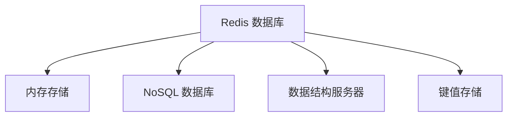

---

### 1. Redis 核心概念

#### 1.1 什么是 Redis？

**Redis（Remote Dictionary Server）** 是一个开源的**内存数据结构存储系统**，可用作数据库、缓存、消息队列。

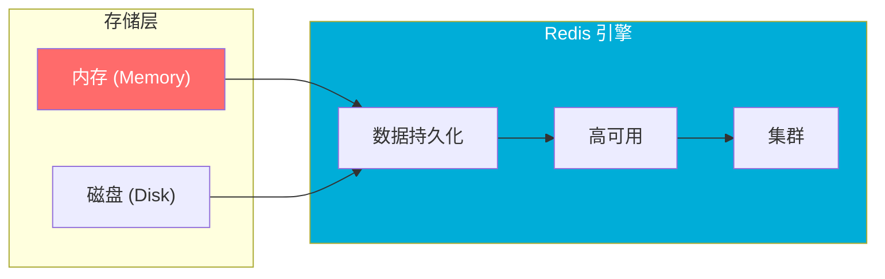

**核心特性**：
- 📦 **内存存储** → 极高性能
- 💾 **持久化** → 数据不丢失
- 🔄 **主从复制** → 高可用
- 🌀 **集群** → 水平扩展

* 参考来源：[Redis Official Website](https://redis.io/)

---

#### 1.2 Redis 数据结构

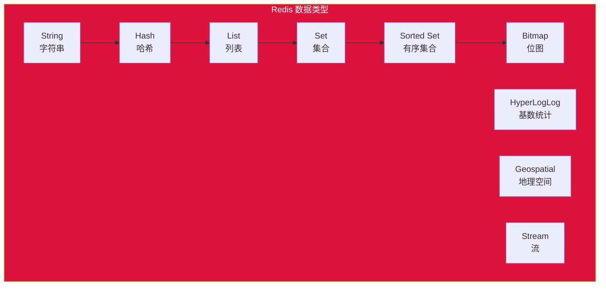

| 类型 | 说明 | 典型场景 |
|------|------|----------|
| **String** | 字符串/数字/JSON | 缓存、计数器、Session |
| **Hash** | 哈希表对象 | 存储对象 |
| **List** | 双向链表 | 消息队列、最新列表 |
| **Set** | 无序集合 | 标签、好友关系 |
| **Sorted Set** | 有序集合 | 排行榜、权重队列 |

* 参考来源：[Redis Data Types](https://redis.io/docs/data-types/)

---

### 2. 键命名规范深度解析

#### 2.1 为什么需要命名规范？

用户问：`entity:identifier:sub_entity:field` 这种格式看不懂

让我用**现实生活的例子**来解释：

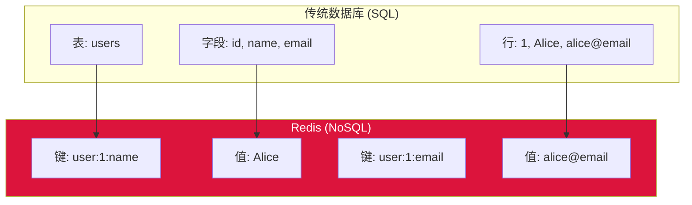

**Redis 是键值存储**，没有"表"的概念，**所有数据都是键值对**：
- 键（Key）= 数据的唯一标识
- 值（Value）= 存储的数据

---

#### 2.2 命名格式解释：`entity:identifier:sub_entity:field`

这是 Redis 社区推荐的**命名空间规范**，用冒号 `:` 分隔层次。

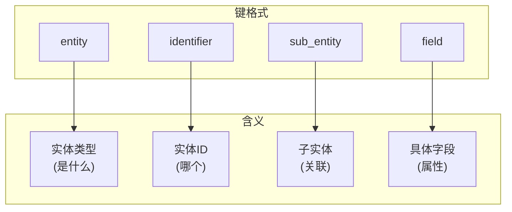

---

#### 2.3 具体例子

##### 示例 1：用户数据

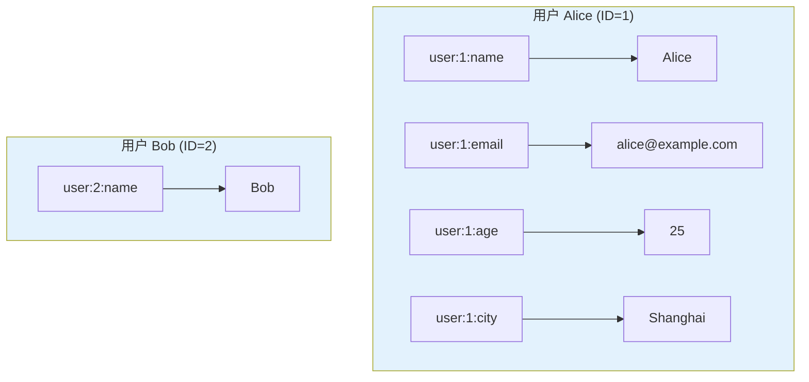

**键值对示例**：

```
┌─────────────────────┬──────────────────┐
│ 键 (Key)            │ 值 (Value)       │
├─────────────────────┼──────────────────┤
│ user:1:name         │ Alice            │
│ user:1:email        │ alice@example.com│
│ user:1:age          │ 25               │
│ user:1:city         │ Shanghai         │
│ user:2:name         │ Bob              │
└─────────────────────┴──────────────────┘
```

**解读**：
- `user` = **entity**（实体类型：用户）
- `1` = **identifier**（实体ID：1号用户）
- `name` = **field**（字段：名字）

---

##### 示例 2：商品数据

```
┌─────────────────────────────────┬──────────────────┐
│ 键 (Key)                        │ 值 (Value)       │
├─────────────────────────────────┼──────────────────┤
│ product:100:title               │ iPhone 15        │
│ product:100:price               │ 999              │
│ product:100:stock               │ 50               │
│ product:100:category            │ phone            │
├─────────────────────────────────┼──────────────────┤
│ product:101:title               │ MacBook Pro      │
│ product:101:price               │ 1999             │
│ product:101:stock               │ 20               │
└─────────────────────────────────┴──────────────────┘
```

---

##### 示例 3：订单 + 订单项（复杂场景）

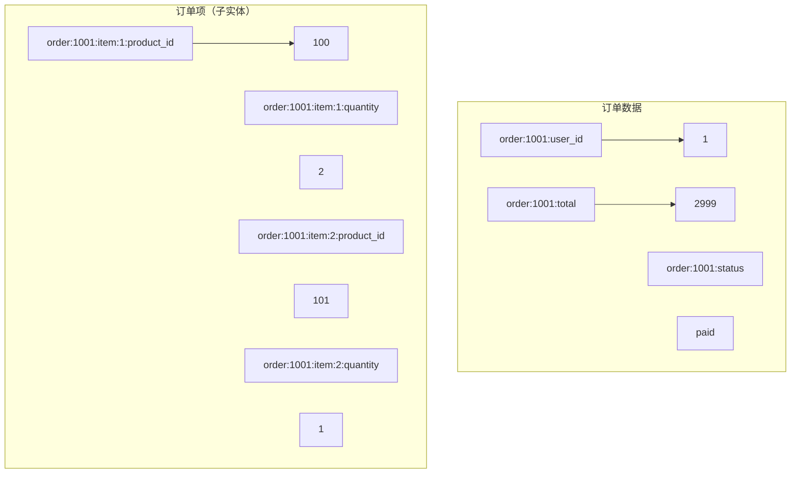

**完整结构**：
```
# 订单主信息
order:1001:user_id      → 1
order:1001:total       → 2999
order:1001:status      → paid
order:1001:created_at → 2024-01-15 10:30:00

# 订单项 1
order:1001:item:1:product_id  → 100
order:1001:item:1:quantity     → 2
order:1001:item:1:price        → 1999

# 订单项 2  
order:1001:item:2:product_id  → 101
order:1001:item:2:quantity     → 1
order:1001:item:2:price        → 999
```

---

#### 2.4 为什么用冒号 `:` 分隔？

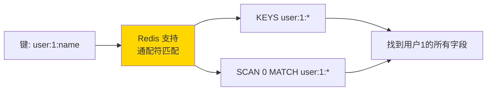

**优势**：

| 优势 | 说明 |
|------|------|
| 🔍 **便于搜索** | `KEYS user:1:*` 匹配所有用户1的键 |
| 📊 **便于管理** | 按前缀分类，易于查看 |
| 🏗️ **层次清晰** | 表达实体关系 |
| 🔧 **工具支持** | Redis Desktop Manager 等工具支持树形展示 |

---

#### 2.5 实际项目中的命名约定

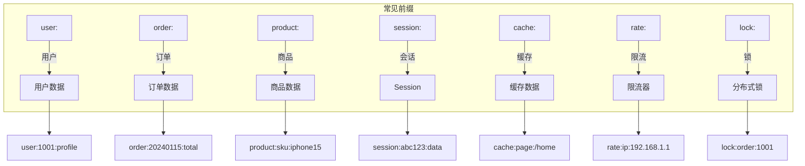

**常见实践**：

```bash
# 用户模块
user:1001:name
user:1001:email  
user:1001:profile
user:1001:friends          # Set - 好友列表

# 缓存模块
cache:user:1001:profile     # 用户资料缓存
cache:product:100:detail    # 商品详情缓存

# 会话模块
session:abc123:token
session:abc123:data
session:abc123:expire

# 计数器
counter:product:100:views   # 商品浏览量
counter:user:1001:login     # 登录次数

# 排行榜
rank:score:global           # Sorted Set - 全局排行榜
rank:score:daily:20240115   # Sorted Set - 每日排行榜
```

---

### 3. Redis 的实际使用方式

#### 3.1 命令行示例

```bash
# 存储用户数据
SET user:1:name "Alice"
SET user:1:email "alice@example.com"
SET user:1:age 25

# 批量获取
MGET user:1:name user:1:email user:1:age

# 使用 Hash 存储对象（更推荐）
HSET user:1 name "Alice"
HSET user:1 email "alice@example.com"
HSET user:1 age 25

# 获取整个用户对象
HGETALL user:1

# 模糊匹配
KEYS user:1:*
```

#### 3.2 Hash vs String 存储对比

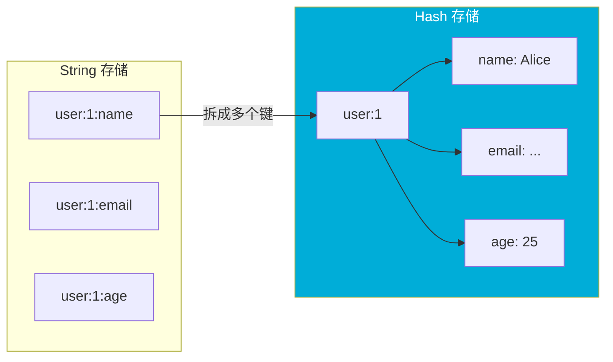

**Hash 更适合存储对象**：

```bash
# String 方式（不推荐用于对象）
SET user:1:name "Alice"
SET user:1:email "alice@example.com"
# 3个键，分散存储

# Hash 方式（推荐）
HSET user:1 name "Alice" email "alice@example.com" age 25
# 1个键，内部字段管理
```

---

### 4. Redis vs 传统数据库

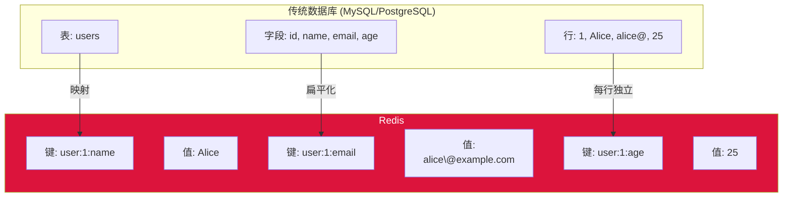

| 特性       | 传统数据库  | Redis  |
| -------- | ------ | ------ |
| **数据结构** | 固定表结构  | 多种数据结构 |
| **存储位置** | 磁盘     | 内存（主）  |
| **查询方式** | SQL 语句 | 键命令    |
| **事务**   | ACID   | 有限支持   |
| **扩展性**  | 垂直扩展   | 水平扩展   |

---

### 5. Redis 典型应用场景

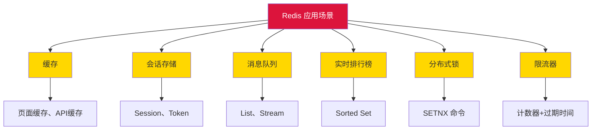

---

### 6. 总结

#### 键命名公式

```
键 = 业务前缀:实体类型:实体ID[:子实体][:字段]
```

#### 一句话解释

> **Redis 的 `entity:identifier:sub_entity:field` 格式，本质上是把传统数据库的「表名:主键:字段」拆散，用冒号连接成唯一的键名。**

这样设计是为了：
1. ✅ **唯一性** - 每个数据都有唯一键
2. ✅ **可读性** - 键名自描述
3. ✅ **可查询** - 支持前缀匹配
4. ✅ **层次感** - 表达数据关系

---

### 参考链接

1. [Redis Official Website](https://redis.io/) — 官方网站
2. [Redis Data Types](https://redis.io/docs/data-types/) — 数据类型文档
3. [Redis KEYS Command](https://redis.io/commands/keys/) — 键命令
4. [Redis Hashes](https://redis.io/docs/data-types/hashes/) — Hash 存储
5. [Redis Persistence](https://redis.io/docs/management/persistence/) — 持久化机制

---

