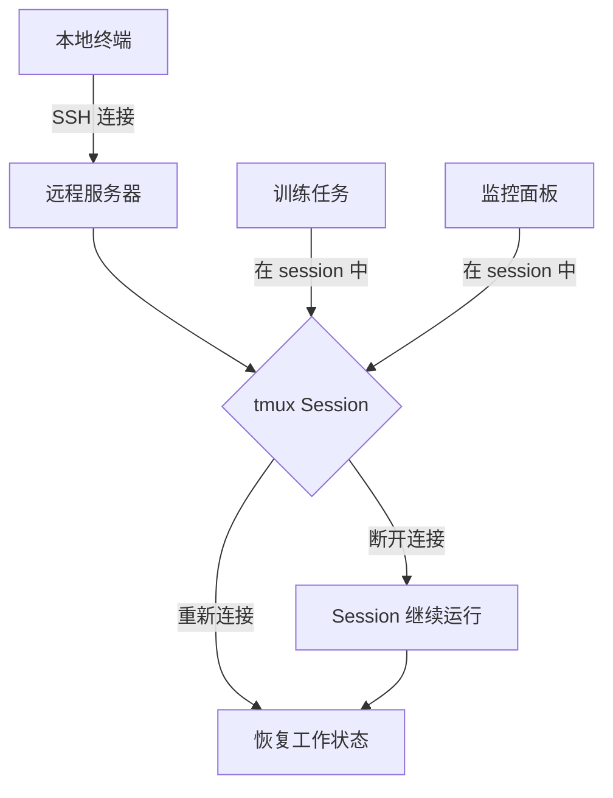
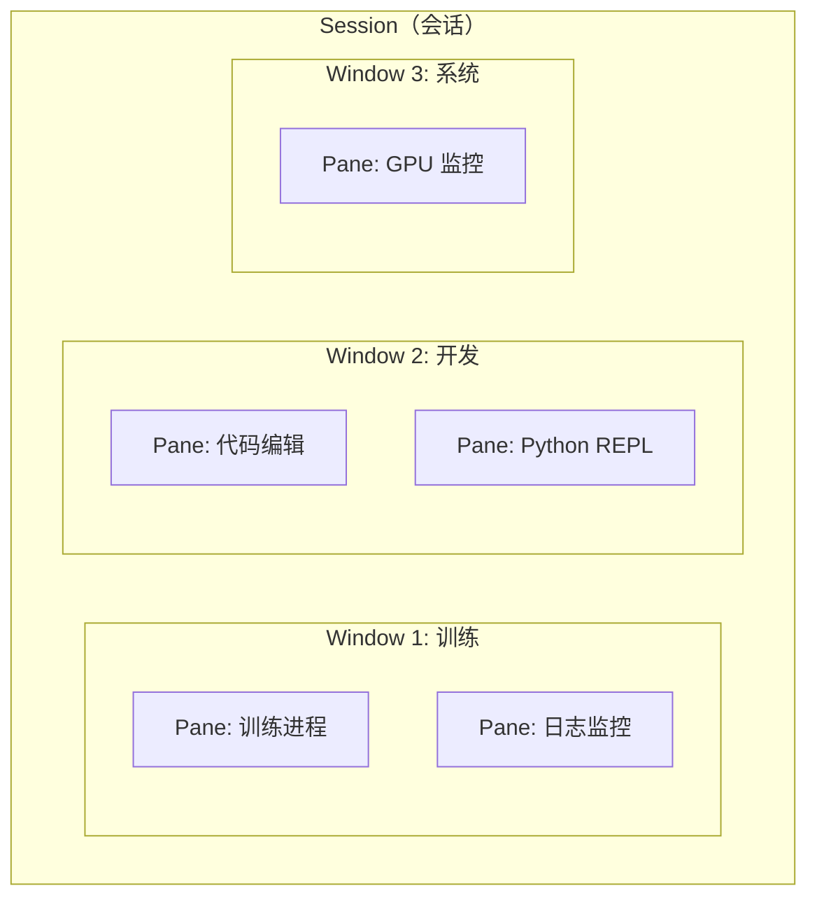
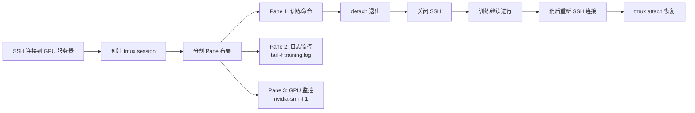
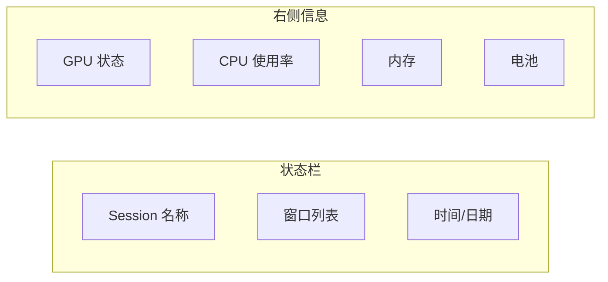

> [!summary] 前情提要
> **作案动机**：希望使用终端更加高效，特别是在云端算力平台训练模型时保持会话持久化
> - 任务：
>   1. [x] 熟悉基本概念
>   2. [x] 配置顺手快捷键
>   3. [x] 美化显示

---

## 1. 背景与定义

### 什么是 tmux？

**tmux**（Terminal Multiplexer，终端复用器）是一款开源的终端复用工具，它允许用户在单个终端窗口中运行多个独立的终端会话，并且在 SSH 连接断开后仍能保持会话持续运行。

> *来源：[Tmux 官方 GitHub 仓库](https://github.com/tmux/tmux)*

当你通过 SSH 连接到远程服务器时，是否曾遇到以下困境：

- 正在进行深度学习模型训练，SSH 连接突然断开，几个小时的工作付诸东流
- 需要同时监控多个终端：训练日志、GPU 状态、代码调试
- 希望在离开电脑后回来还能继续之前的工作

tmux 正是为解决这些问题而设计的。



> *概念参考：[Tmux 官方文档](https://man.openbsd.org/tmux.1)*

---

## 2. 核心概念解释

tmux 的架构由三个核心层次组成：**Session（会话）**、**Window（窗口）** 和 **Pane（面板）**。



### 2.1 Session（会话）

**Session** 是 tmux 的最顶层容器，代表一个独立的工作环境。你可以为一个项目创建一个 session，例如 `ml-training`，所有的 window 都属于这个 session。

- **持久化**：即使 SSH 连接断开，session 仍会在服务器上保持运行
- **可切换**：可以同时运行多个 session，通过 `tmux attach` 重新连接

### 2.2 Window（窗口）

**Window** 相当于浏览器中的标签页，一个 session 可以包含多个 window。每个 window 占据整个屏幕，可以通过快捷键在不同 window 间切换。

### 2.3 Pane（面板）

**Pane** 是 tmux 最强大的功能之一——它允许你在一个 window 内分割出多个终端区域。你可以水平或垂直分割，实现「一边训练模型，一边查看日志，一边编写代码」的工作流。

### 2.4 Prefix Key（前缀键）

tmux 的所有快捷键都需要以前缀键开头，默认为 `Ctrl+b`（简写为 `C-b`）。这意味着如果你想执行某个快捷键操作，需要先按下 `C-b`，松开后再按对应的功能键。

---

## 3. 云端算力平台训练场景

### 3.1 为什么深度学习训练需要 tmux？

在云端算力平台（如 RunPod、Lambda Labs、Paperspace、Vast.ai 等）训练模型时，会遇到以下挑战：

| 挑战 | 说明 | tmux 解决方案 |
|------|------|---------------|
| **SSH 断开** | 网络不稳定导致训练中断 | Session 持久化，进程不中断 |
| **长时间训练** | 模型训练可能需要数小时甚至数天 | 后台持续运行，无需保持连接 |
| **多任务并行** | 同时运行多个实验/预处理 | 多 window/pane 分屏管理 |
| **资源监控** | 需要实时查看 GPU/CPU 状态 | 分屏显示，一目了然 |

> *来源：[RunPod 官方文档 - Using TMUX for persistent sessions](https://docs.runpod.io/tips-and-tricks/tmux)*

### 3.2 典型训练工作流



### 3.3 RunPod 官方推荐配置

根据 RunPod 官方文档，tmux 是管理远程训练任务的首选工具：

> *来源：[RunPod Documentation - Persistent sessions with TMUX](https://docs.runpod.io/tips-and-tricks/tmux)*

```bash
# 安装 tmux
apt-get update && apt-get install -y tmux

# 创建训练 session
tmux new -s training

# 在 session 中运行训练
python train.py --model resnet50 --epochs 100

# 按 C-b d 分离 session（detach）
# 训练继续在后台运行

# 稍后恢复 session
tmux attach -t training
```

---

## 4. 快速入门命令

### 4.1 安装 tmux

```bash
# Ubuntu / Debian
sudo apt update && sudo apt install tmux

# macOS
brew install tmux

# CentOS / RHEL
sudo yum install tmux
```

### 4.2 基础命令一览

| 操作 | 命令 | 说明 |
|------|------|------|
| **创建新 session** | `tmux new -s <name>` | 创建并进入名为 `<name>` 的 session |
| **列出所有 session** | `tmux ls` | 显示当前服务器上的 session |
| **进入 session** | `tmux a -t <name>` 或 `tmux attach -t <name>` | 重新连接到指定 session |
| **分离 session** | `C-b d`（在 session 内） | 退出但保持 session 运行 |
| **杀死 session** | `tmux kill-session -t <name>` | 终止指定 session |
| **重命名 session** | `C-b $` | 在 session 内重命名当前 session |

---

## 5. 快捷键完全指南

### 5.1 前缀键与基本操作

**默认前缀键**：`Ctrl+b`（`C-b`）

> *来源：[Tmux Cheat Sheet - David Graf](https://grafdavid.com/cheatsheets/tmux/)*

| 快捷键 | 功能 | 说明 |
|--------|------|------|
| `C-b d` | 分离当前 session | 退出但保持运行 |
| `C-b $` | 重命名当前 session |  |
| `C-b s` | 列出并切换 session |  |
| `C-b :` | 进入 tmux 命令行 |  |

### 5.2 Window（窗口）操作

| 快捷键 | 功能 | 说明 |
|--------|------|------|
| `C-b c` | 创建新 window |  |
| `C-b ,` | 重命名当前 window |  |
| `C-b n` | 切换到下一个 window | next |
| `C-b p` | 切换到上一个 window | previous |
| `C-b 0-9` | 切换到指定编号的 window |  |
| `C-b l` | 切换到上一个 active 的 window | last |
| `C-b w` | 列出所有 window |  |
| `C-b &` | 关闭当前 window | 确认后杀死 |

### 5.3 Pane（面板）操作

| 快捷键 | 功能 | 说明 |
|--------|------|------|
| `C-b %` | 垂直分割 | 左侧/右侧 |
| `C-b "` | 水平分割 | 上方/下方 |
| `C-b o` | 在 pane 间切换 | 按顺序循环 |
| `C-b 方向键` | 切换到指定方向的 pane |  |
| `C-b ;` | 切换到上一个 active 的 pane |  |
| `C-b x` | 关闭当前 pane | 确认后杀死 |
| `C-b z` | 放大/还原当前 pane | zoom 模式 |
| `C-b 空格` | 切换 pane 布局 | 平铺/堆叠等 |
| `C-b {` | 与左 pane 交换位置 |  |
| `C-b }` | 与右 pane 交换位置 |  |
| `C-b M-方向键` | 调整 pane 大小 | Meta + 方向键 |

### 5.4 复制模式

| 快捷键 | 功能 | 说明 |
|--------|------|------|
| `C-b [` | 进入复制模式 |  |
| `v` | 开始选择 | （在复制模式内） |
| `y` | 复制选中的内容 |  |
| `q` | 退出复制模式 |  |
| `C-b ]` | 粘贴 |  |

---

## 6. 高效配置与快捷键自定义

### 6.1 推荐配置 ~/.tmux.conf

以下是一个经过优化的 tmux 配置，将前缀键改为 `C-a`（更符合人体工程学），并添加了许多实用功能：

```bash
# ~/.tmux.conf

# ========== 基础设置 ==========

# 将前缀键从 C-b 改为 C-a
set -g prefix C-a
unbind C-b
bind C-a send-prefix

# 启用鼠标支持
set -g mouse on

# 设置 escape 时间（快速响应）
set -sg escape-time 0

# 启动 UTF-8 支持
set -g utf8 on
set -g status-utf8 on

# ========== 窗口与面板索引 ==========

# 窗口从 1 开始编号
set -g base-index 1
setw -g pane-base-index 1

# ========== 状态栏 ==========

# 刷新状态栏频率（秒）
set -g status-interval 1

# 状态栏位置（顶部/底部）
set -g status-position bottom

# 窗口活动状态通知
setw -g monitor-activity on
set -g visual-activity on

# ========== 快捷键绑定 ==========

# 重新加载配置
bind r source-file ~/.tmux.conf \; display "Config reloaded!"

# | 垂直分割（更好记）
bind | split-window -h

# - 水平分割
bind - split-window -v

# HJKL 面板导航（Vim 风格）
bind h select-pane -L
bind j select-pane -D
bind k select-pane -U
bind l select-pane -R

# 调整面板大小
bind -r H resize-pane -L 5
bind -r J resize-pane -D 5
bind -r K resize-pane -U 5
bind -r L resize-pane -R 5

# 窗口快速切换
bind -r n next-window
bind -r p previous-window

# ========== 美化设置 ==========

# 状态栏颜色
set -g status-bg colour234
set -g status-fg colour255

# 窗口标题栏
setw -g window-status-bg colour234
setw -g window-status-fg colour249
setw -g window-status-current-bg colour235
setw -g window-status-current-fg colour228
setw -g window-status-activity-bg colour235
setw -g window-status-activity-fg colour228

# 面板边框颜色
set -g pane-border-fg colour235
set -g pane-border-bg colour234
set -g pane-active-border-fg colour228
set -g pane-active-border-bg colour234

# 消息提示
set -g message-bg colour235
set -g message-fg colour228
set -g display-time 2000
```

### 6.2 配置加载与生效

```bash
# 创建配置文件
touch ~/.tmux.conf
vim ~/.tmux.conf  # 粘贴上面的配置

# 在 tmux 内重新加载配置
C-b r

# 或者在命令行重新加载
tmux source-file ~/.tmux.conf
```

> *来源：[Tmux.conf with commentary - Will Richardson](https://willhbr.net/2024/03/06/tmux-conf-with-commentary/)*

### 6.3 插件推荐（TPM）

使用 [Tmux Plugin Manager (TPM)](https://github.com/tmux-plugins/tpm) 管理插件：

```bash
# 安装 TPM
git clone https://github.com/tmux-plugins/tpm ~/.tmux/plugins/tpm

# 在 ~/.tmux.conf 末尾添加：
set -g @plugin 'tmux-plugins/tpm'
set -g @plugin 'tmux-plugins/tmux-sensible'
set -g @plugin 'tmux-plugins/tmux-resurrect'  # 保存恢复 session
set -g @plugin 'tmux-plugins/tmux-continuum'  # 自动保存

# 在 tmux 内按 C-b I 安装插件
```

---

## 7. 主题美化方案

### 7.1 Dracula 主题

Dracula 是最受欢迎的 tmux 深色主题之一，提供丰富的状态信息显示：



> *来源：[Dracula tmux - GitHub](https://github.com/dracula/tmux)*

**安装方式：**

```bash
# 方式一：通过 TPM 安装
# 在 ~/.tmux.conf 添加：
set -g @plugin 'dracula/tmux'

# 方式二：手动安装
git clone https://github.com/dracula/tmux.git ~/.dracula-tmux
```

然后在 `~/.tmux.conf` 末尾添加：

```bash
# Dracula 主题配置
source-file ~/.dracula-tmux/dracula.conf

# 可选：启用 GPU 监控
set -g @dracula-show-powerline true
set -g @dracula-show-gpu true
set -g @dracula-show-cpu true
```

### 7.2 Powerline 风格

Powerline 状态栏是经典的终端美化方案：

```bash
# 使用 gpakosz 的 Oh My Tmux
git clone https://github.com/gpakosz/.tmux.git ~/.tmux
ln -s -f ~/.tmux/.tmux.conf ~/.tmux.conf
```

这个配置自带：
- 电池状态
- 日期时间
- GPU 使用率
- SSH 会话信息

### 7.3 状态栏自定义示例

如果你想手动配置状态栏信息：

```bash
# 左侧：窗口列表
set -g status-left "#[fg=colour235,bg=colour228] #S #[fg=colour228,bg=colour234] "

# 中间：窗口编号 + 名称
set -g window-status-format " #I: #W "
set -g window-status-current-format "#[fg=colour234,bg=colour228] #I: #W #[fg=colour228,bg=colour235] "

# 右侧：时间
set -g status-right "#[fg=colour235,bg=colour234] %Y-%m-%d %H:%M "
```

---

## 8. 高级使用技巧

### 8.1 训练任务工作流示例

```bash
# ============================================
# 场景：在 RunPod 上训练 LLaMA 模型
# ============================================

# Step 1: SSH 连接到 RunPod
ssh user@runpod-host

# Step 2: 创建专用 session
tmux new -s llm-training

# Step 3: 分割布局 (3:1 比例)
# C-b |  垂直分割
# C-b %  垂直分割
# 调整：C-b M-h/j/k/l

# Pane 1 (70%): 主训练进程
python train.py \
    --model_name_or_path meta-llama/Llama-2-7b-hf \
    --dataset your_dataset \
    --output_dir ./outputs \
    --num_train_epochs 3 \
    --per_device_train_batch_size 4 \
    --gradient_accumulation_steps 8

# Pane 2 (15%): 实时日志监控
tail -f outputs/training.log

# Pane 3 (15%): GPU 监控
watch -n 1 nvidia-smi

# Step 4: 分离 session
# 按 C-b d

# Step 5: 关闭本地 SSH，训练继续
# ...

# Step 6: 稍后恢复查看
tmux attach -t llm-training
```

### 8.2 多实验并行管理

```bash
# 创建多个 session，每个实验一个
tmux new -s exp-001    # 实验 1
tmux new -s exp-002    # 实验 2
tmux new -s exp-003    # 实验 3

# 列出所有实验
tmux ls

# 快速切换
tmux a -t exp-001
```

### 8.3 黄金法则：Always Use tmux

> *来源：[Persistent Sessions with tmux - Agent Factory](https://agentfactory.panaversity.org/docs/Agent-Workflow-Primitives/linux-mastery/persistent-sessions-tmux)*

在远程服务器上执行任何重要任务时，请遵循以下原则：

1. **永远**在 tmux session 中运行长时间任务
2. **永远**在开始工作前创建 session
3. **永远**在离开前执行 detach（`C-b d`）
4. **永远**定期检查 session 状态（`tmux ls`）

---

## 9. 常见问题与解决方案

| 问题 | 原因 | 解决方案 |
|------|------|----------|
| 鼠标选择不工作 | 鼠标支持未启用 | `set -g mouse on` |
| 快捷键不生效 | 配置文件未加载 | `tmux source-file ~/.tmux.conf` |
| 中文显示乱码 | UTF-8 编码问题 | `set -g utf8 on` |
| 状态栏不更新 | 刷新间隔太长 | `set -g status-interval 1` |
| 训练进程消失 | 未使用 tmux | 始终在 session 中运行 |
| 无法创建 session | 权限问题 | 检查 `/tmp` 目录权限 |

---

## 10. 资源汇总

### 10.1 官方与权威资源

1. [Tmux 官方 GitHub 仓库](https://github.com/tmux/tmux) — 源码与最新动态
2. [Tmux 官方手册](https://man.openbsd.org/tmux.1) — 完整命令参考
3. [Tmux Cheat Sheet](https://tmuxcheatsheet.com/) — 快捷键速查

### 10.2 教程与博客

1. [A beginner's guide to Tmux - Towards Data Science](https://towardsdatascience.com/a-beginners-guide-to-tmux-a-multitasking-superpower-for-your-terminal/) — 2026年2月
2. [Tmux Terminal Multiplexer Guide - StarMorph](https://blog.starmorph.com/blog/tmux-terminal-multiplexer-guide) — 2026年2月
3. [RunPod Documentation - Using TMUX](https://docs.runpod.io/tips-and-tricks/tmux) — 官方云平台指南

### 10.3 配置与主题

1. [Dracula tmux](https://github.com/dracula/tmux) — 最流行的深色主题
2. [Oh My Tmux - gpakosz](https://github.com/gpakosz/.tmux) — 开箱即用的美观配置
3. [The best tmux configuration - GitHub Gist](https://gist.github.com/nicolasochem/06476623d657329e514a) — 社区推荐

---

## 参考链接

1. [Tmux 官方 GitHub](https://github.com/tmux/tmux) — 官方仓库
2. [Tmux Cheat Sheet](https://tmuxcheatsheet.com/) — 快捷键速查表
3. [RunPod TMUX 文档](https://docs.runpod.io/tips-and-tricks/tmux) — 云平台使用场景
4. [Persistent Sessions with tmux](https://agentfactory.panaversity.org/docs/Agent-Workflow-Primitives/linux-mastery/persistent-sessions-tmux) — 训练场景指南
5. [Tmux.conf with commentary](https://willhbr.net/2024/03/06/tmux-conf-with-commentary/) — 配置详解
6. [Dracula tmux Theme](https://github.com/dracula/tmux) — 主题项目
7. [Beginner's guide to Tmux - tmuxai.dev](https://tmuxai.dev/tmux-getting-started/) — 入门指南
8. [Linux Handbook - Tmux Tutorial](https://linuxhandbook.com/tmux/) — 基础教程

---

> [!note] 更新日志
> - 2026-02-21: 完善云端训练场景、快捷键配置、美化方案
