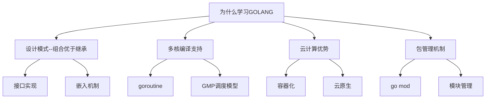
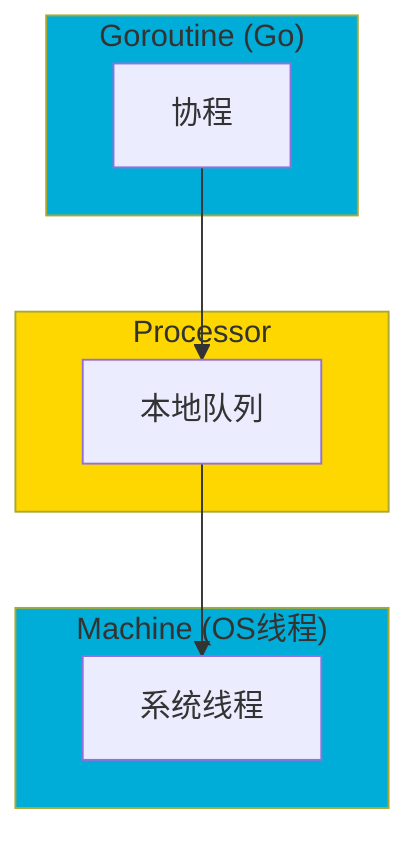
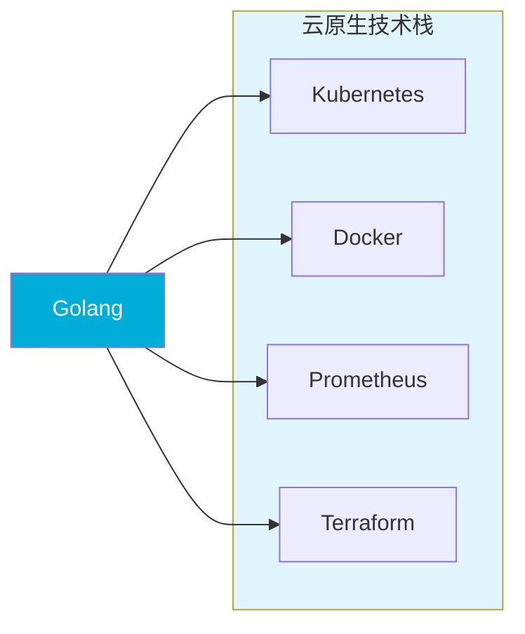
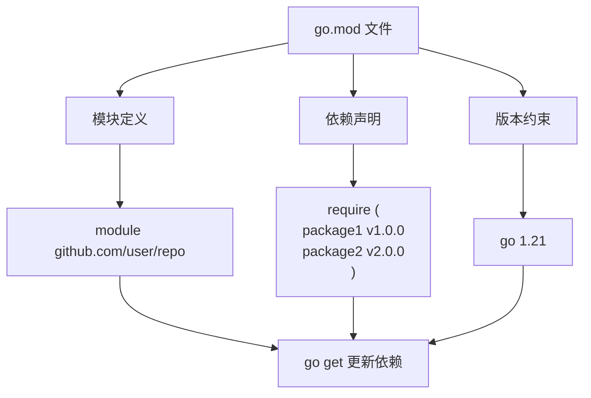
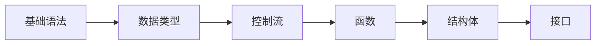
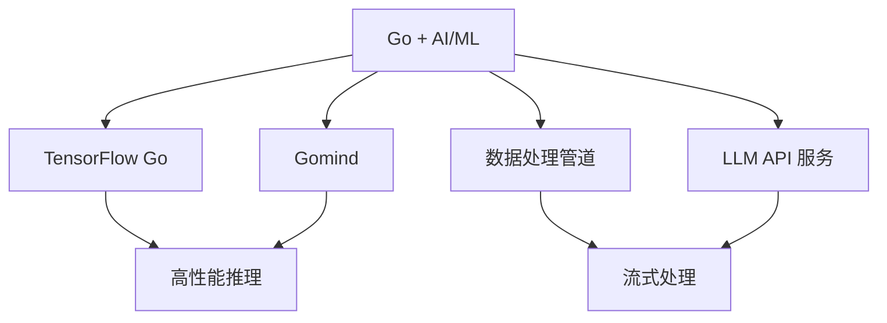

>[!summary] 前情提要
>- go 好语言



---

### 1. Go 语言核心优势概览

---

#### 1.1 简洁高效的编译与执行

Go 语言由 Google 于 2009 年正式发布，2012 年发布 1.0 版本。其设计目标是**简单、高效、安全**，特别适合现代分布式系统和云计算环境。

* 核心特性：
  - **静态编译**：生成单一可执行文件，无依赖
  - **快速编译**：编译器设计高效，编译速度远超 Java/C++
  - **垃圾回收**：内置 GC，内存管理自动化

* 参考来源：[Go Official Website](https://go.dev/)

---

#### 1.2 组合优于继承（Composition over Inheritance）

Go 语言**不支持传统的类继承**，而是采用**组合（Composition）**和**接口（Interface）**来实现代码复用。这是 Go 设计的核心理念之一。

**实现方式：**

```go
// 结构体嵌入（匿名成员）
type Animal struct {
    Name string
    Age  int
}

type Dog struct {
    Animal  // 匿名嵌入，等价于组合
    Breed   string
}

// 接口实现
type Speaker interface {
    Speak() string
}

func (d Dog) Speak() string {
    return "Woof!"
}
```

**为什么组合优于继承？**
- 避免继承层次过深导致的"脆弱基类"问题
- 更灵活的代码组合方式
- 编译时类型检查，减少运行时错误

* 参考来源：[Go Language Specification - Struct Types](https://go.dev/ref/spec#Struct_types)

---

#### 1.3 并发模型：goroutine 与 GMP 调度器

Go 语言最强大的特性之一是其**原生并发支持**，这是为多核时代专门设计的。



**核心概念：**

| 概念 | 说明 |
|------|------|
| **goroutine** | 轻量级协程，栈空间初始仅 2KB，可动态增长 |
| **GMP 模型** | G (goroutine) - M (machine/thread) - P (processor) 调度模型 |
| **工作窃取** | 负载均衡策略，提高 CPU 利用率 |

```go
// 并发示例：使用 goroutine 和 channel
func main() {
    ch := make(chan int)
    
    go func() {
        ch <- 42  // 发送数据
    }()
    
    result := <-ch  // 接收数据
    fmt.Println(result)
}
```

**性能优势：**
- 单个 goroutine 栈空间仅 **2KB**（线程约 1MB）
- 可轻松创建**数十万**个 goroutine
- channel 提供安全的协程间通信

* 参考来源：[Go Concurrency Patterns - Google](https://go.dev/blog/waza-talk)

---

#### 1.4 云计算与云原生时代的首选语言

Go 语言已成为**云原生（Cloud Native）**时代的标准语言。



**云原生领域的 Go 应用：**

| 项目 | 类型 | 说明 |
|------|------|------|
| **Kubernetes** | 容器编排 | 云原生操作系统 |
| **Docker** | 容器运行时 | 容器化标准 |
| **Prometheus** | 监控 | CNCF 毕业项目 |
| **Terraform** | IaC | 基础设施即代码 |
| **Etcd** | 分布式存储 | Kubernetes 后端 |
| **Helm** | 包管理 | Kubernetes 包管理器 |

* 最新报道：[The Go Programming Language in 2024 - Go Blog](https://go.dev/blog/go1.23)
* 参考来源：[Cloud Native Computing Foundation](https://www.cncf.io/)

---

#### 1.5 现代包管理机制（Go Modules）

Go 1.11 引入的 **Go Modules** 彻底解决了依赖管理问题。



**核心命令：**

```bash
# 初始化模块
go mod init github.com/username/project

# 添加依赖
go get github.com/pkg/errors

# 更新所有依赖
go get -u

# 清理未使用的依赖
go mod tidy
```

**优势：**
- **版本语义化**：遵循 SemVer 规范
- **代理支持**：可配置模块代理（如 Go Module Proxy）
- **离线构建**：依赖可缓存，支持离线编译

* 参考来源：[Go Modules Reference](https://go.dev/ref/mod)

---

### 2. Go 语言学习路线图

---

#### 2.1 基础阶段（1-2 个月）



- 变量、常量、数据类型
- 流程控制（if, for, switch）
- 函数定义与多返回值
- 结构体与方法
- 接口与多态

---

#### 2.2 并发阶段（1 个月）

- goroutine 基础
- channel 通信
- Select 多路复用
- 同步原语（sync 包）
- 竞态条件与数据竞争

---

#### 2.3 实战阶段（2-3 个月）

- Web 开发（Go + Gin/Chi）
- 数据库操作（SQL + ORM）
- RESTful API 设计
- 微服务基础
- 容器化部署（Docker + K8s）

---

### 3. Go 语言生态与发展趋势

---

#### 3.1 2024-2025 年最新动态

- **Go 1.23** (2024年8月发布)：引入新的 range over func 迭代器，改进性能
- **Go 1.22** (2024年2月发布)：range over integers，改进路由匹配

* 最新报道：[Go 1.23 Release Notes](https://go.dev/doc/go1.23)

#### 3.2 Go 在 AI/ML 领域的应用



Go 越来越多地用于：
- ML 模型的高性能推理服务
- 大数据处理管道
- LLM API 网关

---

### 4. 总结与建议

---

#### 4.1 学习 Go 的核心理由

| 理由 | 说明 |
|------|------|
| 🚀 **高性能** | 接近 C 的执行效率，编译快速 |
| 🔄 **原生并发** | goroutine 轻松应对高并发场景 |
| ☁️ **云原生首选** | K8s、Docker 等核心技术栈 |
| 📦 **部署简单** | 单一二进制，无依赖 |
| 🔧 **工具链完善** | 内置测试、性能分析、文档工具 |
| 📈 **发展趋势好** | 薪资待遇优，岗位需求大 |

#### 4.2 实践建议

1. **边学边练**：完成 Go By Example 的所有示例
2. **参与开源**：贡献 Go 项目或 Kubernetes 生态
3. **项目驱动**：实现一个 Web API 或微服务
4. **关注社区**：订阅 Go Blog，关注最新动态

---

### 5. 参考链接

1. [Go Official Website](https://go.dev/) — 官方网站
2. [Go Blog - Latest News](https://go.dev/blog) — 官方博客
3. [Go Modules Reference](https://go.dev/ref/mod) — 模块管理文档
4. [A Tour of Go](https://go.dev/tour/) — 交互式教程
5. [Go By Example](https://gobyexample.com/) — 示例学习
6. [Kubernetes - Production-Grade Container Orchestration](https://kubernetes.io/) — K8s 官网
7. [Cloud Native Computing Foundation](https://www.cncf.io/) — CNCF 基金会
8. [The Go Programming Language - Wikipedia](https://en.wikipedia.org/wiki/Go_(programming_language)) — 维基百科

---

> 💡 **扩展建议**：您可以继续完善以下方向
> - 添加具体的代码示例
> - 介绍 Go 与其他语言的对比（如 Python、Java）
> - 分享实际项目经验
> - 添加面试常见问题
