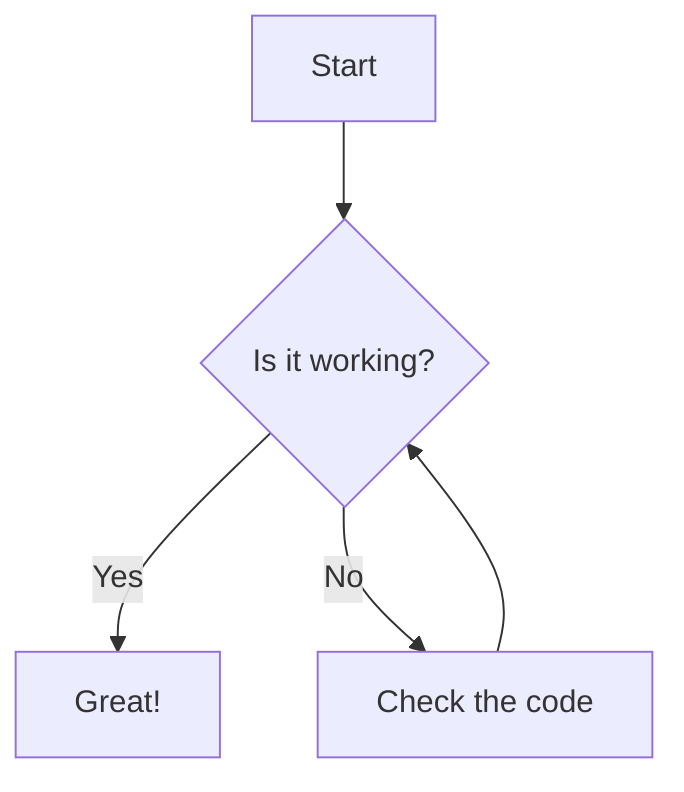

## 当前阶段需要完成
1. [ ] 在OBSIDIAN中完成 formatter yaml 模板(添加 动态图片链接 更新时间)
2. [x] 导入直接的域名 国内加速
3. [ ] 使用`Crontab` 完成 每周/天 固定时间段 更新（或者 ~~监控 draft 字段变化动态更新 ，消耗过大~~）
4. [-] 支持更多的markdown语法 
	1. [x] obsidian   callout 语法
	2. [x] 支持mermaid
	3. [ ] tikz hugo实现不了（hugo没有插件系统，无法做到部署前执行），直接截图吧 
5. [ ] 添加`formatter` 字段 天气 坐标 该文档的 `git log`
6. [ ] 添加 DIY`widget`  添加 访客统计 文章热度 站点运行时间等
7. [x] 完成备份 在`hugo-main`
8. [ ] 使用 obsidian中的 base 功能实现更加完善的 文档输出管理
9. [ ] sidebar 添加 PPT 展示 `slidev` 打包生成的 PPT页面
10. [ ] 完成基础的配置，就可以大写特写。
	1. [ ] 功能的添加先问：
		- 它对对外输出是否必要？
		- 它对自我写作的舒适是否有提升？
11. [ ] 确定写作的内容 以及标签规范


### FQA
1. [x] hugo 打包 content中 md的规则是什么？ 看看源码？
2. [ ] 我的 paginate 现在翻页 文章数量为什么没有生效？
3. [ ] obsidian中的 base 数据库管理是否需要跟进？ 感觉不太必要

---
## 效果验证
### 常见的markdown `yaml`字段
```yaml

```
### moreCode
```cpp
// DFS for finding bridges in an undirected graph
#include <iostream>
#include <vector>
using namespace std;
const int MAXN = 1000;
vector<int> graph[MAXN];
bool visited[MAXN];
int disc[MAXN], low[MAXN], parent[MAXN];
int timeCounter = 0;
void DFS(int u) {
	visited[u] = true;
	disc[u] = low[u] = ++timeCounter;

	for (int v : graph[u]) {
		if (!visited[v]) {
			parent[v] = u;
			DFS(v);
			low[u] = min(low[u], low[v]);

			if (low[v] > disc[u]) {
				cout << "Bridge found: " << u << " -- " << v << endl;
			}
		} else if (v != parent[u]) {
			low[u] = min(low[u], disc[v]);
		}
	}
}
int main() {
	// Example graph initialization
	graph[0] = {1, 2};
	graph[1] = {0, 2};
	graph[2] = {0, 1, 3};
	graph[3] = {2, 4};
	graph[4] = {3};

	for (int i = 0; i < 5; i++) {
		if (!visited[i]) {
			DFS(i);
		}
	}
	return 0;
}
```
### Callout

> [!ABSTRACT] This paper discusses the advantages of microservice architecture

> [!CAUTION] Ensure all tests pass before merging to main branch

> [!CODE] Execute `npm install` to install all dependencies

> [!CONCLUSION] We've decided to implement Docker containerization

> [!DANGER] Critical security vulnerability detected in the system

> [!ERROR] Error: Unable to connect to database. Please check your connection settings

> [!EXAMPLE] Git commit message format: "feat: add user authentication"

> [!EXPERIMENT] Testing new caching strategy with Redis

> [!GOAL] Reduce service response time by 30% by the end of this quarter

> [!IDEA] Implement a machine learning-based code quality detection system

> [!IMPORTANT] Please review and update your security settings

> [!INFO] Current system status: All services are operating normally with 99.9% uptime

> [!MEMO] Technical review meeting scheduled for next Tuesday at 2:00 PM

> [!NOTE] Always backup your data before performing system updates

> [!NOTIFY] System notification: Your password will expire in 30 days

> [!QUESTION] How can we optimize database query performance?

> [!QUOTE] "Code is like humor. When you have to explain it, it's bad." - Cory House

> [!SUCCESS] Congratulations! Your code has been successfully deployed to production

> [!TASK] Review and update API documentation by Friday

> [!TIP] Use `Ctrl + C` to quickly terminate a running program

> [!WARNING] Warning: This operation will delete all data

#### Foldable Admonitions

> [!NOTE]- Here are the details regarding API usage:
>
> - **Endpoint**: `/api/v1/users` is used to fetch the user list.
> - **Authentication**: A valid `Bearer` token must be provided in the request header.
> - **Rate Limiting**: 100 requests are allowed per minute.

> [!TIP]- Click here to view the tips

#### Nested Admonitions

> [!question] Can admonitions be nested?
> > [!todo] Yes!, they can.
> > > [!example]  You can even use multiple layers of nesting.
### mermaid diagram
- 需要添加 `mermaid: true` 到 yaml 头部

- themes stack 有过度防御 修改 `render-codeblock-mermaid.html`
```html
<pre class="mermaid">

{{ .Inner}}

</pre>

{{ .Page.Store.Set "hasMermaid" true }}
```
### TikZ
- 做不了放弃
```tikz
\documentclass{standalone}
\usepackage{tikz}
\begin{document}
\begin{tikzpicture}
	% Draw a rectangle
	\draw (0,0) rectangle (4,2);
	% Draw a circle
	\draw (2,1) circle (0.5);
	% Draw a line
	\draw (0,0) -- (4,2);
\end{tikzpicture}
\end{document}
```
<script type="text/tikz">
\begin{tikzpicture}
  \draw (0,0) circle (1);
\end{tikzpicture}
</script>


---
## 参考资料
1. [Tikz](https://prinsss.github.io/graphics-with-tikz-in-hexo/#tldr)
2. [hugo 中添加Tikz](https://enriqueacosta.github.io/blog/en/posts/creating-this-blog-part-4/)
3. [mermaid配置](https://navendu.me/posts/adding-diagrams-to-your-hugo-blog-with-mermaid/?utm_source=chatgpt.com)
4. [callout 语法](https://anthonyirwin.com/blog/tech/programming/hugo/setting-up-hugo-admonitions/)