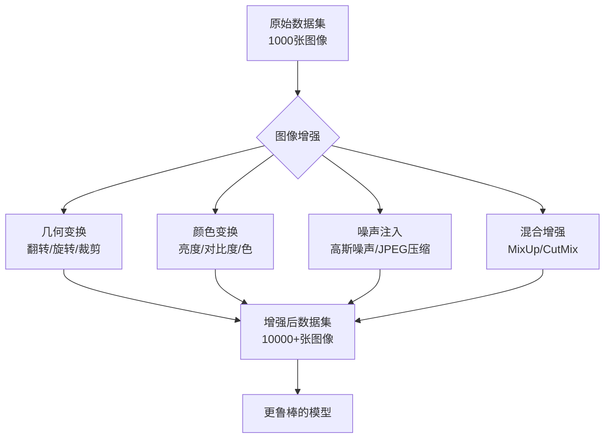
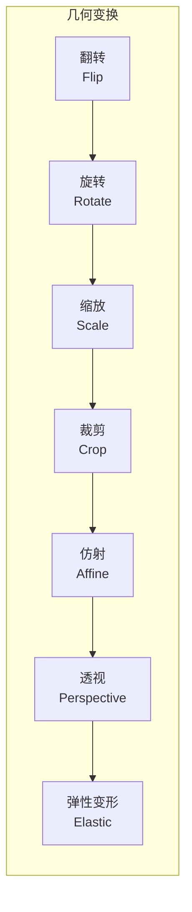
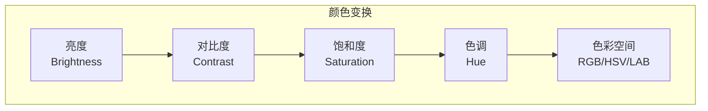
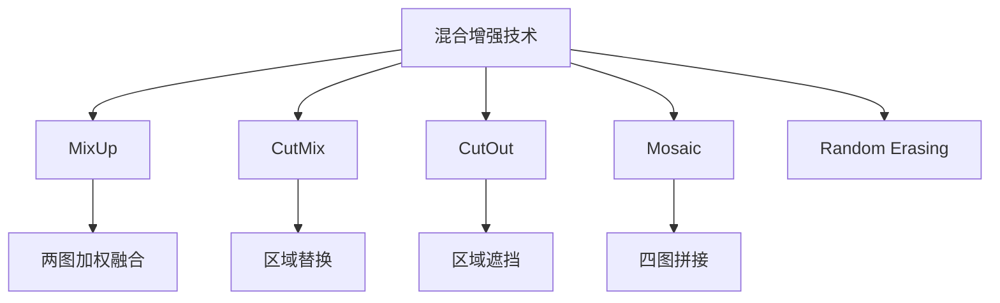
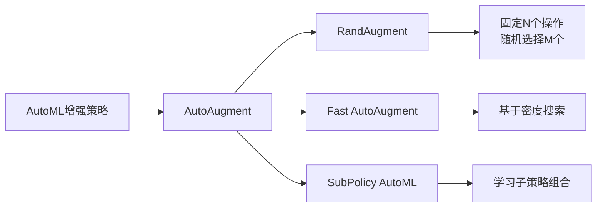
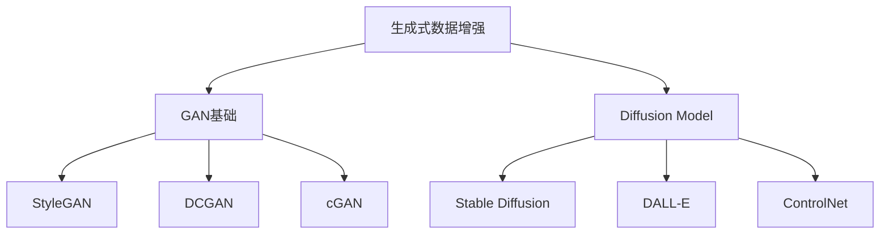
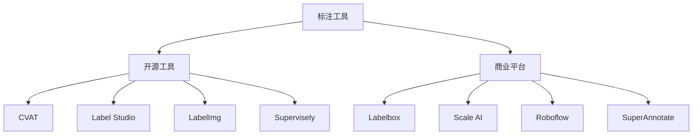
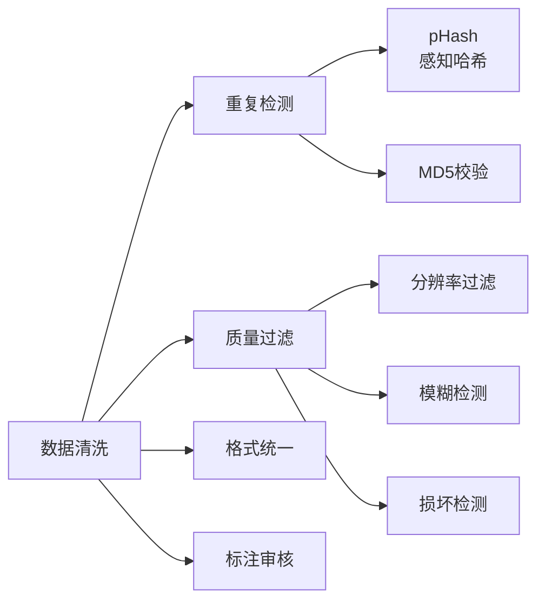
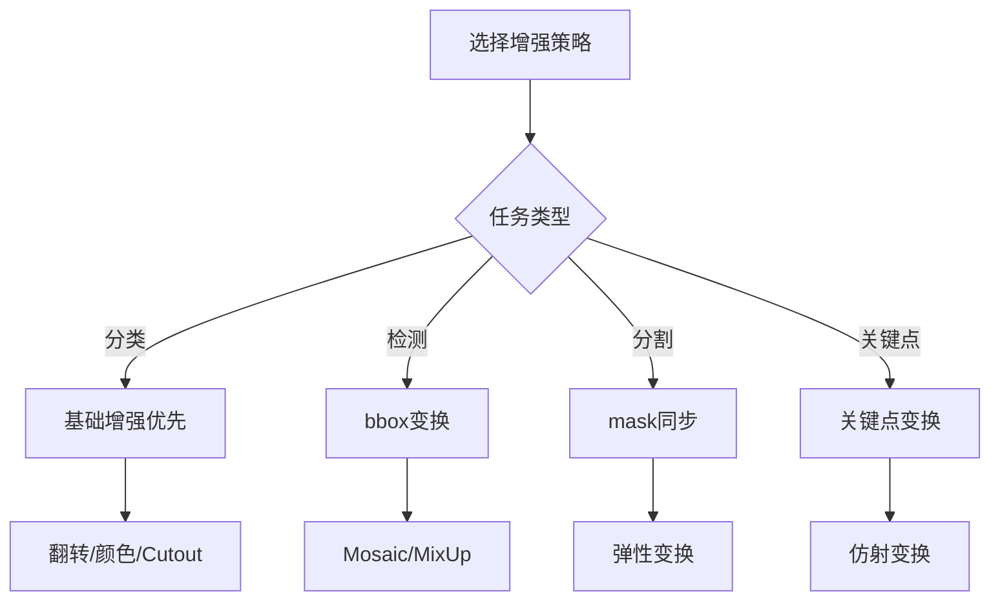

> [!summary] 前情提要
> **作案动机**：构建高质量的图像数据集是计算机视觉项目成功的关键，而数据增强是提升模型泛化能力的最有效手段之一
> - 任务：
>   1. [x] 了解图像增强的核心概念与重要性
>   2. [x] 掌握主流Python库的使用方法
>   3. [x] 学习各种增强技术的原理与参数
>   4. [x] 熟悉数据集标注工具与格式
>   5. [x] 了解最新的基于深度学习的增强技术

---

## 1. 背景与定义

### 1.1 什么是图像增强？

**图像增强**（Image Augmentation）是一种通过创建原始图像的变体来增加训练数据多样性、数量和复杂性的技术。在深度学习，尤其是计算机视觉领域，高质量的大规模数据集是训练强大模型的基础。然而，获取和标注大量真实图像往往耗时且成本高昂。图像增强通过人为地引入变化，有效解决了这一难题。

> *来源：[Albumentations 官方文档](https://albumentations.ai/docs/)*

图像增强的核心价值体现在以下几个方面：

- **缓解过拟合**：通过增加数据多样性，减少模型对训练数据的过拟合
- **提高泛化能力**：使模型能够更好地处理真实世界中的各种变化
- **平衡数据集**：通过过采样少数类来解决数据不平衡问题
- **模拟真实场景**：添加噪声、天气变化、光照变化等真实世界的干扰因素



### 1.2 为什么要构建专业的数据集？

在实际的计算机视觉项目中，通用数据集（如 ImageNet、COCO）往往无法满足特定领域的需求。构建自定义数据集成为必然选择：

| 需求场景 | 通用数据集局限性 | 自定义数据集优势 |
|----------|------------------|------------------|
| 工业缺陷检测 | 无此类缺陷样本 | 针对特定产品缺陷 |
| 医学影像 | 隐私与专业性限制 | 符合医疗标准 |
| 自动驾驶 | 特定场景覆盖不足 | 目标场景全覆盖 |
| 零售场景 | 商品种类差异大 | 特定商品识别 |

> *来源：[Roboflow 官方博客 - 数据增强工具指南](https://blog.roboflow.com/data-augmentation-tools/)*

---

## 2. 核心Python库详解

### 2.1 库对比概览

在Python生态中，存在多个成熟的图像增强库。根据2024-2025年的性能基准测试，各库的特点如下：

> *来源：[Albumentations 性能基准测试](https://albumentations.ai/docs/benchmarks/image-benchmarks/)*

| 库名称 | GitHub星标 | 性能 | _transform数量_ | PyTorch集成 | 特点 |
|--------|------------|------|----------------|-------------|------|
| **Albumentations** | 13k+ | 最快 | 70+ | 优秀 | 速度最快，支持非RGB数据 |
| **torchvision** | - | 中等 | 30+ | 原生 | PyTorch官方，简单易用 |
| **imgaug** | 12k+ | 较慢 | 50+ | 一般 | 功能丰富，社区活跃 |
| **Kornia** | 8k+ | 较慢 | 40+ | 优秀 | GPU加速，PyTorch生态 |
| **Augmentor** | 3k+ | 中等 | 30+ | 一般 | 简单直观，流水线式 |

### 2.2 Albumentations 深度解析

**Albumentations** 是目前最受欢迎的图像增强库，以其卓越的性能和丰富的变换著称。

> *来源：[Albumentations GitHub](https://github.com/albumentations-team/albumentations)*

```python
import albumentations as A
from albumentations.pytorch import ToTensorV2
import cv2
import numpy as np

# 定义增强流水线
transform = A.Compose([
    # 几何变换
    A.RandomRotate90(p=0.5),
    A.Flip(p=0.5),
    A.ShiftScaleRotate(shift_limit=0.1, scale_limit=0.1, rotate_limit=45, p=0.5),
    A.RandomCrop(width=256, height=256, p=0.3),
    A.OneOf([
        A.ElasticTransform(alpha=120, sigma=120 * 0.05, alpha_affine=120 * 0.03, p=0.5),
        A.GridDistortion(p=0.5),
        A.OpticalDistortion(distort_limit=1, shift_limit=0.5, p=0.5),
    ], p=0.3),
    
    # 颜色变换
    A.OneOf([
        A.MotionBlur(blur_limit=7, p=0.5),
        A.MedianBlur(blur_limit=7, p=0.5),
        A.GaussianBlur(blur_limit=7, p=0.5),
        A.Blur(blur_limit=7, p=0.5),
    ], p=0.3),
    A.CLAHE(clip_limit=4.0, tile_grid_size=(8, 8), p=0.5),
    A.RandomBrightnessContrast(brightness_limit=0.2, contrast_limit=0.2, p=0.5),
    A.RandomGamma(gamma_limit=(80, 120), p=0.5),
    A.HueSaturationValue(hue_shift_limit=20, sat_shift_limit=30, val_shift_limit=20, p=0.5),
    
    # 噪声与Dropout
    A.OneOf([
        A.GaussNoise(var_limit=(10.0, 50.0), p=0.5),
        A.ISONoise(color_shift=(0.01, 0.05), intensity=(0.1, 0.5), p=0.5),
    ], p=0.2),
    A.CoarseDropout(max_holes=8, max_height=32, max_width=32, p=0.2),
    
    # 归一化与转换
    A.Normalize(mean=(0.485, 0.456, 0.406), std=(0.229, 0.224, 0.225)),
    ToTensorV2(),
])

# 应用增强
image = cv2.imread("image.jpg")
image = cv2.cvtColor(image, cv2.COLOR_BGR2RGB)
transformed = transform(image=image)
transformed_image = transformed["image"]
```

**关键特性**：

- **高性能**：使用OpenCV作为后端，比其他库快2-10倍
- **丰富的变换**：70+种变换，包括高级技术如CutMix、GridMask
- **多任务支持**：支持图像分类、目标检测、分割、关键点检测等多种任务
- **非RGB支持**：支持医学图像（16位）、深度图等多通道数据

### 2.3 torchvision.transforms 使用指南

作为PyTorch官方库，`torchvision.transforms` 是最易用的选择：

```python
import torchvision.transforms as transforms
from PIL import Image

# 定义变换流水线
transform = transforms.Compose([
    transforms.RandomResizedCrop(224, scale=(0.8, 1.0)),
    transforms.RandomHorizontalFlip(p=0.5),
    transforms.RandomRotation(degrees=15),
    transforms.ColorJitter(brightness=0.2, contrast=0.2, saturation=0.2, hue=0.1),
    transforms.RandomAffine(degrees=0, translate=(0.1, 0.1), scale=(0.9, 1.1)),
    transforms.ToTensor(),
    transforms.Normalize(mean=[0.485, 0.456, 0.406], std=[0.229, 0.224, 0.225]),
    transforms.RandomErasing(p=0.3, scale=(0.02, 0.2)),
])

# 应用变换
image = Image.open("image.jpg")
transformed_image = transform(image)
```

### 2.4 Kornia - GPU加速增强

Kornia 是基于PyTorch的计算机视觉库，支持GPU加速的图像变换：

```python
import kornia
import torch

# 定义增强流水线
transform = kornia.augmentation.AugmentationSequential(
    kornia.augmentation.RandomHorizontalFlip(p=0.5),
    kornia.augmentation.ColorJitter(0.1, 0.1, 0.1, 0.1, p=0.5),
    kornia.augmentation.RandomRotation(degrees=15.0, p=0.5),
    kornia.augmentation.RandomAffine(degrees=0, translate=(0.1, 0.1), p=0.5),
    kornia.augmentation.RandomPerspective(distortion_scale=0.5, p=0.5),
    data_keys=["image"],
)

# 应用变换 - 支持GPU
image = torch.rand(1, 3, 224, 224)  # Batch size = 1
transformed_image = transform(image)
```

> *来源：[Kornia 官方文档](https://kornia.readthedocs.io/)*

---

## 3. 核心增强技术详解

### 3.1 几何变换

几何变换是最基础也是最有效的增强手段，它们通过改变图像的空间结构来增加数据多样性。



#### 3.1.1 翻转（Flip）

| 变换 | 参数 | 说明 |
|------|------|------|
| 水平翻转 | `p=0.5` | 最常用，对大多数场景安全 |
| 垂直翻转 | `p=0.5` | 注意目标方向（如文字不应垂直翻转） |
| 对角翻转 | - | 结合水平和垂直翻转 |

```python
# Albumentations
A.HorizontalFlip(p=0.5),
A.VerticalFlip(p=0.5),
```

#### 3.1.2 旋转（Rotation）

| 参数 | 推荐范围 | 说明 |
|------|----------|------|
| `degrees` | ±15°~±45° | 小角度更安全，大角度增加多样性 |
| `rotate_limit` | 15~45 | 随机旋转的范围 |

```python
# 安全范围内旋转
A.RandomRotate90(p=0.5),  # 90度的倍数
A.Rotate(limit=30, p=0.5),  # -30到+30度
```

#### 3.1.3 仿射与透视变换

- **仿射变换**：保持平行线的平行性，可实现平移、旋转、缩放、剪切
- **透视变换**：更灵活的变换，可产生3D视角效果

```python
A.Affine(
    scale={"x": (0.8, 1.2), "y": (0.8, 1.2)},
    translate_percent={"x": (-0.1, 0.1), "y": (-0.1, 0.1)},
    rotate=(-15, 15),
    shear=(-10, 10),
    p=0.5
)
A.Perspective(scale=(0.05, 0.1), p=0.3)
```

#### 3.1.4 弹性变形（Elastic Transform）

弹性变形模拟真实的物理形变，对医学图像和纹理分析特别有效：

```python
A.ElasticTransform(
    alpha=120,  # 形变强度
    sigma=120 * 0.05,  # 平滑程度
    alpha_affine=120 * 0.03,  # 仿射分量
    p=0.3
)
```

> *来源：[A Comprehensive Survey of Image Augmentation Techniques for Deep Learning - arXiv](https://arxiv.org/abs/2205.01491)*

### 3.2 颜色空间变换

颜色变换通过改变图像的色彩属性来增加多样性，是模拟不同光照和环境条件的有效方法。



| 变换 | 推荐参数 | 适用场景 |
|------|----------|----------|
| 亮度调整 | ±0.2~±0.3 | 不同光照条件 |
| 对比度调整 | ±0.2~±0.3 | 改善图像质量 |
| 饱和度调整 | ±0.2~±0.3 | 色彩多样性 |
| 色调偏移 | ±10~±20 | 颜色变化 |
| CLAHE | clip=4.0 | 对比度增强 |

```python
# 组合颜色变换
A.OneOf([
    A.RandomBrightnessContrast(brightness_limit=0.3, contrast_limit=0.3, p=1),
    A.HueSaturationValue(hue_shift_limit=20, sat_shift_limit=30, val_shift_limit=20, p=1),
    A.RGBShift(r_shift_limit=25, g_shift_limit=25, b_shift_limit=25, p=1),
], p=0.8)
```

### 3.3 噪声与Dropout

#### 3.3.1 噪声注入

| 噪声类型 | 参数 | 效果 |
|----------|------|------|
| 高斯噪声 | `var_limit=(10, 50)` | 添加随机高斯分布噪声 |
| 椒盐噪声 | `p=0.01` | 随机黑白点 |
| JPEG压缩 | `quality_lower=60` | 模拟压缩失真 |
| ISONoise | `color_shift, intensity` | 模拟相机ISO噪声 |

```python
# 噪声组合
A.OneOf([
    A.GaussNoise(var_limit=(10.0, 50.0), mean=0, per_channel=True, p=1),
    A.ISONoise(color_shift=(0.01, 0.05), intensity=(0.1, 0.5), p=1),
    A.JpegCompression(quality_lower=60, quality_upper=95, p=1),
], p=0.3)
```

#### 3.3.2 Dropout技术

| 技术 | 说明 | 推荐参数 |
|------|------|----------|
| CoarseDropout | 随机遮挡矩形区域 | `max_holes=8, max_height=32` |
| GridDropout | 网格状遮挡 | `ratio=0.3` |
| RandomErasing | 随机擦除（PyTorch） | `p=0.3, scale=(0.02, 0.2)` |
| Cutout | 方形遮挡 | `num_holes=1, hole_size=64` |

```python
# Dropout组合
A.OneOf([
    A.CoarseDropout(max_holes=8, max_height=32, max_width=32, 
                    min_holes=2, min_height=8, min_width=8, p=1),
    A.GridDropout(ratio=0.3, p=1),
    A.MaskDropout(max_objects=3, image_internet=0.5, p=1),  # 语义分割
], p=0.3)
```

> *来源：[Image data augmentation techniques based on deep learning: A survey - MBE](https://www.aimspress.com/article/doi/10.3934/mbe.2024272)*

### 3.4 高级混合增强技术

这些技术通过组合多张图像或多个区域来生成新的训练样本，是近年来最重要的增强突破。



#### 3.4.1 MixUp

MixUp 通过对两张图像及其标签进行线性插值来创建新样本：

```python
# Albumentations 实现
A.MixUp(
    alpha=0.4,  # Beta分布参数
    alpha_b=0.4,
    p=0.5
)
```

**理论原理**：MixUp 强制模型学习更平滑的决策边界，提高对对抗样本的鲁棒性。

| 参数 | 推荐值 | 说明 |
|------|--------|------|
| alpha | 0.2~0.4 | Beta分布参数，越大混合程度越高 |
| p | 0.5 | 应用概率 |

#### 3.4.2 CutMix

CutMix 将一张图像的区域剪切并粘贴到另一张图像上：

```python
A.Cutout(
    num_holes=8,
    max_h_size=64,
    max_w_size=64,
    p=0.5
)

# 或使用专门的CutMix
A.Mosaic(
    p=0.5
)
```

| 技术 | 特点 | 适用场景 |
|------|------|----------|
| CutMix | 区域替换，保留空间信息 | 目标检测、分割 |
| CutOut | 简单遮挡，不改变标签 | 图像分类 |
| Mosaic | 四图拼接，丰富背景 | 目标检测训练 |

#### 3.4.3 Mosaic

Mosaic 将四张图像拼接成一张，是YOLO系列模型训练的标准做法：

```python
# 自定义Mosaic实现
def mosaic(images, boxes, img_size=640):
    """四图拼接"""
    s = img_size
    yc, xc = [int(np.random.uniform(s*0.5, s*1.5)) for _ in range(2)]
    
    mosaic_img = np.full((s*2, s*2, 3), 114, dtype=np.uint8)
    
    for i, (img, box) in enumerate(zip(images, boxes)):
        h, w = img.shape[:2]
        # 四个位置的拼接逻辑
        ...
    
    return mosaic_img
```

> *来源：[Albumentations 官方示例](https://albumentations.ai/docs/)*

---

## 4. 基于深度学习的增强技术

### 4.1 AutoAugment 系列

传统增强需要人工设计策略，而AutoAugment使用强化学习自动搜索最优增强策略。



#### 4.1.1 RandAugment

RandAugment 简化了AutoAugment，只需两个参数：

```python
import kornia.augmentation as K

# RandAugment - 简化的自动增强
rand_augment = K.augmentation.RandAugment(
    num_ops=2,       # 每次应用的操作数
    magnitude=9,     # 操作强度 (0-30)
    num_magnitude_bins=31,
    p=0.5
)
```

| 参数 | 说明 | 推荐值 |
|------|------|--------|
| num_ops | 每次应用的操作数 | 1~3 |
| magnitude | 增强强度 | 7~15 |

#### 4.1.2 自定义AutoAugment策略

```python
# 自定义增强策略
policy = [
    # (操作1, 概率1, 强度1), (操作2, 概率2, 强度2), 持续epoch数
    (('Equalize', 0.8, 10), ('Solarize', 0.8, 6), 10),
    (('Rotate', 0.9, 7), ('Color', 0.9, 8), 10),
    (('ShearX', 0.9, 4), ('TranslateX', 0.9, 5), 10),
    # ... 更多子策略
]
```

> *来源：[Data augmentation with automated machine learning - Springer](https://link.springer.com/article/10.1007/s10115-025-02349-x)*

### 4.2 生成式增强（GAN与Diffusion）

近年来，生成式模型在数据增强领域展现出巨大潜力。



#### 4.2.1 使用Stable Diffusion生成合成数据

```python
# 使用Diffusion模型生成合成数据
from diffusers import StableDiffusionImg2ImgPipeline
import torch

pipe = StableDiffusionImg2ImgPipeline.from_pretrained(
    "runwayml/stable-diffusion-v1-5",
    torch_dtype=torch.float16
).to("cuda")

# 基于原始图像生成变体
prompt = "photo of a cat, sitting on grass, high quality, professional"
original_image = load_image("cat.jpg")

# 生成变体
generated_images = pipe(
    prompt=prompt,
    image=original_image,
    strength=0.75,  # 变化强度
    guidance_scale=7.5
).images
```

#### 4.2.2 合成数据质量评估

> *来源：[How to Generate Better Synthetic Image Datasets with Stable Diffusion - Cleanlab](https://cleanlab.ai/blog/learn/synthetic-image-with-stable-diffusion/)*

| 评估维度 | 指标 | 说明 |
|----------|------|------|
| 多样性 | FID分数 | 与原始数据的距离 |
| 质量 | IS分数 | 生成图像质量 |
| 可用性 | 下游任务性能 | 在真实任务上的表现 |

> *来源：[DRAGON: A Large-Scale Dataset of Realistic Images Generated by Diffusion Models - arXiv](https://arxiv.org/abs/2505.11257)*

---

## 5. 数据集构建全流程

### 5.1 数据采集方法

| 方法 | 优点 | 缺点 | 适用场景 |
|------|------|------|----------|
| 网络爬虫 | 规模大、成本低 | 噪声多、需要清洗 | 通用物体 |
| 众包平台 | 标注质量可控 | 成本较高 | 大规模标注 |
| 合成生成 | 完美标注 | 真实感不足 | 边缘case |
| 现有API | 快速获取 | 版权限制 | 特定服务 |

```python
# 简单爬虫示例
import requests
from bs4 import BeautifulSoup

def scrape_images(query, num_images=100):
    """简单图片爬取示例"""
    url = f"https://www.google.com/search?q={query}&tbm=isch"
    headers = {"User-Agent": "Mozilla/5.0"}
    
    response = requests.get(url, headers=headers)
    soup = BeautifulSoup(response.text, 'html.parser')
    
    images = []
    for img in soup.find_all('img')[:num_images]:
        if img.get('src'):
            images.append(img['src'])
    
    return images
```

### 5.2 主流数据集格式

#### 5.2.1 COCO格式

COCO（Common Objects in Context）是目标检测领域最流行的标注格式：

```json
{
  "images": [
    {
      "id": 1,
      "file_name": "image1.jpg",
      "width": 640,
      "height": 480
    }
  ],
  "annotations": [
    {
      "id": 1,
      "image_id": 1,
      "category_id": 1,
      "bbox": [100, 150, 200, 250],
      "area": 50000,
      "iscrowd": 0
    }
  ],
  "categories": [
    {
      "id": 1,
      "name": "person",
      "supercategory": "person"
    }
  ]
}
```

> *来源：[Ultralytics COCO数据集文档](https://docs.ultralytics.com/datasets/detect/coco/)*

#### 5.2.2 YOLO格式

YOLO格式使用文本文件，每行一个目标：

```
# class_id x_center y_center width height
# 坐标归一化到0-1
0 0.5 0.5 0.2 0.3
1 0.3 0.4 0.1 0.15
```

**目录结构**：
```
dataset/
├── images/
│   ├── train/
│   └── val/
└── labels/
    ├── train/
    └── val/
```

> *来源：[Ultralytics YOLO格式文档](https://docs.ultralytics.com/datasets/detect)*

#### 5.2.3 格式转换

```python
# COCO JSON转YOLO TXT
def coco_to_yolo(coco_json, output_dir):
    """转换COCO格式到YOLO格式"""
    with open(coco_json, 'r') as f:
        coco = json.load(f)
    
    for ann in coco['annotations']:
        img_id = ann['image_id']
        img_info = next(i for i in coco['images'] if i['id'] == img_id)
        
        # 转换bbox
        x, y, w, h = ann['bbox']
        img_w, img_h = img_info['width'], img_info['height']
        
        x_center = (x + w/2) / img_w
        y_center = (y + h/2) / img_h
        w_norm = w / img_w
        h_norm = h / img_h
        
        # 写入YOLO格式
        with open(f"{output_dir}/{img_info['file_name'].split('.')[0]}.txt", 'a') as f:
            f.write(f"{ann['category_id']} {x_center} {y_center} {w_norm} {h_norm}\n")
```

> *来源：[Roboflow - COCO转YOLO教程](https://roboflow.com/convert/coco-json-to-yolo-darknet-txt)*

### 5.3 标注工具全解析



#### 5.3.1 CVAT（推荐开源选择）

CVAT 是最强大的开源标注工具，支持多种标注类型：

> *来源：[CVAT 官方文档](https://cvat.ai/resources/blog/best-open-source-data-annotation-tools)*

```bash
# Docker部署CVAT
docker pull opencv/cvat
docker run -d -p 8080:80 cvat
```

**支持的任务**：
- 图像分类
- 目标检测（矩形框、多边形）
- 语义分割
- 关键点检测
- 线条/折线
- 椭圆

#### 5.3.2 Label Studio

Label Studio 是灵活的开源标注平台：

```bash
# 安装
pip install label-studio

# 启动
label-studio
```

```xml
<!-- 配置示例 -->
<View>
  <Image name="image" value="$image"/>
  <RectangleLabels name="label" toName="image">
    <Label value="Car" background="blue"/>
    <Label value="Pedestrian" background="green"/>
  </RectangleLabels>
</View>
```

#### 5.3.3 Roboflow（在线平台）

Roboflow 提供完整的在线数据集管理流程：

> *来源：[Roboflow 官方博客](https://blog.roboflow.com/best-annotation-tools/)*

**功能特点**：
- 浏览器内直接标注
- 自动标注（AI辅助）
- 格式转换（30+种格式）
- 数据增强（内置增强功能）
- 版本管理

| 工具 | 类型 | 费用 | 特点 |
|------|------|------|------|
| CVAT | 开源 | 免费 | 功能最强，自托管 |
| Label Studio | 开源 | 免费 | 高度可定制 |
| LabelImg | 开源 | 免费 | 简单快速 |
| Roboflow | 在线 | 免费/付费 | 完整工作流 |
| Labelbox | 商业 | 付费 | 企业级 |
| Scale AI | 商业 | 付费 | 自动标注 |

> *来源：[18 Best Image Annotation Tools for Computer Vision - Encord](https://medium.com/@ilaria_encord/18-best-image-annotation-tools-for-computer-vision-updated-2025-14ea658a9ba6)*

### 5.4 数据清洗与质量控制



#### 5.4.1 重复图像检测

```python
import imagehash
from PIL import Image
import os

def find_duplicates(image_dir, hash_size=8):
    """使用感知哈希检测重复图像"""
    hashes = {}
    duplicates = []
    
    for img_path in os.listdir(image_dir):
        try:
            img = Image.open(os.path.join(image_dir, img_path))
            phash = imagehash.phash(img, hash_size=hash_size)
            
            for existing_hash, existing_path in hashes.items():
                if phash - existing_hash < 5:  # 阈值
                    duplicates.append((img_path, existing_path))
                    break
            else:
                hashes[phash] = img_path
        except:
            continue
    
    return duplicates
```

#### 5.4.2 模糊图像检测

```python
import cv2
from PIL import Image
import numpy as np

def is_blurry(image_path, threshold=100):
    """使用Laplacian方差检测模糊"""
    img = cv2.imread(image_path, cv2.IMREAD_GRAYSCALE)
    laplacian_var = cv2.Laplacian(img, cv2.CV_64F).var()
    return laplacian_var < threshold

# 批量检测
blurry_images = [img for img in images if is_blurry(img)]
print(f"检测到 {len(blurry_images)} 张模糊图像")
```

---

## 6. 任务特定增强策略

### 6.1 目标检测增强

目标检测增强需要同时变换图像和对应的bounding box：

```python
# 使用Albumentations进行目标检测增强
import albumentations as A
from albumentations.pytorch import ToTensorV2

def get_detection_transforms():
    """目标检测数据增强"""
    return A.Compose([
        # 几何变换 - 需要同时更新bboxes
        A.HorizontalFlip(p=0.5),
        A.RandomBrightnessContrast(p=0.3),
        A.RandomRotate90(p=0.3),
        A.OneOf([
            A.MotionBlur(p=0.5),
            A.MedianBlur(blur_limit=7, p=0.5),
            A.GaussianBlur(blur_limit=7, p=0.5),
        ], p=0.3),
        A.OneOf([
            A.CLAHE(clip_limit=4, p=0.5),
            A.Sharpen(p=0.5),
            A.Emboss(p=0.5),
        ], p=0.3),
        A.Normalize(mean=(0, 0, 0), std=(1, 1, 1)),
        ToTensorV2(),
    ], bbox_params=A.BboxParams(
        format='pascal_voc',  # COCO, yolo, pascal_voc
        label_fields=['class_labels'],
        min_visibility=0.3  # 最小可见比例
    ))

# 应用
transformed = transform(
    image=image,
    bboxes=[[100, 150, 200, 250]],  # x_min, y_min, x_max, y_max
    class_labels=[0]
)
```

### 6.2 分割任务增强

```python
# 语义分割增强
def get_segmentation_transforms():
    return A.Compose([
        A.HorizontalFlip(p=0.5),
        A.ShiftScaleRotate(
            shift_limit=0.1,
            scale_limit=0.1,
            rotate_limit=45,
            border_mode=cv2.BORDER_REFLECT,
            p=0.5
        ),
        A.OneOf([
            A.ElasticTransform(alpha=120, sigma=120*0.05, p=0.5),
            A.GridDistortion(p=0.5),
            A.OpticalDistortion(distort_limit=1, shift_limit=0.5, p=0.5),
        ], p=0.3),
        A.Normalize(mean=(0.485, 0.456, 0.406), std=(0.229, 0.224, 0.225)),
        ToTensorV2(),
    ], additional_targets={'mask': 'image'})

# 应用
transformed = transform(image=image, mask=mask)
```

### 6.3 关键点检测增强

```python
# 关键点检测增强
def get_keypoint_transforms():
    return A.Compose([
        A.HorizontalFlip(p=0.5),
        A.RandomRotate90(p=0.3),
        A.Affine(
            scale={"x": (0.9, 1.1), "y": (0.9, 1.1)},
            translate_percent={"x": (-0.1, 0.1), "y": (-0.1, 0.1)},
            rotate=(-30, 30),
            p=0.5
        ),
        A.KeypointParams(
            format='xy',  # xy, xybs, xys
            remove_invisible=True
        )
    ], additional_targets={'keypoints': 'keypoints'})
```

---

## 7. 最佳实践与建议

### 7.1 增强策略选择指南



### 7.2 常见错误与避免方法

| 错误 | 影响 | 解决方案 |
|------|------|----------|
| 增强过度 | 模型学不到有效特征 | 控制增强概率和强度 |
| 标签不同步 | 错误的监督信号 | 使用库的bbox/mask同步功能 |
| 违反物理规律 | 模型学到错误模式 | 避免不自然的组合（如垂直翻转文字） |
| 数据泄露 | 训练/测试分布不一致 | 验证时禁用随机增强 |

### 7.3 推荐增强流水线

**图像分类**：
```python
train_transform = A.Compose([
    A.HorizontalFlip(p=0.5),
    A.ShiftScaleRotate(shift_limit=0.1, scale_limit=0.1, rotate_limit=45, p=0.5),
    A.RandomBrightnessContrast(brightness_limit=0.2, contrast_limit=0.2, p=0.5),
    A.OneOf([
        A.GaussNoise(var_limit=(10, 50), p=0.5),
        A.GaussianBlur(blur_limit=7, p=0.5),
    ], p=0.3),
    A.CoarseDropout(max_holes=8, max_height=32, max_width=32, p=0.3),
    A.Normalize(mean=(0.485, 0.456, 0.406), std=(0.229, 0.224, 0.225)),
    ToTensorV2(),
])

val_transform = A.Compose([
    A.Normalize(mean=(0.485, 0.456, 0.406), std=(0.229, 0.224, 0.225)),
    ToTensorV2(),
])
```

**目标检测**：
```python
train_transform = A.Compose([
    A.HorizontalFlip(p=0.5),
    A.RandomBrightnessContrast(p=0.3),
    A.RandomRotate90(p=0.3),
    A.OneOf([
        A.MotionBlur(p=0.5),
        A.MedianBlur(blur_limit=7, p=0.5),
    ], p=0.2),
    A.Mosaic(p=0.5),  # YOLO常用
    A.Normalize(mean=(0, 0, 0), std=(1, 1, 1)),
    ToTensorV2(),
], bbox_params=A.BboxParams(format='coco', label_fields=['class_labels']))
```

---

## 8. 资源汇总

### 8.1 官方文档与仓库

| 资源 | 链接 | 说明 |
|------|------|------|
| Albumentations | [官方文档](https://albumentations.ai/docs/) | 最全面的增强库 |
| torchvision | [PyTorch文档](https://pytorch.org/vision/stable/transforms.html) | 官方变换 |
| Kornia | [GitHub](https://github.com/kornia/kornia) | GPU加速增强 |
| imgaug | [GitHub](https://github.com/aleju/imgaug) | 老牌增强库 |

### 8.2 学术论文

| 论文 | 年份 | 贡献 |
|------|------|------|
| [AutoAugment](https://arxiv.org/abs/1805.09501) | 2018 | 强化学习搜索增强策略 |
| [RandAugment](https://arxiv.org/abs/1909.13719) | 2019 | 简化自动增强 |
| [MixUp](https://arxiv.org/abs/1710.09412) | 2017 | 图像混合增强 |
| [CutMix](https://arxiv.org/abs/1905.04899) | 2019 | 区域替换增强 |
| [Cutout](https://arxiv.org/abs/1708.04552) | 2017 | 随机遮挡增强 |

### 8.3 数据集资源

| 数据集 | 链接 | 规模 |
|--------|------|------|
| COCO | [官网](https://c/) | 330ocodataset.orgK图像 |
| ImageNet | [官网](https://www.image-net.org/) | 14M图像 |
| LVIS | [GitHub](https://github.com/facebookresearch/LVIS) | 164K图像 |
| OpenImages | [Google](https://storage.googleapis.com/openimages/web/index.html) | 9M图像 |

---

## 9. 参考链接

1. [Albumentations 官方文档](https://albumentations.ai/docs/) — 最全面的增强库文档
2. [Albumentations 性能基准测试](https://albumentations.ai/docs/benchmarks/image-benchmarks/) — 库性能对比
3. [A Comprehensive Survey of Image Augmentation Techniques for Deep Learning - arXiv](https://arxiv.org/abs/2205.01491) — 2022年综述论文
4. [Image data augmentation techniques based on deep learning: A survey - MBE](https://www.aimspress.com/article/doi/10.3934/mbe.2024272) — 2024年深度学习增强综述
5. [Data augmentation with automated machine learning - Springer](https://link.springer.com/article/10.1007/s10115-025-02349-x) — AutoML增强方法
6. [Roboflow 数据增强工具指南](https://blog.roboflow.com/data-augmentation-tools/) — 2024年工具对比
7. [CVAT 官方博客 - 最佳开源标注工具](https://cvat.ai/resources/blog/best-open-source-data-annotation-tools) — 2026年标注工具推荐
8. [Encord 图像标注工具对比](https://medium.com/@ilaria_encord/18-best-image-annotation-tools-for-computer-vision-updated-2025-14ea658a9ba6) — 2025年标注工具盘点
9. [Ultralytics YOLO 数据集文档](https://docs.ultralytics.com/datasets/detect) — YOLO格式详解
10. [Roboflow COCO转YOLO教程](https://roboflow.com/convert/coco-json-to-yolo-darknet-txt) — 格式转换指南
11. [How to Generate Better Synthetic Datasets with Stable Diffusion - Cleanlab](https://cleanlab.ai/blog/learn/synthetic-image-with-stable-diffusion/) — 合成数据生成
12. [DRAGON: Diffusion Model数据集 - arXiv](https://arxiv.org/abs/2505.11257) — 2025年扩散模型数据集

---

> [!note] 更新日志
> - 2026-02-22: 初始版本，涵盖主流Python库、核心增强技术、数据集标注工具及最新研究进展
