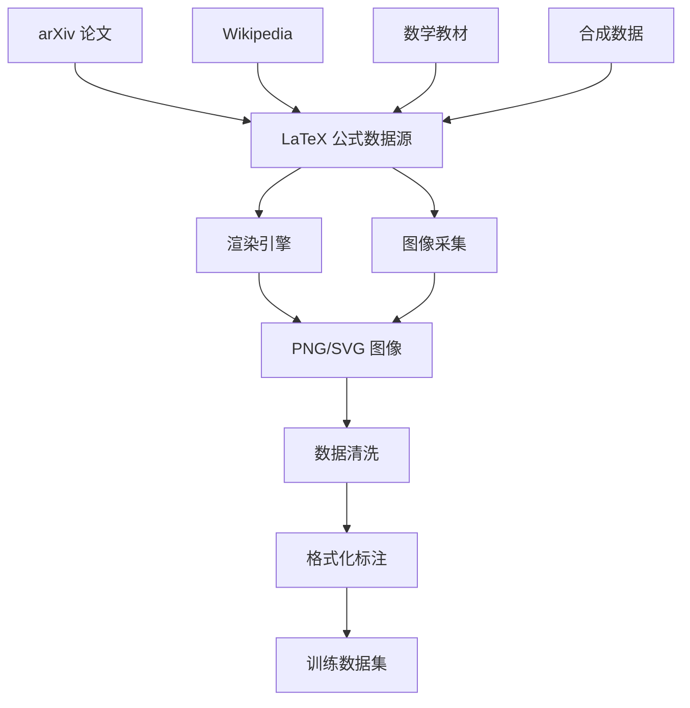

> [!summary] 前情提要
> 用户正在构建一个**图像转 LaTeX**的数据集，用于微调模型。已有合格的数据格式，包含 `messages` (user/assistant 对话)、`images` (图片路径) 字段。本文将介绍多种获取 LaTeX 公式数据源的途径，包括 Hugging Face 和 ModelScope。

# 如何拓展 LaTeX 数据集

## 1. 背景与定义

**LaTeX 公式数据集**是用于训练**图像到 LaTeX (Image-to-LaTeX)** 模型的核心资源。这类数据集通常包含：
- LaTeX 公式的渲染图像（PNG/SVG）
- 对应的 LaTeX 源代码作为标签

典型的应用场景包括：
- 数学公式 OCR（光学字符识别）
- 手写公式识别
- 学术论文公式提取

* 参考：[Papers with Code - im2latex-100k](https://paperswithcode.com/dataset/im2latex-100k)

---

## 2. 核心概念解释



数据集的核心处理流程：
1. **数据采集** - 从 arXiv、Wikipedia 等来源提取 LaTeX 公式
2. **图像渲染** - 使用 LaTeX 引擎将公式渲染为图像
3. **质量过滤** - 去除无效/损坏的样本
4. **格式转换** - 转换为目标训练格式（如用户提供的 JSON 格式）

---

## 3. 主流数据集资源

### 3.1 Hugging Face 数据集

| 数据集 | 规模 | 特点 |
|--------|------|------|
| [OleehyO/latex-formulas](https://huggingface.co/datasets/OleehyO/latex-formulas) | 552k 清洗 / 1M 原始 | 来自 arXiv，含图像+LaTeX |
| [AlFrauch/im2latex](https://huggingface.co/datasets/AlFrauch/im2latex) | **1.59M** | 最大规模公开数据集 |
| [stanford-crfm/image2struct-latex-v1](https://huggingface.co/datasets/stanford-crfm/image2struct-latex-v1) | 1.8k | 含多类别（公式/表格/图表） |

> [!tip] 推荐
> **AlFrauch/im2latex** 是目前规模最大的公开数据集，包含 159 万条图像-公式对，适合大规模预训练。

### 3.2 Zenodo 存档

| 数据集 | 规模 | 来源 |
|--------|------|------|
| [im2latex-100k](https://zenodo.org/records/56198) | ~100k | Cornell KDD CUP 原始数据 |
| [im2latex 230k](https://zenodo.org/records/7738969) | **230k** | 来自 arXiv，2023年更新 |

- im2latex 230k 数据集由 JavaScript 和 Python 工具生成，公式来自 arXiv 论文
- 图像分辨率：72dpi，PNG 格式

### 3.3 专业数据集

| 数据集 | 规模 | 特点 |
|--------|------|------|
| **MathWriting** | 230k 手写 + 400k 合成 | Google 发布，手写公式识别 |
| **MathBridge** | 大规模 | 语音数学表达式→LaTeX |
| **MER-17M** | **17.7M** | 2025年12月最新，多行公式 |
| [Microsoft ArxivFormula](https://github.com/microsoft/ArxivFormula) | - | GitHub 官方数据集 |

> [!warning] 注意
> MathWriting 主要是**手写**公式，如果你的任务是**印刷体**公式识别，请优先使用上述印刷数据集。

---

## 4. 数据获取与转换方法

### 4.1 使用 Hugging Face datasets 库

```python
from datasets import load_dataset

# 加载清洗后的公式数据集
dataset = load_dataset("OleehyO/latex-formulas", "cleaned_formulas")
print(dataset["train"][0])
# 输出: {"image": <PIL.Image>, "latex_formula": "..."}

# 加载大规模数据集
dataset_large = load_dataset("AlFrauch/im2latex")
```

### 4.2 使用 ModelScope MsDataset

ModelScope（魔搭社区）也提供了丰富的数据集资源，可以使用 `MsDataset` 加载：

```python
from modelscope.msdatasets import MsDataset

# 加载在线数据集
dataset = MsDataset.load(
    'Wente47/M2E',  # 数据集名称
    subset_name='default',
    split='train'
)
print(dataset[0])

# 指定缓存目录
dataset = MsDataset.load(
    'Wente47/M2E',
    subset_name='default',
    split='train',
    cache_dir='./data'
)
```

> [!tip] ModelScope 优势
> - 国内访问速度快
> - 镜像源稳定
> - 支持离线加载本地数据集

### 4.3 ModelScope LaTeX 相关数据集

ModelScope 上也有 LaTeX 公式数据集可用：

| 数据集 | 规模 | 说明 |
|--------|------|------|
| [Wente47/M2E](https://modelscope.cn/datasets/Wente47/M2E) | ~10万 | 多行手写数学公式数据集 |
| 其他数学数据集 | 多种 | 可搜索 `latex` 或 `formula` 关键词 |

#### 搜索 ModelScope 数据集

```python
# 搜索 LaTeX 相关数据集
from modelscope.hub.api import HubApi

api = HubApi()
# 搜索包含 latex 关键字的数据集
results = api.search_dataset(model_name='latex', fuzzy=True)
for r in results:
    print(r['Name'], r['DatasetId'])
```

### 4.4 转换为目标格式

将下载的数据转换为用户所需的 JSONL 格式（图片保存到同目录下的 train 文件夹）：

```python
import json
import os
from datasets import load_dataset

# ============== 配置 ==============
DATASET_NAME = "OleehyO/latex-formulas"  # 数据集名称
SUBSET = "cleaned_formulas"               # 子集名称
MAX_SAMPLES = 10000                        # 最大样本数（设为 None 下载全部）
OUTPUT_DIR = "./latex_dataset"            # 输出目录
TRAIN_DIR = os.path.join(OUTPUT_DIR, "train")  # 图片保存目录

# 创建目录
os.makedirs(TRAIN_DIR, exist_ok=True)

# 加载数据集
print("正在加载数据集...")
dataset = load_dataset(DATASET_NAME, SUBSET, split="train")
print(f"数据集总大小: {len(dataset)}")

# 转换并保存
converted_data = []
for i, item in enumerate(dataset):
    if MAX_SAMPLES and i >= MAX_SAMPLES:
        break
    
    # 获取图像并保存
    image = item["image"]
    image_filename = f"formula_{i:05d}.png"
    image_path = os.path.join(TRAIN_DIR, image_filename)
    image.save(image_path)
    
    # 获取 LaTeX 文本
    latex_text = item["latex_formula"]
    
    # 构建目标格式
    converted_data.append({
        "messages": [
            {
                "role": "user",
                "content": "<image>请根据图片中的公式生成对应的 latex 公式文本"
            },
            {
                "role": "assistant", 
                "content": latex_text
            }
        ],
        "images": [f"train/{image_filename}"]  # 相对路径
    })
    
    if (i + 1) % 1000 == 0:
        print(f"已处理 {i + 1} 条数据...")

# 保存为 JSONL 格式
output_jsonl = os.path.join(OUTPUT_DIR, "data.jsonl")
with open(output_jsonl, "w", encoding="utf-8") as f:
    for item in converted_data:
        f.write(json.dumps(item, ensure_ascii=False) + "\n")

print(f"完成！生成了 {len(converted_data)} 条数据")
print(f"图片目录: {TRAIN_DIR}")
print(f"JSONL文件: {output_jsonl}")
```

#### 输出目录结构

```
latex_dataset/
├── train/
│   ├── formula_00000.png
│   ├── formula_00001.png
│   ├── ...
│   └── formula_09999.png
└── data.jsonl
```

#### JSONL 文件内容示例

```json
{"messages": [{"role": "user", "content": "<image>请根据图片中的公式生成对应的 latex 公式文本"}, {"role": "assistant", "content": "\\frac{a}{b}"}], "images": ["train/formula_00000.png"]}
{"messages": [{"role": "user", "content": "<image>请根据图片中的公式生成对应的 latex 公式文本"}, {"role": "assistant", "content": "\\sqrt{x^2 + y^2}"}], "images": ["train/formula_00001.png"]}
```

#### 使用 ModelScope 数据集转换

```python
import json
import os
from modelscope.msdatasets import MsDataset

# 加载 M2E 数据集
dataset = MsDataset.load('Wente47/M2E', subset_name='default', split='train')

converted_data = []
for i, item in enumerate(dataset):
    if i >= 10000:
        break
    
    # 获取图像数据
    image = item['image']  # 根据实际字段调整
    latex_text = item['latex']  # 根据实际字段调整
    
    # 保存图像
    image_path = f"images/formula_{i:05d}.png"
    os.makedirs("images", exist_ok=True)
    image.save(image_path)
    
    converted_data.append({
        "messages": [
            {
                "role": "user",
                "content": "<image>请根据图片中的公式生成对应的 latex 公式文本"
            },
            {
                "role": "assistant",
                "content": latex_text
            }
        ],
        "images": [image_path]
    })

# 保存
with open("latex_dataset.jsonl", "w", encoding="utf-8") as f:
    for item in converted_data:
        f.write(json.dumps(item, ensure_ascii=False) + "\n")
```

### 4.5 自生成数据（进阶）

如果你需要特定领域的公式，可以自己编写脚本生成：

```python
# 示例：生成简单数学公式
formulas = [
    r"\frac{a}{b}",
    r"\sqrt{x^2 + y^2}",
    r"\sum_{i=1}^{n} i^2",
    r"\int_{0}^{\infty} e^{-x} dx",
    r"\begin{pmatrix} a & b \\ c & d \end{pmatrix}"
]

# 使用 matplotlib 或 pdflatex 渲染
# 参考：https://github.com/lukas-blecher/LaTeX-OCR
```

---

## 5. 数据质量与多样性建议

### 5.1 公式类型覆盖

为确保模型泛化能力，建议涵盖以下公式类型：

| 类别 | 示例 | 占比建议 |
|------|------|----------|
| 基础算术 | `a + b = c`, `x^2` | 20% |
| 分式/根号 | `\frac{a}{b}`, `\sqrt{x}` | 15% |
| 求和/积分 | `\sum`, `\int` | 15% |
| 矩阵 | `\begin{matrix}...\end{matrix}` | 10% |
| 希腊字母 | `\alpha`, `\beta`, `\gamma` | 10% |
| 复杂公式 | 多行嵌套公式 | 30% |

### 5.2 图像多样性

- **字体**：Computer Modern（默认）、Latin Modern、AMS 字体
- **字号**：12pt、14pt、16pt
- **背景**：白色、浅灰色，透明
- **格式**：PNG（推荐）、SVG

---

## 6. 实用工具推荐

### 6.1 数据生成工具

| 工具 | 用途 | GitHub |
|------|------|--------|
| im2latex-dataset | 处理原始数据集 | [Miffyli/im2latex-dataset](https://github.com/Miffyli/im2latex-dataset) |
| LaTeX-OCR | 开源公式识别 | [lukas-blecher/LaTeX-OCR](https://github.com/lukas-blecher/LaTeX-OCR) |
| Texify | 数学 OCR 模型 | [VikParuchuri/texify](https://github.com/VikParuchuri/texify) |

### 6.2 在线资源

- **Mathpix** - 付费 API，最精准的公式识别 [mathpix.com](https://mathpix.com/)
- **Overleaf** - 在线 LaTeX 编辑器，可用于测试公式渲染

---

## 7. 专业总结与应用建议

### 主要结论

1. **首选数据集**：`AlFrauch/im2latex`（1.59M 条）或 `OleehyO/latex-formulas`（552k 条），可直接下载使用
2. **手写公式**：`MathWriting` 数据集（230k 人写 + 400k 合成）
3. **最新大规模数据**：MER-17M（17.7M 条，2025年12月发布）

### 实施建议

- **初期**：使用 `OleehyO/latex-formulas` 清洗版本（552k），格式规范，易于处理
- **中期**：扩展到 `AlFrauch/im2latex` 全量（1.59M），提升模型容量
- **专业领域**：考虑从 arXiv 自行抓取特定学科论文（物理、数学、计算机）

### 数据转换流程图


---

## 8. 参考链接

### Hugging Face 数据集
1. [OleehyO/latex-formulas - Hugging Face](https://huggingface.co/datasets/OleehyO/latex-formulas) — 552k 清洗公式数据集
2. [AlFrauch/im2latex - Hugging Face](https://huggingface.co/datasets/AlFrauch/im2latex) — 159万条大规模数据集
3. [im2latex 230k - Zenodo](https://zenodo.org/records/7738969) — arXiv 来源的 230k 数据集
4. [MathWriting - arXiv:2404.10690](https://arxiv.org/abs/2404.10690) — Google 手写公式数据集

### ModelScope 数据集
5. [M2E 多行手写数学公式数据集 - ModelScope](https://modelscope.cn/datasets/Wente47/M2E) — 10万条多行手写公式
6. [ModelScope 数据集使用指南](https://www.modelscope.cn/docs/%E6%95%B0%E6%8D%AE%E9%9B%86%E4%BD%BF%E7%94%A8%E6%8C%87%E5%8D%97) — 官方文档

### 工具与项目
7. [MER-17M - 2025](https://www.emergentmind.com/topics/mer-17m) — 1770万对大规模数据集
8. [Microsoft ArxivFormula - GitHub](https://github.com/microsoft/ArxivFormula) — 官方 arXiv 公式数据集
9. [LaTeX-OCR - GitHub](https://github.com/lukas-blecher/LaTeX-OCR) — 开源公式识别项目
10. [Texify - GitHub](https://github.com/VikParuchuri/texify) — 数学 OCR 模型