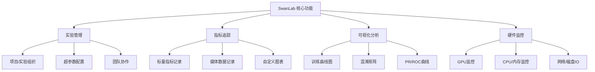
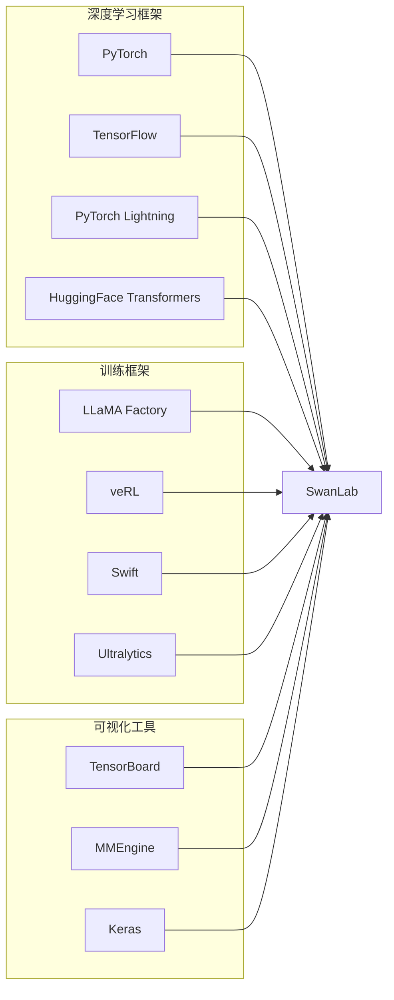

> [!summary] 前情提要
> 本文将详细介绍如何配置 SwanLab 模型训练监控环境，涵盖安装配置、基本使用、框架集成以及最佳实践，帮助开发者快速建立专业的AI实验追踪体系。

## 1. 背景与定义

### 1.1 什么是 SwanLab？

**SwanLab** 是一个开源、现代化设计的 **AI 模型训练追踪与可视化工具**，由 [SwanHubX](https://github.com/SwanHubX/SwanLab) 团队开发维护。该工具支持**云端使用**和**离线私有化部署**两种模式，兼容 PyTorch、Transformers、LLaMA Factory、PyTorch Lightning、veRL、Swift、Ultralytics、MMEngine、Keras 等 **30+ 主流 AI 训练框架**[1]。

* 官方网站：[https://swanlab.cn](https://swanlab.cn)
* GitHub 仓库：[SwanHubX/SwanLab](https://github.com/SwanHubX/SwanLab) (3.5k+ Stars)
* 官方文档：[https://docs.swanlab.cn](https://docs.swanlab.cn)

### 1.2 为什么需要模型训练监控工具？

在深度学习项目中，模型训练过程往往需要追踪大量的实验数据，包括：

| 数据类型 | 示例 |
|---------|------|
| **超参数** | 学习率、批量大小、网络层数、优化器类型 |
| **训练指标** | Loss、Accuracy、Precision、Recall |
| **资源消耗** | GPU 显存、CPU 使用率、训练时间 |
| **中间产物** | 模型权重、可视化图像、预测样本 |

SwanLab 能够帮助开发者**系统化记录、可视化对比分析实验结果**，显著提升研发效率。

---

## 2. 核心功能与特性

### 2.1 主要功能架构



### 2.2 支持的硬件监控

SwanLab 支持全面的硬件资源监控[2]：

| 硬件类型 | 监控指标 |
|---------|----------|
| **NVIDIA GPU** | 显存使用率、GPU 利用率、温度、功率 |
| **Ascend NPU** | NPU 利用率、显存使用 |
| **Cambricon MLU** | MLU 利用率、显存使用 |
| **Kunlunxin XPU** | XPU 利用率、显存使用 |
| **MooreThread GPU** | GPU 利用率、显存使用 |
| **CPU** | CPU 利用率 |
| **内存** | 系统内存使用率、进程内存 |
| **磁盘/网络** | 磁盘 IO、网络流量 |

### 2.3 框架集成生态

SwanLab 开箱即用支持的主流框架[3]：



---

## 3. 快速开始：安装与配置

### 3.1 环境要求

* Python 3.8+
* 推荐使用 Python 3.10 以获得最佳体验

### 3.2 安装 SwanLab

使用 pip 进行安装[4]：

```bash
pip install swanlab
```

如需更新到最新版本：

```bash
pip install -U swanlab
```

### 3.3 账号登录

**步骤 1**: 访问 [https://swanlab.cn](https://swanlab.cn) 注册免费账号

**步骤 2**: 登录后进入 **用户设置** 页面获取 API Key

**步骤 3**: 命令行登录

```bash
swanlab login
```

按照提示粘贴 API Key 即可完成登录。

**其他登录方式**：

```bash
# 使用 API Key 直接登录
swanlab login -k your-api-key

# 或在 Python 代码中登录
import swanlab
swanlab.login(api_key="your-api-key")
```

---

## 4. 基础使用教程

### 4.1 初始化实验

```python
import swanlab

# 初始化 SwanLab 实验
run = swanlab.init(
    project="my-project",           # 项目名称
    experiment_name="exp-001",      # 实验名称
    description="首次训练实验",      # 实验描述
    config={                        # 超参数配置
        "learning_rate": 0.01,
        "batch_size": 32,
        "epochs": 10,
        "optimizer": "Adam"
    }
)
```

### 4.2 记录训练指标

```python
import swanlab
import random

# 初始化
run = swanlab.init(
    project="cat-dog-classification",
    experiment_name="ResNet50-v1",
    config={
        "learning_rate": 1e-4,
        "batch_size": 32,
        "epochs": 20
    }
)

# 模拟训练过程
for epoch in range(run.config.epochs):
    # 模拟计算 loss 和 accuracy
    loss = random.random() * (1 - epoch / run.config.epochs)
    acc = random.random() * (epoch / run.config.epochs)
    
    # 记录指标
    swanlab.log({
        "train/loss": loss,
        "train/accuracy": acc
    })
    
    print(f"Epoch {epoch}: loss={loss:.4f}, acc={acc:.4f}")
```

### 4.3 分组记录指标

使用 `/` 前缀可以对指标进行分组，便于在仪表盘中查看：

```python
# 训练指标
swanlab.log({"train/loss": loss, "train/acc": acc})

# 验证指标  
swanlab.log({"val/loss": val_loss, "val/acc": val_acc})

# 学习率
swanlab.log({"lr": current_lr})
```

### 4.4 记录媒体数据

SwanLab 支持记录图片、音频、文本等媒体数据[5]：

```python
import swanlab
import torch

# 记录图像
image_tensors = ...  # shape: [B, C, H, W]
swanlab.log({
    "examples": [swanlab.Image(im) for im in image_tensors]
})

# 记录音频
audio = ...  # 音频数据
swanlab.log({"audio_sample": swanlab.Audio(audio)})

# 记录文本
swanlab.log({"prediction": swanlab.Text(prediction_text)})
```

---

## 5. 框架集成示例

### 5.1 PyTorch Lightning 集成

```python
from swanlab.integration.pytorch_lightning import SwanLabLogger
import pytorch_lightning as pl

# 创建 Logger
swanlab_logger = SwanLabLogger(
    project="lightning-demo",
    experiment_name="resnet50"
)

# 传入 Trainer
trainer = pl.Trainer(
    logger=swanlab_logger,
    max_epochs=10
)

trainer.fit(model, train_loader, val_loader)
```

### 5.2 HuggingFace Transformers 集成

对于 `transformers>=4.50.0` 版本，只需一行配置[6]：

```python
from transformers import TrainingArguments, Trainer

training_args = TrainingArguments(
    output_dir="./results",
    report_to="swanlab",  # 一行配置完成集成
    num_train_epochs=3,
    learning_rate=2e-5,
)

trainer = Trainer(
    model=model,
    args=training_args,
    train_dataset=train_dataset,
)

trainer.train()
```

对于旧版本，使用回调方式：

```python
from swanlab.integration.transformers import SwanLabCallback

swanlab_callback = SwanLabCallback(
    project="transformers-demo",
    experiment_name="bert-classification"
)

trainer = Trainer(
    model=model,
    callbacks=[swanlab_callback]
)
```

### 5.3 TensorBoard 数据迁移

如果已有 TensorBoard 日志，可以同步到 SwanLab[7]：

```python
import swanlab
from tensorboardX import SummaryWriter

# 同步 TensorBoardX 数据
swanlab.sync_tensorboardX()

writer = SummaryWriter(log_dir='./runs')
# 正常使用 TensorBoard
writer.add_scalar('loss', loss, step)
```

---

## 6. 高级配置与最佳实践

### 6.1 自定义日志目录

```python
run = swanlab.init(
    project="my-project",
    logdir="./swanlog"  # 自定义日志存储目录
)
```

### 6.2 离线部署

对于无外网环境，SwanLab 支持 Docker 私有化部署[8]：

```bash
# 拉取镜像
docker pull swanlab/swanlab:latest

# 运行容器
docker run -d -p 8080:8080 \
    -v ./data:/data \
    swanlab/swanlab:latest
```

详细部署文档请参考 [SwanLab 离线部署指南](https://docs.swanlab.cn/en/guide_cloud/self_host/docker-deploy.html)。

### 6.3 团队协作

SwanLab 支持团队协作功能，可以邀请团队成员共同查看实验结果：

```python
run = swanlab.init(
    project="team-project",
    workspace="team-workspace"  # 团队工作空间
)
```

### 6.4 最佳实践建议

1. **统一命名规范**：项目名使用有意义的名称，实验名包含关键超参数信息
   
   ```python
   experiment_name=f"vit-Adam-1e-4-bs32"
   ```

2. **合理记录频率**：根据训练步数设置日志记录频率，避免数据过大

3. **分组管理指标**：使用 `/` 分组（train/loss, val/acc）便于仪表盘查看

4. **记录超参数**：将所有超参数记录到 config，便于实验复现和对比

---

## 7. 常见问题

### Q1: API Key 在哪里获取？

登录 [swanlab.cn](https://swanlab.cn) 后，进入 **用户设置** 页面即可查看和复制 API Key。

### Q2: 可以离线使用吗？

可以。参考 [离线部署文档](https://docs.swanlab.cn/en/guide_cloud/self_host/offline-deployment.html) 使用 Docker 进行私有化部署。

### Q3: 支持哪些框架？

目前支持 30+ 框架，包括 PyTorch、TensorFlow、PyTorch Lightning、HuggingFace Transformers、LLaMA Factory、Ultralytics、MMEngine 等。完整列表见 [官方集成文档](https://docs.swanlab.cn/en/guide_cloud/integration.html)。

---

## 8. 参考资料

1. [SwanLab 官方 GitHub](https://github.com/SwanHubX/SwanLab) — 开源仓库与项目介绍
2. [SwanLab 官方文档 - 硬件监控](https://docs.swanlab.cn/en/guide_cloud/experiment_track/system-monitor.html) — 系统监控指标说明
3. [SwanLab 集成框架列表](https://docs.swanlab.cn/en/guide_cloud/integration.html) — 支持的框架汇总
4. [SwanLab 快速开始指南](https://docs.swanlab.cn/en/guide_cloud/general/quick-start.html) — 官方入门教程
5. [SwanLab 媒体数据记录](https://docs.swanlab.cn/en/guide_cloud/experiment_track/log-media.html) — 图片/音频/文本记录
6. [HuggingFace Transformers 集成](https://docs.swanlab.cn/en/guide_cloud/integration/integration-huggingface-transformers.html) — Transformers 集成文档
7. [TensorBoard 数据迁移](https://docs.swanlab.cn/en/guide_cloud/integration/integration-tensorboard.html) — TensorBoard 同步方案
8. [SwanLab Docker 部署](https://docs.swanlab.cn/en/guide_cloud/self_host/docker-deploy.html) — 离线部署指南
