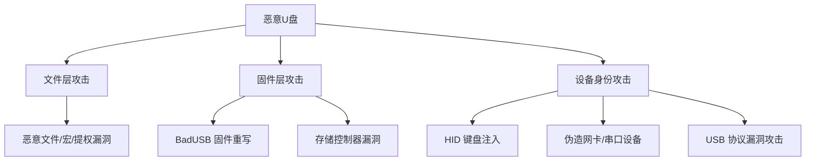
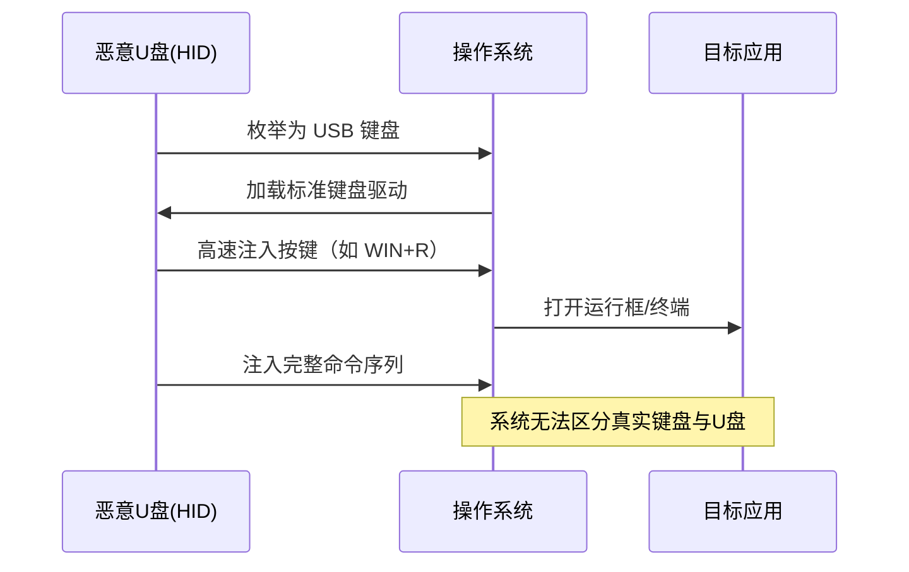
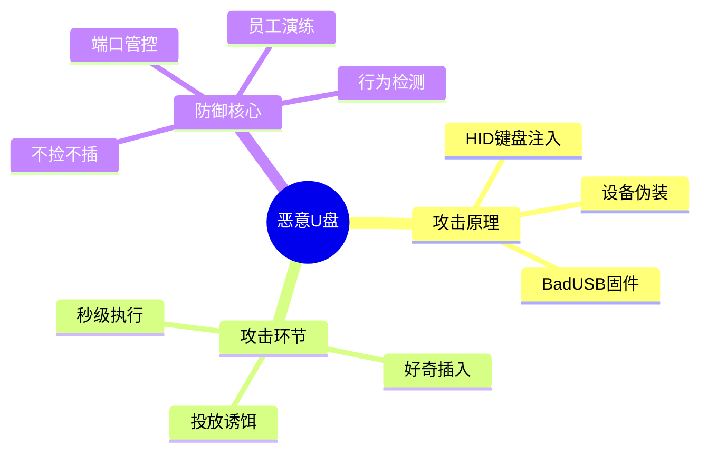

# 恶意U盘是什么？它到底能做什么？

> [!warning] 免责声明
> 本文仅用于**安全防御教育与研究**目的，帮助读者识别威胁、理解攻击面、构建防护。未经授权的攻击行为违反《网络安全法》《刑法》相关规定，请勿将本文内容用于任何非法用途。文中描述均为攻击**原理与类别**，不包含可直接利用的完整武器化细节。

## 0. 导读

你捡到过 U 盘吗？大多数人会忍不住插进电脑看看里面有什么——这正是攻击者最爱的“诱饵”。但真正的恶意 U 盘远比“U 盘里有病毒”更危险：它可能在你插入的**几秒钟内**就完成键盘输入、窃取密码、开启后门，甚至不需要你双击任何文件。

这篇文章会从安全从业者的视角，回答三个问题：

1. **恶意 U 盘是怎么“伪装”成正常设备的？**
2. **它到底能做到什么？能力边界在哪里？**
3. **普通人如何有效防御？**

## 1. 背景：为什么 U 盘是完美的攻击载体

### 1.1 信任的悖论

U 盘攻击的核心是**信任利用**：

- 用户对“物理插入”这件事有天然的信任感——看到实物就觉得安全
- 操作系统对“可信硬件”有信任——键盘说它按了什么，系统就信什么
- 杀毒软件只能扫描**文件**，管不了**硬件行为**

> [!tip] 一句话总结
> U 盘攻击的本质是：**绕过文件层，直接攻击“设备身份”与“输入通道”**。

### 1.2 攻击面全景

## 2. 三类核心技术原理

### 2.1 HID 键盘注入（Rubber Ducky 类）

这是最经典、也最容易被低估的一类。原理非常简单：

> [!important] 核心概念
> 操作系统**无法区分**“人按的键盘”和“U 盘伪装成的键盘”。当 U 盘以 **HID（Human Interface Device）** 协议枚举自己时，系统会把它当作一个 USB 键盘，它随后“打字”的内容与真实键盘输入**毫无区别**。

攻击流程：

**典型能力**：
- 弹出终端，下载并执行远程脚本
- 修改系统设置、创建账户、关闭防火墙
- 窃取浏览器保存的密码与 Cookie
- 建立反向 Shell 后门

**速度极快**：现代实现（如 Ducky 使用 1000 字/分钟以上的注入速率）可以在几十秒内完成整套攻击，甚至**无需用户看到屏幕**。

### 2.2 BadUSB 固件重写

2014 年，安全研究员 Karsten Nohl 与 Jakob Lell 在 Black Hat 大会上演示了 **BadUSB** 攻击，揭开了存储芯片控制器固件的黑暗面。

> [!important] 核心概念
> 普通 U 盘的**主控芯片固件**出厂后仍可被重写。攻击者重写固件后，这个 U 盘可以：
> - 伪装成**任意 USB 设备**（键盘、网卡、CD-ROM、串口）
> - 插入后先以键盘身份注入，再切回存储身份
> - **不可见地**篡改你复制到 U 盘上的文件（固件层拦截读写）
> - 反查杀：杀毒软件扫描到的内容与实际内容不一致

**为什么可怕**：固件攻击**无法通过格式化清除**，普通杀毒软件完全看不见，且部分主控（如 Phison、SMI）的漏洞至今没有补丁——因为它根本不是软件漏洞，而是设计特性。

### 2.3 设备身份与协议层攻击

- **伪造网卡（RNDIS/Ethernet）**：插入后虚拟出一个有线网卡，把流量重定向到攻击者控制的网关，实施中间人攻击
- **伪造串口（UART）**：针对工业设备、嵌入式系统
- **USB 协议漏洞**：如 USBGuard 之前披露的一些协议级缺陷，可在驱动加载阶段触发内核漏洞
- **充电/数据分离**：伪装成“充电线”实为攻击设备（如 O.MG Cable）

## 3. 攻击的完整链条

| 阶段 | 说明 | 关键点 |
|------|------|--------|
| 获取载体 | 普通 U 盘 / 专用设备 / 诱饵 | 成本极低，几十元即可 |
| 写入/改造 | 写入恶意文件或重写固件 | 攻击者能力分层 |
| 投放 | 停车场、门口、公司邮箱、快递包裹 | 社会工程核心 |
| 受害者插入 | 好奇心驱动 | **人是最薄弱的环节** |
| 设备枚举 | U 盘伪装成可信设备 | 系统层无法识别 |
| 载荷执行 | 注入命令 / 运行文件 | 秒级完成 |
| 持久化 | 计划任务、注册表、启动项 | 反复回连 |
| 数据回传 | 外连 C2 服务器 | 数据被窃取 |

## 4. 诱饵攻击：最不起眼却最有效

> [!note] 社会工程视角
> 安全公司 Honeywell 的研究和多项模拟测试表明，**诱饵 U 盘（USB Drop Attack）的点击率长期居高不下**，部分测试中超过 50% 的捡到者会插入并打开文件。攻击者甚至会在 U 盘上贴“薪资表”“简历”“监控录像”等标签进一步提效。

诱饵攻击的成本低到令人发指：一个 32GB U 盘 + 一个自动运行的 HID 载荷，成本可能不到 50 元人民币，却可以打穿大多数缺乏终端管控的企业内网。

## 5. 防御：从人到系统的纵深防护

### 5.1 个人层面（立即可用）

| 措施 | 说明 |
|------|------|
| **别捡 U 盘** | 不插入来历不明的存储设备，这是第一道也是最重要的一道防线 |
| 关闭自动播放 | Windows 关闭 AutoRun/AutoPlay，macOS 关闭“打开安全设置” |
| 开启系统保护 | Windows 开启 BitLocker + 内核隔离 + 受控文件夹访问 |
| 使用安全工具 | 插入前用独立扫描设备/沙箱环境检查 |
| 不借用公共 USB | 机场/酒店充电口使用数据隔离的充电线或充电头 |
| 实体隔离 | 重要设备使用 USB 端口管理（如软件禁用存储类设备） |

### 5.2 企业层面

- **终端管控**：部署 USB 设备管控（白名单设备指纹、按需启用）
- **端口策略**：办公机禁用 USB 存储类设备，仅开放键鼠等白名单 HID
- **物理安全**：锁定机箱 USB 口、封闭机房接口
- **检测**：部署基于行为的端点检测（EDR），监控异常键盘注入速率（如 500ms 内 100+ 按键）
- **数据防泄漏**：DLP 方案对移动存储外拷行为审计
- **员工培训**：定期做诱饵演练，用数据说话

### 5.3 技术细节：如何检测键盘注入

正常人的打字速度上限约为 10 字/秒；恶意注入常以**毫秒级间隔**连续输出命令。因此：

- 系统安全日志中记录输入法/按键事件的企业方案（如 Windows 的 `Microsoft-Windows-Input` 相关审计）可发现异常
- 专门的 HID 行为分析工具（如 USBKeystroke 检测类研究工具）会告警“非人类”输入节奏
- 部分 EDR 直接拦截 `cmd.exe`/`powershell.exe` 在极短时间内的高频参数调用

## 6. 能力边界：恶意 U 盘做不到什么

客观看待威胁，避免妖魔化：

- **不能绕过所有防护**：强制签名驱动、UEFI Secure Boot 白名单、硬件 USB 防火墙（如 USBGuard 配合策略）都能有效拦截大部分攻击
- **不能攻击物理隔离系统**：气隙网络（Air Gap）中若 U 盘被严格管控，载荷无法回传
- **固件攻击有前提**：BadUSB 需要攻击者先物理接触到 U 盘并掌握对应主控的重写工具，不是所有 U 盘都能改
- **现代系统有缓解**：Windows 的 Driver Signature Enforcement、macOS 的 Gatekeeper、Linux 的 USBGuard 都提高了门槛

## 7. 总结

恶意 U 盘之所以危险，是因为它攻击的是**人**和**系统的信任**，而不是单纯的“病毒文件”。理解它的原理，不是为了制造它，而是为了在真实威胁面前不成为那个“好奇插入”的人。

> [!important] 记住三句话
> 1. **地上捡的 U 盘，永远不要插。**
> 2. **U 盘里的“键盘”不等于键盘，系统无法区分。**
> 3. **最好的防御不是杀毒软件，而是端口管控 + 人的习惯。**

## 参考与延伸阅读

- [Rubber Ducky — Hak5（HID 注入设备厂商）](https://shop.hak5.org/products/usb-rubber-ducky)
- [BadUSB: On Accessories that Turn Evil — Nohl & Lell, Black Hat 2014](https://www.blackhat.com/us-14/briefings.html)
- [O.MG Cable — 伪装充电线的攻击设备](https://shop.hak5.org/products/omg-cable)
- [USBGuard — Linux USB 设备管控工具](https://usbguard.github.io/)
- [MITRE ATT&CK — T1091: Replication Through Removable Media](https://attack.mitre.org/techniques/T1091/)
