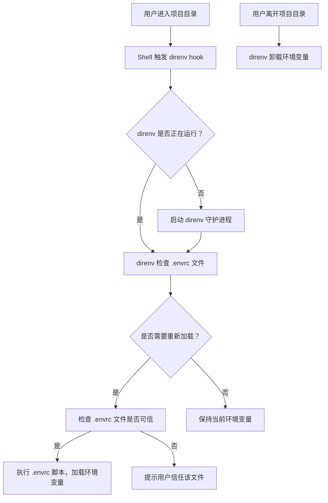

### 1. direnv 工具概述与核心价值

direnv 是一款轻量级的环境变量管理工具，通过在项目目录下创建 `.envrc` 文件来自动加载或卸载环境变量，实现**项目级别的环境隔离**。它能够：
- 解决多个项目依赖不同版本的工具或库时的冲突问题
- 自动加载项目特定的环境变量，无需手动 source 文件
- 提供安全机制，仅在信任的目录下执行 `.envrc` 脚本

* 官方文档：[direnv.net - 项目主页](https://direnv.net/)

---

### 2. 安装与配置 direnv

#### 安装方式

| 操作系统       | 安装命令                                                                 |
|----------------|--------------------------------------------------------------------------|
| macOS（Homebrew）| `brew install direnv`                                                    |
| Ubuntu/Debian  | `sudo apt install direnv`                                                |
| CentOS/RHEL    | `sudo yum install direnv`                                                |
| Arch Linux     | `sudo pacman -S direnv`                                                 |

#### 配置 Shell 钩子

direnv 需要在 Shell 中配置钩子才能正常工作。以下是常见 Shell 的配置方法：

##### Bash
```bash
# 编辑 ~/.bashrc
echo 'eval "$(direnv hook bash)"' >> ~/.bashrc
# 重新加载配置
source ~/.bashrc
```

##### Zsh
```bash
# 编辑 ~/.zshrc
echo 'eval "$(direnv hook zsh)"' >> ~/.zshrc
# 重新加载配置
source ~/.zshrc
```

##### Fish
```bash
# 编辑 ~/.config/fish/config.fish
echo 'eval (direnv hook fish)' >> ~/.config/fish/config.fish
# 重新加载配置
source ~/.config/fish/config.fish
```

* 配置参考：[direnv - Shell 钩子配置](https://direnv.net/docs/hook.html)

---

### 3. 核心使用方法

#### 创建与编辑 .envrc 文件

```bash
# 进入项目目录
cd /path/to/your/project
# 创建 .envrc 文件
touch .envrc
# 编辑 .envrc，添加环境变量
cat > .envrc << 'EOF'
export MY_PROJECT_ENV="development"
export DB_HOST="localhost"
export DB_PORT="5432"
export PATH="$PWD/bin:$PATH"
EOF
```

#### 信任 .envrc 文件

direnv 会阻止执行未信任的 `.envrc` 文件，需要手动信任：

```bash
direnv allow .
```

#### 验证环境变量加载

```bash
# 查看当前环境变量
env | grep MY_PROJECT_ENV
```

#### 自动卸载环境变量

当离开项目目录时，direnv 会自动卸载 `.envrc` 中定义的环境变量：

```bash
cd /path/to/other/directory
# 验证环境变量已卸载
env | grep MY_PROJECT_ENV
```

---

### 4. 高级功能与最佳实践

#### 1. 使用 .env 文件（推荐）

为了与其他工具兼容（如 Docker、VS Code 等），建议使用 `.env` 文件存储环境变量，再在 `.envrc` 中加载：

```bash
# 创建 .env 文件
cat > .env << 'EOF'
MY_PROJECT_ENV="development"
DB_HOST="localhost"
DB_PORT="5432"
EOF

# 编辑 .envrc，加载 .env 文件
cat > .envrc << 'EOF'
dotenv
export PATH="$PWD/bin:$PATH"
EOF

# 重新信任 .envrc 文件
direnv allow .
```

#### 2. 使用 direnv 加载依赖工具

direnv 可以配合其他版本管理工具使用，如 `pyenv`（Python）、`nvm`（Node.js）或 `rbenv`（Ruby）：

```bash
# .envrc 示例：加载 Node.js 16.14.0
cat > .envrc << 'EOF'
use node 16.14.0
EOF

# .envrc 示例：加载 Python 3.9.10
cat > .envrc << 'EOF'
layout python python3.9.10
EOF
```

#### 3. 使用 direnv 与 Docker 结合

direnv 可以通过 `dotenv` 命令加载 `.env` 文件，实现与 Docker Compose 的环境变量共享：

```bash
# docker-compose.yml
version: '3.8'
services:
  app:
    image: myapp
    env_file: .env
    ports:
      - "3000:3000"

# .env 文件
MY_PROJECT_ENV="development"
DB_HOST="db"
DB_PORT="5432"

# .envrc 文件
cat > .envrc << 'EOF'
dotenv
EOF
```

#### 4. 安全性建议

- 定期更新 direnv 到最新版本
- 只信任你能控制的 `.envrc` 文件
- 避免在 `.envrc` 中执行恶意脚本
- 使用 `direnv deny .` 命令拒绝不信任的 `.envrc` 文件

---

### 5. 常见问题与解决方案

#### 问题1：环境变量没有自动加载

**可能原因**：
- Shell 钩子配置不正确
- `.envrc` 文件未被信任
- 项目目录权限问题

**解决方案**：
- 重新检查 Shell 钩子配置
- 执行 `direnv allow .` 信任 `.envrc` 文件
- 检查项目目录权限是否正确（建议使用 755 权限）

#### 问题2：环境变量与其他工具冲突

**可能原因**：
- 其他工具（如 pyenv、nvm）的环境变量优先级更高
- `.envrc` 中的变量没有正确覆盖全局变量

**解决方案**：
- 检查变量加载顺序，确保 direnv 钩子在其他工具之后执行
- 在 `.envrc` 中使用绝对路径或明确的变量值

---

### 6. direnv 工作原理



---

### 7. 总结

direnv 是一款高效的项目级别环境变量管理工具，通过自动加载和卸载环境变量，帮助开发者实现环境隔离，解决了多项目开发中的依赖冲突问题。其核心优势在于：
- 轻量级、易用性强
- 与多种 Shell 和工具兼容
- 提供安全机制，确保脚本执行的可信度

通过合理使用 direnv，开发者可以显著提高开发效率，减少环境配置错误。